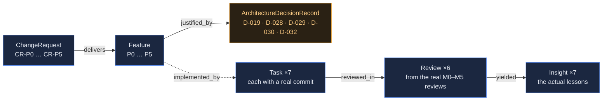

<!-- The demo tenant: what is in it, why this data, and what it is for. -->

# Weave — the demo tenant

- **Purpose:** a populated workspace for demonstration and for the **M6 end-to-end tests**, generated by a script rather than assembled by hand.
- **Generator:** [`scripts/seed_demo.py`](../scripts/seed_demo.py) — re-runnable, and the source of truth for the data. Keep this document in step with it (R6).
- **Tenant:** workspace **`demo`**. The `default` workspace is left empty on purpose, so tenant isolation is demonstrable rather than asserted.

## The scenario: Weave building Weave

The demo data is **the project's own history**. Six phases, the tasks that built them, the real commits that landed them, the milestone reviews that gated them, and the lessons those reviews produced.

**Why this and not invented data.** Every locator in the tenant resolves to a file that actually exists in this repository. Invented data cannot do that — it either embeds its content, which **A5** forbids, or it points at nothing. A demo whose links are dead teaches the opposite of what the product claims, and an answer surface demonstrated on fabricated answers demonstrates nothing. Here every commit SHA survives `git show`, and every review has a document behind it.

It also means the demo doubles as a **check**: anyone can compare `/ask/changes` against `git log` and see whether the graph is telling the truth.



## What is in it

| | count | drawn from |
|---|---|---|
| **Feature** nodes | 6 | phases P0–P5, each with a locator into `WEAVE_WORK_PLAN.md` |
| **ChangeRequest** nodes | 6 | one per phase, linked to its feature |
| **ArchitectureDecisionRecord** nodes | 5 | D-019, D-028, D-029, D-030, D-032 — real entries in `DECISIONS.md` |
| **Task** records | 7 | real work items, each claimed → committed → pull-requested |
| **Commit** references | 7 | **real SHAs** — `8610914`, `778d70a`, `6a3061b`, `bd70c36`, `4af22da`, `96adb41`, `19145ea` |
| **Review** nodes | 6 | the actual M0–M5 milestone reviews, with their verdicts |
| **Insight** nodes | 7 | the lessons those reviews produced, verbatim |
| **Users** | 3 | `demo-manager` (manager), `demo-dev` (developer), `dsivov` (admin) |

## What it demonstrates, and how to check each claim

Log in as `demo-manager` and send `WEAVE-WORKSPACE: demo`.

### 1 · The four questions are traversals, not text

| question | returns | verified |
|---|---|---|
| `GET /ask/features` | **6 nodes**, all `Feature` | ✅ |
| `GET /ask/changes` | **12 nodes** — 6 `ChangeRequest` + 6 `Feature` | ✅ |
| `GET /ask/learnings` | **13 nodes** — 6 `Review` + 7 `Insight` | ✅ |
| `GET /ask/why?node=Feature P2 — Data model and the answer surface` | **5 nodes**, of which **3 are decision records** | ✅ |

Each returns a **node set with types**, not a paragraph. That is the M2 gate criterion, demonstrable in one request.

### 2 · Artifacts reference their source and never embed it (A5)

`GET /projects/resolve?repo=weave&path=docs/DECISIONS.md` returns the file's content **at request time**, from the repository, via the registered `ProjectLayout`. The graph holds `repo · path · rev`, not a copy. Change the file on disk and the answer changes; delete it and the locator dangles, which `scripts/check_locators.py` reports.

### 3 · The tenant boundary is real (A14, D-028, D-030)

The `default` workspace is deliberately empty. The same questions asked with `WEAVE-WORKSPACE: default` return **0** — and `GET /projects/resolve` for a repository registered only in `demo` returns a **404 byte-identical** to one for a repository that exists nowhere. Existence is not leaked.

### 4 · Governance refuses, and says why (A6)

The roles are real, so refusals are real:
- `demo-dev` (developer) is refused supervisory acts — `SUPERVISOR_ROLES` is `{manager, architect}`.
- `dsivov` is an **admin**, which is a user-administration role, **not** a supervisor — so `PUT /weave/project` refuses it too. That surprise is left in the demo deliberately: admin ≠ supervisor is exactly the distinction a governed system needs and an ungoverned one blurs.

### 5 · Retrieval works, on a local backend with no credential (A13)

The instance runs **Ollama** locally: `qwen2.5:14b` for the LLM path and `bge-m3` for embeddings, `WEAVE_EMBEDDING_DIM=1024`. Semantic retrieval and graph build therefore work end to end **without any model credential existing anywhere** — the server-side backend A13 permits, in the configuration that needs no key at all. The `/ask/*` traversals embed nothing; embeddings matter for search and graph build, which is what an agent uses to *find* what to traverse.

## Running it

```bash
# 1 · databases (only needed for the PostgreSQL / Neo4j paths)
docker start weave-m1-pg weave-m1-neo4j

# 2 · the server, with a local embedding backend
set -a; . /storage/Work/weave-demo/env.sh; set +a
export WEAVE_TOKEN_SECRET=$(cat /storage/Work/weave-demo/.token_secret)
python -m weave.server.app --host 0.0.0.0 --port 9800 \
    --working-dir /storage/Work/weave-demo

# 3 · seed (idempotent; safe to re-run)
python scripts/seed_demo.py --url http://127.0.0.1:9800 \
    --user demo-manager --password '<password>' --workspace demo

# 4 · lift reviews and learnings into nodes — see the note below
```

## The one manual step, and why it is a finding

`weave/model/migrate_reviews.py` **has no CLI and no endpoint.** It is a library function, so lifting task `reviews`/`learnings` into `Review`/`Insight` nodes currently requires writing a script that constructs a task store and a graph by hand — which is what was done to seed this tenant. A migration an operator cannot invoke is a migration that will not be run. **Filed for P6** alongside the other onboarding gaps.

This is also how **W5 finally closed.** The P2 migration had never run on real data through four phases. Against this tenant it reports:

```
migration : tasks 7, reviews_found 6, learnings_found 7, nodes_expected 13, nodes_created 13
second run: nodes_created 0, nodes_already_present 13     ← idempotent, on real data
verify    : checked 13, missing [], mismatched [], complete True
```

100% moved by count, and a second run creates nothing. That is R25's criterion met against real data rather than fixtures.

## Honest limits

- **The seed is idempotent for tasks and nodes, not for learnings.** `POST /weave/learnings` appends, so re-running the seed without resetting duplicates the insights. The tenant was reset and seeded once to produce clean data; the reset is `rm -rf <wd>/demo <wd>/*_demo.json`.
- **The first version of this script reported six reviews it had never recorded** — it tolerated 409 everywhere, and reviews were being refused because a review needs a pull request first. Fixed by removing the blanket tolerance and walking the real lifecycle: claimed → committed → pull-requested → reviewed. Recorded here because a seed that lies about what it created is worse than one that fails.
- **The data is a scenario, not a load test.** Seven tasks and thirteen learning nodes demonstrate shape and traversal; they say nothing about behaviour at scale.
