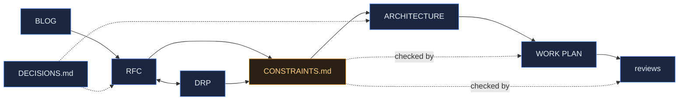

# Weave — Documentation Index

The map of `docs/`. Artifacts follow the pipeline: **BLOG → RFC ↔ DRP → ARCHITECTURE/CR → WORK PLAN → reviews.**
See [../ONBOARDING/METHODOLOGY.md](../ONBOARDING/METHODOLOGY.md) for the method.

_RFC & DRP are co-authored (approach ↔ detail); see METHODOLOGY.md §1._

**Weave** — a full suite to manage the AI-based development cycle, with multi-user and
multi-role support.

## Vision
- [BLOG_THE_TEAM_IS_THE_PRODUCT.html](BLOG_THE_TEAM_IS_THE_PRODUCT.html) — 2026-08-08. Weave stops
  being a flagged subsystem inside Context Graph and becomes the product: multi-user from the first
  screen, a team-vocabulary setup wizard beside the existing graph-vocabulary editors (with RBAC and
  lifecycle finally inside the signed ledger), and a first-class senior-developer seat beside the
  autonomous fleet. Motivates `WEAVE_RFC.html`.

## Proposal & requirements
- [WEAVE_RFC.html](WEAVE_RFC.html) — 2026-08-08, **accepted**. Standalone Weave: copy the selected ~92k LOC
  out of the parent tree (one-way, parent never modified), rebrand totally under a CI name-guard, and
  build the six things the parent lacks — a real user store + Admin UI, a data model that answers the
  team's four standing questions with a locator back to every real document, a live SSE surface, team
  wizards, the senior-developer seat, and a one-command onboarding bundle (CLI + compose + container
  dev-agent fleet). Seven phases P0–P6, seven gated milestones, **no new library**.
- [WEAVE_DRP.md](WEAVE_DRP.md) — 2026-08-08, **accepted**, owner dsivov. 64 numbered requirements across fork/rebrand,
  server & storage, users, the data model & answer surface, the live surface, wizards, the senior seat,
  Claude Code access & the subscription boundary, and onboarding; 7 flagged assumptions with how each
  gets verified; 43 acceptance criteria as checkboxes grouped by milestone M0–M6, with named
  measurement harnesses for every numeric claim.

## The contract
- [CONSTRAINTS.md](CONSTRAINTS.md) — **v2, in force**. 15 falsifiable sentences (A1–A15) plus
  non-goals, tripwires and an amendment log. v2 extends A2/A4 and adds **A7** (the event-bus adapter
  must match the deployment) — see the amendment rows. 15 falsifiable sentences
  (A1–A15) plus non-goals and tripwires — including A10 (every role is a Claude Code session) and A13
  (two LLM paths, never merged: subscription seats vs. the server's metered backend). Loaded every
  session once in force; drift from it stops the build (R11).

## Design
- [WEAVE_ARCHITECTURE.html](WEAVE_ARCHITECTURE.html) — 2026-08-08. Guiding principle (*every surface is
  an adapter over one governed core*), 14 components with owners and entry points, the data model, the
  governed-write and fleet flows, the full layout tree and dependency table, three boundaries
  (import · credential · network), and the trade-offs — including the event fan-out decision that
  added constraint A7.

## Plan & progress
- [WEAVE_CODE_REVIEW.md](WEAVE_CODE_REVIEW.md) — **M0**, 2026-08-08. 0 Critical · 1 High · 3 Medium ·
  1 Security; full contract walk with a verdict per constraint. Gate verified independently.
- [WEAVE_WORK_PLAN.md](WEAVE_WORK_PLAN.md) — 7 phases P0–P6 → M0–M6, **139 checkbox tasks**, each
  milestone with an explicit test gate and each phase opening with a contract check naming the `A#`
  IDs it touches. **55 tasks name a source → destination path** with line counts, so the copy of the
  ~92k LOC of working code is traceable module by module. The checkboxes are the progress trace.

## Reference
- [../CLAUDE.md](../CLAUDE.md) — the working agreement; imports `CONSTRAINTS.md` into every session
- [DECISIONS.md](DECISIONS.md) — decision log
- [templates/](templates/) — the house templates this project authors from (self-contained copy)
- [assets/house.css](assets/house.css) — the shared design system for HTML artifacts
