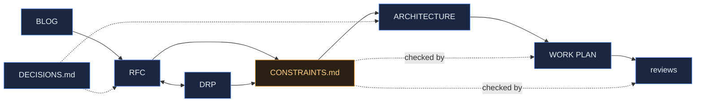

# Weave — Documentation Index

The map of `docs/`. Artifacts follow the pipeline: **BLOG → RFC ↔ DRP → ARCHITECTURE/CR → WORK PLAN → reviews.**
See [../ONBOARDING/METHODOLOGY.md](../ONBOARDING/METHODOLOGY.md) for the method.

_RFC & DRP are co-authored (approach ↔ detail); see METHODOLOGY.md §1._

**Weave** — a full suite to manage the AI-based development cycle, with multi-user and
multi-role support.

## Vision
- [BLOG_THE_TEAM_IS_THE_PRODUCT.html](BLOG_THE_TEAM_IS_THE_PRODUCT.html) — 2026-08-08. Weave stops
  being a flagged subsystem inside Context Graph and becomes the product: multi-user from the first
  screen, a team-vocabulary setup wizard beside the existing graph-vocabulary editors (with RBAC and
  lifecycle finally inside the signed ledger), and a first-class senior-developer seat beside the
  autonomous fleet. Motivates `WEAVE_RFC.html`.

## Proposal & requirements
- [WEAVE_RFC.html](WEAVE_RFC.html) — 2026-08-08, **accepted**. Standalone Weave: copy the selected ~92k LOC
  out of the parent tree (one-way, parent never modified), rebrand totally under a CI name-guard, and
  build the six things the parent lacks — a real user store + Admin UI, a data model that answers the
  team's four standing questions with a locator back to every real document, a live SSE surface, team
  wizards, the senior-developer seat, and a one-command onboarding bundle (CLI + compose + container
  dev-agent fleet). Seven phases P0–P6, seven gated milestones, **no new library**.
- [WEAVE_DRP.md](WEAVE_DRP.md) — 2026-08-08, **accepted**, owner dsivov. 64 numbered requirements across fork/rebrand,
  server & storage, users, the data model & answer surface, the live surface, wizards, the senior seat,
  Claude Code access & the subscription boundary, and onboarding; 7 flagged assumptions with how each
  gets verified; 43 acceptance criteria as checkboxes grouped by milestone M0–M6, with named
  measurement harnesses for every numeric claim.

## The contract
- [CONSTRAINTS.md](CONSTRAINTS.md) — **v4, in force**. 15 falsifiable sentences (A1–A15) plus non-goals,
  tripwires and an amendment log. **v2** extended A2/A4 and added **A7** (the event-bus adapter must match the
  deployment); **v3** scoped A3 to product documents and widened it to generated contracts (D-027); **v4** ranked
  A4's three storage paths and made Neo4j's single-workspace limit a refusal in code rather than a caveat
  (D-029). Every amendment has a row and a `D-NN`. Loaded every session; drift from it stops the build (R11).
  All 15 held at M6, with A1, A10, A13 and A15 verified against the **built** images.

## Design
- [WEAVE_ARCHITECTURE.html](WEAVE_ARCHITECTURE.html) — 2026-08-08. Guiding principle (*every surface is
  an adapter over one governed core*), 14 components with owners and entry points, the data model, the
  governed-write and fleet flows, the full layout tree and dependency table, three boundaries
  (import · credential · network), and the trade-offs — including the event fan-out decision that
  added constraint A7.

## Change requests
- [WEAVE_UI_CHANGE_REQUEST.md](WEAVE_UI_CHANGE_REQUEST.md) — **CR-001, proposed**, 2026-08-12. The UI becomes
  Weave's rather than the engine's: Weave concepts as the primary navigation (today "Weave" is item 13 of 16),
  and the raw ontology/rules JSON textareas replaced by the wizard's **interview → proposal → diff → sign**.
  **No new dependency, no new endpoint, no contract amendment** — it surfaces what P4–P6 already built.

## Plan & progress
- [WEAVE_CODE_REVIEW_M6.md](WEAVE_CODE_REVIEW_M6.md) — **M6**, 2026-08-11, **the final milestone**. 0 Critical ·
  0 High · 2 Medium. Suite **1083 / 0 / 0**. The Docker half the developer's container could not run was run by the
  reviewer: **all three deployables build**, and **A13** (no `anthropic` in the dev-agent image), **A10** (Claude Code
  present), **A15** (no git credentials, no published ports) verified **against the built artifacts**. D-034 closed
  A8's last unsigned write path. **Merged — the build is complete.**
- [WEAVE_CODE_REVIEW_M5.md](WEAVE_CODE_REVIEW_M5.md) — **M5**, 2026-08-11. **0 Critical · 0 High** · 2 Medium.
  Suite 974 / 0 / 0. The gate's own wording checked rather than believed: the three claim-test files hash
  **byte-identical to the P0 fork commit**. A15 verified structurally — the seat holds no transport and a
  `socket.connect` trap over the whole surface records zero connections. **D-032 and D-033 closed**, so every
  governance write goes through the ledger. Merged.
- [WEAVE_CODE_REVIEW_M4.md](WEAVE_CODE_REVIEW_M4.md) — **M4**, 2026-08-11. 0 Critical · **1 High (pre-existing,
  P5's first task — D-032)** · 2 Medium. Behavioural gate **run live by the reviewer**: a permission that was
  allowed became denied, read back by a separate process while the same server pid kept serving. Suite
  925 / 0 / 0. **A8 drift found in `/onboard/apply`** — runtime-enforced rules with no signature. Merged.
- [WEAVE_CODE_REVIEW_M3.md](WEAVE_CODE_REVIEW_M3.md) — **M3**, 2026-08-11. **0 Critical · 0 High** · 4 Medium.
  The first gate with **measured** criteria, and both were re-run by the reviewer rather than accepted:
  **p95 2.44 ms** over 100 trials against a 1000 ms gate, and **exactly one winner of 20** with 0 lost writes
  on all three storage paths. Suite 897 / 0 / 0. **A7 delivered, W3 closed.** Merged.
- [WEAVE_CODE_REVIEW_M2.md](WEAVE_CODE_REVIEW_M2.md) — **M2**, 2026-08-11. 0 Critical · **1 High (H1, open —
  the D-029 admission check fails open)** · 3 Medium. Gate reproduced independently at **848 passed / 0 failed /
  0 skipped** and driven by hand on a live server: tenant boundary confirmed (cross-tenant `resolve` returns a
  404 byte-identical to a nonexistent repo), governance confirmed, parent tree verified intact. **Not merged.**
- [WEAVE_CODE_REVIEW_M1.md](WEAVE_CODE_REVIEW_M1.md) — **M1**, 2026-08-09. 0 Critical · 1 High (an A4
  decision, not a defect) · 3 Medium. Gate reproduced independently at 679 passed / 0 failed against live
  PostgreSQL and Neo4j; **AS2 and AS3 verified**.
- [WEAVE_CODE_REVIEW.md](WEAVE_CODE_REVIEW.md) — **M0**, 2026-08-08. 0 Critical · 1 High · 3 Medium ·
  1 Security; full contract walk with a verdict per constraint. Gate verified independently.
- [WEAVE_WORK_PLAN.md](WEAVE_WORK_PLAN.md) — 7 phases P0–P6 → M0–M6, **139 checkbox tasks**, each
  milestone with an explicit test gate and each phase opening with a contract check naming the `A#`
  IDs it touches. **55 tasks name a source → destination path** with line counts, so the copy of the
  ~92k LOC of working code is traceable module by module. The checkboxes are the progress trace.

## Reference
- [../CLAUDE.md](../CLAUDE.md) — the working agreement; imports `CONSTRAINTS.md` into every session
- [DECISIONS.md](DECISIONS.md) — decision log
- [templates/](templates/) — the house templates this project authors from (self-contained copy)
- [assets/house.css](assets/house.css) — the shared design system for HTML artifacts
