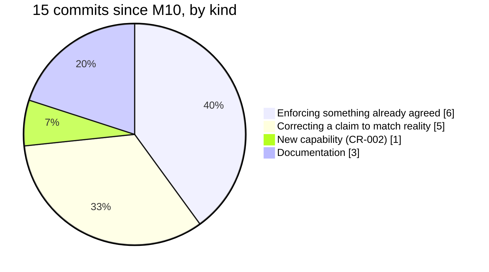

<!-- Stage 6 · Checkpoint review. Drift check against the agreed direction (R11). -->

# Weave — Checkpoint Review, 2026-08-15

- **Asked for by:** dsivov — *"make sure we are still on the same architecture and there is no drift."*
- **Scope:** everything since **M10** was written (`681d4c7..HEAD`), and the whole contract history.
- **Verdict:** **no drift.** The architecture is the one agreed at P0. Fourteen phases, forty-nine
  decisions, three contract amendments — and **none of them changed the shape of the system.**

## The answer, in one paragraph

**The design did not move. The documentation of it was ahead of the evidence, and that gap closed.**
Every amendment since M10 was the contract being corrected *toward* reality rather than the system being
steered away from it. A4 was lowered when it claimed something no deployment could do, and raised again
when the evidence existed. Nothing was added that the RFC did not anticipate; the additions were
**enforcement of things already agreed** — authentication on a surface that had none, membership on routes
that never checked it, and a description that stopped advertising a capability the server does not serve.

## Contract standing

`CONSTRAINTS.md` is **v7**, nine amendment rows, all with a `D-NN` and a human approval.

| | when | what moved | why it is not drift |
|---|---|---|---|
| **v5** | 2026-08-13 | A4 gains *"PostgreSQL cannot yet run quadruple mode"* | A limitation discovered and stated, not a direction changed. |
| **v6** | 2026-08-14 | A4 **lowered** — PostgreSQL is the multi-workspace path *for records*; its graph half **not deployable** | The strongest claim in the contract had the least evidence. **Lowering it was the contract working.** |
| **v7** | 2026-08-14 | A4 **restored** — the whole path runs, against an image the bundle ships | Earned by a graph round-trip on a live database and a healthy server raised by the published steps. |

**v6 is the entry I would point at if asked whether this process works.** For one day the contract said
*"not yet"* about the thing the product is proudest of, because that was true. It could have been quietly
fixed instead, and nobody outside would have known.

### Every constraint, against the current system

| ID | Verdict | Evidence |
|----|---------|----------|
| A1 | **held** | Still exactly three deployables. `deploy/postgres.Dockerfile` is a database the bundle runs *against*, not a fourth thing Weave ships — stated in D-047 rather than assumed. |
| A2 | **held, and it decided a design** | `weave_core/` still imports nothing from `weave/`. **And the same instinct pointed outward settled CR-002**: Weave does not reach into the ONBOARDING kit; the coupling lives in the `CLAUDE.md` Weave generates. |
| A3 | **held** | Name-guard clean throughout. Its **reach** is the standing limit: it catches spellings, not initials (`CG`), not inherited *content* (the extraction prompt, the Ollama claim). Three findings of that class, all now closed. |
| A4 | **v7, earned** | The full production path ran for the first time: round-trip green on live PostgreSQL, bundle healthy by its published steps, `ag_catalog.ag_graph` holding a graph the server created. |
| A5 | **held — and true for the first time** | `Insight` and `Review` were named artifact types **no new instance ever created** until D-043. The contract described an intention; it now describes behaviour. |
| A6 | **held — and twice repaired** | W33: the MCP surface answered unauthenticated. W34: membership was enforced nowhere on REST. **Both were A6 violations that had passed every prior gate**; both are closed with the rule in one place. |
| A7 | **held** | The default is one worker; the unsafe pairing is refused. W26 found the flag's help said `1` while the code said `2`. |
| A8 | **held — strengthened** | Governance is still the signed ledger. U17 derives the mode in force from `/rbac` and `/lifecycle` rather than storing a label — a stored one would be A8's failure from the other direction. |
| A9 | **held, repeatedly load-bearing** | One handler, both surfaces — and W33 showed that *identity* must be shared too, or "one handler" is a fiction at the layer that matters. The MCP auth copy was deleted rather than kept. |
| A10 | **held** | Every role is still a Claude Code session. `weave roles kit` writes the client configuration; there is no bespoke human client. U14 replaced an instruction to `curl` with a button. |
| A11 | **held** | No new library in fourteen phases. D-042 vendored Swagger assets — build output, not an import — and said so. |
| A12 | **held** | No model in the routing path. Coordination is still deterministic graph logic. |
| A13 | **held, and re-examined on request** | dsivov asked why `ANTHROPIC_API_KEY` appears at all. It appears in a **scrub list** and two comments; nothing reads it. Sixteen variables are removed before an agent runs, and a preflight refuses if `claude` does not report subscription auth. |
| A14 | **held** | Users are persisted records with explicit membership — **and D-048 made that membership mean something on every route**, which it had not since P1. |
| A15 | **held** | The hub still never dials out. P10.5 added step reporting on the existing outbound heartbeat rather than a poll inward. |

## What changed since M10, and what kind of change it was

- **Enforcement, not new direction:** MCP authentication (W33), membership on every route (W34), the tenant
  header that selects rather than grants, and the step field that is diagnostic and never governed.
- **Claims corrected:** the Ollama emulation the server never served, the splash describing another
  product, the storage default that split the CLI from the server, the API description that named a
  capability with no routes.
- **One genuine addition:** **CR-002 / D-049** — authoring an artifact updates Weave, and `PublishPlan`
  refuses without its artifacts. Within A5, A6, A9 and A10; **no amendment required**.

## Open findings, carried forward

**34 watch items, 3 struck.** The ones that matter now:

| | | |
|---|---|---|
| **W24** | The diff shows the target state, not what you are losing — while the product now says *"read the diff before signing"* | before the guide's governance chapter |
| **W29** | The agent transcript is **destroyed**, not merely unsurfaced | needs a `D-NN` on retention and read-access |
| **W35** | A refused request still creates the workspace it named — admission runs before authentication | when middleware ordering is next opened |
| **W36** | One endpoint is public because nobody declared it either way | with the next auth change |
| **W31 · W32** | Extension setup swallows its own failures; the dev-host `--token` has no help text | with the next change to each |

**Two phases remain:** **P14** (CR-002, in flight) and **P9** (PostgreSQL quadruple mode, which would drop
A4's last qualification).

## The pattern this checkpoint exists to record

**Four defects in a fortnight were guarded by tests that passed.**

| what passed | what it proved | what it did not |
|---|---|---|
| `test_all_three_graph_adapters_import` | the module imports | the adapter had **never run** |
| `tests/test_membership.py` | `may_access` is correct | **no HTTP route called it** |
| the storage-layout test | directories *beneath* the working dir match | the **root** did not |
| `measure_extraction.py --names-only` | the offline paths work | the measuring path **could not run at all** |

**Each proved something true and adjacent to the claim, and was read as proving the claim.** That is the
same sentence as *builds is not runs*, *constructs is not reachable*, *endpoints is not buttons* and *a
tenant with history is not a new install*. It is the project's most reliable defect generator and its most
reliable review question: **name the noun in the criterion and the noun in the evidence, and check they
are the same word.**

## Recommended sequence

1. **Finish P14** (in flight), then **P9** — after which A4 carries no qualification at all.
2. **W24 before the guide's governance chapter** — the product tells a reader to read a diff that cannot
   answer the question it raises.
3. **W29 needs a decision, not an implementation** — an agent's reasoning is the most revealing artifact
   in the system and RBAC has no notion of who may read it.
4. **W35 and W36 together**, when middleware ordering is next opened: admission before authentication, and
   the undeclared public route.

## Verdict

- [x] **No architectural drift.** Every constraint in v7 holds; the three amendments moved the contract
      toward the evidence, never the system away from the design.
- [x] **The one new capability** (CR-002) was raised, measured, approved and logged before any code.
- [x] **Nothing was quietly widened.** Where a claim proved false it was withdrawn in the document that
      published it — including one of the reviewer's own, in the review where it appeared.
