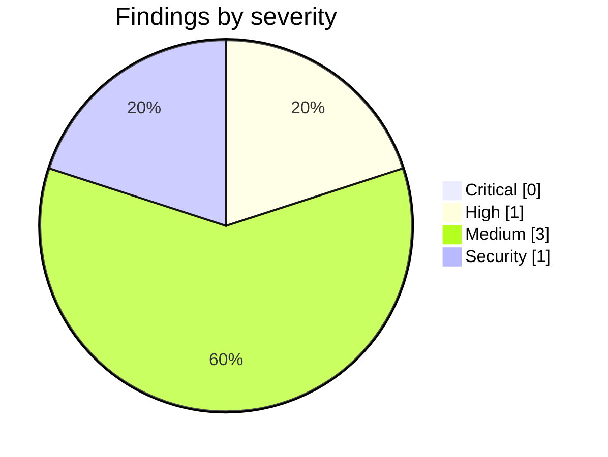

<!-- Stage 6 · Code review, run against the milestone's diff. Findings verified before reporting. -->

# Weave — Code Review (M0, 2026-08-08)

- **Scope:** `main` — `8610914` (the fork: 404 files, 111,017 insertions) and `fd68d4e` (the A3 v3 amendment). 62,259 LOC Python + 27,248 LOC UI carried from the pinned source commit `608401b8`.
- **Reviewer:** weave-manager · **Result:** **approved — one High to fix before P1 ships** · *H1 fixed in `9d17e4e`; see the correction under H1 — its scope was larger than this review found.*

## Summary

M0 is met. The gate was verified independently rather than accepted on report: **569 passed, 3 skipped, 0 failed** in the declared conda environment. The name-guard is clean on the scope A3 v3 defines, the engine/product boundary holds at 0 violations, the pinned commit's tree hash is intact, and 572 tests collect with zero errors — which is the real proof that a 340-file module remap broke nothing.

The finding that matters is **H1**: the rename left a security-relevant instruction pointing at a variable that no longer exists, so an operator following it would believe they had fixed an insecure default when they had not. One-string fix, and it must land before P1 ships the user store — that is when a forged token stops being a nuisance and becomes an RBAC bypass.

Nothing about the fork's structure is wrong. All six recorded deviations were checked against the code and all six are justified; one of them corrected an error in the work plan rather than departing from it.

## Critical

None.

## High

### H1 — The default-JWT-secret warning names a variable that no longer exists
- **Where:** `weave/server/app.py:561`
- **Failure:** The server warns `"Using default JWT secret — set TOKEN_SECRET env var for production"`. After D-024 the variable is `WEAVE_TOKEN_SECRET` (`weave/server/config.py:417`). An operator who follows the instruction exactly sets `TOKEN_SECRET`, which nothing reads; the server keeps signing with the known constant `weave_core-jwt-default-secret` while the operator believes it is fixed. The warning still fires, but by then it reads as noise they have already actioned.
- **Why both guards missed it:** the string contains no banned token — it is a *correct-looking old variable name*. A3 v3's widening catches brand leakage into generated contracts; stale variable names inside human-readable strings are a second class neither guard covers.
- **Fix:** one string → `WEAVE_TOKEN_SECRET`.
- **Correction (2026-08-08, after the fix landed):** this review originally recorded H1 as *"verified not systemic — the only instance"*. **That was wrong.** The developer's sweep found six more, and one was worse than H1 itself: `weave_core/graph/storage/__init__.py` listed `POSTGRES_*` and `NEO4J_*` unprefixed in `STORAGE_ENV_REQUIREMENTS`, which `check_storage_env_vars()` **reads from the environment at engine start and raises on**. A correctly configured PostgreSQL or Neo4j deployment would have been *refused at startup*, citing variables nothing reads — and it would have surfaced at M1 as a mystery, because the file-based path the suite runs on needs no environment at all.
- **Why the reviewer's sweep missed it:** the greps looked for *prose instructions* — `set X env var` shaped strings. `STORAGE_ENV_REQUIREMENTS` is a **declarative table of variable names consumed at runtime**, not prose. The generalisation was drawn from the one instance found rather than from the mechanism. The real class is *any string literal naming an environment variable* — prose, dict value or list entry alike, whether a human or the runtime reads it. `tests/test_config_surface.py` now asserts the class, which is the durable fix; a sharper grep would only have shifted where the blind spot sat.

## Medium

### M1 — Outside the declared environment the suite fails 89 times with no usable signal
- **Where:** `tests/` · `environment.yml` · `.github/workflows/ci.yml:42-50`
- **Note:** Running `pytest` with an interpreter lacking the conda env produces **89 failures**, all `ModuleNotFoundError: business_rule_engine`, indistinguishable at a glance from catastrophic breakage. This reviewer hit it and came close to filing 89 bogus Criticals. CI is correct (`setup-miniconda@v3`, `environment-file: environment.yml`, `activate-environment: weave`), so it only bites humans running locally. Suggested fix: a preflight in `tests/conftest.py` that imports the declared third-party set and fails **once** with a message naming the environment, rather than 89 collection errors.

### M2 — The source→destination mapping exists in two forms, and the durable one cannot name its source
- **Where:** `PROVENANCE.md` vs `docs/WEAVE_WORK_PLAN.md`
- **Note:** A3 v3 exempts seven pipeline artifacts; `PROVENANCE.md` is not among them, so it uses `⟨engine⟩` / `⟨platform⟩` / `⟨webui⟩` placeholders (D-026), while the work plan — which *is* exempt — names the same paths literally. The record meant to outlive everything is the one that cannot state its own source. It is recoverable ("with the pinned commit checked out there are exactly two Python packages and one UI directory"), but only by someone holding the source. **Decision needed:** either add `PROVENANCE.md` as an eighth enumerated exemption — a contract amendment, and the test pinning the list at seven moves with it — or accept the placeholder convention permanently and record that in A3's rationale so it is not re-argued each phase. Recommend the latter: the convention works, and a short exemption list is worth more than literal paths in one file.

### M3 — `weave_core/graph/storage/files.py` is 1,750 lines holding four unrelated storage classes
- **Where:** `weave_core/graph/storage/files.py` (`JsonKVStorage:50`, `JsonDocStatusStorage:362`, `NanoVectorDBStorage:772`, `NetworkXStorage:1206`)
- **Note:** **This was the work plan's instruction, not a developer deviation** — P0.3 specified the four-module merge. It is defensible: the four together are exactly one supported deployment path, so the module maps to an A4 configuration rather than an arbitrary grouping. But P1 (the Postgres `RecordStore` adapter) and P3 (the concurrency harness across every path) will both touch it. Revisit at P3 if it becomes a churn hotspot; splitting it now would be precisely the non-mechanical change deviation 3 correctly refused to make during a no-behaviour-change phase.

## Security

### S1 — The JWT signing secret has a publicly-known default and the server only warns
- **Where:** `weave/server/config.py:417` · `weave/server/app.py:557-561`
- **Risk:** `WEAVE_TOKEN_SECRET` defaults to the literal `weave_core-jwt-default-secret`. Anyone who reads this repository can mint a token carrying any `role` claim. Today that is contained — nothing is deployed and there is no user store. From **P1** it is a full RBAC bypass: A6 requires the principal to come from the authenticated identity, and a forged token *is* an authenticated identity. Compounded by H1, an operator who tried to fix it may have failed silently.
- **Inherited, not introduced:** the source carries the same pattern — an unprefixed `TOKEN_SECRET` defaulting to a hard-coded literal of its own — so the fork copied it faithfully. In scope for P1, not a P0 regression. *(The source's literal is deliberately not quoted here: a review is not one of the seven artifacts A3 v3 puts out of scope, and the name-guard caught the quotation on the first run after this file landed — which is the carve-out behaving exactly as specified.)*
- **Fix:** in P1, refuse to start when the default is in use unless an explicit development flag is set. A warning that can be ignored is not a control.

## Contract check (methodology R11)

| ID | Verdict | Evidence |
|----|---------|----------|
| A1 · three deployables | **held** | server serving `weave/server/webui`, `weave/devhost/` daemon, `deploy/dev-agent.Dockerfile`. No fourth. |
| A2 · import direction, no HTTP in core | **held** | 0 violations swept across `weave_core/`. Actively *enforced* this milestone: deviation 6 moved `__api_version__` to `weave_core/version.py`; deviation 4 moved `flows/` into the engine — justification verified real at `weave_core/studio/service.py:423`. |
| A3 · naming | **held, amended** | v2 → v3 (`fd68d4e`) with amendment row, `D-027`, approval confirmed. Independent grep over `weave weave_core weave-ui tests deploy scripts environment.yml pyproject.toml` returns 0. |
| A4 · three storage paths + ports | **held** | `weave_core/graph/storage/{files,postgres,neo4j}.py` only; `weave_core/store/record.py` present as the persistence port. |
| A5 · artifact nodes reference, never embed | **n/a** | Data model is P2. |
| A6 · governance on every action, authenticated principal | **n/a (carried)** | No new endpoints in P0. See S1 — a forged token would defeat this from P1. |
| A7 · bus adapter matches deployment | **n/a** | Postgres adapter is P3. **Watch:** nothing yet refuses multi-worker startup on the in-process bus — that guard is a P3 task. |
| A8 · runtime enforces the ledger version | **n/a** | Wizards are P4. |
| A9 · one handler for REST and MCP | **n/a** | Answer surface is P2. |
| A10 · every role is a Claude Code session | **n/a** | Role kits ship in P6. |
| A11 · stack, one library per job | **held** | conda + `environment.yml`; `python-jose` appears only in the comment explaining its absence; PyJWT is the sole JWT library; `pytest` for Python, `bun test` for the UI. Nothing added off-plan. |
| A12 · no orchestrator model | **held** | Nothing added to any routing path. |
| A13 · two LLM paths, never merged | **held** | `anthropic` absent from manifest and code. `SUBSCRIPTION_SCRUB_VARS` intact at `weave/team/worker.py:50-51`; `CLAUDE_CODE_OAUTH_TOKEN` and `ANTHROPIC_API_KEY` deliberately left **unprefixed**, so the seat still arrives and the scrub still matches. |
| A14 · persisted users, no env accounts | **n/a** | User store is P1. |
| A15 · one hub, outbound-only, agents hold no creds | **held (carried)** | `weave/devhost/` copied whole; no inbound path added. |

- **Any drift reported before it landed?** Yes — all of it. Deviations 1–6 were raised in advance and recorded in `PROVENANCE.md`; the A3 tension was escalated as a contract question rather than worked around.
- **Contract amended this milestone?** Yes — **v3**, one amendment row, `D-027`, human approval confirmed and recorded.
- **Non-goals still respected?** Yes. `webingest`, `tools`, `evaluation` and the six dropped backends absent; nothing writes to the source; no new library.

## Layout & dependency drift (methodology R10)

- **Layout matches the doc?** Yes, after five plan corrections made this milestone: `flows/` → `weave_core/` (A2), `reasoning.py` over `graph.py` (name collision), `gunicorn_config.py` kept separate, plus two packages the plan never named (`weave/ingress/`, `weave_core/studio/apps.py`). **The plan moved to match the code, because in all five cases the code was right.**
- **Manifest matches the declared table?** Yes. Every DRP §7 library present, all 13 omissions absent, nothing added.
- **Duplicate functionality introduced?** None. The one candidate — two JWT libraries — was resolved by dropping `python-jose`, which the source declared but never imported.

## Non-issues confirmed (checked, clean — do not re-flag)

- **89 test failures on first run.** Reviewer's environment, not the code. Ambient `/storage/conda/bin/python` lacks `business_rule_engine`; the declared env passes 569 / 3 skipped. Recorded as M1 so the trap is documented rather than rediscovered.
- **`flows/` in `weave_core/`.** Verified justified — `weave_core/studio/service.py:423` imports `weave_core.flows.schema`, so the plan's placement would have forced an A2 violation. Contract outranks plan.
- **The 152-variable `WEAVE_` prefixing.** Vendor/ours split checked and correct: `OPENAI_API_KEY`, `AZURE_OPENAI_*`, `GEMINI_API_KEY`, `AWS_*`, `ANTHROPIC_API_KEY`, `CLAUDE_CODE_OAUTH_TOKEN` all left bare; no unprefixed "ours" variable remains in `config.py`. Prefixing a vendor variable would have broken the library silently — none was.
- **`gunicorn.py` / `gunicorn_config.py` as two files.** The launcher mutates the config as a module object; merging breaks that mechanism.
- **`studio/diagrams/` as a package.** Flattening needs intra-package import rewriting — not mechanical, and P0's gate forbids behaviour change.
- **`PROVENANCE.md` placeholders.** Deliberate (D-026), not an oversight. Raised as M2 only for the asymmetry with the work plan, not because the file is wrong.
- **Two accidental OpenAPI `operationId`s carrying the source's brand.** Found and fixed by the developer, with `tests/test_public_contract_names.py` now asserting against the *generated* document. This is the class a file-scanning guard structurally cannot catch, and it is why A3 v3's widening matters more than its carve-out.

## Verdict

- [x] All **Critical** fixed → milestone gate passes. (None found.)
- [ ] **High** fixed or logged — **H1 open**, one-string fix, must land before P1 ships the user store.
- [x] Layout & dependencies match the design docs (docs updated where the code was right).
- [x] **Every constraint in `CONSTRAINTS.md` still holds** — A3 amended with recorded approval.
- Decisions arising: none new. M2 needs a call from dsivov; S1 becomes a P1 task.

**P1 may start.** H1 and S1 both concern authentication — the subsystem P1 opens with — so they are naturally its first two tasks rather than a blocking backlog.
