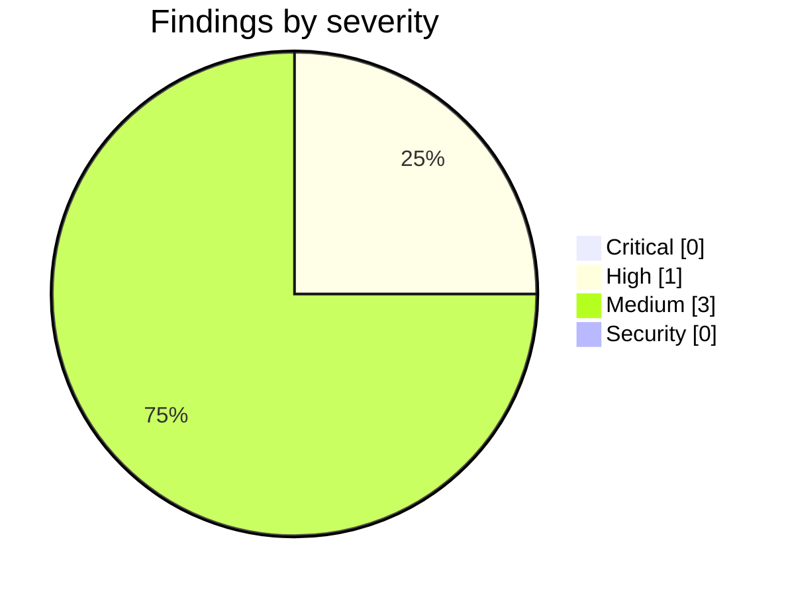

<!-- Stage 6 · Code review, M1. Findings verified before reporting. -->

# Weave — Code Review (M1, 2026-08-09)

- **Scope:** `main` — `778d70a` (P1: the user store) and `9d17e4e` (M0 review items closed). Reviewed against `WEAVE_DRP.md` §3.3 / §5-M1 and `CONSTRAINTS.md` v3.
- **Reviewer:** weave-manager · **Result:** **approved — one High is a decision for dsivov, not a code fix**

## Summary

M1 is met, and the gate was reproduced independently against the developer's live containers rather than accepted on report: **679 passed, 0 failed, 0 skipped** with PostgreSQL on 5442, Neo4j on 7688 and `--run-integration`. **AS2 and AS3 — the two assumptions the DRP flagged as most likely to bite — are now verified rather than assumed.**

The one High is not a defect. Neo4j Community cannot create a database per workspace, so every workspace shares one — which means the three storage paths A4 lists as equals are not equal on the property this system's tenancy rests on. That is a decision, and the developer correctly recorded the fact without picking the verdict.

Three problems this milestone found are ones no unit test would have surfaced, and all three were found by standing the thing up. That is the milestone working as intended.

## Critical

None.

## High

### H1 — A4 presents three storage paths as equals; on Neo4j the tenant boundary is weaker
- **Where:** `weave_core/graph/storage/neo4j.py` · `CONSTRAINTS.md` A4 · interacts with D-028
- **Failure:** Neo4j Community has no multi-database support — that is an Enterprise feature — so every workspace shares the default database. Isolation on that path rests on labels and naming rather than on a database boundary. A4 says "exactly three storage paths" with no qualification, and D-028 was written on the premise that the workspace *is* the hard boundary. An operator reading A4 could deploy Neo4j with several workspaces believing they are isolated to the same degree as on PostgreSQL. They would not be.
- **Not a code defect:** the adapter is correct for what Community offers. The gap is between what the contract implies and what one path delivers.
- **Decision needed (dsivov, R11):** either (a) A4 states that Neo4j requires Enterprise for multi-workspace deployments, or (b) the Neo4j path ships labelled experimental and single-workspace. Either way A4 changes, so this is an amendment with a version bump and an amendment row. Recommend (a): it is a truthful qualification rather than a retreat, and the path is otherwise verified working.
- **RESOLVED 2026-08-11 — (b), by dsivov ([D-029](DECISIONS.md), A4 → v4).** The recommendation was not taken, and the reasoning against it is worth recording: (a) annotates the failure but leaves it available, since an operator on Community who reads the qualification and proceeds anyway gets no error — just silent co-tenancy. That is the same class of defect as the in-process bus under multiple workers (D-019). **The consequence is that this finding became code, not prose:** a Neo4j deployment asked for a second workspace must fail at creation, and P2.1 carries the task and its test. A restriction enforced only by documentation is what the decision exists to close.

## Medium

### M1 — `weave_core/store/postgres.py` runs a background event loop; the architecture does not mention it
- **Where:** `weave_core/store/postgres.py:61-74` (`_LoopThread`, singleton, `daemon=True`)
- **Note:** Disclosed by the developer rather than smuggled, and the reasoning holds: the `RecordStore` port is synchronous because its callers are — including the dev-host daemon, which runs nowhere near a web server — `asyncpg` is async-only and the sole driver in the dependency set, making the port async would rewrite every carried caller, and a second synchronous port would be two tools for one job (R10). The bridge is contained: the thread starts on first use and no coroutine escapes the module. But "introducing background work where there was none" is a named tripwire, and `WEAVE_ARCHITECTURE.html` describes the store as a plain port with three adapters. **Fix the document, not the code:** the architecture should say the Postgres adapter owns a loop thread, so the next person does not discover it.

### M2 — `list everyone with access to workspace X` is a full scan of all users
- **Where:** `weave/server/users.py` — `WorkspaceMembership` embedded in the user record
- **Note:** The deviation is well argued: two stores make a grant two writes and a revocation a cascade, and on the file path's whole-file read-modify-write that window is wide enough that an orphaned grant becomes unfixable from the UI. Embedding is the right call at this scale. The cost is that membership is only indexed by user, so the reverse question — who can reach this workspace — requires reading every user. Fine now; worth revisiting if user counts grow or if an audit view needs it. Recording so the trade-off is deliberate rather than rediscovered. Good detail: the grant carries `granted_by` and `granted_at`, because "why does this person have access" is asked during incidents.

### M3 — `python -m weave.server.users` is real product surface that the plan does not carry
- **Where:** `weave/server/users.py` (CLI entry) · `docs/WEAVE_WORK_PLAN.md` P1
- **Note:** This exists because the gate found something genuine: after migrating environment accounts, **nobody could administer users** — the HTTP bootstrap window closes on the first user, and a migrated install has users but no admin, because the old scheme had no such concept. That is precisely the "edit a file and restart" trap M1 exists to remove, reintroduced by the fix for it. The local CLI is the right answer (it already requires more authority than any HTTP caller). But it is unplanned surface, and it is the seed of `weave user add` (R44) — so the plan must carry it now, or P6 will rediscover it as a duplicate.

## Security

None new. S1 from M0 (the published default JWT secret) was closed as P1's first task.

## Correction, 2026-08-11 — A6 and A14 did **not** hold, and this review said they did

Recorded here rather than quietly amended in the table below, because a review is read later as fact
and the table's verdicts are the part people trust.

The developer, reading before starting P2, found that `weave/server/workspace_pool.py:192` reads the
request workspace from a rebrand artifact rather than the documented `WEAVE-WORKSPACE` header.
Reproduced independently: line 214 is the only `_current_workspace.set()` in the tree, so the lookup
misses on every request and **every request resolves to `default_workspace`**. The tenant boundary
this whole design rests on was not enforced at all. That is **Critical**, it predates P2, and both
this review and M0's missed it (D-030).

**Why it was missed, which matters more than the miss.** A6 was checked by driving 403 / 200 / 401
across roles, and A14 by confirming per-workspace membership was persisted and carried in the token.
Both are true and both were verified. Neither asks the next question — *does the workspace the client
names actually select anything?* The M1 gate has the same shape: "an admin creates a user → that user
signs in → sees **only** granted workspaces" is satisfiable entirely at the token and membership
layer, and it was satisfied there. **A gate that can pass without the data layer participating does
not test the data layer.** M2 gains `tests/test_workspace_isolation.py` for exactly this: two
workspaces, real store, different data over HTTP.

This is the second instance of one mechanism — a renamed literal that is compared against something
produced outside this codebase, where self-consistency proves nothing. The first was the `POSTGRES_*`
startup defect corrected in [WEAVE_CODE_REVIEW.md](WEAVE_CODE_REVIEW.md). Twice is a pattern, so the
rule is written down in D-030 rather than left as a habit: **a renamed literal is safe when both sides
of the comparison were renamed together, and broken when the other side is an external contract.**

The verdicts below stand as originally written, with A6 and A14 read as **superseded by this
correction**.

## Contract check (methodology R11)

| ID | Verdict | Evidence |
|----|---------|----------|
| A1 · three deployables | **held** | `deploy/server.Dockerfile` added for the server image; still server + devhost daemon + dev-agent image. No fourth process. |
| A2 · import direction, no HTTP in core | **held** | 0 violations swept across `weave_core/`. |
| A3 · naming | **held** | Guard clean; independently re-grepped. `WEAVE_AUTH_ACCOUNTS` reads 0 outside the migration path. |
| A4 · three storage paths + ports | **held, but see H1** | Exactly three adapters; the user store goes through `weave_core/store/record.py`, not a private client. The *qualitative* gap between the paths is H1. |
| A5 · artifact nodes reference, never embed | **n/a** | Data model is P2. |
| A6 · governance on every action, authenticated principal | **held** | 403 for developer / 200 for admin / 401 anonymous, verified. Authorisation is now a dependency, so it is decided **before** body validation — closing a real leak where a 422 handed the full field list to a caller who would have been refused. |
| A7 · bus adapter matches deployment | **n/a** | P3. **Watch persists:** nothing yet refuses multi-worker startup on the in-process bus. |
| A8 · runtime enforces the ledger version | **n/a** | P4. |
| A9 · one handler for REST and MCP | **n/a** | Answer surface is P2. |
| A10 · every role is a Claude Code session | **n/a** | P6. |
| A11 · stack, one library per job | **held** | `deploy/requirements.txt` is a **generated projection** of `environment.yml` via `scripts/sync_requirements.py`, with `tests/test_dependency_parity.py` failing on drift. That is one manifest with a derived artifact, not two manifests. No library added. |
| A12 · no orchestrator model | **held** | Nothing added to any routing path. |
| A13 · two LLM paths, never merged | **held** | Unchanged this milestone. |
| A14 · persisted users, no env accounts | **held — this milestone delivered it** | Persisted users with bcrypt hashes and explicit per-workspace membership; `WEAVE_AUTH_ACCOUNTS` migrated on boot and then unread. `test_users.py:263` asserts `password_hash` appears nowhere in the **generated** OpenAPI document. |
| A15 · one hub, outbound-only | **held** | No inbound path added. |

- **Any drift reported before it landed?** Yes. The daemon-thread bridge was raised explicitly as a tripwire; all three deviations were declared.
- **Contract amended this milestone?** No. H1 proposes one.
- **Non-goals still respected?** Yes.

## Layout & dependency drift (methodology R10)

- **Layout matches the doc?** Yes, with two additions to carry into the plan: `deploy/server.Dockerfile` and `deploy/requirements.txt` (both needed once `compose.yml` requires an image, and conda inside a container buys nothing), plus the `weave.server.users` CLI (M3).
- **Manifest matches the declared table?** Yes — and the parity test makes the projection self-checking.
- **Duplicate functionality introduced?** None.

## Non-issues confirmed (checked, clean — do not re-flag)

- **8 skips in the offline run.** Not database gating. With credentials supplied the skip *reason changes* to `requires the real similarity model — pass --run-integration`; with `--run-integration` the suite is 679 passed / 0 skipped. The database paths are genuinely exercised. The skip messages naming AS2/AS3 and the exact variables to set are a good pattern — a skip that says which assumption it leaves unverified.
- **`to_dict()` includes `password_hash`.** That is the *storage* serialisation and must. The HTTP surface is asserted clean over the generated OpenAPI document, which is the assertion that actually matters.
- **`deploy/requirements.txt`.** Generated, parity-tested, not a second manifest.
- **`tests/test_auth_roles.py` rewritten rather than deleted.** Same intents, new mechanism — correct treatment for a carried test whose subject changed.

## Verdict

- [x] All **Critical** fixed → milestone gate passes. (None found.)
- [x] **High** — H1 **closed 2026-08-11**: dsivov chose *experimental, single-workspace*; A4 is at v4, D-029 is logged, and the enforcement it requires is a P2.1 task with a test. P2 was never blocked by it.
- [x] Layout & dependencies match the design docs (three additions to fold into the plan).
- [x] **Every constraint in `CONSTRAINTS.md` v3 holds** — A4 needs qualifying, which H1 proposes.
- Decisions arising: H1 → an A4 amendment; M1 → an architecture correction; M3 → plan tasks.

**P2 may start.** H1 is a contract question that runs in parallel; nothing in P2 depends on its answer.
