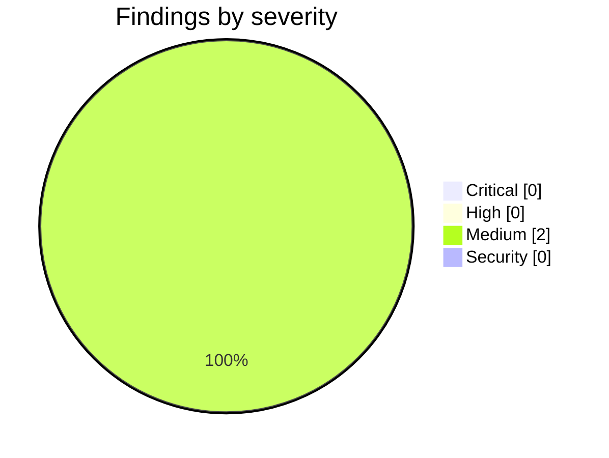

<!-- Stage 6 · Code review, M10. Every finding verified before reporting; every fix driven in a browser. -->

# Weave — Code Review (M10, 2026-08-14 · refreshed)

- **Scope:** `main` — `9b7f4ab..439467a`, **44 commits, 73 files, +4,647/−240** (P10 through P10.5, plus P12).
  Reviewed against [WEAVE_UI_DEFECTS.md](WEAVE_UI_DEFECTS.md) and `CONSTRAINTS.md` as it moved **v5 → v6 → v7**.
- **Refreshed 2026-08-14** — the first version was written after P10.1 and everything from P10.2 onward landed
  after it. A review that describes a phase it predates is the failure this project keeps finding, so it is
  rewritten rather than appended to.
- **Reviewer:** weave-manager · **Result:** **approved — 0 Critical, 0 High. Merged.**

## Summary



| | |
|---|---|
| Python suite | **1262 passed / 3 skipped** on the final commit, against the **new database image** — every skip Neo4j-not-configured |
| `bun test` · `tsc --noEmit` · `eslint` | pass · exit 0 · exit 0 |
| `bunx --bun vite build` | ✓ 12.3s |
| **A9** | `weave/server/routers/` — **10 files, 0 route/model/handler changes.** Every diff line a message string, checked not asserted |
| **A2** | `weave_core/` — 0 files |
| name-guard | clean |
| **Browser sweep** | **15/15**, three server states, two roles — `m10_sweep.py`, re-run on final code |
| **The production path** | **ran for the first time**: graph round-trip green on live PostgreSQL, bundle healthy by its published steps |
| `bun test` | **51 pass / 0 fail** — run here; the developer's container has no bun |

**This phase began with thirteen defects a user found in twenty minutes. It ended with nineteen fixed —
fourteen reported and five nobody had ever seen — plus a production path that had never run.** The five
were found by doing what a new operator does: starting a server, on an empty machine, and reading the
screen; and by writing a guide whose rule is that every claimed step is executed before it is written.

## The gate, driven by hand

Not `curl`. Every row below is a browser, signed in as a real user, against a server in the state the
defect needs:

| State | Verified |
|---|---|
| **Populated, governed** | U2 · U3 · U5 · U6 · U9 · U10 · U11 · U12 · U13 · U17 |
| **Weave switched off** | U15 — the message names `WEAVE_ENABLE_TEAM`, the variable the server reads |
| **Governance engine off** | U16 · U14 — the refusal names the engine; the board offers a button |
| **Created from nothing** | **P10.1's gate** — seeded, `/ask/learnings` answers **13 nodes** with no migration |

```
In force now — reviewed                        RBAC v2 · lifecycle v2
  manager   everything      Task 7 states
  developer 8 actions
Read from the signed artifacts themselves, not from a stored setting.
```

## What the seventeen actually were

Thirteen reports, seven root causes — and **not one was "works as designed"**:

- **The new shell replaced the chrome and did not re-implement it** (U11·U12·U13). `AppShell` is the whole
  app in `next` mode; `SiteHeader` — which owned the only logout and the only display of who you are — is
  never rendered. The `CG` badge was the parent's initials, which the name-guard cannot see because it
  checks spellings.
- **The refusal rendered where nobody was looking** (U2·U6·U7·U10). Four screens, one rule.
- **A role change needed a token the UI could not reissue** (U1) — three defects composing into an owner
  who could not configure their own installation.
- **The renderer and the answer surface shared one field name out of thirteen** (U3).
- Plus the anchor-not-a-question box (U5), Swagger assets that 404'd (U9), the board naming an HTTP verb
  (U14), and governance that was signed, in force, and displayed nowhere (U17).

## Critical / High

None.

## Medium

### M1 — the tooltip sweep read stronger than it was
`test_controls_explain_themselves.py` claimed *"a `title` on a disabled element is not an explanation"*
and checked only `title={… ? …}`. A **constant** explanatory title walked through. Found by injecting a
control the guard had never seen. **Widened, and the widening immediately found two real offenders in
`WeaveProjectPanel` — a screen nobody had reported** — where titles described the action while the reason
for disablement went unsaid. Fixed, and the waiver is per-title rather than per-file, so a declared
filename is not a free pass. *(Fourth instance of reach-versus-claim in this project.)*

### M2 — W24: the diff shows the target, not the loss, and U17's warning now cites it
`SignOffPanel` renders `delta.after`, so re-picking **Solo** on a **Reviewed** workspace shows *"here is
Solo"* rather than *"you are removing the architect's approval gate"*. True before this phase; **U17 made
it matter**, because the product now says *"read the diff before signing"*. Advice pointing at a diff that
cannot answer the question it raises — W20's family. **Open, scheduled before P8's governance chapter.**

## A finding withdrawn — mine, from M7

**W17 named a mechanism that does not exist, and the correction is written into the M7 review where the
claim was published.** `emit_decision_trace` cannot retype an existing node: it skips one that exists and
creates only a missing endpoint (`quadruple.py:1293`), and `git log -S` places that guard in **`8610914`,
the P0 fork commit**. `review:T-P0-FORK` is not an id the migration writes — it writes
`review:T-P0-FORK:0`. The audit edge pointed at `review:{task}` while typed nodes live at
`review:{task}:{index}`, so **the edge created a twin at an id no typed node ever occupied**. Generic from
birth. Two nodes; the M7 review compared the `entity_type` of one against the write of the other.

The developer probed this before building on it, rather than accepting a manager's finding as a premise.

## The one that mattered most, and why it hid — W23

On a **new** instance, recording a learning did not make it answerable. `/ask/learnings` returned **0** on
every fresh workspace: `record_learning` wrote a decision trace, the answer seeds on
`entity_type in (Review, Insight)`, and the typed nodes were never created. **One of the four canonical
questions was empty on every install** until `weave migrate reviews` — a step nobody was told to run.

It survived two milestone reviews, a browser pass and a week of daily use for one reason: **every
measurement was taken against the demo tenant, which had been migrated historically and therefore already
knew the answer.** The seed script hid the same way — it had not completed on a clean workspace since
`1e4d427` made bootstrap step 0, because the preset gates the claim to developers and the script logs in
as a manager; the only tenant anyone re-ran it against already had its tasks claimed from before that
change, so every repeat 409'd quietly into a tolerated-error counter.

**D-043 fixed it at the source** — one builder in `weave/model/insights.py`, called by both the live path
and the migration, proven by running the migration over live-recorded data: `nodes_created: 0,
nodes_already_present: 13`. Zero is the only number that means they cannot differ.

## What landed after the first draft — and the phase changed shape

The review below originally covered thirteen UI defects. By the end it covered **seventeen defects, five
sub-phases, two contract amendments in opposite directions, and a production path that had never run.**

| | |
|---|---|
| **U15 · U16** | The only message shown when Weave is missing named `ENABLE_WEAVE` — **a variable nothing reads**. Ten routers told a reader whose Weave surface was on that it was off. |
| **U17** | Governance was signed, in force, and displayed nowhere. Now derived from `/rbac` + `/lifecycle`, never stored — a stored label would be A8's failure from the other direction. |
| **U18 · U19** | The diagram editor rejected `flowchart TB` and `graph TD` — **valid mermaid it renders happily** — and crashed on an edge to a subgraph, showing the reader a raw `TypeError`. |
| **P10.1 / W23** | **`/ask/learnings` answered `0` on every new workspace.** Recording wrote a decision trace; the answer read types that were never created. One of four canonical questions, empty on every install. |
| **P10.5 / D-045** | A worker now reports its step and how long it has been there. `building · 4m` answers *"is it stuck?"*; `current_task` alone never did. |
| **W25–W28** | The first screen a reader meets: a blocking `yes/no` prompt, another product's tagline, a workers default A7 refuses, a storage default that **split the CLI from the server**, and an API advertising Ollama emulation that was excluded at P0. |
| **W30 / P12** | **A4's production path had never run anywhere**, and no published image could run it. |

**Nine of those were found by executing the guide's own install steps**, not by reading code. The rule
*"every claimed step is executed before it is written"* was written to make the guide honest; it turned out
to be the most productive defect-finder in the project.

## The two amendments, and why there are two

**`CONSTRAINTS.md` moved v5 → v6 → v7 in one day, in opposite directions, and that is the file working.**

- **v6 (D-046)** lowered A4: PostgreSQL is the multi-workspace path *for records*, its graph half **not yet
  deployable**. Multi-workspace production requires `PGGraphStorage`; that needs `age` **and** `vector` in one
  database; pgvector-only dies at `create_graph`, AGE-only dies **earlier**, on connect; no published image
  has both. **The contract had been asserting something no deployment could do.**
- **v7 (D-047)** put it back, once the evidence existed: `deploy/postgres.Dockerfile`, a graph round-trip
  green on a live database, and a healthy server raised by the **published steps** with all four storages on
  PostgreSQL and `ag_catalog.ag_graph` holding a graph the server created.

**Lowering it first was the point.** Building the image without amending would have left the contract
carrying an unearned claim for as long as the fix took — which is exactly what **v4 corrected for Neo4j**.
The contract is allowed to say *"not yet"*.

**How it survived seven milestone gates:** the only test touching the adapter was
`test_all_three_graph_adapters_import`, which asserts a module imports. **Builds-is-not-runs, wearing a
test's clothes** — and the test container this project had used since M1 was the same image that cannot run it.

## Contract check — `CONSTRAINTS.md` v7 (R11)

| ID | Verdict | Evidence |
|----|---------|----------|
| A1 | **held** | No deployable added. `weave/server/static/` is inside the server, not a fourth thing. |
| A2 | **held** | `weave_core/` — 0 files changed across the phase. The new writer imports stdlib only. |
| A3 | **held** | Guard clean. **U13 is the interesting one**: `CG` is the parent's *initials*, which the guard cannot see — recorded as a reach limit, not a violation. |
| A4 | **lowered, then earned back** | **v6** said the graph half was not deployable — measured: pgvector-only dies at `create_graph`, AGE-only dies on connect, no published image has both. **v7** restored it against `deploy/postgres.Dockerfile`, with a round-trip green on a live database and the bundle healthy by its published steps. The adapter itself is unchanged. |
| A5 | **held — made true** | `Insight` and `Review` are named artifact types in A5 and were **aspirational on any new instance**. D-043 makes the sentence true rather than changing it. |
| A6 | **held — strengthened** | The session block displays the token's claims; the server still derives the principal from the token. U1's fix made the token/record distinction *visible*, which is the opposite of self-stamping. |
| A7 | **held, and exercised** | The first test to construct the app tripped A7's refusal on the worker count — the constraint firing in a test rather than in production. |
| A8 | **held — load-bearing** | U17 derives the mode from `/rbac`+`/lifecycle`. A stored `current_mode` would be the wizard-writes-what-the-runtime-does-not-read failure from the other direction. |
| A9 | **held** | 10 router files, **0 route/model/handler changes** — every line a message string. U3 fixed below both adapters, so MCP gets the label too. |
| A10 | **held** | U14 replaced an instruction to issue an HTTP request with a button. Human roles are Claude Code and the web UI; neither is a `curl` prompt. |
| A11 | **held** | No manifest change. **D-042** vendors Swagger assets — third-party build output, not an imported library; FastAPI already depended on the same files from a CDN at a floating major, so this *removes* a network origin and pins a version. |
| A12 · A14 · A15 | **n/a** | Untouched. |
| A13 | **held** | No credential goes near a Claude Code process; the vendored assets are static files. |

- **Contract amended?** No. Two decisions logged — **D-042** (vendoring) and **D-043** (typed nodes at
  recording). Neither makes a sentence false; D-043 makes A5 true.
- **W16 still open**, and it now blocks a feature: auto-installing governance on workspace creation would
  install RBAC everywhere, and an RBAC-enabled workspace denies every MCP agent. **U14 is a button and
  deliberately not install-on-load**, with that reason written into its test.

## What this phase says about how it was reviewed

**Three of my own claims were wrong and are corrected in place**, because a review is read later as fact:

1. **W17's mechanism** — withdrawn above.
2. **U2's description** — I wrote that the 403 rendered "behind the modal where you cannot see it". The
   screenshot says *outside and above the dialog, dimmed by the overlay*: on screen in principle,
   unnoticeable in practice. More precise, and the fix is the same.
3. **`PROVENANCE.md`** claimed a test fetched asset URLs. It read source. I wrote the test that makes the
   claim true rather than softening the sentence.

**And the pattern behind the phase's own findings is one sentence:** *what was measured sat next to what
was claimed.* Builds is not runs (W18). Constructs is not reachable (W20). Endpoints is not buttons (U6).
Views is not chrome (U11). **And a tenant with history is not a new install (W23)** — the one that cost
most, because it was invisible to every check that used the instance we already had.

The developer's version is better than mine and is the phase's lesson: **look at the artefact before
reasoning about the mechanism** — and, after W23, *look at it on a machine with no memory.*

## Verdict

- [x] **Critical** — none. **High** — none.
- [x] **Nineteen defects fixed**; **15/15 driven in a browser** across three server states and two roles, re-run on the final commit.
- [x] P10.1's gate met on a workspace created from nothing: `13 nodes — 7 Insight, 6 Review`, no migration.
- [x] Every constraint in **v7** holds. **A5 is true for the first time** (D-043); **A4 was lowered and earned back** (v6 → v7); A6, A8 and A9 are stronger.
- [x] One finding withdrawn, three corrections written where the wrong claims were published.

**Merged. P8 — the user guide — is next, and is now writable:** the flows it documents work, `/docs` works
offline, the seed is idempotent and completes on a clean machine, and *record a learning → ask what did we
learn* answers. **W24 is the one open item that touches the guide**, and belongs before its governance
chapter.
