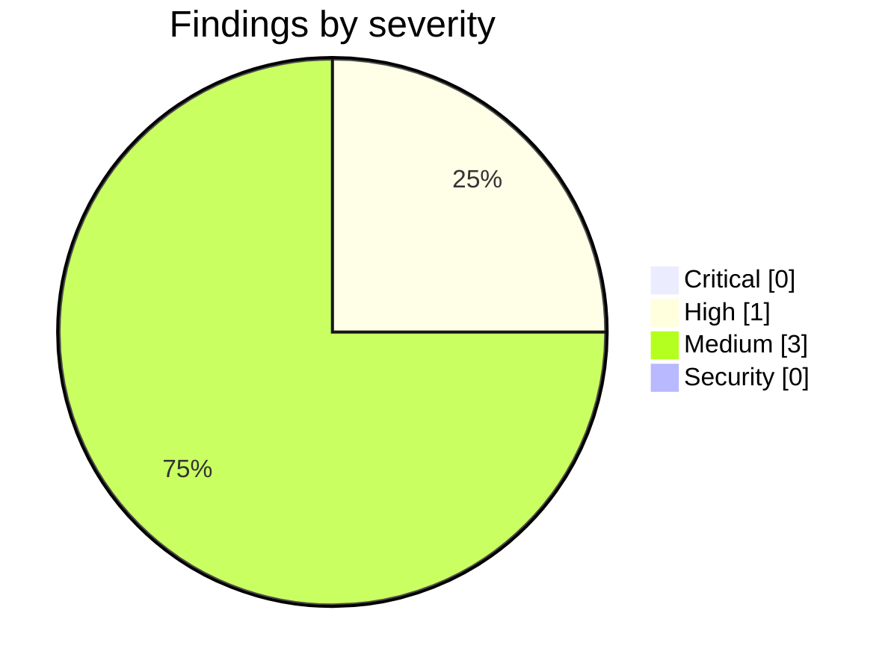

<!-- Stage 6 · Code review, M2. Findings verified before reporting. -->

# Weave — Code Review (M2, 2026-08-11)

- **Scope:** `feature/p2-data-model` — `main..40c277c` (P2: data model & the answer surface). 39 files, +4,930 / −243. Reviewed against `WEAVE_DRP.md` §3.4 / §5-M2 and `CONSTRAINTS.md` **v4**.
- **Reviewer:** weave-manager · **Result:** **gate met — one High open. Not merged to `main` until it is closed (R4, R5).**

## Summary

M2's gate is met and was reproduced independently rather than accepted on report: **848 passed / 0 failed / 0 skipped** in the declared conda env with PostgreSQL on 5442, Neo4j on 7688 and `--run-integration` (M1 was 679). The only change between the developer's `40c277c` and the commit I ran, `1718897`, is 22 lines of `WEAVE_WORK_PLAN.md` — no code — so the number stands for the reviewed head.

**The gate criteria were then driven by hand on a live server**, because a green suite is not the gate and standing the thing up has found a defect at every milestone so far. It did again here — see H1, which no test in the suite covers.

One finding this milestone deserves credit for: **the P2 routers were written but never mounted**, and the developer found it by running a live server rather than at review. That is the milestone process working as designed.

## Critical

None.

## High

### H1 — the D-029 admission check fails open, in exactly the mode D-029 exists to prevent
- **Where:** `weave_core/graph/storage/neo4j.py` (`occupied_workspaces`, the `except Exception → return set()` path) · `weave/server/workspace_admission.py:93` · `weave/server/workspace_pool.py:173`
- **Verified, not inferred:** the adapter swallows every exception and returns an **empty set**, which `check_admission` cannot distinguish from *"the database holds no workspaces"*. The other half of the occupancy union, `known_workspaces`, is `self._instances` — this process's pool, so it is empty on a fresh boot.
- **Failure:** graph backend is Neo4j; the server restarts while Neo4j is briefly unreachable (container restart, network blip, database still coming up — the ordinary case, not an exotic one); an operator creates workspace `beta`. The probe fails, returns empty, `known_workspaces` is empty, and **`beta` is admitted**. Neo4j comes back. `alpha` and `beta` now share one database separated only by labels, permanently, with no error and nothing that re-checks. That is precisely the silent co-tenancy A4 v4 forbids and D-029 chose *code over prose* to prevent — the enforcement reproduces the failure mode of the documentation it replaced.
- **Why the current justification does not hold.** The adapter docstring argues *"Refusing to start because we could not verify a limit would be worse than the limit."* That conflates two different refusals. Refusing to **create a new workspace** while occupancy is unverifiable is not a startup failure: the existing workspace keeps working, every current caller is unaffected, and the only thing refused is the one irreversible act. Fail-open is right for *reads*; it is wrong for *admission*.
- **Fix:** make the probe distinguish *unoccupied* from *undetermined* — return `None`/raise rather than `set()` on error — and have `check_admission` refuse a **new** workspace when occupancy is undetermined, while still admitting one already in `known_workspaces`. The refusal message should say the limit could not be verified, which is a different operator instruction than "this backend is full". Add the test that fails against today's code: probe raises, fresh pool, second workspace requested → refused.

## Medium

### M1 — the migration is well tested and has never run on real data
- **Where:** `weave/model/migrate_reviews.py` · `tests/test_migrate_reviews.py` (15 tests)
- **Note:** Disclosed rather than glossed: the live task store was empty, so a live run would have been a pass that meant nothing. The unit coverage is genuinely good (100% by count and content, idempotency, `release()`-written entries). But "moves 100% of existing reviews/learnings" is a claim about **existing data**, and no existing data has been through it. Not a defect and not a gate failure — a claim narrower than it reads. Re-run it against a populated store at the first opportunity and record the result; until then it is verified-by-construction, not verified-in-practice.

### M2 — "0 dangling locators" was measured on an empty graph
- **Where:** `scripts/check_locators.py`
- **Note:** I reproduced it: `resolved 0, dangling 0, malformed 0`. Zero out of zero. The developer flagged this unprompted and tested the checker's **detection** separately, which is the right response and the reason this is a note rather than a finding. Recording it so the number is never quoted later as evidence the graph is clean — it is evidence the checker runs.

### M3 — the DRP layout does not carry three modules that now exist
- **Where:** `WEAVE_DRP.md` §layout — missing `weave/cli/`, `weave/server/workspace_admission.py`, `weave/model/answers.py`
- **Note:** R10 requires the layout to match reality. **Manager's to fix**, raised by the developer.

## Security

None new. The tenant boundary — the one security-relevant property this milestone touches — was verified live and holds; see A6/A14 below.

## Gate verification (driven by hand, not only in the suite)

| Gate criterion | Result | Evidence |
|---|---|---|
| Four question classes, one traversal each, **nodes not a text blob** | **pass** | `/ask/{changes,features,learnings}` → `{"nodes":[...],"count":N}`; `/ask/why` correctly 422s without a subject `node`. |
| **MCP ≡ REST**, same node set | **pass** | Asserted by `tests/test_mcp_rest_parity.py` **calling both surfaces** and comparing node sets, not by asserting a shared symbol — the sharpening asked for at assignment. Developer additionally drove it over the real Streamable-HTTP transport. |
| **0 dangling locators** | **pass, weakly** | `check_locators.py` → 0/0/0. See M2 — an empty graph. |
| Migration 100% by count **and** content, idempotent | **pass (tests)** | 15 tests. See M1 — never run on real data. |
| `reviewed_in` terminates on a `Review` node | **pass** | Ontology v2; retarget ruled in D-031. |
| `Commit` carries a resolving `sha` | **pass** | `locator.py`; ontology property present. |
| Suite green on all three storage paths | **pass** | **848 / 0 / 0**, `--run-integration`, both databases live. |
| **Tenant boundary, live** | **pass** | Project registered in `default` is absent from `beta`'s list; `resolve` returns URL **and** content to the owner, and to `beta` returns a 404 **byte-identical** to a nonexistent repo — existence not leaked (R22a). |
| **Governance, live** | **pass** | With zero users, `auth_configured:false` and guest access — the documented bootstrap state. After `weave user add`, `auth_configured` flipped to **true with no restart** (M1's fix holding) and all four `/ask` routes returned **401** unauthenticated. |
| **Nothing written to the parent tree** | **pass** | `parent_checksum.sh verify` → pinned commit `608401b8` and tree `30a44324` intact. *The developer could not run this from its container; I ran it on the host, so this DoD item is closed rather than carried.* |

## Contract check — `CONSTRAINTS.md` v4 (methodology R11)

| ID | Verdict | Evidence |
|----|---------|----------|
| A1 · three deployables | **held** | No new process. `weave` CLI is a local administration entry point on the server host, not a deployable. |
| A2 · import direction, no HTTP in core | **held** | Swept: `weave_core/` has **0** imports of `weave.` and 0 of FastAPI/Starlette. The Neo4j occupancy probe is inside the adapter precisely so the policy module need not construct a client. |
| A3 · naming | **held** | Guard clean, 0 occurrences outside the marked lineage passage; the seven pipeline artifacts reported as out of scope. |
| A4 · three paths, ranked; ports only | **held in design, weakened in one failure mode** | The ranking is now enforced code (`workspace_admission.py`), not prose — which is what v4 demanded. **H1 is a hole in that enforcement, not a breach of the constraint's text.** No client constructed outside an adapter. |
| A5 · artifacts reference, never embed | **held** | Locator fields (`locator_{repo,path,rev,anchor}`) added to all nine artifact types; no body stored. `resolve()` returns content at request time from the repo, not from the graph. |
| A6 · governance on every action, authenticated principal | **held** | Verified live: 401 on all four `/ask` routes once auth is configured; authorisation decided before body validation (M1's leak stays closed). |
| A7 · bus adapter matches deployment | **n/a** | P3. **Watch persists (W3):** nothing yet refuses multi-worker startup on the in-process bus. |
| A8 · runtime enforces the ledger version | **n/a** | P4. |
| A9 · one handler for REST and MCP | **held — this milestone delivered it** | Both are thin adapters over the functions in `weave/model/answers.py`; parity asserted by calling both. |
| A10 · every role is a Claude Code session | **n/a** | P6. |
| A11 · stack, one library per job | **held** | `environment.yml`, `deploy/requirements.txt` and `package.json` are **unchanged** across the whole phase — no library added. |
| A12 · no orchestrator model | **held** | The four traversals are deterministic graph logic; no model in the routing path. |
| A13 · two LLM paths, never merged | **held** | No `anthropic` import anywhere; unchanged this milestone. |
| A14 · persisted users, per-workspace membership | **held** | Strengthened: the tenant boundary membership scopes is now real, having been inert before D-030. |
| A15 · one hub, outbound-only | **held** | No inbound path added. |

- **Any drift reported before it landed?** Yes, consistently. Three ontology judgement calls were held for a ruling (D-031) rather than settled in a commit, and the `yielded` widening was declared immediately after.
- **Contract amended this milestone?** A4 → **v4** with its amendment row and D-029, before any code — the R11 order held.
- **Non-goals still respected?** Yes.

## Rulings on the items raised for decision

1. **`yielded` widened to `[Review, Task] → Insight` — approved.** `record_learning(task_id=…)` anchors insights to a task, so the migration had task-anchored insights and the alternative was inventing a review to hang each one from — which would fabricate an artifact to satisfy a schema. Additive, no retarget, so D-031's reasoning carries unchanged. **Process note, not a finding:** it is an ontology tripwire and was taken before asking. Declaring it immediately afterwards is most of the value; do the same next time, one message earlier.
2. **W4 accepted as a standing watch item and recorded as a rule** — *a rule enforced in an adapter protects only the callers who arrive through that adapter.* Three instances now: the last-admin guard (P2.0, found by its own first test run), the workspace header (D-030), and M1's finding M3. Three is a pattern.

## Non-issues confirmed (checked, clean — do not re-flag)

- **Unauthenticated `/ask` returning 200 on a fresh instance.** I flagged this mid-review and disproved it: `auth_configured:false`, `auth_mode:disabled` — the documented zero-user bootstrap state. It returns 401 the moment a user exists.
- **The last-admin guard moving from the router into `UserService`.** A relocation, not a redefinition: the three pre-existing 409 tests pass unmodified, which is the evidence.
- **`weave/cli/` as new top-level surface.** Planned in P2.0, traceable to M1 finding M3, and the seed of R44 — not unplanned growth.

## Verdict

- [x] **Critical** — none.
- [ ] **High** — **H1 open.** A code defect in new work, so unlike M1's High this is not a decision: it is a fix, and it belongs to the developer.
- [x] Gate criteria met, reproduced independently and driven by hand.
- [x] **Every constraint in `CONSTRAINTS.md` v4 holds.**
- [x] Layout & dependency drift: one doc gap (M3, manager's).

**Not merged to `main`.** The house rule is that a milestone merges when the gate passes **and** the review is clean of Critical/High (R4, R5); H1 is High and narrow, so the shortest path to a clean merge is fixing it rather than arguing the severity down. **P3 does not start until it is closed.**
