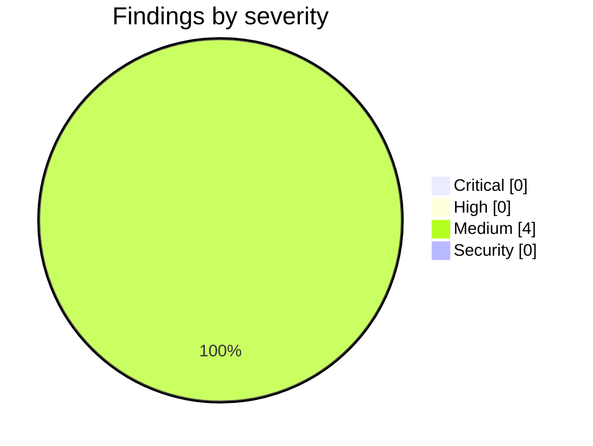

<!-- Stage 6 · Code review, M3. Findings verified before reporting. -->

# Weave — Code Review (M3, 2026-08-11)

- **Scope:** `feature/p3-live-surface` — `717ada4..123005d` (P3: the live, multi-user surface). Reviewed against `WEAVE_DRP.md` §5-M3 and `CONSTRAINTS.md` **v4**.
- **Reviewer:** weave-manager · **Result:** **approved — 0 Critical, 0 High. Merged to `main`.**

## Summary

M3 is the first gate whose criteria are **measured** rather than pass/fail, so accepting reported numbers would have defeated the point. **Both figures were re-run by me, on this host, in the declared conda env:**

| Criterion | Gate | Developer | **Reproduced by reviewer** |
|---|---|---|---|
| Cross-session latency, p95, 100 trials | ≤ 1000 ms | 2.52 ms | **2.44 ms** (p50 2.14 · p99 11.95 · max 23.19, 200 samples) |
| Simultaneous claims, N=20, every storage path | exactly 1 winner | 1 winner, 19 conflicts, 0 lost | **1 winner, 19 conflicts, 0 errors, 0 lost writes** on `memory`, `file`, `postgres` |
| Suite | green | 897 / 0 / 0 | **897 passed / 0 failed / 0 skipped** |

Three orders of magnitude of headroom on latency is a real result and not a rounding artifact — but see M3 below on what that number does and does not describe.

**A7 is delivered and the pairing is intact.** W3 closed **in the same commit as the adapter** (`4af22da`), as required. I checked the guard is not decorative: `assert_bus_matches_deployment` is called inside `create_app`, so uvicorn's `main()` and every forked gunicorn worker hit it, and `global_args.workers` carries the real count on the gunicorn path. It refuses in-process + many workers and deliberately does **not** refuse PostgreSQL with one worker — the correct asymmetry.

**The multi-worker property is asserted in both directions**, which is the part that makes it meaningful: `test_an_event_published_in_one_worker_reaches_a_client_in_another` for PostgreSQL, and `test_the_in_process_bus_does_not_reach_another_worker` — a positive assertion of absence rather than a skip.

**The developer applied W4 to its own work and found a real hole an hour after shipping P3.1:** the ingress service constructed its own `InProcessBus()`, which under several workers would have silently opted that subsystem out of fan-out **while the A7 startup check kept passing**, because the check sees the configured *name* and never where a bus is actually built. One construction site now. That is the watch item doing exactly what it was written for.

## Critical

None.

## High

None.

## Medium

### M1 — the latency harness cannot say why it failed, which undermines the R2 claim it exists to support
- **Where:** `scripts/measure_live_latency.py`
- **Found by hitting it.** My first run died with `SSE clients never became ready` and nothing else. The cause was a **403**: I had created the measuring user with `--role admin` but no `--workspaces`, and `/live/stream` correctly refuses a caller with no membership. The harness swallowed the status code, so a one-line fix looked like a broken transport, and I spent a diagnostic cycle proving the router was even mounted.
- **Why it matters more than usual here:** R2 exists so a claim can be *reproduced*. A harness that reports a permission refusal and a dead server identically is reproducible only by whoever already knows the trick. The number is correct; the path to it is not.
- **Fix:** surface the HTTP status and body on readiness failure, and say plainly when it is 401/403 that the user needs a workspace grant. One `--workspaces` hint in the error text would have saved the cycle entirely.

### M2 — the multi-worker property is proven at the bus, not end-to-end
- **Where:** `tests/test_sse_multiworker.py`
- **Declared by the developer, not discovered here.** Fan-out is proven across **real process boundaries** at the bus level, both positively and negatively. What is not covered is two gunicorn workers each holding live SSE clients — the wiring *around* the bus. The property A7 is about is genuinely tested; the integration above it is inferred. Acceptable for M3, and it is the first thing to cover if SSE ever misbehaves in a real deployment.

### M3 — the latency number describes presence traffic on a local bridge, not a task claim over a network
- **Where:** `scripts/measure_live_latency.py`
- **Declared, and the harness prints the caveat in its own output** so the figure cannot travel without it — the right instinct. Two limits are folded into one finding because they qualify the same number: the driver is `POST /live/presence` rather than a task claim (the claim-emitting routes are not mounted), and both figures come from a local process to a local database. The measurement establishes that **nothing in the path is accidentally synchronous**, which is what a 2.44 ms p95 against a 1000 ms gate actually proves. It does not predict behaviour across a real network, and the DRP should not later be read as claiming it does.

### M4 — the UI is type-checked but never built, and three pre-existing type errors are now on the record
- **Where:** `weave-ui/` · W8 in the work plan
- **Note:** No `bun` in the developer's container, so `bun run build` did not run; `tsc` did, with **0 errors in the three files P3 touched**. Three errors elsewhere (`api/weave.ts:907`, `ChatMessage.tsx:226`, `FileUploader.tsx:149`) predate P3 and were recorded rather than silently carried — correct, and they would fail a strict CI. **Manager's to schedule**, not the developer's to absorb mid-phase. The `grep setInterval → 0` criterion I re-ran myself: **0** in both board sources.

## Security

None new — and one strength worth recording rather than filing.

**The SSE tenant check runs per event, not per connection** (`weave/live/stream.py:108-112`). The event's workspace must match the connection's, **and** the subscriber's membership is re-checked on every event, with the stream closed if access was revoked. A connect-time check would have been the obvious implementation and would have leaked to any user whose grant was withdrawn while they held the connection open — the exact failure mode a long-lived transport invites, and the W4 lens applied correctly.

## Contract check — `CONSTRAINTS.md` v4 (methodology R11)

| ID | Verdict | Evidence |
|----|---------|----------|
| A1 · three deployables | **held** | No Dockerfile, compose service or unit added. SSE is an endpoint, not a process. |
| A2 · import direction, no HTTP in core | **held** | `weave_core/events/postgres.py` imports neither `weave.` nor any HTTP framework — swept. |
| A3 · naming | **held** | Guard clean. **See W7:** `weave_core-gunicorn` / `weave_core-server` survive as *operator instruction strings* in `weave/server/gunicorn.py`. They carry no banned name so the guard is right to pass, but they name commands that do not exist — the console script is `weave`. Pre-existing, correctly parked for P6 where they would ship as documentation. |
| A4 · three paths, ranked; ports only | **held** | No storage change. The bus adapter is its own adapter; no client constructed outside one. |
| A5 · artifacts reference, never embed | **n/a** | Untouched. |
| A6 · governance on every action | **held** | `/live/stream` returned **403** to an authenticated admin with no workspace grant — verified live, and the reason M1 exists. |
| A7 · bus adapter matches deployment | **held — this milestone delivered it** | The PostgreSQL `LISTEN/NOTIFY` adapter plus the refusal, shipped together. Verified reachable from every startup path. **W3 closes.** |
| A8 · runtime enforces the ledger version | **n/a** | P4. |
| A9 · one handler for REST and MCP | **held** | SSE is a third adapter over the same handlers, not a fourth answer surface. |
| A10 · every role is a Claude Code session | **n/a** | P6. |
| A11 · stack, one library per job | **held** | `environment.yml`, `deploy/requirements.txt`, `package.json` **unchanged** — `asyncpg` was already installed, which is why D-019 chose it. |
| A12 · no orchestrator model | **held** | Coordination is deterministic; no model in the path. |
| A13 · two LLM paths, never merged | **held** | Untouched. |
| A14 · persisted users, per-workspace membership | **held** | Strengthened — membership is now enforced *per event* on a long-lived stream. |
| A15 · one hub, outbound-only | **held** | SSE is the client holding a connection open. The server dials nothing; `LISTEN/NOTIFY` is the server and its own database. |

- **Any drift reported before it landed?** Yes. Two deviations from named files were declared with the same reasoning — *the plan names a file, the constraint names a property, and where they disagree the property wins*: the version check went into `DiffEngine.apply` rather than `routers/studio.py` (the wizard writes through `apply` without touching HTTP, so a check in the adapter would protect only HTTP callers — W4 again), and the existing `WeaveBoard.tsx` was converted rather than adding a second board beside it (R10). **Both judgements are correct and I would have ruled the same way.**
- **Contract amended this milestone?** No.
- **Non-goals still respected?** Yes — no broker, no Redis, no fourth service.

## Non-issues confirmed (checked, clean — do not re-flag)

- **`update_uvicorn_mode_config()` forcing workers to 1.** I chased this as a possible bypass of the A7 refusal. It is carried fork behaviour and safe by construction: it *reduces* the worker count, so the pairing it could produce (in-process + 1 worker) is the one A7 permits.
- **PostgreSQL bus with a single worker is not refused.** Deliberate and documented in the guard: unnecessary is not wrong, and refusing it would break running one worker against a production database.
- **403 on `/live/stream` for an admin.** Correct — admin is a role, membership is a grant, and A14 is about the grant.

## Verdict

- [x] **Critical** — none. **High** — none.
- [x] **Both measured criteria reproduced independently** by the reviewer, not accepted on report.
- [x] Gate criteria met: p95 within budget, one winner of 20 on every path, 409 with a merge view, `setInterval` 0 in board sources, multi-worker asymmetry asserted both ways.
- [x] **Every constraint in `CONSTRAINTS.md` v4 holds.** W3 closes.
- [x] No library added; no deployable added.

**Merged to `main`. P4 may start.** Four Mediums carry forward as watch items rather than blocking work; W5 remains open and untriggered.
