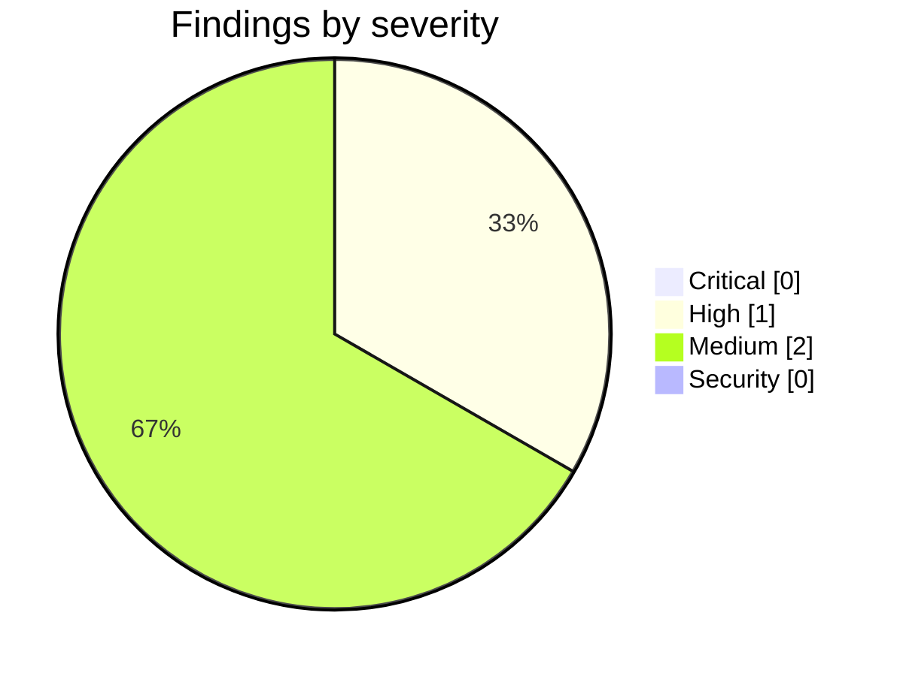

<!-- Stage 6 · Code review, M4. Findings verified before reporting. -->

# Weave — Code Review (M4, 2026-08-11)

- **Scope:** `feature/p4-wizards` — `dcfbf25..b3c743d` (P4: team-vocabulary wizards). Reviewed against `WEAVE_DRP.md` §5-M4 and `CONSTRAINTS.md` **v4**.
- **Reviewer:** weave-manager · **Result:** **approved — P4's own work is clean. Merged to `main`. One High is a pre-existing gap this milestone *revealed*, and it is P5's first task (D-032).**

## Summary

Suite reproduced independently: **925 passed / 0 failed / 0 skipped** in the conda env against both live databases. The only change after the commit I ran was three lines of the work plan, so the number stands for `b3c743d`.

**The M4 gate is behavioural, so I ran it rather than reading it** — fresh working directory, wizard driven over HTTP, permission decisions read back from a *separate process*:

| | before the wizard | after |
|---|---|---|
| `developer invoke:MergeToMain` | **allowed=True** — *"no RBAC policy — permissive"* | **allowed=False** — *"role 'developer' lacks invoke:MergeToMain"* |
| `integrator invoke:MergeToMain` | allowed=True — permissive | allowed=True — **"granted"** (explicit, no longer default-open) |
| server pid | 2600599 | **2600599 — no restart** |
| repo working tree | clean | **clean — operator edited nothing** |

**The flip landed on a different role than the developer's own table, and that is evidence rather than a discrepancy.** Their run showed `integrator` going True→False; mine shows `developer` going True→False while `integrator` stays allowed with the reason changing from *permissive* to *granted*. The cause is that I answered `who_merges: integrator`. **The answers demonstrably shape the policy** — this is not a fixed template with an interview painted on it, which is the failure mode a wizard invites.

Two properties, separately established, that together are the milestone: the decision changed for a **separate process reading the persisted store** (so it really persisted), while the **same server pid kept serving** (so nothing restarted). Either alone would prove the wrong thing.

## Critical

None.

## High

### H1 — `/onboard/apply` writes runtime-enforced rules with no signature and no version, so A8 is false today
- **Where:** `weave/server/routers/workspaces.py:468-495` — `ontology_service.save(...)` and `rules_service.save(...)` called directly; no `DiffEngine.apply`, no sign-off, no version.
- **Raised by the developer, verified and re-graded here.** Their read was *"nothing false today, but it is the shape that becomes false."* I checked the enforcement path and it is stronger than that: `weave/server/routers/actions.py` documents and implements `resolve principal → RBAC → lifecycle → **rules gate** → side effect`, with a gate REJECT mapping to HTTP 422. **A rule installed through onboarding is therefore enforced by the runtime while carrying no signature and no ledger version** — which makes A8's first sentence, *"What the runtime enforces is the signed ledger version"*, false right now for anything installed that way. The ledger has a blind spot, and P4 created the asymmetry by giving the wizard a signed path for the same artifact kinds.
- **Not P4's defect, and not a reason to block P4.** The surface is pre-existing, carried from the fork; P4 neither introduced nor touched it. The developer deliberately left it alone — pre-existing surface, unreviewed scope in a phase that did not plan for it — and that judgement was right.
- **Ruling: option (a), fix in P5 as its first task.** Convert `/onboard/apply` to route through `DiffEngine.apply` so both paths produce signed, versioned artifacts. This is the same fix as P3.3's and it is where W4 points: the guard belongs in the engine both paths share. Logged as **D-032**. Merging M4 with this open follows the M0 precedent exactly — H1 there was approved and merged, and became P1's first task.

## Medium

### M1 — the UI is type-checked, never built, and the gate drove the API rather than the screen
- **Where:** `weave-ui/` · W8
- **Note:** No `bun` in the developer's container. `tsc --noEmit` is clean for every file P4 touched; the three errors it reports are the pre-existing W8 set. The React wizard page is therefore verified by type-check alone, and the gate evidence comes from HTTP. Declared, not discovered. **This is now the second milestone in a row where the UI ships unbuilt** — worth a decision before P6, where the onboarding bundle makes the UI a deliverable rather than a convenience.

### M2 — "zero file edits" is true of the operator and not of the disk, and the distinction should survive
- **Where:** M4 gate wording
- **Note:** The developer stated this precisely rather than claiming a bare zero: the *operator* edited nothing, while the server persisted its own state inside its working directory. I confirmed the repository working tree is untouched. Recording it so the gate's meaning is not later flattened into "nothing was written" — the storage path doing its job is the opposite of a config file being hand-edited, and that is the whole point of the criterion.

## Security

None new.

## Contract check — `CONSTRAINTS.md` v4 (methodology R11)

| ID | Verdict | Evidence |
|----|---------|----------|
| A1 · three deployables | **held** | No process added; the wizard is endpoints and a page. |
| A2 · import direction, no HTTP in core | **held** | Wizard logic lives in `weave/wizards/`; `weave_core` gained ledger kinds, no HTTP. |
| A3 · naming | **held** | Guard clean. W7 strings unchanged, still parked for P6. |
| A4 · storage paths and ports | **held** | No new backend, no client outside an adapter. |
| A5 · artifacts reference, never embed | **n/a** | Untouched. |
| A6 · governance on every action | **held** | `/wizard/*` all carry `Depends(combined_auth)`; the apply recorded a sign-off naming the approver, reason, time and role. |
| A7 · bus adapter matches deployment | **held** | Unchanged since M3. |
| A8 · runtime enforces the signed ledger version; no server-file config path | **drifted — see H1** | **The wizard half is exemplary**: RBAC and lifecycle became ledger kinds, so the wizard needs no special write path, and `tests/test_no_file_config.py` proves the negative three ways — a watched run leaving an empty directory, one service object answering differently in-process, and an **AST walk showing no module under `weave/wizards/` opens a file for writing at all**. That is how a negative should be asserted. The drift is the *other* path: `/onboard/apply`. |
| A9 · one handler for REST and MCP | **held, with H1 as the caveat** | The wizard is a pure function of (template, answers), so it tests without HTTP and is reachable by any surface. Two write paths for one artifact kind is the A9-shaped half of H1. |
| A10 · every role is a Claude Code session | **n/a** | P6. |
| A11 · stack, one library per job | **held** | Manifests unchanged; the interview is built on the copied `GetStarted` / `/onboard/chat` flow, not a new mechanism. |
| A12 · no orchestrator model | **held** | The wizard proposes diffs a human signs; no model in the enforcement path. |
| A13 · two LLM paths, never merged | **held** | Untouched. |
| A14 · persisted users, per-workspace membership | **held** | Unchanged. |
| A15 · one hub, outbound-only | **held** | Nothing dials out. |

- **Any drift reported before it landed?** Yes — H1 was raised by the developer as an open question with options and a recommendation, before merge. That is the protocol working; the re-grade is mine, not a failure of theirs.
- **Contract amended?** No. H1 brings code to the contract, not the contract to the code.

## Non-issues confirmed (checked, clean — do not re-flag)

- **The wizard being stateless.** Not over-engineering. A session dict works until a second worker exists, then half the requests land on a process that never heard of the session — no error, no log, the same class as the in-process bus under gunicorn. W4 shaping a design decision rather than a review comment is the point of having it.
- **`/wizard/propose` returning 503 without Weave mode.** I hit this myself with a plainly-worded error (*"The wizard needs the Studio engine (Weave mode)"*). Correct behaviour, clearly reported — the opposite of M3's opaque harness failure.
- **A wizard run inheriting the stale-write 409 for free.** Because P3.3 put the version check in `DiffEngine.apply` rather than the router. Two people setting up one workspace at once is exactly that race, and it was already covered.

## Verdict

- [x] **Critical** — none.
- [ ] **High** — H1 open, **pre-existing and not in P4's diff**; P5's first task by D-032.
- [x] Gate criteria met and **reproduced live by the reviewer**: a permission that was allowed is denied, no restart, no operator file edits.
- [x] Suite **925 / 0 / 0** reproduced independently.
- [x] Contract: A8 drift identified, reported before merge, and scheduled — not silent.

**Merged to `main`. P5 may start, with H1 as its first task.**
