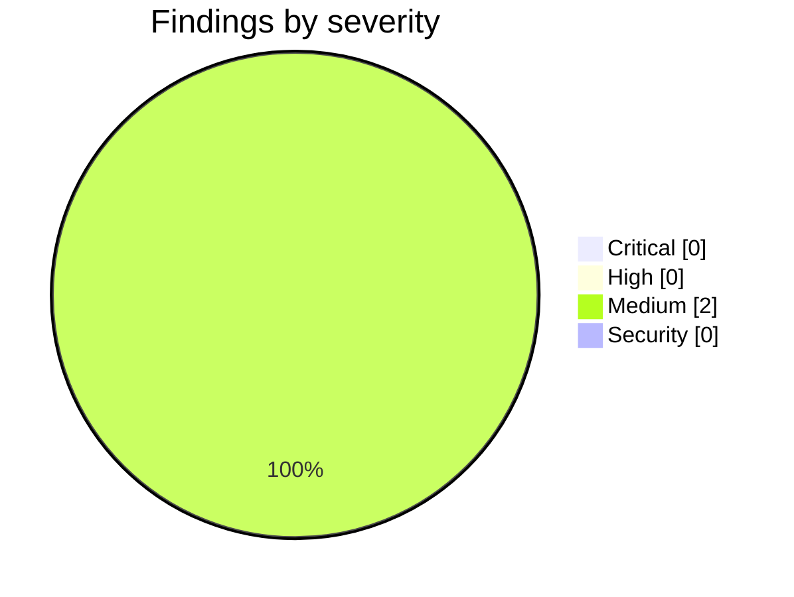

<!-- Stage 6 · Code review, M5. Findings verified before reporting. -->

# Weave — Code Review (M5, 2026-08-11)

- **Scope:** `feature/p5-senior-seat` — `08ed79b..b8b0505` (P5: the senior-developer seat, plus carried D-032 and D-033). Reviewed against `WEAVE_DRP.md` §5-M5 and `CONSTRAINTS.md` **v4**.
- **Reviewer:** weave-manager · **Result:** **approved — 0 Critical, 0 High. Merged to `main`.**

## Summary



Suite reproduced independently: **974 passed / 0 failed / 0 skipped** in the conda env against both live databases.

**The gate criterion I said I would check rather than believe, checked.** The M5 gate requires the claim tests to pass **unmodified**. I hashed all three against the P0 fork commit `8610914` rather than trusting the assertion:

| file | P0 `8610914` | HEAD `b8b0505` | |
|---|---|---|---|
| `tests/test_claim_race.py` | `ac4cf323c116d1c9` | `ac4cf323c116d1c9` | **byte-identical** |
| `tests/test_weave_coordinator.py` | `784601fff21eaea5` | `784601fff21eaea5` | **byte-identical** |
| `tests/test_weave_devhost.py` | `1129507289a0b583` | `1129507289a0b583` | **byte-identical** |

The pin in `test_claim_protocol_unchanged.py` matches the real hash, and the constant carries *"do not update this to make it pass — the D-NN comes first"*. That comment does more work than the hash.

**A15 is a property of the type, not a rule to remember.** `Supervisor` holds no transport: swept for `requests`/`httpx`/`aiohttp`/`urlopen` and there is nothing to dial with. `test_no_supervisory_act_opens_an_outbound_connection` traps `socket.connect` and drives dispatch, all four worker actions, host control and scale through it. *"We didn't write a POST"* is invisible to ordinary behavioural assertions; trapping the socket layer is what makes the absence checkable.

**D-032 and D-033 both closed, and the developer found a layer under my finding.** Dropping the exclusion list was **not sufficient**: the guard matched on *variable name*, and the four editors hold their service in a bare `service` parameter — so `service.save()` in `rbac.py` was invisible to it. The exclusion list was concealing a rule that would have caught nothing in those files anyway. They proved it by reintroducing a direct `save()`, watching the guard pass, fixing the matcher, and watching it fail with the right message. **My line applied twice: a guard reads as coverage when its exclusion list contains the hole, and again when its matcher cannot see what it excludes.**

## Critical

None.

## High

None.

## Medium

### M1 — a removal is recorded as a version, but is structurally indistinguishable from an authored empty policy
- **Where:** `weave_core/studio/service.py` (`DiffEngine.sign`) · verified live against the ledger
- **The design call was right and the record does not carry it.** The developer correctly refused to sign `{}` through the normal path, because an empty RBAC policy **exists and grants nothing** (deny-by-default) while a *deleted* one is treated as **permissive** — so signing `{}` would record a version whose replay produces the opposite of what was asked for. Good reasoning. But I read the persisted ledger after a live `DELETE /rbac` and the two cases are identical on disk:

  ```
  v1  origin='authoring'  behaviour_changed=True  snapshot={'name': 'm5', 'roles': {...}}
  v2  origin='authoring'  behaviour_changed=True  snapshot={}
  ```
  The only marker that `v2` was a *removal* (→ permissive) rather than an *authored empty policy* (→ deny-all) is the free-text `sign_off.reason`. The `removed: true` / `revert_to: 1` fields appear in the **HTTP response**, not in the `ArtifactVersion`.
- **Failure:** anything that replays or reverts to `v2` — an audit tool, a future rollback path, a human reading history — gets deny-all where the recorded event was permissive. That is the *inverse* of the intent, which is precisely the outcome the design avoided one layer up.
- **Why it matters beyond the bug:** this is the same shape as D-029's lesson. A distinction preserved only in prose is not preserved. The practical path is currently safe because the response says `revert_to: 1`, which is why this is Medium and not High.
- **Fix:** give removal a structural marker — `origin='removal'`, or a `removed: bool` on `ArtifactVersion` — so replay and audit can tell the two apart without parsing English.

### M2 — the guard's coverage is bound to a hand-maintained filename map
- **Where:** `tests/test_onboard_signs_governance.py` — `GOVERNANCE_EDITORS`
- **Note:** The bare-`service` blind spot is fixed for the four files named in that map. A **new** governance router — `routers/policy.py`, say — holding its service as `service` would resolve to `kind = None` and pass silently. The rule is now uniform across files but its *reach* still depends on a list someone must remember to extend, which is the third layer of the same lesson in as many days. Cheapest hardening: treat a bare `service.save()`/`delete()` in **any** router as an offender unless explicitly annotated otherwise — a false positive there costs one comment, a false negative costs an unsigned governance path.

## Security

None new. Two behavioural changes from D-033 verified live and both are improvements: `POST /rbac` and `DELETE /rbac` now return **401** without an authenticated identity (A6), and **503** without a Studio engine rather than falling back to the unsigned write. The developer updated six existing API tests to build a real ledger and sign in, rather than softening the code — the right direction.

## Gate verification (driven by hand)

| Criterion | Result | Evidence |
|---|---|---|
| **Claim tests pass unmodified** | **pass** | Byte-identical to P0 across all three files; hashes above. |
| Pause honoured between steps | **pass (tests)** | `test_pause_between_steps.py`; control modelled as *state*, after the developer's own pop-list version broke on a mid-task re-heartbeat. |
| Every supervisory action on the graph with an authenticated principal | **pass** | Verified live: `POST`/`DELETE /rbac` 401 unauthenticated; the removal version records `approver=m5admin`, `role=admin`. |
| Dispatch never dials a host | **pass** | Socket trap + no transport on the type. Live: dispatch returned `reaches_fleet_via: heartbeat`, `running: 0`. |
| Suite | **pass** | **974 / 0 / 0**, `--run-integration`, both databases. |
| Removal is a version, not an absence | **pass, with M1** | `v1 policy → v2 removed`, signed, reason naming the consequence. |

## Contract check — `CONSTRAINTS.md` v4 (methodology R11)

| ID | Verdict | Evidence |
|----|---------|----------|
| A1 · three deployables | **held** | No process added; the seat is endpoints plus a page on the existing fleet surface. |
| A2 · import direction, no HTTP in core | **held** | Swept: 0 `weave.` or HTTP-framework imports in `weave_core/`. |
| A3 · naming | **held** | Guard clean. W7 unchanged, still P6. |
| A4 · storage paths and ports | **held** | No backend change. |
| A5 · artifacts reference, never embed | **held** | Unchanged. |
| A6 · governance on every action, authenticated principal | **held — strengthened** | D-033 gave the four editors 401s they did not have, and `/workers/{id}/control` and `/hosts/{id}/scale` now record *who* rather than only checking a role. |
| A7 · bus adapter matches deployment | **held** | Unchanged since M3. |
| A8 · runtime enforces the signed ledger version | **held — the gap is closed** | All governance writes go through `DiffEngine.sign`: Studio, wizard, onboarding and the four editors. The class assertion is uniform and its matcher now sees bare `service`. **M1 is about the fidelity of one record, not a bypass.** |
| A9 · one handler for REST and MCP | **held** | One helper, not four — `DiffEngine.sign` is the single writer. |
| A10 · every role is a Claude Code session | **n/a** | P6. |
| A11 · stack, one library per job | **held** | Manifests unchanged across the phase. |
| A12 · no orchestrator model | **held** | The seat orders and records; ready-queue ordering **delegates to `WeaveCoordinator.ready()`** rather than reimplementing it. No model in the dispatch path. |
| A13 · two LLM paths, never merged | **held** | Untouched. |
| A14 · persisted users, per-workspace membership | **held** | Unchanged. |
| A15 · one hub, outbound-only | **held — asserted, not argued** | Socket trap over the whole supervisory surface; `Supervisor` holds no transport; scale writes `desired_workers` and the host learns it by heartbeating. |

- **Drift reported before it landed?** Yes — W9 raised with a recommendation, and the D-033 matcher discovery reported rather than quietly fixed.
- **Contract amended?** No. D-033 brought code to the contract.

## Non-issues confirmed (checked, clean — do not re-flag)

- **The near miss on the ready queue.** The developer began hand-writing pending/deps/priority ordering and it omitted the `touches` collision rule — which would have handed two workers colliding tasks and let the claim lock refuse the second: an ordering bug wearing a race's clothes. Caught before landing, delegated to `WeaveCoordinator.ready()`, **and** pinned by a test asserting the collision rule has exactly one implementation in `weave/`. Not a defect — the strongest thing in the phase. It is D-033's lesson from the other side: not an exclusion hiding a hole, but a duplicate about to open one.
- **Two self-reported test-design errors.** A control script consumed out of order by a mid-task re-heartbeat, and a "resume" test that never paused. Both found and fixed by the developer; modelling control as *state* is closer to what a supervisor is.
- **974 unchanged across D-033.** Six existing tests were rewritten rather than added to, which nets flat. Checked, not assumed.

## Verdict

- [x] **Critical** — none. **High** — none.
- [x] **Claim tests verified byte-identical to P0** — the gate's own wording, checked rather than believed.
- [x] A15 asserted structurally; A8's gap closed across every write path.
- [x] Suite **974 / 0 / 0** reproduced independently.
- [x] Every constraint in **v4** holds.

**Merged to `main`. P6 may start** — the last phase. Two Mediums carry forward; **W5 has now gone untriggered through four phases** and P6 is its last chance.
