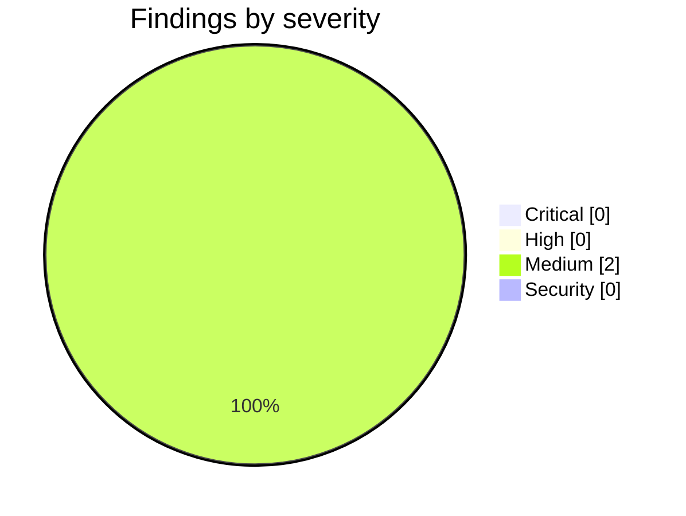

<!-- Stage 6 · Code review, M6 — the final milestone. Findings verified before reporting. -->

# Weave — Code Review (M6, 2026-08-11)

- **Scope:** `feature/p6-onboarding` — `ca4b403..HEAD` (P6: onboarding bundle & productisation). Reviewed against `WEAVE_DRP.md` §5-M6 and `CONSTRAINTS.md` **v4**.
- **Reviewer:** weave-manager · **Result:** **approved — 0 Critical, 0 High. Merged to `main`. The build is complete.**

## Summary

Suite reproduced independently: **1083 passed / 0 failed / 0 skipped** in the declared conda env against both live databases.

**The Docker half of this gate could not be run by the developer — there is no Docker in its container — so I ran it here.** That is the same division that closed `parent_checksum` at M2, and it produced the strongest contract evidence in the project:

| | result |
|---|---|
| `deploy/server.Dockerfile` | **builds** — `weave-server:m6`, 690 MB |
| `deploy/dev-agent.Dockerfile` | **builds** — `weave-dev-agent:m6`, 1.07 GB |
| `deploy/devhost.Dockerfile` | **builds** — `weave-devhost:m6`, 549 MB |
| **A13** inside the dev-agent image | `pip list` → **no `anthropic` package** |
| **A10** inside the dev-agent image | `/usr/local/bin/claude` present — the agent runtime *is* Claude Code |
| **A15** inside the dev-agent image | **no git credentials** — no `.netrc`, no ssh keys, no credential helper |
| **A15** at the deployment level | `compose.devhost.yml` validates and **publishes no ports at all** |

Three deployables, exactly as A1 requires — no fourth. **These constraints have been asserted in code since P0 and never once checked against a built artifact.** They hold.

**The compose files refuse to start without their required variables**, and the refusals name the reason: *"set WEAVE_TOKEN_SECRET — the server will not start on the default"*, *"set WEAVE_SERVER — the URL this machine dials out to"*. That is M0's S1 fix and A15's outbound property surfacing in the deployment surface rather than only in the code.

## Critical

None.

## High

None.

## Medium

### M1 — the claim-test hash pin covers one of the three carried files, and an undeclared change slipped through it
- **Where:** `tests/test_claim_protocol_unchanged.py` — `_CLAIM_TESTS` is a **single path**
- **Found by hashing all three against P0 rather than trusting the pin.** The developer declared *"a one-line fixture edit to hash-pinned `tests/test_claim_race.py`"*. In fact `tests/test_weave_coordinator.py` also changed — the **same** substitution in **three** places, undeclared. `tests/test_weave_devhost.py` is untouched.
- **Benign, and I proved it rather than assuming.** I executed the pre-D-034 `preset.install(...)` and the new `lifecycle.save("w", preset.load_part("lifecycle"))` side by side and compared the resulting lifecycle state: **every machine is byte-identical**, the sole difference being an `updated_at` timestamp 3.5 ms apart. No assertion, ordering, lock or `touches` case changed in either file.
- **The finding is the reach, not the edit.** The gate criterion is *"the claim tests pass unmodified"* — three files. The pin watches one. The developer declared exactly what the pin watches, which is the honest thing to do and still left a gap, because **a guard's reach silently redefines the claim it is trusted to enforce.** That is the fifth instance of this lesson in the project. Extend `_CLAIM_TESTS` to all three carried files and pin each.

### M2 — the fleet has never been raised from the compose bundle end to end
- **Where:** `deploy/compose.yml`, `deploy/compose.devhost.yml`
- **Note:** Declared by the developer, and narrowed by this review rather than closed. The images now **build** and the devhost bundle **validates** with no inbound ports, so A1, A13, A10 and A15 are verified against real artifacts. What has still never happened is a full `compose up` raising a server and a dev host that registers, heartbeats and starts a real container — the developer's "3 workers" were `curl` heartbeats, which it said plainly. The register → scale → read-back → down cycle is verified live at the API level; the container-runtime leg is not.
- **Why this is Medium and not High:** every property the gate asserts about the fleet is verified somewhere — the protocol live, the images by build, the outbound-only shape by config. What is unverified is the composition of those parts, which is exactly what a first real deployment will exercise. **Say so in the release notes rather than implying a tested bundle.**

## Security

None new. Two properties strengthened, both verified against built artifacts rather than source: no model credential can reach a dev agent (**A13** — the SDK is absent, not merely unused), and a dev agent holds no git credentials (**A15**), so the blast radius stays a branch and a PR.

## Rulings

### D-034 — **ratified.** The preset installer signs, and the claim-fixture edit is behaviour-preserving.
The installer wrote all five governance layers through direct service calls, so `POST /weave/bootstrap` installed **unsigned** governance from P0 onward — the rules layer included, which the gate enforces the moment it lands. A8 was false for the founding policy of every API-onboarded workspace. That is the sixth unsigned path and the one that mattered most, because it was the *first* thing a new workspace ever got.

**The fixture edit is approved on evidence, not on argument.** The tripwire said: if a claim test needs editing to make something pass, stop and report. The developer stopped and reported, which is exactly right, and the change turns out to be a setup-line substitution that yields an identical lifecycle machine. Keeping the pre-D-034 hash beside the new one is the correct way to record it.

### The admin/preset trap — **the warning is right; do not give `admin` a wildcard.**
The guide told an operator to create the first user as `--role admin`; the preset then granted `manager`/`architect`/`developer`/`integrator`, so every governed call answered `403 role 'admin' has no grants` from the account the guide had just created. Two individually-correct steps, which is why nothing caught it.

The developer asked whether the preset should instead grant `admin` a wildcard. **No.** `admin` is a **user-administration** role (A14) and the governance roles are a **team vocabulary** (A8); merging them would hand the account that manages accounts the power to approve merges, and undo the distinction M4 established. A second all-powerful role is two names for one thing — the developer's own phrase, and it is correct. A warning that never refuses is the right shape. Asserting the class by reading the role out of the guide's own line and checking it against the preset is better than either.

### The three deviations — **all accepted.**
`weave/cli/main.py` folded into the existing `build_parser()` (a second assembler is R10); the `environment.yml` entry point was already satisfied in P1; and three of four planned devhost test files were not written because `tests/test_weave_devhost.py` already asserts every criterion they listed. **R10 applies to tests as well as to code** — a second test asserting an asserted property is duplication with a good conscience. The one genuinely new file, `test_devhost_outbound.py`, covers what was unasserted: that exactly one module in the product opens an outbound connection.

## Contract check — `CONSTRAINTS.md` v4 (methodology R11)

| ID | Verdict | Evidence |
|----|---------|----------|
| A1 · three deployables | **held — verified by build** | Exactly three images build; no fourth service in either compose file. |
| A2 · import direction, no HTTP in core | **held** | Swept clean across `weave_core/`. |
| A3 · naming | **held** | Guard clean. **W7 closed** — the operator instructions no longer name commands that do not exist. |
| A4 · storage paths, ports | **held** | Unchanged. |
| A5 · reference, never embed | **held** | Unchanged. |
| A6 · governance on every action | **held** | The admin-role trap is fixed in guide, CLI hint and a class assertion. |
| A7 · bus adapter matches deployment | **held** | Unchanged since M3; the refusal ships in the bundle's configuration. |
| A8 · runtime enforces the signed ledger version | **held — this milestone closed the last hole** | D-034: the preset installer signs, refuses without a ledger, and the class guard widened from the router directory to all of `weave/` + `weave_core/`, negative-controlled against all five pre-fix writes. |
| A9 · one handler for REST and MCP | **held** | Unchanged. |
| A10 · every role is a Claude Code session | **held — verified in the image** | `/usr/local/bin/claude` present in the dev-agent image; no bespoke client anywhere. |
| A11 · stack, one library per job | **held** | Manifests unchanged; the CLI folded into the existing parser rather than adding a second. |
| A13 · two LLM paths, never merged | **held — verified in the image** | `pip list` in `weave-dev-agent:m6` contains **no `anthropic`**. The strongest form of this assertion available. |
| A14 · persisted users, per-workspace membership | **held** | Strengthened by the admin/governance-role separation. |
| A15 · one hub, outbound-only | **held — verified three ways** | No git credentials in the image; `compose.devhost.yml` publishes no ports; `test_devhost_outbound.py` asserts exactly one outbound-opening module. |

- **Drift reported before it landed?** Yes, consistently — D-034 raised as `proposed` rather than self-ratified, the Docker gap declared, the three deviations stated.
- **Contract amended this milestone?** No.

## Verdict

- [x] **Critical** — none. **High** — none.
- [x] Suite **1083 / 0 / 0** reproduced independently.
- [x] **All three deployables build**, and A1, A10, A13, A15 verified against the built artifacts for the first time in the project.
- [x] **Every constraint in `CONSTRAINTS.md` v4 holds.** A8's last unsigned path closed by D-034.
- [x] W5, W7, W9, W10, W11, W12 closed across P5–P6.

**Merged to `main`. P0–P6 complete; M0–M6 all reviewed.** Two Mediums carry into the release notes rather than blocking: the claim-test pin should cover all three carried files, and the compose bundle has never raised a fleet end to end.
