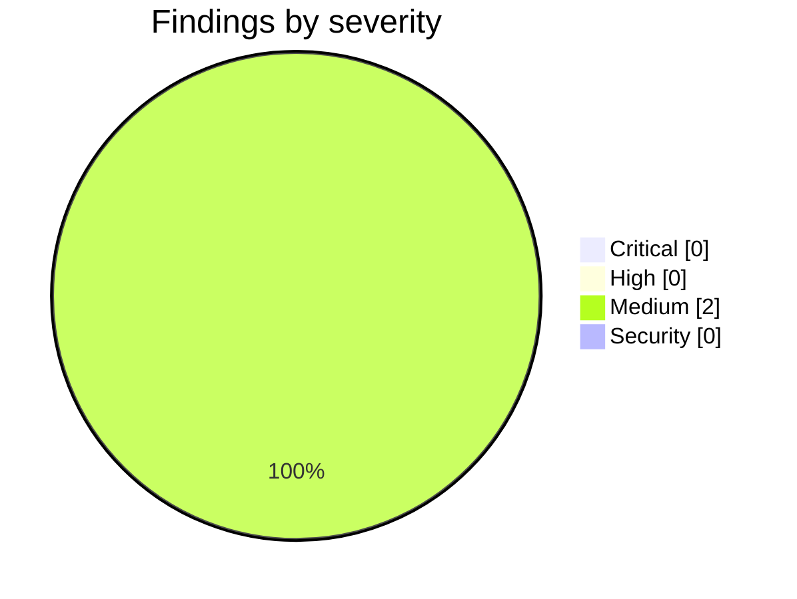

<!-- Stage 6 · Code review, M7. Findings verified before reporting. -->

# Weave — Code Review (M7, 2026-08-13)

- **Scope:** `main` — `1ffac3d..40c2d74` (P7: the UI becomes Weave's). Reviewed against [WEAVE_UI_CHANGE_REQUEST.md](WEAVE_UI_CHANGE_REQUEST.md) (CR-001) and `CONSTRAINTS.md` **v4**.
- **Reviewer:** weave-manager · **Result:** **approved — 0 Critical, 0 High. Merged.**

## Summary



**The phase's own stated top risk was that nothing could render what it built.** That risk is now closed, and closing it is what this review is mostly about.

| | |
|---|---|
| Python suite | **1116 passed / 0 failed / 0 skipped**, live PostgreSQL + Neo4j |
| **`bun test`** | **17 pass, 0 fail** — *the first time it has ever run in this project* |
| `bunx --bun vite build` | ✓ 12.5s — the real command, not the Node workaround |
| `tsc --noEmit` · `eslint .` | exit 0 · exit 0 |
| **A9** | `git diff --name-only weave/server/routers/` → **0 files** across the whole phase |
| name-guard | clean |

## The browser pass

Everything in P7 was written by a session with **no browser and no bun**. It said so from the phase's first commit, when it was a caveat, to its last, when it was the only thing left — *"more context buys more code, not more confidence that the code works."* That was correct, and the pass was run here with real Chromium over CDP.

**The navigation renders Weave-first**, which is the gate's first criterion:

```
WEAVE       Work · Features · Learnings · Projects · Team vocabulary
GOVERNANCE  Ontology · Rules · History · Users
KNOWLEDGE   Documents · Knowledge Graph · Retrieval · Chunks · Diagrams · Graph Quality
SETUP       Dashboard · Decisions · Get Started · API
```

Landing view `Work`; **all 16 original views still reachable** (verified by re-deriving the id sets from the pre-change commit, not by counting); SSE reports **Connected**; **no console errors**. `Features` rendered all 6 nodes, `Projects` the registered repository with its `readable` marker.

## Gate verification (driven by hand)

| Criterion | Result | Evidence |
|---|---|---|
| First screen answers a **Weave** question | **pass** | Landing view is `Work`, the team board — not `Documents`. |
| Each `/ask` reachable, node set matches the API | **pass** | `Features` 6 in the browser, 6 from the API; `Learnings` 26 / 26. |
| Governance change **shows a diff first** | **pass** | The editors use `/studio/propose` + `/studio/apply`, the only pair that produces a diff. `POST /ontology` signs correctly but cannot show — the developer chose the endpoint that can. |
| **Refuses to sign without a reason** | **pass** | Applied with no reason → *"this change alters behaviour — sign-off requires an approver and a reason"*. |
| **Lands as a new ledger version, read back** | **pass** | Applied with a reason → **v2**, then `/studio/artifacts` reports `ontology … version 2, revisions 2`. Read back from the ledger, not from the UI's confirmation. |
| Signer is the authenticated identity | **pass** | `sign_off.approver = "demo-manager"`, `role = "manager"` — derived from the token. **D-038 visibly in effect.** |
| JSON escape hatch retained | **pass** | Both editors keep a labelled textarea. |
| All sixteen views reachable | **pass** | Script-verified against the pre-change commit. |
| No endpoint added, no UI-only route | **pass** | 0 files in `weave/server/routers/` across the phase. |

## Critical / High

None.

## Medium

### M1 — W17: a generic upsert silently retypes a governed node, and the answer goes quiet
- **Found by the browser pass**, which is exactly what it was for — though not where anyone expected. `Learnings` rendered *"No insights recorded yet"* while the task store held 12 reviews and 14 learnings. **The page was right.**
- `review:T-P0-FORK` still exists in the graph; its `entity_type` is `'ENTITY'` with `source_id='emit_decision_trace'`, where the migration wrote `'Review'`. `/ask/learnings` seeds on `entity_type in (Review, Insight)`, so a retyped node **vanishes from the answer with no error, no exception and no missing row** — the query simply finds nothing to start from.
- **This weakens W5's closure rather than reversing it.** The P2 migration did run on real data and did verify complete. What it never established is that its output *survives* a later write by a path that does not know the type is load-bearing.
- **Not P7's defect and not the UI's.** Recorded as **W17** for P8, which will tell readers to run that migration. The developer's note on the durable fix is the right one: *re-running the migration repairs an instance, not the mechanism — `emit_decision_trace` should not be able to retype a governed node at all.*

### M2 — the demo tenant was never bootstrapped, and the board said so
- The seed script created tasks, projects and answer nodes and **never installed the governance they are enforced against**, so the board read *"not bootstrapped"*. A gap in the manager's script, not in the product — and the board was telling the truth.
- Fixed, and `scripts/seed_demo.py` now bootstraps as step 0 so the tenant is reproducible rather than repaired by hand. Checked afterwards that installing an ontology did **not** re-trigger W17: learnings 26, features 6, changes 12, unchanged across the bootstrap. That narrows W17 to the generic upsert path rather than leaving it as *"some write did this"*.

## Deviations from CR-001 — all approved, and two corrected the CR

1. **No `Work.tsx` wrapper** — the existing view was relabelled. A file rendering one component adds indirection, not structure.
2. **`Graph Quality` under Knowledge, not Governance** — it operates on the graph, not on governance, and sitting it beside Ontology and Rules would imply it is a signed artifact. **Better information architecture than the CR specified.**
3. **The canvas has its own inspector.** The CR said reuse `diagram-editor/components/Inspector/`; it cannot be reused — it reads `useFlowStore` directly and edits mermaid styling. **R10 forbids a second implementation of one job, not a first implementation of another.** CR corrected.
4. **`test_ask_ui_parity.py` re-specified** — a Python test cannot observe the UI's node set, and the alternative was already covered elsewhere, so the original would have asserted something easy while reading as though it checked the gate. CR corrected.

**Two of those are corrections to instructions I wrote without reading what I was pointing at.** Writing *"reuse X"* without opening X is the same failure as asserting a class from a partial grep.

## Contract check — `CONSTRAINTS.md` v4 (methodology R11)

| ID | Verdict | Evidence |
|----|---------|----------|
| A1 | **held** | No deployable added; the UI is served by the server. |
| A2 | **held** | `weave_core/` untouched by this phase. |
| A3 | **held** | Guard clean — and it caught the manager once, on a CR naming the source web UI. |
| A4 · A5 | **held** | No storage change; `Projects` exists precisely because artifacts reference sources and never embed them. |
| A6 | **held — strengthened** | **D-038**: the signer is the authenticated principal on all four surfaces; `approver` deleted from three request schemas and the MCP tool. |
| A7 | **held** | Unchanged. |
| A8 | **held — strengthened** | Ontology and rules author through propose → diff → sign; verified landing as v2 in the ledger. |
| A9 | **held, and the phase's load-bearing one** | 0 router files changed across the phase; `test_ui_has_no_private_answer_path.py` asserts the UI has no private data path. |
| A10 · A13 · A15 | **n/a / held** | Untouched. **W16 stands open**: MCP carries no role, so a bootstrapped workspace denies agents. |
| A11 | **held** | No dependency added. The DOM-harness temptation was refused, and the rule was lifted into a pure predicate instead — a better design than the dependency would have bought. |
| A12 · A14 | **held** | Unchanged. |

- **Contract amended?** Yes — **the M7 gate criterion itself** (D-038). It said `git diff weave/server/routers/` must be empty, which was written to stop a private endpoint and would have forbidden fixing an A6 violation the UI work uncovered. Amended with the old wording kept beside the new, because a gate quietly reinterpreted means whatever is convenient later.

## Verdict

- [x] **Critical** — none. **High** — none.
- [x] Every gate criterion driven by hand, including the two that had never run: `bun test` and the real `bun run build`.
- [x] **The browser pass closed the phase's stated top risk**, and found W17 while doing it.
- [x] Every constraint in **v4** holds; A6 and A8 are stronger than when the phase began.

**Merged. P8 — the user guide — is next**, and W17 belongs in its troubleshooting before it tells anyone to run the migration.
