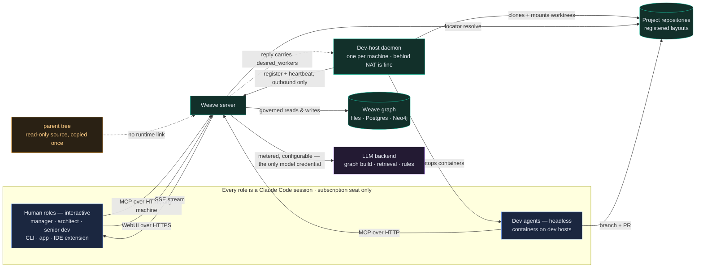
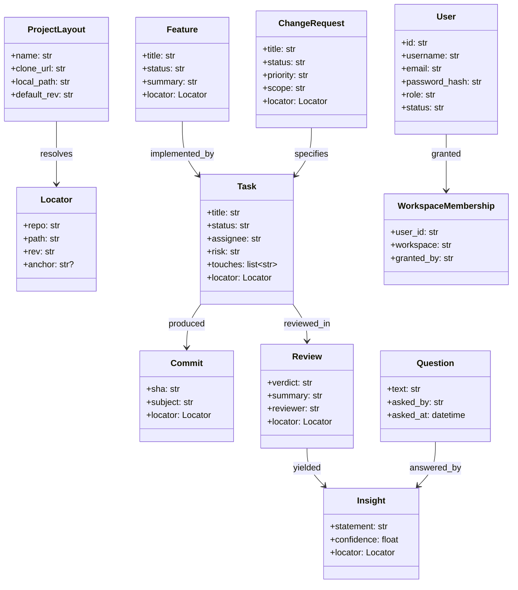
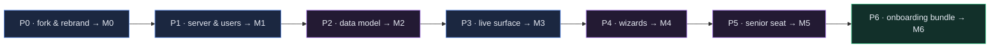

<!-- Stage 3 · Detailed Requirements & Plan. Sources: BLOG + RFC. Illustrated with mermaid. -->

# Weave — Detailed Requirements & Plan (DRP)

- **Project:** Weave
- **Status:** accepted — 2026-08-08
- **Date:** 2026-08-08
- **Owner:** dsivov
- **Sources:** [BLOG_THE_TEAM_IS_THE_PRODUCT.html](BLOG_THE_TEAM_IS_THE_PRODUCT.html) · [WEAVE_RFC.html](WEAVE_RFC.html) · decisions D-002…D-015 in [DECISIONS.md](DECISIONS.md)

> The RFC carries the repository inventory and the assemble/build/avoid agreement. This document
> details it; it does not re-open it (R7). Where a number appears below it was measured from the
> parent tree at `feat/weave-p0`, head `608401b8`.

---

## 1 · Problem & goal

A working multi-role AI development system exists as a flagged subsystem inside another product. It
cannot be installed without configuring a knowledge-graph server, it has no way to add a user, its
data model cannot answer two of the four questions a team asks daily, its index does not lead back to
the documents it indexes, and standing up a team means calling Python functions by hand. **Done** means
a standalone Weave: its own repository and brand, a running server a team can log into and administer,
a graph that answers *what changed · why · what does it do · what did we learn* and resolves every
answer to a real file, and a single command that brings up the server, the database and a fleet of
container-based dev agents — with onboarding time measured and lower than the parent's.

**In scope**

- A one-way copy of the selected ~92k LOC into a new repository, fully rebranded (D-002, D-004).
- A standalone server with `WEAVE_*` configuration, on three storage paths: file-based, PostgreSQL, Neo4j (D-007).
- A persisted user store with an Admin UI: create, edit, disable, roles, per-workspace membership (D-009).
- Data-model extension: `Feature`, `Review`, `Insight`, `Question` as nodes; a locator on every artifact node; a `ProjectLayout` registry (D-011, D-012).
- A live multi-user surface: SSE, presence, version-checked writes (D-010).
- Team-vocabulary setup wizards over the signed ledger; RBAC and lifecycle as ledger artifact kinds.
- A supervisory senior-developer principal.
- A `weave` CLI and a compose bundle that runs the server, the database and the dev-agent fleet (D-013).
- Human roles operating through ordinary Claude Code — CLI (primary), desktop app or IDE extension — including from remote machines (D-015).

**Out of scope (non-goals)**

- **Any modification of `Context_Graph/`.** Read-only source, asserted by checksum (D-003).
- **Any runtime dependency on the parent** — no submodule, no upstream package, no shared environment.
- **Six storage backends**: Mongo, Milvus, Memgraph, Redis, Qdrant, Faiss (7,617 LOC) are not copied.
- **Web ingestion / crawling** (`webingest`, lxml, playwright), the evaluation harness, and `lightrag.tools`.
- **CRDT co-editing.** Deferred behind a transport seam; 409-and-merge is the v1 answer (D-010).
- **Federation** of per-developer graphs. One central hub.
- **External IdP / SSO, email invitations, scoped API tokens.** The user store is local in v1.
- **Storing document bodies in the graph.** The graph indexes repositories; it never copies them (D-012).
- **New external libraries.** This plan adds none and removes 13.
- **The Anthropic SDK, in any Claude Code path.** Every seat is subscription-authenticated; `anthropic` is not a dependency (D-015).
- **A bespoke client for human roles.** Every role is a Claude Code session; there is no second client architecture.

---

## 2 · Context



**The two LLM paths never merge.** Everything inside the `Claude Code` box authenticates by
subscription seat and never sees a model credential; the server's backend connectors are metered,
repointable by configuration, and are the only place a key exists (A13).

**What exists today** (parent tree, measured): the governance layers — `rbac`, `lifecycle`, `actions`,
`rules`, `ontology` (4,570 LOC); the Studio signed ledger and diagrams (1,532); the team layer
`context_graph/weave/` (3,577) with atomic claim, fleet registry, dev hosts and the merge gate; the
graph core and CGR3 retrieval (`core.py` 2,352 + engine 12,059); the event bus with a durable ingress
log (289) and **no consumer attached**; the server (12,533 across 22 files, 13 routers); the React
WebUI (26,659, 28 components); `docker/weave-dev.Dockerfile` for the dev agent. The running instance is
configured file-based: `NetworkXStorage` + `JsonKVStorage` + `NanoVectorDBStorage`.

**What does not exist**: any user store or user route; any WebSocket or SSE (the board polls
`setInterval(load, 4000)`); node types for functionality, review, insight or question; a locator on 11
of 14 node types; any `weave` command (`scripts/` is empty, all four console entry points are
`lightrag-*`, and `docker-compose.yml` has one service pulling the parent's upstream image).

---

## 3 · Requirements

### 3.1 Fork, rebrand, isolation

| # | Requirement | Priority | Rationale |
|---|-------------|:--------:|-----------|
| R1 | The selected modules are copied into this repository; the parent is never imported at runtime and never written to. | must | D-002/D-003. A dependency would drag the parent's naming and cadence along and make R2 impossible. |
| R2 | No occurrence of `lightrag` or `context graph` (any case, any separator) survives in a filename, module path, environment variable, storage identifier, database object name, log string, UI string or document. | must | D-004. A half-rebrand teaches the old vocabulary anyway. |
| R2a | Sole exemption to R2: a lineage passage in `docs/BLOG_*.html` marked `<!-- nameguard:allow lineage -->`. The guard scans everything else, including all other documentation. | must | The project's history is true and worth telling; the exemption is narrow, marked and greppable, so it can never quietly widen. |
| R3 | A name-guard (`scripts/nameguard.sh`) runs on every commit and fails the build on a non-zero result outside the marked exemption. | must | Left to humans, R2 decays within a phase. |
| R3a | The guard reports which exemption markers it honoured on each run. | should | An exemption nobody sees is an exemption that spreads. |
| R4 | `PROVENANCE.md` records the exact source commit, the module selection, and the date of each deliberate port from the parent. | must | Makes the fork auditable and later ports reviewable rather than accidental. |
| R5 | The copied test suites come across with the code and pass at the same count. | must | The only way P0 can be honestly gated as behaviour-preserving. |
| R6 | Findings from the parent's 2026-08-04 review are carried as regression tests, starting with the workspace-keyed claim lock. | must | The copy is of branch code whose fixes were applied in place; a regression would be invisible. |

### 3.2 Server, configuration, storage

| # | Requirement | Priority | Rationale |
|---|-------------|:--------:|-----------|
| R7 | Every variable **Weave itself reads** is `WEAVE_*` — including `POSTGRES_*`, `NEO4J_*`, `JWT_*` — and no parent-prefixed variable is read, including for backward compatibility. Variables a **vendor library reads directly** (`OPENAI_API_KEY`, `AZURE_*`, `GOOGLE_*`) are never prefixed; prefixing them breaks the library, and they carry no parent product name so A3 does not reach them (D-024). | must | R2 applies to the config surface, the most-copied text in any deployment — but a rename that breaks a vendor SDK is a bug, not compliance. |
| R8 | Three storage paths are supported and tested: file-based (default), PostgreSQL, Neo4j. | must | D-007. File-based makes first run trivial; Postgres is the multi-user path; Neo4j serves graph-engine teams. |
| R9 | The full test suite passes on all three storage paths at every milestone from M1 onward. | must | Two production paths that are not gated are two paths that do not work. |
| R10 | Multi-user deployment documentation states that the file-based path is single-operator only. | must | Its `_write()` is whole-file read-modify-write; concurrent writers lose data. |
| R11 | Neo4j ships labelled experimental if it cannot hold the M1 gate. | should | Better a labelled gap than a silent one. |

### 3.3 Users, roles, access

| # | Requirement | Priority | Rationale |
|---|-------------|:--------:|-----------|
| R12 | Users are persisted records with: id, username, display name, email, bcrypt password hash, governance role, status (active/disabled), created/updated timestamps. | must | D-009. There is no user store today; `AUTH_ACCOUNTS` is an env string parsed once at boot. |
| R13 | An administrator can create, edit, disable and re-enable users, and set or reset a password, entirely from the UI. | must | The stated gap: "I can't add/edit UI users". |
| R14 | Workspace membership is an explicit grant per user; a user sees and can act on only their granted workspaces. | must | Multi-user without scoping is a shared login with extra steps. |
| R15 | The RBAC principal is derived from the authenticated identity, never from a client-supplied field. | must | Inherited invariant; attribution must be authenticated. |
| R16 | Any existing `AUTH_ACCOUNTS` / `AUTH_ROLES` value is migrated on first boot, after which both are removed from the config surface. | must | R10 of the methodology: replace-and-remove, never coexist. |
| R17 | Passwords are never returned by any endpoint, logged, or included in an export. | must | Baseline. |
| R18 | An administrator can see when a user last signed in. | could | Useful for retiring seats; not worth blocking a milestone. |

### 3.4 Data model and the answer surface

| # | Requirement | Priority | Rationale |
|---|-------------|:--------:|-----------|
| R19 | `Feature`, `Review`, `Insight` and `Question` exist as object types with link types `implemented_by`, `specified_by`, `depicted_by`, `answered_by`. | must | D-011. Functionality has no node today; reviews and learnings are list fields on a task record and cannot be traversed or cited. |
| R20 | Each of the four question classes — *what changed · why · what does it do · what did we learn* — is answerable by a single graph traversal returning nodes, not a text blob. | must | The team's primary source of truth has to answer in citable objects. |
| R21 | Every artifact node carries `locator = {repo, path, rev, anchor?}`; `Commit` additionally carries `sha`. | must | D-012. Today only `Module.path`, `PullRequest.url` and `Environment.url` exist; `Commit` has only a subject line. |
| R22 | A `ProjectLayout` registry maps a repo name to a clone URL, a server-side path and a default revision, and resolves a locator to both a URL (for a human) and file content (for an agent). **Registrations are workspace-scoped and persist through the `RecordStore` port**, so the workspace argument is required by signature rather than by convention. | must | An index whose entries do not lead back to the document is trivia — but a *global* registry would let one tenant resolve another's repository, and `resolve()` returns file content. |
| R22a | A locator naming a repository **not registered in the caller's workspace** does not resolve: the endpoint returns 404, never another workspace's content, and never leaks whether that repo exists elsewhere. | must | Otherwise membership (R14) scopes what a user sees in the graph while the resolver sits outside that scoping — inverting the guarantee A14 exists to give. |
| R22b | A repository genuinely shared by several workspaces is **registered in each**. There is no cross-workspace registration. | should | Duplicating a four-field record is cheaper than a hole in the tenant boundary, and it keeps the store's workspace-first signature honest. |
| R23 | A locator resolves against its recorded `rev`, not a moving `HEAD`. | must | Otherwise every reorganisation silently invalidates history. |
| R24 | A resolver check reports every artifact node whose locator does not resolve; it gates M2 at zero and runs periodically thereafter. | must | Rot must be detectable, not discovered by a frustrated reader. |
| R25 | Existing task `reviews` and `learnings` are migrated into `Review` and `Insight` nodes once, idempotently, asserted by count and content; the source fields are removed only after M2 is signed off. | must | No silent data loss, and no permanent dual write. |
| R26 | Humans (UI) and agents (MCP) receive the same node set for the same question. | must | Two answer surfaces that disagree is worse than one. |
| R27 | A `Question` records who asked, what answered it, and when — so a repeat question surfaces the prior answer. | should | The compounding value of a team brain; not a blocker for M2. |

### 3.5 Live, multi-user surface

| # | Requirement | Priority | Rationale |
|---|-------------|:--------:|-----------|
| R28 | Board, task, fleet and run state reach connected clients over SSE fed by the existing event bus. | must | D-010. The bus exists with no consumer; the board polls every 4s. |
| R29 | A state change is visible to another authenticated session in under 1 second, measured (see §5). | must | "Live" must be a number, not an adjective (R2 of the methodology). |
| R30 | Presence shows who is on a board and who is editing an artifact. | must | Coordination between humans, matching what agents already get from the claim. |
| R31 | Writes to a versioned artifact are version-checked: a stale write returns 409 with a merge view. A silent overwrite is a defect. | must | The ledger already versions everything; use it. |
| R32 | All polling loops are removed from the surfaces the stream covers. | must | Two mechanisms for one job (R10). |
| R33 | The transport is behind a seam so CRDT co-editing can be added later without reworking callers. | should | Keeps the deferral honest. |

### 3.6 Wizards and configuration

| # | Requirement | Priority | Rationale |
|---|-------------|:--------:|-----------|
| R34 | A setup wizard asks in team vocabulary (who signs off on what, which task states, how many dev containers) and writes ontology, rules, actions, RBAC and lifecycle through the signed ledger. | must | The main product goal: an easy-to-use, configurable development system. |
| R35 | `rbac` and `lifecycle` become ledger artifact kinds, versioned and signed like `rule`, `ontology`, `flow`, `action`. | must | Today they bypass the ledger entirely and live only in preset JSON. |
| R36 | A wizard-authored change is enforced on the next request, observable as a 403 or 409 that was a 200 before. | must | A wizard that writes anything the runtime does not read is a second source of truth. |
| R37 | Weave-oriented starting templates ship for the common team shapes. | must | Starting from a blank object type is the current failure. |
| R38 | Rolling back to a prior ledger version restores the prior behaviour. | must | Signed and versioned means reversible, or it means nothing. |
| R39 | No wizard step requires editing a file on the server or restarting it. | must | The measured onboarding target depends on it. |

### 3.7 Senior-developer seat

| # | Requirement | Priority | Rationale |
|---|-------------|:--------:|-----------|
| R40 | A senior developer is a supervisory principal who can claim and order work, dispatch workers, and pause / resume / stop / redirect them. | must | The stated gap: autonomy today is all-or-nothing. |
| R41 | Supervision uses the same claim protocol as any developer principal; the existing claim tests pass unmodified. | must | A supervisory bypass would void the collision guarantee. |
| R42 | A pause is honoured between steps: the current step completes and no edit is left half-written. | must | A mid-edit halt corrupts a worktree. |
| R43 | Every supervisory action is recorded as an attributed decision with an authenticated principal. | must | Inherited invariant. |

### 3.8 Claude Code access and the subscription boundary

> This section carries a **hard architectural limitation** of the existing system that must be
> preserved, not merely respected: contract constraints A13 and A10.

| # | Requirement | Priority | Rationale |
|---|-------------|:--------:|-----------|
| R52 | **Every role is a Claude Code session.** Manager, architect and senior developer run it interactively (CLI — the primary mode — desktop app, or IDE extension); dev agents run it headless in a container. Both talk to Weave over the same MCP surface. | must | One client architecture, not two: the runtime and the identity differ, the client does not. A bespoke human client would drift from the agents' surface. |
| R52a | The role-kit generator is **one code path for all roles**, human and agent; a role's entry differs only in its loop, its permitted actions and its runtime flag. | must | Two generators would let the human and agent surfaces diverge, which is what A9 and A10 exist to prevent. |
| R53 | A human role runs unchanged on a **remote machine**: the MCP surface is Streamable HTTP at `<server>/mcp`, reachable over the network with TLS, authenticated by the user's own credential (JWT role claim). | must | Roles are routinely not on the same host as the server. |
| R54 | `weave roles install --role <role>` writes a ready `.mcp.json` and `CLAUDE.md` for a human seat, pointed at the server URL and workspace — the same generator the agents use. | must | Onboarding a person must be one command (R44, R47). |
| R55 | The generated MCP server entry and its workspace header are Weave-named. | must | Today they are `context-graph` and `LIGHTRAG-WORKSPACE` — a direct A3 violation shipped into every user's `.mcp.json`. |
| R56 | Regenerating a kit is idempotent and the migration note tells existing holders to re-run it, because their `.mcp.json` carries the old header. | must | The rename reaches config files that live on other people's machines. |
| R57 | **Every Claude Code client authenticates by subscription seat only.** No API key, auth token or base-URL override reaches a Claude Code process; they are scrubbed from the environment and the seat is asserted before the session starts. | must | The hard limitation. An SDK/API call in this path breaks the subscription model and meters the work. |
| R58 | The `anthropic` package is **not a dependency** of this repository, and no code path constructs an Anthropic SDK client. | must | The parent carries `lightrag/llm/anthropic.py`, which imports the SDK. It is dropped with the other unwired connectors — now constraint-mandated, not merely tidy. |
| R59 | The scrub-and-assert boundary applies to **human seats as well as dev containers**. | must | Today `preflight_subscription_auth()` / `scrub_api_auth()` protect only the worker path; a human role has no equivalent. |
| R60 | Server-side LLM use — graph build, extraction, embedding, CGR3 retrieval, rules matching — runs through the configurable backend connectors and is the **only** place a model credential exists. The backend is repointable by configuration. | must | The two paths must stay separable: one is a subscription seat, the other is a metered backend a team chooses. |
| R61 | A `weave doctor` check reports, for each configured seat, whether it is subscription-authenticated and whether any metered variable is present in its environment. | should | Makes the boundary observable instead of assumed. |

### 3.9 The dev-host bundle — the proxy between a dev environment and Weave

> **Reused wholesale from the parent** (`devhost.py` 313 LOC + `devhost_daemon.py` 759 LOC = 1,072 LOC).
> This is a design to copy, not to re-derive; the requirements below pin the properties that make it
> work so a rewrite cannot quietly lose them.

| # | Requirement | Priority | Rationale |
|---|-------------|:--------:|-----------|
| R62 | A **dev-host daemon** is deployed on each machine that carries developer agents. It registers the machine with the Weave server, heartbeats, manages Docker containers, and is the entry point through which a senior developer monitors and controls actual coding. | must | The third deployable named in A1; it is what turns "a machine" into fleet capacity. |
| R63 | **Outbound-only: nothing ever connects *to* the daemon.** It registers and heartbeats; each heartbeat reply carries the state it should reconcile to. | must | This is what lets a dev host sit behind NAT, on a laptop, or in a private VPC with no inbound access. Losing it makes remote fleets undeployable. |
| R64 | Scaling is **state the machine reads, not a command sent to it**: a supervisor writes `desired_workers` onto the host record, the host learns it on the next heartbeat and reconciles by starting or stopping containers. | must | Preserves R63 under supervisory control — "run three developers in Berlin" never requires the server to dial out. |
| R65 | The reconcile loop scales **down from the highest-numbered worker**, excludes individually held (paused/stopped) workers rather than replacing them, and reports a container that fails to start rather than raising. | must | Worker 1 stays stable so logs and board rows stay readable; a held slot stays empty so pausing one developer does not cause the machine to start a substitute; one bad slot must not take down a working machine. |
| R66 | A host has four control states: `run · drain · pause · stop`. **`drain` means claim nothing new, finish what you hold.** | must | Stopping a host outright abandons whatever its containers have already claimed; drain is how a machine leaves rotation without stranding tasks mid-flight. |
| R67 | Each machine holds **exactly one Claude subscription seat**, provisioned by an interactive login on the box, propagated into every container it starts. | must | A13. Concurrency is capped by the seat, which is why rate-limit failures are treated as backpressure rather than as the task's fault. |
| R68 | The host reports **seat health** (`ok · missing · expired · unknown`) plus detail on every heartbeat. | must | The board must be able to say *why* a machine is idle instead of showing zero progress with no cause. |
| R69 | The environment a container inherits is an **allowlist, not a denylist**. | must | The daemon normally runs beside the server, so its environment holds the workspace's LLM keys and the JWT signing secret that mints supervisor roles. A denylist would have to enumerate every one of those and would silently fail the day a new one is added — inside something that runs an agent unattended with full write permission. |
| R70 | The seat variable (`CLAUDE_CODE_OAUTH_TOKEN`) is deliberately **excluded from the scrub list**; scrubbing removes metered auth, and the seat is the opposite of metered auth. | must | Getting this backwards either disables the fleet or breaks A13; it must be explicit, not incidental. |
| R71 | Container operations sit behind a narrow `ContainerRuntime` interface (`start` / `stop` / `running`). | must | Keeps Docker at arm's length so the reconcile logic is testable without a Docker daemon. |
| R72 | The **host** clones the repository and mounts a git worktree per worker; containers carry no git credentials and cannot push. | must | The blast radius stays a branch and a PR (A15). |
| R73 | Host registration is **owned**: a host record cannot be claimed or overwritten by another identity, and re-registering never clears a terminal `stop`. | must | Both are inherited fixes — the second was a review finding in the parent; a regression would silently revive a stopped machine. |
| R74 | The daemon **does not decide what anyone works on** — only how many claimants exist on this machine. Workers claim their own tasks from the ready-set. | must | Preserves the claim protocol as the single source of assignment (A6, R41). |
| R75 | The daemon installs on a developer machine **without the server's dependency set** — a thin extra that pulls only what the daemon needs. | must | A dev host should not require Postgres and Neo4j drivers in order to run containers. |
| R76 | The fleet view shows, per host: machine, status, control state, seat health, desired vs running workers, and each worker's live progress and diff. | must | This is the senior developer's monitoring entry point (R40). |

### 3.10 Onboarding, deployment, productisation

| # | Requirement | Priority | Rationale |
|---|-------------|:--------:|-----------|
| R44 | A `weave` CLI provides: `init`, `roles install`, `user add`, `project register`, `up`, `down`, `agents up/scale/down`, `doctor`. | must | D-013. The pieces are library functions today with no command in front of them. |
| R45 | A compose bundle runs the server, PostgreSQL (optionally Neo4j) and the dev-host daemon that manages container dev agents. | must | "Deploy and start the dev server bundle" has no artifact today. |
| R46 | `weave agents scale N --host <id>` writes `desired_workers=N` onto the host record and returns once the host has reconciled; `down` drains then stops. The CLI never dials the host. | must | Fleet management must be a command, not a procedure — but it must reach the host the way R63/R64 require: as state the host reads. |
| R47 | Every step in the onboarding documentation has a command behind it. | must | A documented step without a command is how the parent's onboarding became tribal knowledge. |
| R48 | Onboarding time is measured on a clean machine and published (see §5). | must | R2 of the methodology: the headline claim of this project must be measured. |
| R49 | The dev-agent image builds from the rebranded packages and its entry point is the rebranded worker module. | must | The current Dockerfile copies `context_graph` and `lightrag` and runs `python -m context_graph.weave.worker`. |
| R50 | The dev-agent container continues to carry no git credentials and no metered-auth API keys. | must | Inherited safety property; the blast radius is a branch and a PR. |
| R51 | Documentation is organised by the job a person is doing, not by engine subsystem. | should | The parent's 53 docs are mostly about the graph. |

---

## 4 · Constraints & assumptions

**Constraints**

- **No writes to `Context_Graph/`** — enforced by a checksum assertion, not by convention (D-003).
- **No new external library.** Anything this plan needs must already be in the copied dependency set, or it needs a decision entry (D-006, R10).
- **Python via conda**, manifest `environment.yml` (D-006). The UI keeps bun + `package.json`.
- **No orchestrator model.** Reasoning is Claude Code sessions; coordination is deterministic graph logic. No model sits in the routing path.
- **One hub.** A single central server; no federation.
- **Claude Code subscription seat** for agents — the container receives `CLAUDE_CODE_OAUTH_TOKEN` and metered-auth variables are scrubbed.

**Assumptions** — each flagged with how we will verify it

| # | Assumption | Status | How it gets verified |
|---|------------|--------|----------------------|
| AS1 | The copied test suite passes standalone after the rename. | **unverified** | P0 first task: copy, rename, run. Any test coupled to a parent path is a P0 fix. |
| AS2 | The PostgreSQL graph path works at team scale. | **unverified** — the running instance is file-based; no Postgres deployment has been exercised. | P1: stand it up, run the suite, record the result. If it needs an extension (e.g. AGE for graph storage) that becomes a documented prerequisite. |
| AS3 | The Neo4j path works at all. | **unverified** — same reason. | P1, same treatment; falls back to "experimental" per R11. |
| AS4 | The dev-agent image builds and runs after the rebrand. | **unverified** | P6 gate; the image's `COPY` lines and entry point change with the rename (R49). |
| AS5 | The event bus can carry board-level traffic without a broker. | **unverified** — it has never had a consumer. | P3: measure under the concurrency harness before committing to the design. |
| AS6 | 92k LOC can be renamed mechanically without behaviour change. | partially verified — the rename is textual, but dynamic lookups (the `STORAGES` name→module map) are string-keyed. | P0: the storage registry is the known trap; explicitly tested on all three paths. |
| AS7 | Onboarding on the parent can be timed for a baseline comparison. | **unverified** | P6: if no honest baseline can be produced, publish the Weave number alone and say so. |
| AS8 | The source is a fixed point we can copy from. | **FALSE — observed 2026-08-08.** The source is under active development: `coordinator.py`, `store.py`, `devhost_daemon.py` and `test_weave_devhost.py` all changed today, and `coordinator.py` carries an uncommitted 46-line addition (a `release()` path with `attempts` / `blocked`, appending a `learnings` entry per release). These are exactly the modules P0 copies. | P0 task zero: the copy point is a **commit**, never a working tree. Either the outstanding work is committed and `PROVENANCE.md` pins that sha, or the copy is taken from `608401b8` and the newer work is ported deliberately afterwards. Re-run `git status` in the source immediately before P0 begins (D-022). |

---

## 5 · Acceptance criteria

Accepted when **all** hold. These become the milestone test gates in the work plan.

**M0 · Fork & rebrand**

- [ ] The copied test suite passes at the same test count as in the source tree.
- [ ] `grep -riE 'lightrag|context[ _-]?graph' --exclude-dir=.git .` returns **0** hits, including filenames.
- [ ] `Context_Graph/` git status and working-tree checksum match the values recorded before the phase, byte for byte.
- [ ] The server boots and serves the UI on the file-based path.
- [ ] `PROVENANCE.md` names the source commit and the module selection.
- [ ] The name-guard runs in CI and fails a deliberately seeded violation.

**M1 · Standalone server & user store**

- [ ] An admin creates a user in the UI; that user signs in and sees **only** granted workspaces (asserted, not observed by eye).
- [ ] A user holding `developer` receives **403** on an architect-only governed action.
- [ ] An install configured with `AUTH_ACCOUNTS` migrates on first boot and then serves with the variable unset.
- [ ] `grep -r AUTH_ACCOUNTS` returns 0 outside the migration path.
- [ ] No endpoint returns a password hash; asserted by a response-schema test.
- [ ] The suite passes green on file-based **and** PostgreSQL **and** Neo4j (or Neo4j is labelled experimental with the failing set named).
- [ ] A human role on a **separate machine** connects with Claude Code CLI using only the generated kit, authenticates with their own credential, and can read and act through MCP.
- [ ] The generated `.mcp.json` contains no parent-derived server name or header; the name-guard passes over it.

**M2 · Data model & answer surface**

- [ ] Each of the four question classes is answered by one traversal returning nodes.
- [ ] Every artifact node returned by those queries resolves through its locator to a file that exists at the named `rev`; the resolver check reports **0** dangling locators.
- [ ] The same question asked via MCP and via the UI returns the same node set.
- [ ] The migration moves 100% of existing task `reviews`/`learnings` into nodes — asserted by count and content — and is idempotent on a second run.
- [ ] `reviewed_in` terminates on a `Review` node; no declared link type points at nothing.
- [ ] **Tenant boundary:** a locator naming a repository registered in *another* workspace returns **404** from `/projects/resolve` — not content, and not a different error that reveals the repo exists. Asserted with two workspaces and one repo registered in only one of them.
- [ ] `Commit` nodes carry a `sha` that resolves in the registered project layout.

**M3 · Live multi-user surface**

- [ ] **Measured:** a task claimed in one session appears in another in **< 1s** at the 95th percentile over 100 trials. Harness: `scripts/measure_live_latency.py`, two authenticated SSE clients, publishing the timestamp delta; the number is published in the milestone review.
- [ ] Two sessions editing one artifact: the second write returns 409 and is offered a merge view. A silent overwrite fails the gate.
- [ ] `grep -r setInterval` in the board sources returns 0.
- [ ] **Measured:** a concurrency harness drives N=20 simultaneous claims on each storage path and asserts exactly one winner per task. Harness: `scripts/measure_claim_concurrency.py`, reporting winners, 409s and lost writes per backend.
- [ ] Presence lists the sessions on a board and the artifact each is editing.

**M4 · Wizards**

- [ ] From a fresh install, a wizard run produces a governed workspace with roles and gates enforced — **zero file edits, zero restarts**.
- [ ] An RBAC change made in the wizard is observed as a **403 that was a 200** before, on the next request.
- [ ] A lifecycle change is observed as a **409**.
- [ ] Both appear in ledger history with an attributed signature and a diff.
- [ ] Rolling back to the prior ledger version restores the prior behaviour, asserted by re-running the two checks above.

**M5 · Senior-developer seat**

- [ ] A senior developer dispatches N workers; each appears in the fleet registry with a live heartbeat.
- [ ] A pause is honoured between steps: the worktree contains no partial edit, asserted by a clean `git status` in the container.
- [ ] Every supervisory action is on the graph with an authenticated principal; none self-stamped.
- [ ] The pre-existing claim tests pass **unmodified**.

**M6 · Onboarding bundle & productisation**

- [ ] On a clean machine with only Docker and the repository, the published steps reach a running Weave with an admin user, installed roles, a registered project and N dev agents visible in the fleet — with no Python called by hand.
- [ ] `weave agents scale 3` yields exactly 3 registered workers with live heartbeats; `weave agents down` retires them cleanly.
- [ ] Every step in the onboarding docs maps to a command in `scripts/` or `[project.scripts]`; a documented step with no command fails the gate.
- [ ] **Measured:** onboarding wall-clock time from clean machine to first governed task claimed, published as a number. Harness: `scripts/measure_onboarding.py` timestamping each documented step; compared against the same measurement run against the parent, or published alone with the reason if AS7 fails.
- [ ] No document in `docs/` references the parent's product names.
- [ ] The dev-agent image builds from the rebranded packages and carries no git credentials and no metered-auth keys, asserted by inspecting the built image's environment and filesystem.
- [ ] `grep -r "anthropic"` over the manifests and source returns 0; no code path constructs an Anthropic SDK client.
- [ ] With `ANTHROPIC_API_KEY`, `ANTHROPIC_AUTH_TOKEN` and `ANTHROPIC_BASE_URL` all deliberately set in the launching environment, **every** Claude Code seat — human kit and dev container alike — starts with them scrubbed and its subscription seat asserted; a seat that starts without that assertion fails the gate.
- [ ] `weave doctor` reports, per configured seat, subscription-auth status and any metered variable present.
- [ ] A dev-host daemon on a **second machine with no inbound network access** registers, heartbeats, and runs containers — asserted with the server unable to open a connection to it.
- [ ] `weave agents scale 3 --host <id>` writes `desired_workers=3`; the host reconciles to exactly 3 running containers on its next heartbeat, with no connection initiated by the server.
- [ ] Scaling 3 → 1 stops the highest-numbered workers and leaves worker 1 running.
- [ ] A worker individually paused from the fleet view is **not** replaced by the reconcile loop; the slot stays empty.
- [ ] `drain` on a host: no new claims are made, and every task already held runs to completion.
- [ ] A container's environment contains only the allowlisted variables plus its seat — asserted by inspecting a running container; the daemon's own LLM keys and JWT signing secret are absent.
- [ ] A host whose seat is missing or expired reports `seat: missing`/`expired` and the fleet view shows the reason rather than silent idleness.
- [ ] Re-registering a host whose control state is `stop` does **not** revive it (inherited review finding).
- [ ] The daemon installs and runs on a machine without Postgres or Neo4j drivers present.

---

## 6 · Data & interfaces



> **Three things in this design say "project" — they are not the same thing.**
>
> - **workspace** — the *tenant* boundary. One per project or client; isolated graph, KV namespace and
>   vector collection; selected by the `WEAVE-WORKSPACE` header and required as the first argument of
>   every store call. This is what separates customers.
> - **`ProjectLayout`** — a registered *code repository* (name → clone URL, local path, default rev) used
>   to resolve a locator back to a real file. It lives **inside** a workspace (R22); it is not a tenant.
> - **`weave/team/project.py`** — carried from the source; the team's unit of planned work.
>
> A workspace may register many repositories. A repository shared across workspaces is registered in each
> (R22b). Nothing crosses a workspace boundary.

**Interfaces / endpoints** — all under `/api`, all requiring an authenticated principal.

| Method · path | Purpose | Returns |
|---|---|---|
| `POST /auth/login` | unchanged contract; accounts now sourced from the user store | JWT with role claim |
| `GET /users` · `POST /users` | list · create | user records, never a hash |
| `GET/PATCH/DELETE /users/{id}` | read · edit · disable | user record |
| `POST /users/{id}/password` | set or reset | 204 |
| `GET/PUT /users/{id}/workspaces` | read · replace membership grants | membership list |
| `POST /projects` · `GET /projects` | register · list a `ProjectLayout` **in the caller's workspace** | layout records for that workspace only |
| `GET /projects/resolve?repo=&path=&rev=` | resolve a locator **within the caller's workspace**; unregistered repo → 404 | `{url, exists, content?}` |
| `GET /ask/changes?feature=` | what changed | ChangeRequest → Task → Commit → PullRequest → IntegrationRun |
| `GET /ask/why?node=` | why | ADR + decision context + `justified_by` chain |
| `GET /ask/features` | what it does | Feature → Module · PRD/RFC · Diagram |
| `GET /ask/learnings?scope=` | what we learned | Review + Insight nodes |
| `GET /live/stream` | SSE — board, task, fleet, run and presence events | `text/event-stream` |
| `POST /live/presence` | presence heartbeat + current artifact | 204 |
| `POST /wizard/session` · `/propose` · `/apply` | interview → proposal → signed ledger write | proposal, then ledger version |
| `POST /team/dispatch` · `POST /workers/{id}/control` | senior-dev dispatch and control | worker records |
| `POST /hosts/register` | a dev-host daemon registers its machine (owned; cannot be spoofed) | host record |
| `POST /hosts/{id}/heartbeat` | the whole remote-control channel — the reply carries control state and `desired_workers` | `{control, desired_workers, …}` |
| `POST /hosts/{id}/control` | set `run · drain · pause · stop` on a machine | host record |
| `POST /hosts/{id}/scale` | write `desired_workers`; the host reconciles on its next heartbeat | host record |

The four `/ask/*` endpoints are mirrored one-for-one as MCP tools, sharing the same handler so R26
cannot drift.

---

## 7 · Code layout & dependencies

**Dependency manager:** **conda** (house default) — manifest `environment.yml`. Asked, not assumed;
recorded as D-006. The UI keeps **bun** with `package.json`. The parent's `pyproject.toml` + `uv.lock`
are read once as the version source of truth and not carried.

**File-system layout**

```
Weave/
├── weave_core/                     # the engine                              [new — copied + renamed]
│   ├── graph/                      # quadruple store, CGR3 retrieve→rank→reason
│   │   └── storage/                # files (networkx·json·nano) · postgres · neo4j   [3 of 8 kept]
│   ├── governance/                 # rbac · lifecycle · actions · rules · ontology
│   ├── studio/                     # signed ledger, versioned artifacts, diagrams
│   ├── knowledge/                  # ingestion, extraction, dedup, quality, community
│   ├── events/                     # in-process bus + durable ingress log
│   └── llm/                        # the 8 connectors the server actually wires
├── weave/                          # the product                             [new — copied + renamed]
│   ├── team/                       # coordinator, claim, fleet, dev hosts, integration gate
│   ├── model/                      # Feature · Review · Insight · Question · locator · ProjectLayout  [NEW code]
│   ├── server/                     # FastAPI app, routers, config, auth, users  [users = NEW code]
│   ├── live/                       # SSE transport, presence                  [NEW code]
│   ├── wizards/                    # team-vocabulary setup + templates        [NEW code]
│   ├── devhost/                    # THE DEV-HOST BUNDLE — deployable #3      [copied + renamed]
│   │   ├── registry.py             #   host records, control states, seat health  (was devhost.py, 313)
│   │   ├── daemon.py               #   register → heartbeat → reconcile loop      (was devhost_daemon.py, 759)
│   │   ├── runtime.py              #   ContainerRuntime protocol + Docker impl
│   │   └── worktree.py             #   host-side clone, worktree, branch publish
│   └── cli/                        # the `weave` command                      [NEW code]
├── weave-ui/                       # React 19 · Vite 7 · Tailwind 4 · zustand 5   [copied + renamed]
│   └── src/{pages,components,stores,api}
│       └── pages/{LiveBoard,AdminUsers,Wizard}.tsx                            [NEW code]
├── tests/                          # copied suites + new gates per milestone
├── scripts/                        # measurement harnesses (R2) — currently EMPTY in the parent
│   ├── measure_live_latency.py     # gate M3
│   ├── measure_claim_concurrency.py# gate M3
│   ├── measure_onboarding.py       # gate M6
│   └── nameguard.sh                # gate M0, runs every commit
├── deploy/
│   ├── compose.yml                 # server + Postgres (+ Neo4j)
│   ├── compose.devhost.yml         # the dev-host bundle — deployed per dev machine
│   └── dev-agent.Dockerfile        # rebranded from docker/weave-dev.Dockerfile
├── docs/                           # BLOG · RFC · DRP · CONSTRAINTS · DECISIONS · work plan
├── environment.yml                 # conda manifest
└── PROVENANCE.md                   # pinned source commit + module selection + port log
```

**External libraries**

| Library | Version | Purpose | Reused / New | Why this over the alternative |
|---------|---------|---------|:------------:|-------------------------------|
| fastapi · uvicorn · gunicorn | as parent | HTTP server, routers, workers | reused | the entire API is written against it |
| pydantic | 2.x | request/response and artifact schemas | reused | already every schema in the tree |
| PyJWT | >=2.8,<3 | issue and verify tokens | reused | **replaces `python-jose[cryptography]`**, which the parent declares but imports nowhere — two JWT libraries for one job is a defect (R10). Removed in P0. |
| bcrypt | >=4.0 | password hashing for the user store | reused | already a dependency; the user store adds no crypto library |
| asyncpg · pgvector | >=0.31 / >=0.4.2 | PostgreSQL KV + vector + graph | reused | one service covers three storage roles |
| neo4j | >=5,<7 | optional dedicated graph backend | reused | chosen over Memgraph — wider operational familiarity, same driver shape |
| networkx · nano-vectordb | as parent | file-based dev storage | reused | zero-install first run |
| openai · google-genai (+ azure, bedrock, ollama, lollms, jina) | openai >=2,<3 | extraction and embedding connectors | reused | only the 8 the server config mounts; the 7 unwired connector modules are dropped |
| mcp | >=1.26,<2 | agent tool surface | reused | how every Claude Code role connects |
| model2vec · business_rule_engine | >=0.3 / >=1.0 | the rules engine's fuzzy field matching | reused | governance depends on it |
| pypdf · python-docx · python-pptx · openpyxl | as parent | document extraction | reused | needed for curated backfill |
| React 19 · Vite 7 · Tailwind 4 · zustand 5 · sigma 3 · @xyflow/react 12 · mermaid 11 | as parent | the web application | reused | 26,659 LOC is written against exactly these |
| **— none —** | — | SSE, presence, users, wizards, CLI | **new** | **This plan introduces no new library.** SSE is Starlette streaming; the CLI is argparse; the stores reuse the existing `RecordStore` pattern. |

**Removed** (13): `python-jose[cryptography]` (dead duplicate of PyJWT), `lxml`, `playwright`
(webingest), `redis`, `pymongo`, `pymilvus`, `qdrant-client` (dropped backends), `docling`,
`llama-index`, `llama-index-llms-openai`, `zhipuai`, `aioboto3`, `voyageai`. Each leaves with the
module that used it, in P0.

**Existing code we build on**

| What's already there | Where (parent, read-only) | How this plan reuses it |
|----------------------|---------------------------|-------------------------|
| Team layer, 12 modules, 3,577 LOC | `context_graph/weave/` | copied whole → `weave/team/`; its tests come with it |
| Typed record stores — in-memory + JSON, atomic replace, corrupt-file tolerance | `context_graph/weave/recordstore.py` | the user store and `ProjectLayout` are written **against this**, not as a new persistence layer |
| Event bus + durable ingress log | `context_graph/events/` | the SSE stream subscribes to it — it has no consumer today |
| Signed artifact ledger | `context_graph/studio/` | wizards write through it; `rbac` and `lifecycle` added as kinds |
| Workspace pool | `lightrag/api/workspace_pool.py` | becomes the unit membership is granted against |
| JWT issuance + server-side role assignment | `lightrag/api/auth.py` | kept; only the account **source** changes |
| Role kit generation | `context_graph/weave/playbook.py` — `role_kit()`, `claude_md()`, `_mcp_config()` | called by `weave roles install` instead of by hand |
| Preset install | `context_graph/weave/preset.py` — `install()`, `validate()`, `seed_entities()` | called by `weave init`; the wizard writes through the ledger on top |
| **Dev-host daemon + registry** — outbound-only register/heartbeat/reconcile, four control states incl. `drain`, one seat per machine, allowlist container env, `ContainerRuntime` protocol, host-side worktrees | `context_graph/weave/devhost.py` (313) + `devhost_daemon.py` (759) | **copied whole** → `weave/devhost/`; every property in §3.9 is a copied invariant, not a new design |
| Dev-agent image | `docker/weave-dev.Dockerfile` | rebranded `COPY` paths and entry point; safety properties (no git creds, no API keys, non-root) preserved verbatim |
| 28 UI components, 3 stores, API client | `lightrag_webui/src/` | new screens are built **from** them, not beside them |
| Databases | file-based today (`NetworkXStorage` + `JsonKVStorage` + `NanoVectorDBStorage`) | stays the default; Postgres and Neo4j are added production paths, no new store invented |

**Replacements with a removal plan:** `AUTH_ACCOUNTS`/`AUTH_ROLES` → the user store, removed in P1
(R16). `python-jose` → PyJWT, removed in P0. Polling → SSE, removed in P3 (R32). Task
`reviews`/`learnings` fields → `Review`/`Insight` nodes, removed after M2 sign-off (R25). In no case
do both survive a milestone.

---

## 8 · Risks & open questions

| Risk / question | Impact | Plan |
|-----------------|:------:|------|
| Rebrand decays after P0 | med | Name-guard in CI on every commit, not a one-time sweep (R3) |
| **The source moved during planning** (AS8). The pinned head `608401b8` no longer describes the working tree; `coordinator.py` has uncommitted work in the claim path. | high | Pin a **commit**, never a working tree. Before P0 starts, re-check `git status` in the source: if it is dirty in a copied module, that work is committed first, or explicitly excluded and ported later with a `D-NN`. `PROVENANCE.md` records the sha actually copied (D-022). |
| **The new `release()` path interacts with two planned changes** — it writes `learnings` entries and adds `attempts`/`blocked` to the claim protocol. | med | R25's migration must cover `learnings` written by `release()`, not only by the P3 artifact-chain writers. R41's "claim tests pass unmodified" is evaluated against the copied version of the protocol, whichever sha is pinned. |
| String-keyed dynamic lookups survive the rename (the `STORAGES` name→module map) | high | AS6 — explicitly tested on all three storage paths at M0 |
| Postgres / Neo4j paths have never been exercised | high | AS2/AS3 — stood up and gated at M1; Neo4j degrades to "experimental" rather than shipping broken |
| Event bus cannot carry board traffic without a broker | med | AS5 — measured at M3 before the design is committed; a broker would need a decision entry (no new library) |
| Locator rot | high | `rev`-pinned resolution + a resolver check gating M2 at zero and running periodically (R23, R24) |
| Migration of reviews/learnings loses data | high | Count-and-content assertion, idempotent, source fields retained until M2 sign-off (R25) |
| Onboarding bundle works only on the machine that built it | med | M6 gate runs on a clean machine; documented step without a command fails |
| P0 is ~92k LOC in one move | med | P0 is mechanical by definition — its gate is "same tests, same count", which a mechanical change can meet. Behavioural fixes discovered in P0 are deferred to a later phase with their own task. |
| ~~Open — name-guard vs lineage.~~ **Resolved 2026-08-08 (dsivov):** option (a). | — | The guard scans code, config, UI strings and all product documentation; the sole exemption is a `docs/BLOG_*.html` lineage passage carrying `<!-- nameguard:allow lineage -->`, and the guard reports which markers it honoured. Logged as **D-014**; pinned as R2a/R3a and constraint A3. |
| ~~Open — DRP owner.~~ **Resolved 2026-08-08:** dsivov. | — | Recorded in the header. |

---

## 9 · Plan summary

Phases and milestones live in [WEAVE_WORK_PLAN.md](WEAVE_WORK_PLAN.md). At a glance:



P2 deliberately precedes the surfaces that display it — a live board over a model that cannot answer
the team's questions is not worth building. M6 is the only milestone that measures the product goal.
