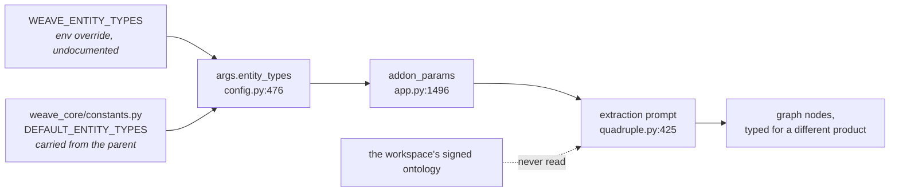

<!-- Stage 4 · Change request (Mode B). Against WEAVE_ARCHITECTURE.html and CONSTRAINTS.md v7. -->

# CR-003 — Extraction uses the ontology the workspace signed, not a constant carried from the parent

- **Raised by:** dsivov, 2026-08-15 (*"is it a problem of our test onboarding or an issue with design?"*)
- **Status:** **accepted** 2026-08-15 (**D-050**) · **Origin:** **W40**, found by measuring the thin Learnings and Features tabs
- **Against:** [WEAVE_ARCHITECTURE.html](WEAVE_ARCHITECTURE.html) §data-model · `CONSTRAINTS.md` **v7**
  (A5, A8, A9, A11)

## The problem, measured

Weave installs an ontology into a workspace as **signed governance** — the object types the product's
whole answer surface is built on. **Extraction never reads it.**

```
DEFAULT_ENTITY_TYPES   Person · Creature · Organization · Location · Event · Concept · Method
(weave_core/constants  Content · Data · Artifact · NaturalObject · LossReason · Objection · Competitor
 .py:29)

the installed ontology Role · Feature · ChangeRequest · Task · ArchitectureDecisionRecord · Review
                       Insight · Question · Module · Commit · PRD · RFC · Diagram · PullRequest · …

overlap                none
```

A real publish of one document produced **92 nodes**: `artifact 23 · concept 31 · method 6 · data 4 ·
objection 2 · constraint 6 · person 1 · content 5 · UNKNOWN 14`. **Not one Weave type.**

Across the demo workspace: **975 nodes, of which the six `Feature` nodes and the typed `Review`/`Insight`
nodes were all created by hand.** Everything the pipeline extracted — 947 nodes — is typed in a
vocabulary the answer surface does not look for.

**So the four standing questions are not thin because the data is thin.** `ask_features` seeds on
`Feature`; the pipeline produces `concept` and `artifact`; the question finds what a human typed and
nothing the product learned.

### Why this survived P11

D-041 replaced the extraction prompt's **examples** — the science-fiction story and the B2B sales call.
`Objection` and `Competitor` in the list above are **the entity types that sales example taught**. P11
removed the illustration and left the schema it illustrated. **The examples were the picture; this is the
vocabulary.**

## The chain today



**There is already a configuration point** — `WEAVE_ENTITY_TYPES` — so this is not a new mechanism. It is
pointing an existing one at the authority that already exists.

## Scope

**Changed**

1. **Extraction takes its types from the workspace's installed ontology.** `object_types` from the signed
   ontology, per workspace.
2. **Read per extraction run, not once at engine construction.** The ontology is a **signed, versioned
   artifact that changes without a restart** (A8). Types captured at construction would go stale the
   moment someone signs a new version — *the wizard writes what the runtime does not read*, which is the
   failure A8 exists to prevent, arriving from a third direction.
3. **A workspace with no ontology installed falls back to the shipped preset's ontology**, not to the
   parent's constant. A new workspace ingesting before `bootstrap` should still produce Weave types.
4. **`WEAVE_ENTITY_TYPES` remains an explicit override** and is documented — someone extending the
   vocabulary for a domain is a legitimate case; inheriting the parent's silently is not.

**Explicitly unchanged**

- **No new storage, node type, dependency or endpoint.** This is a source change for one list.
- **Existing graphs are not migrated.** The graph is *derived data* — A5 says the retrieval index is
  rebuilt, not authored — so an instance that wants Weave types re-ingests. **Said in the guide rather
  than done silently.**
- **The ontology itself is not changed.** It is already the authority; it was simply not consulted.
- **`weave_core/knowledge/quality/filter.py`** also reads `DEFAULT_ENTITY_TYPES` as a fallback schema.
  **In scope to check, out of scope to redesign** — it must not silently keep the old vocabulary alive.

### And the seed does not exercise the ontology either

dsivov: *"make sure all added ontology entities are in the seeding procedure as well."* Measured:

| | types covered |
|---|---|
| the ontology declares | **18** |
| a **fresh** `seed_demo.py` run produces | **8** — ADR, ChangeRequest, Commit, Feature, Insight, PullRequest, Review, Role |
| the **current demo workspace** holds | **5** — Feature, ChangeRequest, Review, Insight, PullRequest *(seeded by an older version of the script)* |
| **never seeded** | **Task, PRD, RFC, Diagram, Module, Question, Worker, DevHost, Environment, IntegrationRun** |

**This is the second reason the tabs look empty, and it is independent of W40.** Even once extraction
produces Weave types, a demo that has never contained a `PRD`, an `RFC`, a `Question` or a `Module`
cannot show what those questions answer. **A type declared in the ontology and absent from every
instance is a type nobody has ever seen work.**

It also weakens every gate that reads the demo: an answer surface exercised against 8 of 18 types has
been *demonstrated* on fewer than half the vocabulary it claims to serve.

## Impact and risk

| Risk | Judgement |
|---|---|
| Extraction quality changes | **This is the point, and it must be measured.** A software ontology may extract better or worse than a general one; R2 says an honest parity beats an unverified win. |
| Existing graphs keep parent types | True, and acceptable: derived data. The alternative — a migration that retypes nodes — is the exact mechanism W17 was mistakenly blamed on, and we are not building it. |
| The ontology is large; the prompt has a budget | 18 object types against 14 today. Worth watching, not blocking. |
| A workspace changes its ontology mid-life | Handled by (2): the next extraction uses the new one. Nodes already extracted keep their old types, which is honest — they *were* extracted under a different vocabulary. |

**Rollback** is setting `WEAVE_ENTITY_TYPES` to the old list; nothing written is stranded.

## Contract check (R11)

| ID | Verdict |
|----|---------|
| **A5** | **Upheld and served.** A5 names the artifact types; today extraction produces none of them. This makes the sentence describe the pipeline as well as the hand-authored nodes. |
| **A8** | **Load-bearing.** Reading the ontology *per run* is what keeps a signed change in force without a restart. Capturing it at construction would violate the spirit of A8 while passing every test. |
| **A9** | **Held** — one list, read in one place, so REST/UI and MCP answers cannot diverge. |
| **A11** | **Held** — no new library. |
| **A3** | **Relevant** — `LossReason`, `Objection`, `Competitor` are the parent's domain vocabulary. Not a name-guard hit (no banned string), the same **semantic** carry-over as D-041. |

**No amendment required.** Approved as **D-050**.

## Acceptance criteria — the gate

- [ ] **Criterion 1 is a pair, and neither half may be read alone (D-052).** Ingest into a workspace with
      the Weave ontology installed and measure both: **(1a) conformance ≥ 75%** of extracted nodes carry a
      type the ontology declares *or* `Other`; **(1b) answerability ≥ 40%** carry a type the ontology
      declares, `Other` excluded. **Raising 1a while lowering 1b is a failure, not a pass** — `Other` is
      legal and unanswerable, so the cheapest way to score 99% on the original wording was to empty the
      answer surface into it, which is exactly what one measured attempt did.
- [ ] **`ask_features` over a freshly ingested corpus returns nodes the pipeline extracted**, not only
      hand-created ones. *This is the criterion that matters: it is dsivov's original question.*
- [ ] Sign a new ontology, ingest again, and the **new** types are used — **without a restart**.
- [ ] A workspace with no ontology falls back to the **preset's** types, not the parent's.
- [ ] `WEAVE_ENTITY_TYPES` still overrides, and is documented.
- [ ] **R2 measurement, before and after, on one corpus**: node count, type histogram, and the number of
      nodes **the four questions can reach**. The last number is the one to report; today it is **zero**
      for extracted nodes.
- [ ] **`scripts/seed_demo.py` produces at least one node of every ontology object type** — 18 of 18, not
      8 — and a test asserts the two lists match, so a type added to the ontology fails until the seed
      covers it. **Otherwise the next type is unseeded the same way these ten were.**

## Tasks

1. `weave_core/graph/quadruple.py` — take `entity_types` from the workspace ontology at extraction time.
2. `weave/server/app.py` · `weave/server/config.py` — the fallback chain: explicit override → installed
   ontology → shipped preset. **The parent's constant leaves the chain.**
3. `weave_core/knowledge/quality/filter.py` — check what its fallback does once the constant is not the
   default; do not redesign it.
4. `scripts/measure_extraction.py` — add the answerable-node count; it already has the harness.
5. **`scripts/seed_demo.py` — cover all 18 types** (manager's script; the ten missing are `Task`, `PRD`,
   `RFC`, `Diagram`, `Module`, `Question`, `Worker`, `DevHost`, `Environment`, `IntegrationRun`).
6. **`scripts/check_locators.py` (W42)** — `ARTIFACT_TYPES` from the ontology instead of a hand-written ten,
   and `resolve_working_dir()` instead of a second default. **Folded in on approval:** it is the same
   defect, and it is why the check reported *"0 dangling"* from a directory it had never looked in.
7. **`weave/model/answers.py` (W39)** — `description` enters `CONTENT_FIELDS`/`LABEL_FIELDS`. Same theme,
   and it is the one field 97% of nodes carry.
8. `tests/` — the criteria, each negative-controlled, **including the ontology-versus-seed comparison**.
9. `guides/WEAVE_USER_GUIDE.html` — the ontology decides what extraction produces, and an existing graph
   keeps the types it was built with.

## Layout delta

```
weave_core/graph/quadruple.py            [edit] — read the ontology at extraction time
weave/server/app.py · config.py          [edit] — the fallback chain
weave_core/knowledge/quality/filter.py   [check]
scripts/measure_extraction.py            [edit] — answerable-node count
scripts/check_locators.py                [edit] — W42: ontology types, resolve_working_dir()
weave/model/answers.py                   [edit] — W39: `description`
scripts/seed_demo.py                     [edit] — 18 of 18 types
tests/test_extraction_uses_the_ontology.py [new]
tests/test_seed_covers_the_ontology.py   [new]
```

**No new dependency.**
