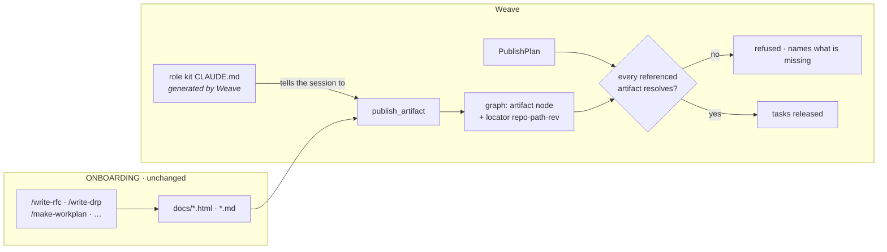

<!-- Stage 4 · Change request (Mode B). Against WEAVE_ARCHITECTURE.html and CONSTRAINTS.md v7. -->

# CR-002 — Authoring an artifact updates Weave, or the plan does not publish

- **Raised by:** dsivov, 2026-08-14 · **Status:** **accepted** 2026-08-14 (D-049) · **Supersedes** the
  first draft of this file, which proposed a `docs sync` command as the whole answer.
- **Against:** [WEAVE_ARCHITECTURE.html](WEAVE_ARCHITECTURE.html) §data-model and §key-flows ·
  `CONSTRAINTS.md` **v7** (A2, A5, A6, A9, A10)
- **Companion:** chapter 10 of [guides/WEAVE_USER_GUIDE.html](guides/WEAVE_USER_GUIDE.html). **The CR and
  the chapter ship together** — a documented workflow nothing enforces is how this gap was created.

## The problem

The house methodology produces artifacts in a fixed order — **BLOG → RFC ↔ DRP → CONSTRAINTS →
ARCHITECTURE / CR → WORK PLAN → milestone reviews** — and Weave is where the team's answers live.
**Nothing connects them.**

Measured, not assumed:

| | |
|---|---|
| **No methodology skill mentions Weave.** | `~/.claude/skills/*/SKILL.md` — every *Finish* step says *"add to `DOCS_INDEX.md`, suggest the next skill"*. Seven skills, zero references. |
| **The only link is an instruction.** | The manager's role kit says *"ingest those docs (`POST /documents/text`)"* as step 3 of its loop. If a session skips it, **nothing notices**. |
| **Acceptance is not completion.** | `POST /documents/text` answers `success` with a `track_id` when the text is *received*. Processing happens after and can fail — a `200` followed by a document in `failed`. |
| **Nothing detects an absent artifact.** | `check_locators.py` finds references that **broke**; nothing finds one that was **never made**. |

**So the failure mode is silence**, and it compounds: a plan publishes, tasks release, and every agent
orients on a graph missing the document the plan came from. Nobody is told, because there is nothing to
tell them about.

### Three gaps dsivov named, and the first draft got one of them wrong

1. **Scope is not `docs/*.md`.** Ingestion already accepts `.md`, `.html`, `.pdf`, `.docx`, source files
   and ~20 more — so `WEAVE_RFC.html`, `WEAVE_ARCHITECTURE.html` and a root `README.md` are ingestible
   **today**. The first draft's `docs/*.md` was an error in the CR, not a limit in the product. **The
   boundary is which artifacts matter, not which extension they carry.**
2. **Commit messages are a source, and only half of one is captured.** A `Commit` node carries `sha`,
   `subject` and `touches`. **The body is dropped** — and in this project the body is where the reasoning
   is.
3. **Task state is only as current as what flows through Weave.** Every transition is a governed action,
   so anything done *through* Weave is recorded. **Nothing makes work go through Weave**: a human
   developer committing in an IDE updates nothing, and the board quietly drifts from the repository.

## The shape of the answer

**dsivov's proposal — make authoring itself update Weave — is better than a sync command**, because a
command is a thing to remember and this CR exists because remembering failed. But it must not put Weave
inside the methodology kit.



**The coupling lives in Weave's own generated artifact, not in ONBOARDING.** `weave roles kit` already
writes a role's `CLAUDE.md`; that is where the instruction belongs. The methodology kit stays portable —
usable by a team with no Weave at all — and Weave stays the thing that knows about Weave (A2's instinct,
applied outward).

## Scope

**Changed**

1. **`publish_artifact` — one tool, one verb.** Takes a path, ingests the file, creates or updates the
   artifact node, and sets its locator from `repo · path · rev`. Exposed as an **MCP tool** (so a role
   session calls it directly, which is the point) and as `weave docs publish` for hooks and CI. **It
   waits for the outcome** and fails if the document did not land — the `track_id` is not the answer.
2. **The role kit's `CLAUDE.md` gains the step**, per role: after `/write-rfc` publish the RFC, after
   `/make-workplan` publish the plan. Generated by Weave, so it updates when the roles do.
3. **`PublishPlan` gains a precondition.** A plan whose referenced artifacts do not resolve is
   **refused**, naming each missing one and how to publish it. This is the backstop that makes step 2 not
   depend on anyone remembering.
4. **Commit bodies are recorded.** `record_commit` takes the message body alongside the subject, so *why*
   a commit exists is in the graph rather than only in `git log`.

**Explicitly unchanged**

- **ONBOARDING is not modified.** No skill learns about Weave.
- **No new storage, node type or dependency.** Artifact nodes and locators are what P2 built.
- **No watcher.** A daemon tailing a directory is background state this product does not otherwise have;
  "automatic" in practice is a hook or a CI step, and an idempotent verb gives that.
- **Task state from the git side stays out of scope** — see below.

## What this CR does not fix, said plainly

**It does not make a human developer's work update the board.** If someone commits in their IDE without
going through Weave, nothing changes in the graph, and CR-002 does not alter that. Closing it means either
a git-side hook that records commits against a task, or accepting that **the board reflects governed work
and not all work** — and saying so in the guide. **That is a product decision, not a defect**, and it
deserves its own CR rather than being smuggled in here.

## Impact and risk

| Risk | Judgement |
|---|---|
| A team is blocked by the new refusal | **Intended**, and it fires exactly where a plan would otherwise release tasks over an empty graph. It names the artifacts and the fix. |
| Publishing is one more step in a role's loop | It replaces a step already in the loop that nobody enforced. **Net zero instructions, one enforcement.** |
| The kit's instruction drifts from the tool | Both are generated by `weave roles kit` from the same source. A test asserts every artifact the plan can reference has a publish path. |

**Backward compatibility.** Existing workspaces are unaffected until their next `PublishPlan`.
**Rollback** is removing the precondition; nothing written is stranded.

## Contract check (R11)

| ID | Verdict |
|----|---------|
| **A2** | **Held, and it decided the design.** Weave does not reach into the methodology kit; the coupling lives in the artifact Weave generates. |
| **A5** | **Upheld and used.** The check is *"does the locator resolve"* — exactly what A5 makes checkable. Nothing is embedded. |
| **A6** | **Strengthened.** A governed action gains a precondition and refuses when unmet. |
| **A9** | **Held** — the precondition lives in the service beneath both adapters, so REST and MCP refuse identically. **The W4 lesson**: a rule in one adapter protects only the callers arriving through it. |
| **A10** | **Held** — an MCP tool and a CLI verb, no new client surface. |
| **A11** | **Held** — no new library. |

**No amendment required.** Approved as **D-049**.

## Acceptance criteria — the gate

- [ ] `publish_artifact` on an `.html` RFC and on a root `README.md` both land — **the extension is not the boundary.**
- [ ] It **fails when the document fails to process**; a `track_id` for a document that never landed does not read as success.
- [ ] Run twice, the second reports unchanged and writes nothing.
- [ ] A plan referencing an unpublished artifact is **refused**, naming it — **and refused identically through REST and MCP** for the same principal, asserted on both.
- [ ] The same plan publishes once the artifact is published.
- [ ] A commit's **body** is retrievable from its `Commit` node.
- [ ] `check_locators.py` reports **zero dangling** afterwards.
- [ ] Each role's generated `CLAUDE.md` names the publish step for the artifacts that role authors.

## Tasks

1. `weave/model/artifacts.py` `[new]` — `publish_artifact`, beneath both adapters.
2. `weave/server/mcp.py` · `weave/cli/docs.py` `[new]` — the two callers.
3. `weave/team/coordinator.py` — the `PublishPlan` precondition; `record_commit` takes a body.
4. `weave/team/playbook.py` — the role kit's `CLAUDE.md` gains the step.
5. `tests/` — the eight criteria, each negative-controlled.
6. `guides/WEAVE_USER_GUIDE.html` — chapter 10 updated, **written by executing it**.

## Layout delta

```
weave/model/artifacts.py   [new]  — publish_artifact, one implementation
weave/cli/docs.py          [new]  — weave docs publish
weave/server/mcp.py        [edit] — the tool
weave/team/coordinator.py  [edit] — the precondition; commit bodies
weave/team/playbook.py     [edit] — the kit instruction
tests/test_plan_requires_its_artifacts.py [new]
```

**No new dependency.** Nothing is added to `environment.yml`.
