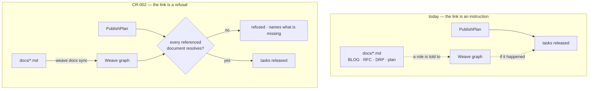

<!-- Stage 4 · Change request (Mode B). Against WEAVE_ARCHITECTURE.html and CONSTRAINTS.md v7. -->

# CR-002 — The methodology's artifacts are in the graph, or the plan does not publish

- **Raised by:** dsivov, 2026-08-14 · **Status:** **proposed**
- **Against:** [WEAVE_ARCHITECTURE.html](WEAVE_ARCHITECTURE.html) §data-model and §key-flows ·
  `CONSTRAINTS.md` **v7** (A5, A6, A9, A10)
- **Companion:** a new chapter in [guides/WEAVE_USER_GUIDE.html](guides/WEAVE_USER_GUIDE.html) — *using
  Weave with the ONBOARDING methodology*. **The CR and the chapter ship together**; a documented workflow
  nothing enforces is how this gap was created.

## The problem, measured

The house methodology produces artifacts in a fixed order — **BLOG → RFC ↔ DRP → CONSTRAINTS →
ARCHITECTURE / CR → WORK PLAN → milestone reviews**. Weave is where a team's answers live. **Today
nothing connects the two except an instruction.**

| Question | Today |
|---|---|
| Are planning artifacts uploaded automatically? | **No.** There is no watcher, hook or sync. The manager's role kit *instructs* the session — *"Ingest those docs into Weave (`POST /documents/text`)"* — as step 3 of its loop. If a session skips it, **nothing notices**. |
| Do they reach the developer? | **Yes, if step 1 happened.** A brief carries the task, its change request, dependencies, `touches`, and **precedent** — prior decisions semantically similar to the task. Documents arrive by retrieval, and artifact nodes carry a `repo · path · rev` locator rather than a copy (A5). |
| Can I tell the information is there? | **Partly.** `get_manifest` answers *what may I do*; `scripts/check_locators.py` finds citations that **no longer resolve**. **Nothing finds an artifact that was never ingested at all** — the difference between a broken reference and an absent one. |

**So the failure mode is silence.** A plan can be published whose DRP was never ingested; every task
released from it orients on a graph that does not contain the document the plan was derived from. The
developer is not told, because there is nothing to tell them about.

**And the acceptance is not the outcome.** `POST /documents/text` answers `status: success` with a
`track_id` the moment the text is *received*; processing happens afterwards and can fail. Verified on a
clean workspace: a `200`, then a document in `failed`. **A caller who trusts the response has published a
plan over a graph that does not contain the document** — which is the same silence as never ingesting,
arriving through the path that looks like it worked.

## Before → after



## Scope

**Changed**

1. **`PublishPlan` gains a precondition.** A plan naming documents whose locators do not resolve is
   **refused**, naming each missing artifact and the command that fixes it. Same shape as every other
   refusal in Weave: state the fact where it is known, name the exit.
2. **`weave docs sync <dir>`** — ingest a directory, report what was added, updated and unchanged, and
   **list artifacts referenced by the plan with no document behind them**. Idempotent, so it is safe in a
   git hook or CI.
3. **Ingestion reports its outcome, not its acceptance.** `POST /documents/text` returns a `track_id`
   today and the work fails later in the background. `docs sync` waits for the outcome and exits non-zero
   if a document did not land. *(The endpoint's async contract is unchanged — the CLI is what waits.)*

**Explicitly unchanged**

- **No new storage, no new node type, no new dependency.** Artifacts are already `PRD·RFC·ADR·…` with
  locators; this uses what P2 built.
- **No second ingestion path.** `docs sync` calls the same endpoint the kit already names (R10).
- **No automatic watcher.** A daemon watching a directory is state and background work this product does
  not otherwise have — and "automatic" in practice means *a hook or a CI step*, which an idempotent
  command already gives.

## Impact and risk

| Risk | Judgement |
|---|---|
| A team is blocked by the new refusal | **Intended.** It fires exactly when a plan would otherwise release tasks over an empty graph. It names the missing artifacts and the command. |
| Ingestion depends on the server's model backend | **Already true.** The refusal does not add that dependency; it makes a failed ingest visible at publish time instead of at the first unanswerable question. |
| `docs sync` becomes a second source of truth | **It cannot:** it ingests files and reports; the graph and `docs/` stay one artifact joined by a locator (A5). |

**Backward compatibility.** Existing workspaces with unpublished plans are unaffected until the next
`PublishPlan`. **Rollback** is removing the precondition; nothing is written that a rollback strands.

## Contract check (R11)

| ID | Verdict |
|----|---------|
| **A5** | **Upheld and used.** The check is *"does the locator resolve"* — precisely the property A5 exists to make checkable. Nothing is embedded. |
| **A6** | **Strengthened.** A governed action gains a precondition and refuses when it is not met. |
| **A9** | **Held** — the precondition lives in the service beneath both adapters, so REST/UI and MCP refuse identically. **This is the W4 lesson**: a rule enforced in one adapter protects only the callers who arrive through it. |
| **A10** | **Held** — `docs sync` is an operator command, not a new client surface. |
| **A11** | **Held** — no new library. |

**No amendment required.** Log a `D-NN` on approval.

## Acceptance criteria — the gate

- [ ] A plan referencing a document that was never ingested is **refused**, and the message **names the
      artifact and the command**.
- [ ] The same plan publishes once `weave docs sync` has run.
- [ ] **Refused identically through REST and MCP** for the same principal — asserted on both surfaces,
      not inferred from sharing a service.
- [ ] `weave docs sync` run twice reports the second as unchanged and writes nothing.
- [ ] `weave docs sync` **exits non-zero when a document fails to process** — a `track_id` returned for a
      document that never landed must not read as success.
- [ ] `scripts/check_locators.py` still reports **zero dangling** after a sync.

## Tasks

1. `weave/team/coordinator.py` — the `PublishPlan` precondition, in the service beneath both adapters.
2. `weave/cli/docs.py` `[new]` — `weave docs sync`, over the existing ingestion endpoint.
3. `tests/` — the six criteria above, each negative-controlled.
4. **`guides/WEAVE_USER_GUIDE.html` — the methodology chapter**, written by executing it.

## Layout delta

```
weave/cli/docs.py          [new]  — one verb: sync
weave/team/coordinator.py  [edit] — the precondition
tests/test_plan_requires_its_documents.py [new]
docs/guides/WEAVE_USER_GUIDE.html         [edit] — the new chapter
```

**No new dependency.** Nothing is added to `environment.yml`.
