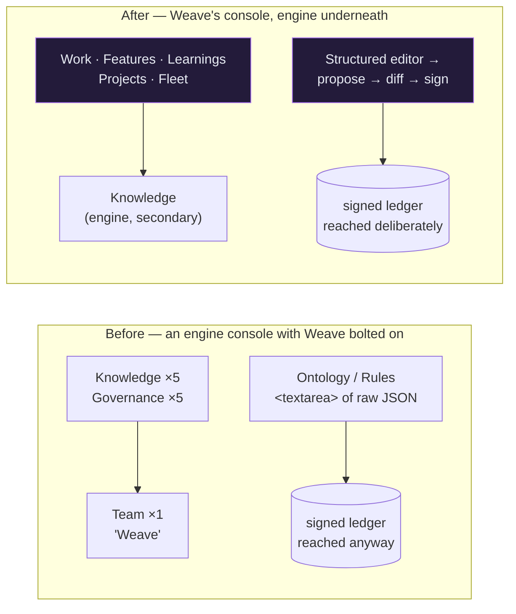

<!-- Stage 4b · Change Request. A scoped change on top of the existing architecture. -->

# Weave — Change Request (CR-001): the UI becomes Weave's, not the engine's

- **Project:** Weave  ·  **Date:** 2026-08-12  ·  **Status:** **proposed**
- **Affects:** [WEAVE_ARCHITECTURE.html](WEAVE_ARCHITECTURE.html) §components, §key flows · [WEAVE_DRP.md](WEAVE_DRP.md) §3.4, §3.6
- **Requested by:** dsivov

## 1 · What & why

**Weave is item 13 of 16 in its own navigation.** The product is called Weave, and "Weave" is one menu entry two-thirds down a list whose vocabulary belongs to the engine it was forked from:

```
Overview    Dashboard · Decisions
Knowledge   Documents · Knowledge Graph · Retrieval · Chunks · Diagrams
Governance  Rules · Ontology · Graph Quality · Studio · Team vocabulary
Team        Weave                                    ← the product, one item
Admin       Users
Setup       Get Started · API
```

**This is not a build failure — it is a requirement that never reached the artifacts.** P0.5 copied the source web UI (26,659 LOC) verbatim, P0 adopted the frontend-kit tokens *"as the design system for **new** screens"*, and the BLOG promises a team-vocabulary wizard *"**beside** the graph-vocabulary editors"*. Five screens were then added — Admin ▸ Users, the live board, the wizard, FleetView, the Weave view. Every one of them was built exactly as written. **Nothing in the BLOG, RFC, DRP or work plan asks for Weave to be the primary surface**, so no milestone review could have caught it: a contract check tests whether what was written stayed true, not whether the right thing was written.

The second half is sharper. **`Ontology` and `Rules` are `<textarea>` elements containing `JSON.stringify(doc, null, 2)`** (`OntologyNext.tsx:32,156,195`, `RulesNext.tsx:21,68`). A user configuring their team edits raw JSON and a rules DSL. Meanwhile P4–P6 built the alternative and proved it: the wizard's **interview → proposal → diff → sign**, where the sign button stays disabled until a reason is typed, and D-032/D-033/D-034 made **every one of the seven ledger kinds** sign through `DiffEngine`. *The capability is finished server-side and the UI never caught up.*

**What this CR does not ask for is any new backend.** It surfaces what the last three phases already built.

## 2 · Before → after



Two changes, one principle: **the screens a Weave operator uses daily come first, and every governance change is authored the way the wizard already authors one.**

## 3 · Scope

**Changes**

- `weave-ui/src/features/next/AppShell.tsx` — the `NAV` array and its groups. Weave concepts become the primary group; the engine's surfaces move to a secondary group; nothing is deleted.
- **`Ontology`** and **`Rules`** — the raw-JSON textareas are replaced by structured editors that produce a **proposal**, render the **diff** the Studio already computes, and **sign** with a reason. The textarea survives as an explicit *"edit as JSON"* escape hatch for the cases a form cannot express.
- **`Studio`** — currently a generic artifact ledger. Becomes the *history* view those flows link into ("what changed, who signed it, revert") rather than a separate place to author.
- **A Weave landing view** — the four canonical questions (`/ask/{changes,why,features,learnings}`) surfaced as the entry point they were built to be. They have existed since P2 and have **no UI at all**.
- `weave-ui/src/features/next/pages/` — one new page per primary concept; the existing `WeaveBoard`, `FleetView` and `Wizard` are re-parented, not rewritten.

**Unchanged (explicitly)**

- **Every server endpoint.** No route added, changed or removed. If a screen needs something the API cannot answer, that is a finding for this CR, not a licence to add an endpoint (**A9**: one handler for REST and MCP — a UI-only endpoint would breach it).
- **The graph, retrieval, chunk and document screens** — kept, working, moved. This is a demotion in the navigation, not a deletion. Deleting an engine surface is a separate decision with its own `D-NN`.
- **The diagram editor**, `@xyflow`-based and already the most Weave-native surface in the app.
- **`weave_core/`, `weave/`, the CLI, the daemon, the dev-agent image.** This CR is `weave-ui/` only.
- **Authentication, RBAC and the workspace header.** Untouched.

## 4 · Layout & dependency delta

**Files / directories**

| Path | Added / moved / deleted | Owns |
|---|---|---|
| `weave-ui/src/features/next/AppShell.tsx` | changed | the `NAV` array, groups, ordering |
| `weave-ui/src/features/next/pages/Work.tsx` | added | the board — re-parents `WeaveBoard` |
| `weave-ui/src/features/next/pages/Features.tsx` | added | `/ask/features` + `/ask/changes` |
| `weave-ui/src/features/next/pages/Learnings.tsx` | added | `/ask/learnings` + `/ask/why` |
| `weave-ui/src/features/next/pages/Projects.tsx` | added | `ProjectLayout` registry + locator resolve |
| `weave-ui/src/features/next/governance/` | added | the shared propose → diff → sign flow |
| `weave-ui/src/features/next/pages/OntologyNext.tsx` | changed | structured editor over the shared flow |
| `weave-ui/src/features/next/pages/RulesNext.tsx` | changed | as above |
| `weave-ui/src/features/next/pages/Studio.tsx` | changed | history and revert, not authoring |

**Dependencies**

| Library | Version | New / reused | Why nothing already installed covers it |
|---|---|:--:|---|
| — | — | **none** | Nothing new is required, and that is the point. |

Everything this CR needs is installed **and already used**: `@radix-ui/*` for dialogs, tabs, select and scroll; `@tanstack/react-table` for the node lists the four questions return; `zustand` for state; `lucide-react` for icons; `sonner` for toasts; `@xyflow/react` if the ontology editor becomes a node/link canvas. **A11 holds with no `D-NN`.** If a form library or a JSON-schema renderer starts to look necessary, that is a drift — stop and report it rather than adding one.

## 4b · The ontology canvas: a LinkType is not an edge — decided here, not in implementation

The premise holds: `@xyflow/react` ^12.10.1 is **already installed** for the diagram editor, which
already has `Canvas`, `NodeTypes/`, `EdgeTypes/` and `Inspector/`. The ontology has **no inheritance,
nesting or containment** (`extends`/`parent` appear nowhere in `schema.py`) — the thing that usually
defeats a node/link canvas is absent.

**One mismatch is real and must be settled before it becomes a task.** `LinkType.source_types` and
`target_types` are **lists** (`schema.py:263-264`, *empty = any*), so **one LinkType is N edges**.
Measured against the shipped preset:

| | |
|---|---|
| object types | **18** |
| link types | **23** |
| **concrete edges on a canvas** | **37** |
| link types with >1 source or >1 target | **9** (worst: `specified_by`, 2×2 = 4 edges) |
| link types using the ANY wildcard | **0 today** — but the schema permits it, and one `ANY→ANY` link would be **324** |

`@xyflow` has no hyperedges: an edge is one source handle to one target handle. The two honest options
fail differently, and picking by default rather than deliberately is how the wrong one gets shipped:

- **Draw 23, one per LinkType** — truthful to the model, but an edge must attach to several nodes at
  each end, which the library does not do natively.
- **Draw all 37** — native, but deleting or renaming one edge edits a shared `LinkType` and silently
  changes up to three others on screen.

**Decision: draw all 37, and make the sharing visible rather than silent.** Edges carrying the same
`LinkType` render as one group; selecting any one selects them all; the inspector is headed *"this link
type also connects: …"*. An **edit-one-change-many** surprise is the same class of defect as a signature
promising a distinction its body never makes — the fix is to stop the UI implying two edges are
independent when they are one object. **Named fallback if that is too much for a first cut:** render
multi-type links **read-only** on the canvas and edit them in the structured panel. An edit whose blast
radius is invisible is worse than an edit the canvas declines to offer.

**Two consequences for the tasks:**

1. **Node properties do not go inline.** 99 object-type properties, mean 5.5, max 9, across six kinds
   with constraints (enum, min/max, required). That is an inspector panel, and
   `diagram-editor/components/Inspector/` is the precedent to **reuse**, not a second one to write (R10).
**Both blind spots are one bug.** Link properties and the `ANY` wildcard are each *a property of the data, mistaken for a property of the code, because the only data anyone tested against did not exercise it* — W13's shape, and W5's before it. One fixture closes both, and it costs a line each.

2. **Link-type properties must round-trip even though the preset has none.** The schema carries them;
   **0 of 23** preset links use one. An editor that drops them on save loses data for anyone who has
   authored some — and the preset would never reveal it, because the preset has none. Assert the
   round-trip against a fixture that *has* link properties, not against the preset.

## 5 · Impact & risk

| Area | Impact | Risk | Mitigation |
|---|---|:--:|---|
| Navigation | Every user's muscle memory moves | **med** | Nothing is deleted; the engine group keeps its labels and routes. `ViewId` is a union, so a stale link is a compile error, not a 404. |
| Ontology / Rules authoring | Raw JSON stops being the primary path | **med** | The textarea stays as a labelled escape hatch. A structured editor that cannot express a document must say so and hand over rather than silently truncate it. |
| Governance correctness | Every write goes through propose → diff → sign | **low** | Strengthens **A8** rather than testing it. The server already refuses unsigned writes (D-032/033/034), so a UI mistake fails loudly. |
| Untested UI | `bun test` is unverified after D-036 and the UI has never been built in CI | **high** | **The real risk in this CR.** See the gate: the build must run and the suite must be exercised locally before sign-off, because nothing automatic will do it. |
| Scope creep into the engine | "While we are here" rewrites of graph screens | **med** | §3 names them unchanged. A change there needs its own CR. |

- **Backward compatibility:** yes. No API, storage or contract change; a user's data and workspaces are untouched.
- **Rollback:** `weave-ui/` is a self-contained directory and the change is a UI-only commit range — `git revert` restores the previous console without touching server state. The built assets are regenerated by `bun run build`.

## 6 · Acceptance criteria (test gate)

- [ ] **A Weave operator's first screen answers a Weave question.** From a fresh login, the landing view shows work, features, learnings or fleet — not documents or chunks.
- [ ] **The four questions have a UI.** Each of `/ask/{changes,why,features,learnings}` is reachable, returns the **same node set** the API returns for the same workspace, and every node links to its locator.
- [ ] **Ontology and Rules are authored through propose → diff → sign.** A change shows a diff before it applies, cannot be signed without a reason, and lands as a **new ledger version** — verified by reading `history()` back, not by the UI's own confirmation.
- [ ] **The JSON escape hatch still works** and round-trips a document the structured editor cannot express.
- [ ] **Nothing engine-side is lost:** every one of the sixteen current views is still reachable.
- [ ] **`bun run build` succeeds and `bun test` passes**, both run by hand and reported — after D-036 nothing runs them otherwise.
- [ ] **`tsc --noEmit` exits 0** and `eslint .` exits 0.
- [ ] **No endpoint added or changed** — `git diff` on `weave/server/routers/` is empty (A9).
- [ ] Python suite still **1091+ passed**, name-guard clean.

## 7 · Tasks

- [ ] **Contract check (R11)** — touches **A9** (no UI-only endpoint), **A11** (no new library), **A8** (governance writes stay signed), **A6**. Write it into the first commit with a verdict per ID.
- [ ] `AppShell.tsx` — new `NAV` groups and ordering; `ViewId` extended for the new pages.
- [ ] `governance/` — the shared propose → diff → sign flow, extracted from `Wizard.tsx` so there is **one** implementation (R10), not a second copy beside it.
- [ ] `Work.tsx` · `Features.tsx` · `Learnings.tsx` · `Projects.tsx` — the primary views.
- [ ] `OntologyNext.tsx` · `RulesNext.tsx` — structured editors over the shared flow, JSON escape hatch retained.
- [ ] **Ontology canvas** — `@xyflow` node/link view drawing all 37 concrete edges, with same-`LinkType` edges grouped: select one selects all, inspector headed with the other pairs it connects. Reuse `diagram-editor/components/Inspector/` for the 99 properties rather than writing a second inspector (R10).
- [ ] `weave-ui/src/**/__tests__` — **one fixture that exercises what the preset does not.** It must carry **link-type properties** (0 of 23 preset links have any, so a preset-derived test cannot catch the save dropping them) **and one `ANY` wildcard link** (0 of 23 use one, so no preset-derived test renders the 324-edge case). Assert: properties round-trip through save without loss; the wildcard renders without collapsing the canvas; and an edit to one edge of a shared `LinkType` visibly affects its siblings.
- [ ] `Studio.tsx` — history, diff and revert; authoring removed.
- [ ] `tests/test_ask_ui_parity.py` — the UI's node set for each question equals the API's (**A9**, mirrors `test_mcp_rest_parity.py`).
- [ ] `weave-ui/src/**/__tests__` — `bun test` coverage for the shared governance flow: a proposal with no reason cannot sign.
- [ ] **Run the build and both suites by hand** and report the numbers (D-036).

**Review:** on completion, code review of the CR diff; log the decision in `DECISIONS.md`.

---

## Contract check (R11) — no amendment required

| ID | Verdict | Note |
|---|---|---|
| A1 | **held** | The UI is not a deployable; it is built and served by the server. Unchanged. |
| A6 | **held** | Every screen calls governed endpoints with the authenticated principal. |
| A8 | **strengthened** | Raw JSON authoring is replaced by signed ledger versions — the direction A8 points. |
| A9 | **held, and load-bearing** | No UI-only endpoint. This is the constraint most at risk in a UI change, so the gate asserts `routers/` is untouched. |
| A11 | **held** | No new library. |
| A14 | **held** | Membership and the workspace header unchanged. |

**This CR designs inside the contract and needs no amendment.** If the work reaches a point where a screen cannot be built without a new endpoint or a new library, that is drift: stop, report the ID, and take comply / amend / defer to dsivov — do not design around it.
