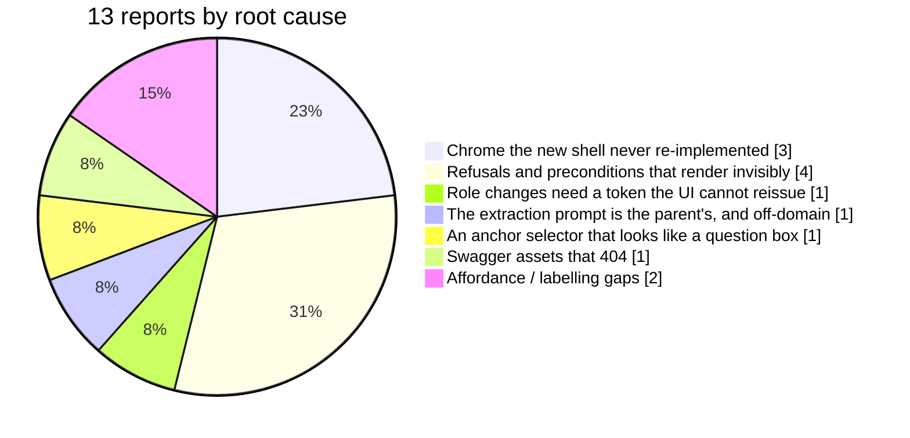
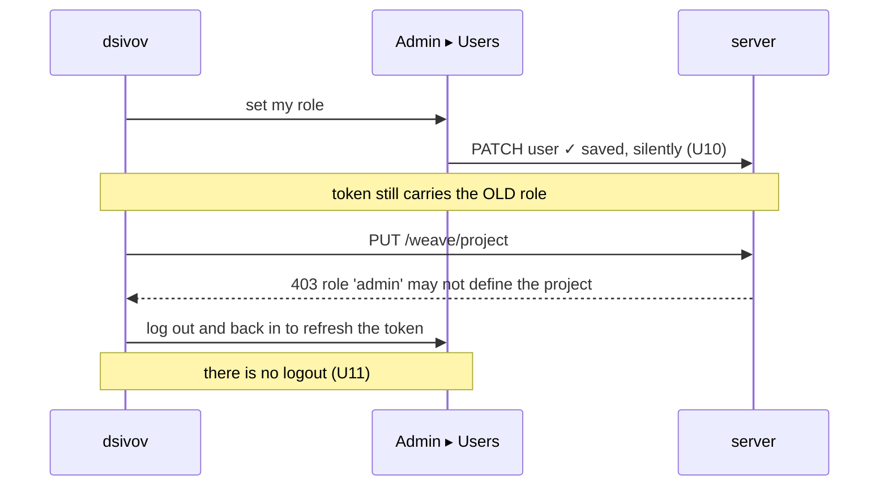

<!-- Defect triage. Every mechanism below was verified in the source or against the running demo. -->

# Weave — UI defect triage (U1–U13)

- **Source:** `BUGS_IN_UI.md` — dsivov, testing the demo tenant at `10.0.0.80:9800` after P7 shipped.
- **Triaged by:** weave-manager, 2026-08-13 · **Result:** **13 reports → 13 confirmed defects, 7 root causes.**
- **Nothing here is "works as designed".** Two reports describe behaviour that is technically
  correct and still wrong, and they are the two most important ones.

## What the reports actually are



**The headline: a user could not log out, could not tell who they were, and could not act in
the role they had just given themselves.** For a product whose one-sentence pitch is *multi-user,
multi-role*, that trio is not cosmetic — it is the pitch failing on first contact.

---

## Cause A · The new shell replaced the chrome and did not re-implement it — U11, U12, U13

`App.tsx:204` makes `AppShell` the whole application in `next` mode, which is the default.
The classic `SiteHeader` is not rendered, and it owned exactly two controls
(`SiteHeader.tsx:143,150`): the project-repository link and **logout, with the username in its
tooltip**. `AppShell`'s replacement footer (`AppShell.tsx:196–203`) carries an avatar, the
workspace name, and a back-to-classic button. **Logout and identity were not carried across.**

| | Report | Mechanism | Verified |
|---|---|---|---|
| **U11** | No way to log out | `handleLogout` exists only in the unrendered classic header | source |
| **U12** | No indication of who you are | `username` is read by `SiteHeader` only; the new footer prints the *workspace* | source |
| **U13** | A `CG` badge, bottom-left | `AppShell.tsx:197` — `<div className="avatar">CG</div>`, a hardcoded literal | source |

**U13 is a name-guard blind spot, and worth stating as a rule rather than a fix.** A3 bans two
*spellings*; this is the parent's *initials*. The guard cannot see it, and the same namespace runs
through the new shell's own CSS — `cgnext` ×259, `cgtable`, `cgmodal`, `cgmain`, 338 occurrences.
Those are internal class names and not user-visible, so they are not A3 violations; the avatar is
the one that reaches a screen. **The finding is the reach of the guard, not the count.**

**Fix:** the footer becomes the session block — the signed-in user's initials, their name and role,
and logout. That is one change that closes all three, and it is the right home for identity
anyway: it is where the user already looks for it.

---

## Cause B · The refusal renders where the user cannot see it — U2, U6, U7, U10

Four "the button does nothing" reports, one shape: **the reason nothing happened is real,
correct, and invisible.**

### U2 — Approve, on a task
`WeaveBoard.tsx:241` sits inside a `<Modal>` (line 206). Its `act()` helper catches the failure and
calls `setErr` (line 85) — and `err` renders at **line 128, outside the modal**. A 403 lands on the
page *behind* the dialog the user is looking at. The click is not ignored; the answer is occluded.

### U6, U7 — Sign in the wizard and on a diagram
`SignOff.tsx:163` disables the sign button until a reason is typed, and `useSignOff` refuses the
call as well — deliberately, two guards, and the file argues the case well. But the **only**
explanation is a `title` tooltip on a *disabled* control (line 170), which most people never see
and no touch device shows at all. The invariant is right and its communication is absent.

### U10 — Admin ▸ Users
Two halves, both real:
- *"Cannot add users"* — the create button is disabled until a username exists **and the password
  is ≥ 8 characters** (`AdminUsers.tsx:249`). The rule is never stated on screen.
- *"Changing role has no save option"* — because **it saves immediately** (line 137,
  `updateUser(user.id, { role })`) and says nothing. Confirmed against the live store:
  `dsivov.updated_at` is `2026-08-13T10:15:00` against a `last_login_at` of 2026-08-11. **The
  change the user believed was lost is the one that is on disk.**

**Fix:** one rule, applied in all four places — *a control that will not act says why, in place,
before it is clicked; an action that fails says so where it was clicked; an action that succeeds
says that too.* Never a disabled button whose only voice is a tooltip.

---

## Cause C · A role change needs a new token, and the UI cannot issue one — U1

This is the one to read twice.

`_role()` (`team.py:310`) reads the role **from the token**, correctly — D5, attribution is
authenticated, never self-stamped. `PUT /weave/project` requires `SUPERVISOR_ROLES =
{"manager","architect"}` (line 197, 722). The reported principal was `admin`.

So the sequence that produced U1 is:



**Three defects compose into a dead end.** The save is silent, the token is stale, and the only
way to refresh it was removed. Fixing U10 and U11 breaks the deadlock on their own.

**But there is a product question underneath, and it is yours to answer.** `admin` is a *system*
role — it administers users. `manager` and `architect` are *governance* roles — they direct work.
Today the account that administers the installation cannot say what the team is working on, which
is defensible (administering people ≠ directing work) and surprising to the person who installed
it. See **Decisions needed**, below.

---

## Cause D · Weave extracts its knowledge using the parent's examples — U8

The user saw a sales conversation about a wireless speaker in the Decisions tab and reasonably
read it as bad demo data. **It is not demo data. It is shipped product behaviour.**

`weave_core/graph/prompt.py` — the entity-extraction prompt — teaches the model on two few-shot
examples inherited verbatim from the parent engine:

- a **science-fiction short story** (lines 108–125): *Alex, Taylor, Jordan, Cruz, "The Device"*
- a **B2B sales call** (lines 615–643): *Premium Wireless Speaker, AudioRival, SoundMax Pro*, with
  entity types `competitor` and `objection`

GPT-4o then copied them into its output. Confirmed in the live demo graph:

```
vdb_entities.json          924 entities
of which, from the prompt    5  — AudioRival · TechGadgets · Premium Wireless
                                  Speaker · SoundMax Pro · Customer
```

**Two defects, and the second is the serious one.** Example entities leak into real graphs — but
worse, an extractor for a *software development team* is being taught what an entity looks like by
a novel and a price objection. Every PRD, ADR and review Weave ingests is read through that lens.

**This is the half-rebrand A3 was written to prevent, in the one place A3 cannot reach.** The
guard bans two spellings; nothing in the contract says *the prompts must be about the domain the
product serves*. The names were changed and the worked examples were not.

Fixing it changes extraction behaviour, so it is a measured change under R2, not a text edit —
see **Decisions needed**.

---

## Cause E · An anchor selector dressed as a question box — U5

`Features.tsx:35` calls `ask('features', anchor)`. `anchor` is a **node id**. The user typed
*"Explain Feature P5"*, which is not one, so both panels fell through to their empty states —
and those empty states are written to explain an *empty system* (*"No capabilities recorded yet…"*),
so a well-populated instance reported itself as empty. **The input invited a question it cannot
answer, and the failure message described the wrong problem.**

**Fix:** make it a picker over real node ids, or accept prose and say plainly when nothing matched
— *"no feature matches 'Explain Feature P5'"* is a different sentence from *"no features exist"*.

---

## Cause F · The API tab is blank because Swagger's assets are missing — U9

Verified against the running server:

```
GET /docs                              200   (points at /static/swagger-ui/…)
GET /static/swagger-ui/swagger-ui.css  404
GET /static/swagger-ui/swagger-ui-bundle.js  404
GET /openapi.json                      200   ← the contract itself is fine
```

The server is configured for **self-hosted** Swagger assets that are not shipped or not mounted,
so the iframe loads a page whose stylesheet and script both 404. The API surface is healthy; only
its documentation viewer is broken.

---

## Cause G · Labelling and affordance — U3, U4

- **U3** — `AnswerView.tsx:31` labels a node by `title`, `name`, `entity_name`, then falls back to
  `id`. Insight nodes carrying none of the first three render as `insight:XXXX`. The *Why* panel
  then shows the same node because that is what it was anchored on. Partly a seed-data shape
  (manager's), partly a real rule: **the answer surface should never show a reader a raw id.**
  Confirm against a correctly-seeded instance before fixing.
- **U4** — *Component map* (`Studio.tsx:163`) renders without saying what a component is, where
  they come from, or how to add one. Not a code defect; a **P8 documentation task** plus one
  explanatory line on the panel.

---

## Severity and sequence

| ID | Defect | Severity | Why that severity |
|----|--------|----------|-------------------|
| **U11** | No logout | **Critical** | A multi-user product you cannot leave. Blocks role changes, blocks testing every other role, blocks the guide's whole "log in as the architect" chapter. |
| **U10** | Users: silent save, unstated password rule | **Critical** | The administration screen misreports its own writes. |
| **U1** | Supervisor dead end | **Critical** | Composite of U10 + U11; the owner cannot configure the product. |
| **U2** | Approve's refusal renders behind the modal | **High** | The governed action at the centre of the review loop looks broken. |
| **U8** | Off-domain extraction examples leak into graphs | **High** | Silent, permanent, and pollutes every customer instance. |
| **U6 · U7** | Sign refuses without saying why | **High** | The signing flow is the product's spine. |
| **U12** | No identity shown | **High** | With no logout, nothing tells you which account you are in. |
| **U9** | API docs blank | **Medium** | Contract intact; viewer broken. |
| **U5** | Question box that takes ids | **Medium** | Wrong answer to a fair question. |
| **U3** | Raw ids as labels | **Medium** | Verify seed first. |
| **U13** | `CG` avatar | **Medium** | One visible instance; fixed by the U11/U12 work. |
| **U4** | Component map unexplained | **Low** | P8. |

**Sequence:** U11 + U12 + U13 first, as one change — it unblocks U1 and U10 and it is the session
block the shell should always have had. Then U10, U2, U6/U7 as the visible-refusal rule. Then U8
under its own decision. U9, U5, U3 after. U4 with the guide.

---

## What this says about the M7 review — mine

**I verified the sign-off flow through the API and reported it as a UI gate.** M7 records
*"Refuses to sign without a reason — pass"* and *"Lands as a new ledger version — pass"*; both were
driven with `curl` against `/studio/propose` and `/studio/apply`. Every one of those statements is
true and **none of them was a statement about the button**. U6 and U7 are exactly the gap between
those two things.

**And I verified that all sixteen views were reachable without checking what the shell around them
lost.** I re-derived the view-id set from the pre-change commit and confirmed the count — a good
check that answered a narrow question. Nobody derived the *control* set, so logout and identity
left without a trace. Same shape as W15, W18 and W20: **the thing I measured was adjacent to the
thing I claimed.** Builds is not runs; endpoints is not buttons; views is not chrome.

That belongs in every future gate as a question rather than a lesson: *what did the old
implementation own that the new one silently does not?*

---

## Decisions needed from dsivov

1. **Should `admin` be able to define the project (U1)?**
   - **(a) Keep the separation, fix the deadlock** *(recommended)* — administering users stays
     distinct from directing work; U10 + U11 make role changes usable, and the owner grants
     themselves `manager` in two clicks and a re-login. Nothing in the contract moves.
   - **(b) Make `admin` a supervisor** — one-line change, immediately intuitive for a single
     operator, and it merges "can manage people" with "can direct the team" permanently. A6 still
     holds; the role model gets coarser.
   - **(c) Grant per-workspace governance roles from the users screen** — the most correct and the
     largest; it is the real answer to *"there is no supervisor role to assign to myself"*.

2. **Rewrite the extraction prompt's examples for the software-development domain (U8)?**
   Recommended **yes**, and as a measured change under R2: same corpus, before/after entity counts,
   and the five leaked entities gone. It touches how every document is read, so it wants a `D-NN`
   and its own gate rather than a quiet edit.

3. **Rename the `cg*` CSS namespace?** Recommended **not now** — 338 internal occurrences, no user
   ever sees one, and the visible instance is fixed with U13. Worth logging that the name-guard
   catches spellings and not initials, so the decision is deliberate rather than an oversight.
