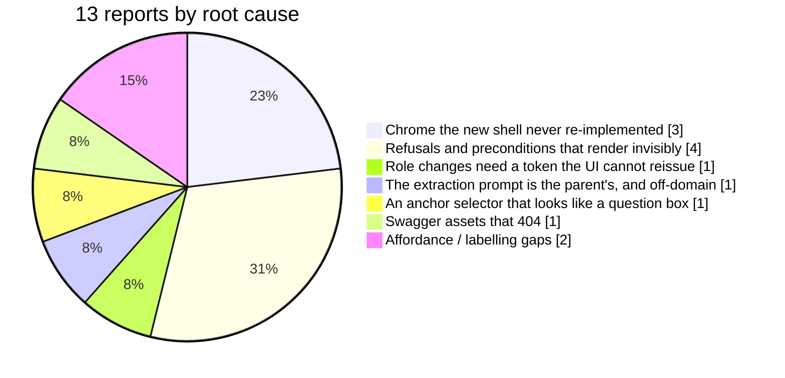
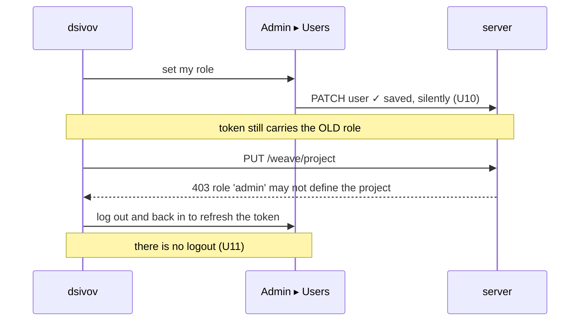

<!-- Defect triage. Every mechanism below was verified in the source or against the running demo. -->

# Weave — UI defect triage (U1–U13)

- **Source:** `BUGS_IN_UI.md` — dsivov, testing the demo tenant at `10.0.0.80:9800` after P7 shipped.
- **Triaged by:** weave-manager, 2026-08-13 · **Result:** **13 reports → 13 confirmed defects, 7 root causes.**
- **Nothing here is "works as designed".** Two reports describe behaviour that is technically
  correct and still wrong, and they are the two most important ones.

## What the reports actually are



**The headline: a user could not log out, could not tell who they were, and could not act in
the role they had just given themselves.** For a product whose one-sentence pitch is *multi-user,
multi-role*, that trio is not cosmetic — it is the pitch failing on first contact.

---

## Cause A · The new shell replaced the chrome and did not re-implement it — U11, U12, U13

`App.tsx:204` makes `AppShell` the whole application in `next` mode, which is the default.
The classic `SiteHeader` is not rendered, and it owned exactly two controls
(`SiteHeader.tsx:143,150`): the project-repository link and **logout, with the username in its
tooltip**. `AppShell`'s replacement footer (`AppShell.tsx:196–203`) carries an avatar, the
workspace name, and a back-to-classic button. **Logout and identity were not carried across.**

| | Report | Mechanism | Verified |
|---|---|---|---|
| **U11** | No way to log out | `handleLogout` exists only in the unrendered classic header | source |
| **U12** | No indication of who you are | `username` is read by `SiteHeader` only; the new footer prints the *workspace* | source |
| **U13** | A `CG` badge, bottom-left | `AppShell.tsx:197` — `<div className="avatar">CG</div>`, a hardcoded literal | source |

**U13 is a name-guard blind spot, and worth stating as a rule rather than a fix.** A3 bans two
*spellings*; this is the parent's *initials*. The guard cannot see it, and the same namespace runs
through the new shell's own CSS — `cgnext` ×259, `cgtable`, `cgmodal`, `cgmain`, 338 occurrences.
Those are internal class names and not user-visible, so they are not A3 violations; the avatar is
the one that reaches a screen. **The finding is the reach of the guard, not the count.**

**Fix:** the footer becomes the session block — the signed-in user's initials, their name and role,
and logout. That is one change that closes all three, and it is the right home for identity
anyway: it is where the user already looks for it.

---

## Cause B · The refusal renders where the user cannot see it — U2, U6, U7, U10

Four "the button does nothing" reports, one shape: **the reason nothing happened is real,
correct, and invisible.**

### U2 — Approve, on a task
`WeaveBoard.tsx:241` sits inside a `<Modal>` (line 206). Its `act()` helper catches the failure and
calls `setErr` (line 85) — and `err` renders at **line 128, outside the modal**. A 403 lands on the
page *behind* the dialog the user is looking at. The click is not ignored; the answer is occluded.

### U6, U7 — Sign in the wizard and on a diagram
`SignOff.tsx:163` disables the sign button until a reason is typed, and `useSignOff` refuses the
call as well — deliberately, two guards, and the file argues the case well. But the **only**
explanation is a `title` tooltip on a *disabled* control (line 170), which most people never see
and no touch device shows at all. The invariant is right and its communication is absent.

### U10 — Admin ▸ Users
Two halves, both real:
- *"Cannot add users"* — the create button is disabled until a username exists **and the password
  is ≥ 8 characters** (`AdminUsers.tsx:249`). The rule is never stated on screen.
- *"Changing role has no save option"* — because **it saves immediately** (line 137,
  `updateUser(user.id, { role })`) and says nothing. Confirmed against the live store:
  `dsivov.updated_at` is `2026-08-13T10:15:00` against a `last_login_at` of 2026-08-11. **The
  change the user believed was lost is the one that is on disk.**

**Fix:** one rule, applied in all four places — *a control that will not act says why, in place,
before it is clicked; an action that fails says so where it was clicked; an action that succeeds
says that too.* Never a disabled button whose only voice is a tooltip.

---

## Cause C · A role change needs a new token, and the UI cannot issue one — U1

This is the one to read twice.

`_role()` (`team.py:310`) reads the role **from the token**, correctly — D5, attribution is
authenticated, never self-stamped. `PUT /weave/project` requires `SUPERVISOR_ROLES =
{"manager","architect"}` (line 197, 722). The reported principal was `admin`.

So the sequence that produced U1 is:



**Three defects compose into a dead end.** The save is silent, the token is stale, and the only
way to refresh it was removed. Fixing U10 and U11 breaks the deadlock on their own.

**But there is a product question underneath, and it is yours to answer.** `admin` is a *system*
role — it administers users. `manager` and `architect` are *governance* roles — they direct work.
Today the account that administers the installation cannot say what the team is working on, which
is defensible (administering people ≠ directing work) and surprising to the person who installed
it. See **Decisions needed**, below.

---

## Cause D · Weave extracts its knowledge using the parent's examples — U8

The user saw a sales conversation about a wireless speaker in the Decisions tab and reasonably
read it as bad demo data. **It is not demo data. It is shipped product behaviour.**

`weave_core/graph/prompt.py` — the entity-extraction prompt — teaches the model on two few-shot
examples inherited verbatim from the parent engine:

- a **science-fiction short story** (lines 108–125): *Alex, Taylor, Jordan, Cruz, "The Device"*
- a **B2B sales call** (lines 615–643): *Premium Wireless Speaker, AudioRival, SoundMax Pro*, with
  entity types `competitor` and `objection`

GPT-4o then copied them into its output. Confirmed in the live demo graph:

```
vdb_entities.json          924 entities
of which, from the prompt    5  — AudioRival · TechGadgets · Premium Wireless
                                  Speaker · SoundMax Pro · Customer
```

**Two defects, and the second is the serious one.** Example entities leak into real graphs — but
worse, an extractor for a *software development team* is being taught what an entity looks like by
a novel and a price objection. Every PRD, ADR and review Weave ingests is read through that lens.

**This is the half-rebrand A3 was written to prevent, in the one place A3 cannot reach.** The
guard bans two spellings; nothing in the contract says *the prompts must be about the domain the
product serves*. The names were changed and the worked examples were not.

Fixing it changes extraction behaviour, so it is a measured change under R2, not a text edit —
see **Decisions needed**.

---

## Cause E · An anchor selector dressed as a question box — U5

`Features.tsx:35` calls `ask('features', anchor)`. `anchor` is a **node id**. The user typed
*"Explain Feature P5"*, which is not one, so both panels fell through to their empty states —
and those empty states are written to explain an *empty system* (*"No capabilities recorded yet…"*),
so a well-populated instance reported itself as empty. **The input invited a question it cannot
answer, and the failure message described the wrong problem.**

**Fix:** make it a picker over real node ids, or accept prose and say plainly when nothing matched
— *"no feature matches 'Explain Feature P5'"* is a different sentence from *"no features exist"*.

---

## Cause F · The API tab is blank because Swagger's assets are missing — U9

Verified against the running server:

```
GET /docs                              200   (points at /static/swagger-ui/…)
GET /static/swagger-ui/swagger-ui.css  404
GET /static/swagger-ui/swagger-ui-bundle.js  404
GET /openapi.json                      200   ← the contract itself is fine
```

The server is configured for **self-hosted** Swagger assets that are not shipped or not mounted,
so the iframe loads a page whose stylesheet and script both 404. The API surface is healthy; only
its documentation viewer is broken.

---

## Cause G · Labelling and affordance — U3, U4

- **U3** — **corrected 2026-08-13 after measuring; the first reading was wrong.** Both the manager
  and the developer expected a data defect on W17's smell, and planned a re-seed. **The data is
  perfect.** `/ask/learnings` returns each Insight with its full text in a `statement` field; the
  renderer never looks at it.

  Two lists, written independently, intersecting on one word. `weave/model/answers.py:65` —
  `_node_view`, the **shared** projection behind REST/UI *and* MCP (A9) — emits
  `title, status, summary, verdict, statement, sha, reviewer, confidence, text, asked_by, url, path`.
  `AnswerView.tsx:31` labels from `title, name, entity_name, id`. **They overlap on `title` alone**,
  so every node whose content lives in `statement`/`summary`/`text` renders as a raw id — which is
  exactly Insights and Reviews, which is exactly what Learnings shows.

  ```
  learnings  26 nodes  id type statement summary verdict reviewer  → renders: id   ✗
  features    6 nodes  id type                                      → renders: id   ✓ the id is the name
  changes    12 nodes  id type                                      → renders: id   ✓
  ```

  Features and changes present the identical symptom and are **correct** — their ids are
  human-readable. Only the rich nodes lose their content, which is why this reads as cosmetic and
  is not. **The fix is a canonical `label` from the shared handler**, so MCP agents stop guessing
  too, plus a test that the two lists cannot drift apart again. Not a longer hardcoded chain in the
  renderer: that misses the next field the way this one did.

  **The re-seed was cancelled.** It would have destroyed the evidence and changed nothing —
  looking before acting is the only reason this was caught.

  Related and *not* a defect: `/ask/why` anchored on one of these returns 0 nodes, so the
  right-hand panel's *"Nothing justifies this node yet"* is truthful. dsivov's *"both show the same
  unused Insight"* was the id-rendering on the left plus an honest empty on the right.
- **U4** — *Component map* (`Studio.tsx:163`) renders without saying what a component is, where
  they come from, or how to add one. Not a code defect; a **P8 documentation task** plus one
  explanatory line on the panel.

---

## U14 · A new project starts with no ontology and no rules, and the UI tells you to make an HTTP request

Raised by dsivov, 2026-08-13: *"ontology and rules are very complicated, but for a software project they
are pretty much the same — we have to ensure initial seeding for each new project creates those
definitions by default."* **Verified against the running server, and the concern is correct.**

A workspace that has never been touched:

```
GET /weave/status   installed: false   (the preset is described, not installed)
GET /ontology       exists: false  ·  object_types: []  ·  link_types: []
GET /rules          exists: false  ·  enabled: false  ·  rules: []
```

The preset itself is complete and well-formed — **18 object types, 23 link types, 15 actions, 4 roles,
3 concepts** — and it is exactly the "pretty much the same for every software project" content dsivov
means. It is simply not installed. `preset.install()` has exactly two callers, both deliberate acts:
`POST /weave/bootstrap` and `weave roles install`. **Nothing installs on workspace creation.**

And the affordance is a sentence, not a control (`WeaveBoard.tsx:140`):

> *This workspace isn't bootstrapped for Weave yet. Run `POST /weave/bootstrap` as a manager/architect.*

**That instructs a human role to issue an HTTP request from a screen that could simply do it.** A10 says
human roles are Claude Code sessions and the web UI — neither of which is a `curl` prompt.

### Why this is not a one-line "install on create", and what to do instead

**Auto-installing everywhere would install RBAC everywhere, and W16 says an RBAC-enabled workspace denies
every MCP agent** — `rbac_service.check(ws, None, …)` fails closed because MCP carries no role. So
"seed every new workspace" and "dev agents can work in a new workspace" are, today, in direct conflict.
The demo tenant has been usable by agents *precisely because* nothing was installed in it.

Two steps, in order:

1. **A button, now.** The board already knows `installed: false`, the endpoint exists, and it is correctly
   gated to supervisors. This is the cheap, obviously-right half — and it is a P10-class defect: *the
   application knew the answer and did not put it where the person was looking.*
2. **Default-on at workspace creation — after W16.** Installing signs five ledger layers with an approver
   and a reason (A8), which is attributable to the creator and fine. The blocker is not signing; it is
   that RBAC-on-by-default locks agents out until MCP can carry a role. **Sequence it behind W16, or the
   fix for empty governance becomes the cause of an empty fleet.**

## U15 · The one message shown when Weave is missing names a variable that does nothing

**Found by accident during U14's browser pass**, by starting a server the way a new operator would
and reading what the screen said. `WeaveBoard.tsx:55`:

> *Weave is unavailable (is `ENABLE_WEAVE` set?)*

**`ENABLE_WEAVE` is read by nothing.** The server reads **`WEAVE_ENABLE_TEAM`** (`config.py:575`).
Proven rather than grepped — two servers, identical but for one variable:

```
ENABLE_WEAVE=true       → args.enable_weave = False   (no Weave surface at all)
WEAVE_ENABLE_TEAM=true  → args.enable_weave = True
```

Two code comments repeat the wrong name (`routers/team.py:3`, `app.py:1569`), which is presumably
where the UI string came from.

**Why this is worse than its size.** It is the *only* message a person sees when the entire Weave
surface is absent — every board, every governance screen, gone — and following its advice changes
nothing, which reads as *"this product is broken"* rather than *"you set the wrong flag"*. It is
W7's class (printed advice naming something that does not exist) on the most consequential screen.
**P8 will document turning Weave on**, so this must be right before the guide is written, or the
guide inherits it.

## U16 · The bootstrap refusal blames the flag that is set and names the one that is not

Same pass, one click later. With `WEAVE_ENABLE_TEAM=true` but quadruple mode off, **Install
governance** returns 503 and renders — correctly, in place, which is U14's rule working:

> *Weave bootstrap requires Weave mode. Set `WEAVE_ENABLE_QUADRUPLE=true`.*

Weave mode **is** on; `/weave/status` says `enabled: true`. What is missing is quadruple mode, and
the sentence names the right fix while asserting the wrong cause. A reader who trusts the first half
goes and checks the flag that is already correct.

Also a **genuine onboarding fact nobody has written down**: governance needs *both*
`WEAVE_ENABLE_TEAM` and `WEAVE_ENABLE_QUADRUPLE`. That belongs in the guide regardless of the
wording fix.

## U17 · Governance is signed, in force, and shown nowhere

dsivov, 2026-08-13: *"In Team vocabulary I changed mode from Solo to Reviewed and enabled only two
roles (manager and developer). I signed it, but there is no indication which mode the system is in
now."*

**The change worked perfectly.** Read back from the live demo ledger:

```
GET /rbac        name: "reviewed"  version: 2  roles: manager (*), developer (8 actions)
GET /lifecycle   name: "reviewed"  version: 2  Task: review → approved requires "manager"
```

Exactly what was asked for, signed and enforced. **And no screen says so.** `Wizard.tsx` renders
four sections — *choose a shape*, *the interview*, *the diff and the signature*, *what happened* —
every one of them about **changing** governance. The fourth only appears in the session that applied
it; revisit the page tomorrow and there is nothing. The board's chip says `installed`, not *which*.

So the person who just reshaped how their team works has no way to confirm it, and the honest
question *"are we in Reviewed mode?"* is answerable only by reading the ledger over HTTP.

**Same family as U10's silent save** — the write succeeded and told nobody — but a step worse: U10
was silent about an event, this is silent about **state**, so the gap does not close by waiting.

### The fix, and the trap in it

**Derive it from the installed artifacts; do not store a mode label.** `/rbac` and `/lifecycle`
already carry `name` and `version` — the wizard writes them and the runtime enforces them, so they
cannot disagree with reality. A separate *"current mode = reviewed"* field would be **a second
source of truth, which is precisely what A8 exists to forbid**: someone edits the ontology or rules
directly, the runtime changes, and the label keeps saying Reviewed.

- An **In force now** section at the top of Team vocabulary: mode name, version, the roles that
  exist and what each may do, and the lifecycle in force — read from the ledger.
- Mark the installed shape in *choose a shape*, so re-picking is an informed act rather than a
  guess.
- The board's `installed` chip names the mode.

## U18 · The diagram editor rejects valid mermaid it will happily render

Found by editing dsivov's diagram 002 through the real surfaces. `parser.ts:351` matches
`/^flowchart\s+(TD|LR|BT|RL)/` — so:

| header | mermaid | Weave's editor |
|---|---|---|
| `flowchart TD` | valid | opens |
| **`flowchart TB`** | **valid — the official synonym for TD** | *"No valid flowchart header found"* |
| **`graph TD`** | **valid — the older form, and the commonest in the wild** | rejected |

**The viewer renders all three; only the editor refuses them.** So a diagram pasted from anywhere else —
documentation, an LLM, this repository's own `.md` files — round-trips as an unopenable artifact whose
source is intact and whose canvas is empty.

**The product behaves well around it**, which is why this is Medium and not High: it refuses in place,
names the fix, and says *"Its source is still intact on the server"* — the U2/U6 rule holding on a screen
that was never part of P10.

## U19 · An edge targeting a subgraph crashes the layout, and the crash is shown raw

Same session, isolated by changing one thing: with `daemon --> hub` where `hub` is a **subgraph**, Open
fails with

> *'002' could not be laid out on the canvas: **Cannot set properties of undefined (setting 'rank')**.*

Re-point the same edge at a node *inside* the subgraph and the identical diagram opens — 12 nodes, 11
edges. **Edges to and from subgraphs are ordinary mermaid**; dagre needs the cluster registered before
`setEdge`, and it is not.

Two defects in one line, worth separating:
1. **The layout cannot handle a legal construct.**
2. **A raw JavaScript `TypeError` is rendered to the user as an explanation.** *"Cannot set properties of
   undefined (setting 'rank')"* tells a manager nothing they can act on — the sentence around it is
   excellent and the middle of it is a stack frame.

**Minor, same screen:** `<br/>` inside a node label renders literally on the canvas while the mermaid
preview beside it renders the line break. Cosmetic, and worth one line in whatever fixes the above.

## Severity and sequence

| ID | Defect | Severity | Why that severity |
|----|--------|----------|-------------------|
| **U11** | No logout | **Critical** | A multi-user product you cannot leave. Blocks role changes, blocks testing every other role, blocks the guide's whole "log in as the architect" chapter. |
| **U10** | Users: silent save, unstated password rule | **Critical** | The administration screen misreports its own writes. |
| **U1** | Supervisor dead end | **Critical** | Composite of U10 + U11; the owner cannot configure the product. |
| **U2** | Approve's refusal renders behind the modal | **High** | The governed action at the centre of the review loop looks broken. |
| **U8** | Off-domain extraction examples leak into graphs | **High** | Silent, permanent, and pollutes every customer instance. |
| **U6 · U7** | Sign refuses without saying why | **High** | The signing flow is the product's spine. |
| **U12** | No identity shown | **High** | With no logout, nothing tells you which account you are in. |
| **U9** | API docs blank | **Medium** | Contract intact; viewer broken. |
| **U5** | Question box that takes ids | **Medium** | Wrong answer to a fair question. |
| **U3** | Raw ids as labels | **Medium** | Verify seed first. |
| **U13** | `CG` avatar | **Medium** | One visible instance; fixed by the U11/U12 work. |
| **U4** | Component map unexplained | **Low** | P8. |

**Sequence:** U11 + U12 + U13 first, as one change — it unblocks U1 and U10 and it is the session
block the shell should always have had. Then U10, U2, U6/U7 as the visible-refusal rule. Then U8
under its own decision. U9, U5, U3 after. U4 with the guide.

---

## What this says about the M7 review — mine

**I verified the sign-off flow through the API and reported it as a UI gate.** M7 records
*"Refuses to sign without a reason — pass"* and *"Lands as a new ledger version — pass"*; both were
driven with `curl` against `/studio/propose` and `/studio/apply`. Every one of those statements is
true and **none of them was a statement about the button**. U6 and U7 are exactly the gap between
those two things.

**And I verified that all sixteen views were reachable without checking what the shell around them
lost.** I re-derived the view-id set from the pre-change commit and confirmed the count — a good
check that answered a narrow question. Nobody derived the *control* set, so logout and identity
left without a trace. Same shape as W15, W18 and W20: **the thing I measured was adjacent to the
thing I claimed.** Builds is not runs; endpoints is not buttons; views is not chrome.

That belongs in every future gate as a question rather than a lesson: *what did the old
implementation own that the new one silently does not?*

---

## Decisions needed from dsivov

1. **Should `admin` be able to define the project (U1)?**
   - **(a) Keep the separation, fix the deadlock** *(recommended)* — administering users stays
     distinct from directing work; U10 + U11 make role changes usable, and the owner grants
     themselves `manager` in two clicks and a re-login. Nothing in the contract moves.
   - **(b) Make `admin` a supervisor** — one-line change, immediately intuitive for a single
     operator, and it merges "can manage people" with "can direct the team" permanently. A6 still
     holds; the role model gets coarser.
   - **(c) Grant per-workspace governance roles from the users screen** — the most correct and the
     largest; it is the real answer to *"there is no supervisor role to assign to myself"*.

2. **Rewrite the extraction prompt's examples for the software-development domain (U8)?**
   Recommended **yes**, and as a measured change under R2: same corpus, before/after entity counts,
   and the five leaked entities gone. It touches how every document is read, so it wants a `D-NN`
   and its own gate rather than a quiet edit.

3. **Rename the `cg*` CSS namespace?** Recommended **not now** — 338 internal occurrences, no user
   ever sees one, and the visible instance is fixed with U13. Worth logging that the name-guard
   catches spellings and not initials, so the decision is deliberate rather than an oversight.
