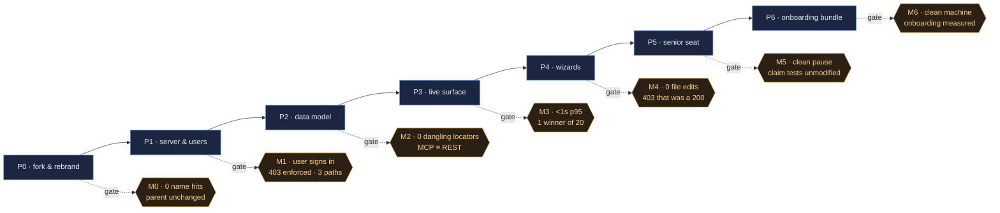

<!-- Stage 5 · Work Plan. Phases → milestones → tasks, each milestone with an explicit test gate.
     The checkboxes are the progress trace. -->

# Weave — Work Plan

- **Sources:** [WEAVE_DRP.md](WEAVE_DRP.md) · [WEAVE_ARCHITECTURE.html](WEAVE_ARCHITECTURE.html) · [WEAVE_RFC.html](WEAVE_RFC.html)
- **Contract:** [CONSTRAINTS.md](CONSTRAINTS.md) **v4** — every phase opens with a contract check (R11)
- **Branch:** work rides a `feature/` branch and the manager merges at each gate — two sessions now share one checkout (D-025's direct-to-`main` waiver superseded in practice; R5 observed). · **Status:** **P0–P2 complete and reviewed. M2 approved 2026-08-11 — 0 Critical, 0 High open, merged to `main`. P3 is the active phase.**
- **Owner:** dsivov · **Roles:** *manager* owns this plan, the contract, the reviews, git and server startup; *developer* implements the tasks and runs the gate. A task marked **[manager]** is not the developer's to do.

> **This plan builds on working code, not a blank page.** Every task below that moves code names its
> **source path in the parent tree and its destination here**, with the line count, so "copy, rename,
> refactor — but still use it" is a checkable instruction rather than an intention. Roughly **92k LOC
> is carried across**; the genuinely new code is the user store, the answer surface, the live layer,
> the wizards, the CLI and one event-bus adapter.
>
> **Read before P0 (D-022):** the source is under active development. `coordinator.py`, `store.py`,
> `devhost_daemon.py` and `test_weave_devhost.py` all changed on 2026-08-08, and `coordinator.py`
> carries uncommitted work in the claim path. **The copy point is a commit, never a working tree** —
> task P0.1 resolves this before anything is copied.

## Phase overview

| Phase | Theme | Ships | Milestone | Gate |
|-------|-------|-------|:---------:|------|
| P0 | Fork, rebrand, foundations | ~92k LOC copied + renamed; name-guard; conda env | **M0** | same tests, same count; 0 name hits; parent byte-identical |
| P1 | Standalone server & user store | `WEAVE_*` config; users + Admin UI; 3 storage paths | **M1** | UI-created user signs in, sees only granted workspaces, 403s correctly, on all 3 paths |
| P2 | Data model & answer surface | Feature/Review/Insight/Question; locator; ProjectLayout | **M2** | 4 questions = 4 traversals; 0 dangling locators; MCP ≡ REST |
| P3 | Live, multi-user surface | SSE + presence; 409-and-merge; Postgres bus adapter | **M3** | < 1s p95 cross-session; 1 winner under N=20 concurrent; no polling |
| P4 | Team-vocabulary wizards | Wizard + templates; RBAC & lifecycle as ledger kinds | **M4** | fresh install → governed workspace, 0 file edits, 0 restarts; 403 that was a 200 |
| P5 | Senior-developer seat | Supervisory principal; dispatch, pause/resume/redirect | **M5** | pause honoured between steps; claim tests pass unmodified |
| P6 | Onboarding bundle & productisation | `weave` CLI; compose bundles; dev-host + agent images | **M6** | clean machine → live fleet by published steps only; onboarding measured |

**Legend for copy tasks:** `destination` ← `source` (LOC) — what it is.
`[copy]` verbatim + rename · `[copy+split]` copied then split along an existing seam ·
`[new]` written here.

---

## P0 · Fork, rebrand, foundations → **M0**

> Mechanical by definition: **no behaviour change**. Any bug found here is written up and deferred
> to a later phase with its own task — fixing it in P0 destroys the gate's meaning (R5).

- [x] **Contract check (R11)** — this phase touches **A1** (three deployables), **A2** (import
      direction, no HTTP in the core), **A3** (naming), **A4** (three storage paths + ports),
      **A11** (stack, one library per job), **A13** (no `anthropic` dependency). Re-read
      `CONSTRAINTS.md` v2 before starting.

### P0.1 · Pin the source (do this first — D-022)
- [x] Re-run `git status` in the parent tree. If dirty in any module listed below, either commit that
      work there and pin the new sha, **or** exclude it explicitly and record a `D-NN` to port later.
- [x] `PROVENANCE.md` — source repo, **pinned sha**, the module selection table below, the date, and
      an empty port log for future deliberate ports.
- [x] `scripts/parent_checksum.sh` — record the parent's `git status` + working-tree checksum; this is
      the M0 baseline that proves we never wrote to it (A2, D-003).

### P0.2 · Environment and guards
- [x] `environment.yml` — conda, Python 3.12, pinned to the DRP §7 library table. **13 libraries
      omitted:** `anthropic`, `python-jose`, `lxml`, `playwright`, `redis`, `pymongo`, `pymilvus`,
      `qdrant-client`, `docling`, `llama-index(+openai)`, `zhipuai`, `aioboto3`, `voyageai`.
- [x] `weave-ui/package.json` — bun, carried from the source app's manifest.
- [x] `scripts/nameguard.sh` — fail on any `lightrag` / `context graph` hit outside a
      `<!-- nameguard:allow lineage -->` passage in `docs/BLOG_*.html`; report honoured markers (R2a, R3a).
- [x] `.github/workflows/ci.yml` — run `nameguard.sh`, `pytest`, `bun test` on every commit.
- [x] `tests/test_nameguard.py` — a seeded violation must fail the guard.
- [x] `tests/test_dependency_set.py` `[new]` — the installed set matches `environment.yml`, and **none of the 13 omitted libraries is present**; guards A11 and A13 at the manifest level rather than only at import time. *(Added 2026-08-08 from P0 implementation — R1: the plan carries the work, not the other way round.)*

### P0.3 · Copy the engine → `weave_core/` *(no HTTP below this line — A2)*
- [x] `weave_core/graph/engine.py` ← `lightrag/lightrag.py` (4,079) `[copy]` — the graph engine
- [x] `weave_core/graph/quadruple.py` ← `context_graph/core.py` (2,352) `[copy]` — the `(h,r,t,rc)` layer + CGR3 retrieve→rank→reason
- [x] `weave_core/graph/operate.py` ← `lightrag/operate.py` (5,433) `[copy]`
- [x] `weave_core/graph/query.py` ← `lightrag/utils_graph.py` (1,753) `[copy]`
- [x] `weave_core/graph/prompt.py` ← `lightrag/prompt.py` (794) `[copy]`
- [x] `weave_core/graph/base.py` ← `lightrag/base.py` (915) `[copy]`
- [x] `weave_core/graph/types.py` ← `context_graph/types.py` (252) `[copy]` — `RelationContext`, 11 fields
- [x] `weave_core/graph/storage/files.py` ← `lightrag/kg/{networkx_impl,json_kv_impl,json_doc_status_impl,nano_vector_db_impl}.py` (1,706) `[copy]`
- [x] `weave_core/graph/storage/postgres.py` ← `lightrag/kg/postgres_impl.py` (5,778) `[copy]`
- [x] `weave_core/graph/storage/neo4j.py` ← `lightrag/kg/neo4j_impl.py` (1,922) `[copy]`
- [x] `weave_core/graph/storage/__init__.py` — the `STORAGES` registry, **cut to the 3 supported paths** (A4). ⚠ string-keyed module map — the known rename trap (AS6)
- [x] `weave_core/store/record.py` ← `context_graph/weave/recordstore.py` `[copy]` — **promoted** to the one persistence port (A4, D-020)
- [x] `weave_core/store/locks.py` ← `lightrag/kg/shared_storage.py` (1,717) `[copy]` — keyed locks incl. the workspace-keyed claim lock
- [x] `weave_core/governance/rbac/` ← `context_graph/rbac/` (406) `[copy]`
- [x] `weave_core/governance/lifecycle/` ← `context_graph/lifecycle/` (393) `[copy]`
- [x] `weave_core/governance/actions/` ← `context_graph/actions/` (850) `[copy]`
- [x] `weave_core/governance/rules/` ← `context_graph/rules/` (1,290) `[copy]`
- [x] `weave_core/governance/ontology/` ← `context_graph/ontology/` (1,200) `[copy]`
- [x] `weave_core/governance/gate.py` ← `context_graph/rules/gate.py` `[copy+split]` — the single verdict entry point; returns verdicts, never raises HTTP (A2)
- [x] `weave_core/studio/service.py` ← `context_graph/studio/` (900) `[copy]` — propose → diff → sign, versioned
- [x] `weave_core/studio/diagrams/` ← `context_graph/diagrams/` (632) `[copy]` — *(stays a 4-module package: flattening needs intra-package import surgery, which is not mechanical, and P0's gate is no-behaviour-change.)*
- [x] `weave_core/events/schema.py` ← `context_graph/events/schema.py` `[copy]`
- [x] `weave_core/events/bus.py` + `inprocess.py` ← `context_graph/events/service.py` (289) `[copy+split]` — port and in-process adapter separated (the Postgres adapter lands in P3)
- [x] `weave_core/events/ingress.py` ← `context_graph/events/store.py` `[copy]` — durable append-then-publish log
- [x] `weave_core/knowledge/{dedup,quality,community,connectivity}/` ← the same-named `context_graph/` packages (1,426) `[copy]`
- [x] `weave_core/llm/` ← `lightrag/llm/{openai,azure_openai,bedrock,gemini,jina,lollms,ollama,binding_options}.py` (3,454) `[copy]` — **the 8 wired connectors only**; the 7 unwired modules and `anthropic.py` are not copied (A13)
- [x] `weave_core/llm/rerank.py` ← `lightrag/rerank.py` (577) `[copy]`
- [x] `weave_core/{utils,exceptions,constants,types,namespace}.py` ← the `lightrag/` equivalents (~3,700) `[copy]`
- [x] `weave_core/jsonio.py` ← `context_graph/jsonio.py` (46) `[copy]`

### P0.4 · Copy the product → `weave/`
- [x] `weave/team/coordinator.py` ← `context_graph/weave/coordinator.py` `[copy]` — atomic claim, **workspace-keyed lock** (the fixed review finding — R6)
- [x] `weave/team/store.py` ← `context_graph/weave/store.py` `[copy]` — task records
- [x] `weave/team/workers.py` ← `context_graph/weave/workers.py` (223) `[copy]` — fleet registry
- [x] `weave/team/worker.py` ← `context_graph/weave/worker.py` (526) `[copy]` — the loop + `scrub_api_auth()` / `preflight_subscription_auth()` (A13)
- [x] `weave/team/integration.py` ← `context_graph/weave/integration.py` (171) `[copy]` — `WeaveEnvironment` + `IntegrationRun`, the merge gate. *(Corrected 2026-08-08: the plan previously carried 587 LOC here, which is the **other** `integration` — see the next task.)*
- [x] `weave/ingress/` ← `context_graph/integration/` (483) `[copy]` — the **ingress engine** (`IngressService`, `MappingSpec`, connectors, mapper). A different subsystem that happens to share a word; the plan omitted it and the server + copied tests need it. *(Added from P0 implementation.)*
- [x] `weave_core/studio/apps.py` ← `context_graph/apps/` (86) `[copy]` — *(Added from P0 implementation; omitted from the original plan.)*
- [x] `weave/team/project.py` ← `context_graph/weave/project.py` `[copy]`
- [x] `weave/team/playbook.py` ← `context_graph/weave/playbook.py` `[copy]` — `role_kit()`, `claude_md()`, `_mcp_config()`
- [x] `weave/team/preset.py` + `weave/team/preset/*.json` ← `context_graph/weave/preset.py` + `preset/` (468) `[copy]`
- [x] `weave/devhost/registry.py` ← `context_graph/weave/devhost.py` (313) `[copy]` — host records, `run·drain·pause·stop`, seat health
- [x] `weave/devhost/daemon.py` ← `context_graph/weave/devhost_daemon.py` (759) `[copy+split]` — register → heartbeat → reconcile
- [x] `weave/devhost/runtime.py` ← split from the same file `[copy+split]` — `ContainerRuntime` protocol + `DockerRuntime`
- [x] `weave/devhost/worktree.py` ← split from the same file `[copy+split]` — host-side clone, worktrees, branch publish
- [x] `weave/server/app.py` ← `lightrag/api/lightrag_server.py` `[copy]`
- [x] `weave/server/config.py` ← `lightrag/api/config.py` `[copy]` — **every setting renamed to `WEAVE_*`** (R7)
- [x] `weave/server/auth.py` ← `lightrag/api/auth.py` `[copy]` — JWT kept; the account source changes in P1
- [x] `weave/server/utils.py` ← `lightrag/api/utils_api.py` `[copy]`
- [x] `weave/server/workspace_pool.py` ← `lightrag/api/workspace_pool.py` `[copy]`
- [x] `weave/server/mcp.py` ← `lightrag/api/mcp_server.py` `[copy]` — Streamable HTTP, **rebranded server name + `WEAVE-WORKSPACE` header** (R55)
- [x] `weave/server/routers/` ← `lightrag/api/routers/` **12 of 15** `[copy]` — drop `webingest_routes.py` and `ollama_api.py`
- [x] `weave/server/routers/team.py` ← `context_graph/weave/routes.py` `[copy]` — incl. `/hosts/{register,heartbeat,control,scale}`
- [x] `weave/server/routers/reasoning.py` ← `context_graph/api/routes.py` (1,383) `[copy]` — *(renamed from the plan's `graph.py`: `lightrag/api/routers/graph_routes.py` already claims that name. Two routers, two names.)*
- [x] `weave/server/gunicorn.py` ← `lightrag/api/run_with_gunicorn.py` `[copy]` — the launcher
- [x] `weave/server/gunicorn_config.py` ← `lightrag/api/gunicorn_config.py` `[copy]` — *(kept separate: the launcher imports the config as a **module object** and mutates its attributes; merging breaks that.)*
- [x] `weave_core/flows/` ← `context_graph/flows/` (1,037) `[copy]` — *(moved from the plan's `weave/flows/`: it is engine machinery with no HTTP, so it belongs below the A2 line. Confirmed clean by the A2 sweep.)*

### P0.5 · Copy the UI and images
- [x] `weave-ui/` ← `lightrag_webui/` (26,659) `[copy]` — React 19 · Vite 7 · Tailwind 4 · zustand 5; 28 components, 3 stores, API client
- [x] Drop the scraper screens with `webingest`; keep `DocumentManager`, `RetrievalTesting`, `Studio`, `GetStarted`, `WeaveBoard`, `Diagrams`, `Decisions`, `Ontology`, `Rules`, `Dashboard`, `LoginPage`
- [x] `weave-ui/src/styles/` — adopt `frontend-kit/house-ui.css` tokens as the design system for **new** screens (this repo already has it)
- [x] `deploy/dev-agent.Dockerfile` ← `docker/weave-dev.Dockerfile` `[copy]` — update `COPY` paths to `weave_core/` + `weave/`, entry point to `python -m weave.team.worker` (R49); safety properties preserved verbatim (R50)

### P0.6 · Rebrand and verify
- [x] `weave_core/version.py` `[new]` — hold `__api_version__`, re-exported from `weave/server/__init__.py`. **Fixes a real A2 violation in the source:** `lightrag/llm/{openai,ollama}.py` import it `from lightrag.api`, i.e. the engine importing the HTTP layer. Direction stays inward; no behaviour change.
- [x] `weave/server/config.py` — **all** variables Weave reads become `WEAVE_*`, incl. `POSTGRES_*`, `NEO4J_*`, `JWT_*`; `USE_CONTEXT_GRAPH` → `WEAVE_ENABLE_QUADRUPLE`. Variables a **vendor library reads itself** (`OPENAI_API_KEY`, `AZURE_*`, `GOOGLE_*`) are **never** prefixed (D-024)
- [x] Rename every module path, env var, storage identifier, log string and UI string; **filenames too** — including outbound `User-Agent` headers, which currently ship the parent's product name to third-party services
- [x] `tests/` ← the source's `context_graph/tests/` suites `[copy]` — carried with the code (R5)
- [x] `tests/test_storage_registry.py` `[new]` — the string-keyed `STORAGES` map resolves on **all three** paths (AS6, the known trap)
- [x] `tests/test_claim_race.py` `[new]` — regression for the 2026-08-04 review finding: two workers, two tasks, overlapping `touches` → one winner (R6)
- [x] `tests/test_no_sdk.py` `[new]` — `anthropic` is absent from manifests and no module imports it (A13)

**Gate (M0):**
1. The copied suite passes, and **every copied module's suite came with it**. Absent suites are only those whose modules were deliberately dropped, **named explicitly** — at `608401b8` that is the six `test_webingest_*` files (D-008). *(Corrected 2026-08-08: the original wording said "same test count", which a deliberate drop makes false — the gate would have had to be fudged to pass honestly.)*
2. `scripts/nameguard.sh` returns **0** hits outside the marked exemption, filenames included.
3. The **pinned commit** still resolves in the source and its tree hash matches the recorded value (`608401b8` → tree `30a44324`); the fork is extracted via `git archive` at that commit, so this is what was actually copied and git guarantees its integrity. *(Corrected 2026-08-08 at the M0 review: the original compared the source's **working tree** to a baseline, conflating "we never wrote to it" — what A2/D-003 require — with "nobody wrote to it", which is impossible for a live repository with its own developer. As written it would fail permanently for reasons unrelated to our compliance, and it did.)*
4. The server boots and serves **the API** on the file-based path. The **UI build** (`bun`) is a separate assertion: met at M0 if `bun` is available, otherwise recorded as a named exception with a P1 task — never silently skipped, since A1 requires the server to serve the built UI and P6's clean-machine gate depends on it.
5. `PROVENANCE.md` names the pinned sha and the module selection.
6. A seeded name violation fails CI.

**Review:** ✅ **M0 reviewed 2026-08-08** → [WEAVE_CODE_REVIEW.md](WEAVE_CODE_REVIEW.md) — 0 Critical, 1 High (H1), 3 Medium, 1 Security. Gate verified independently: 569 passed / 3 skipped / 0 failed in the declared conda env. **P1 may start**; H1 and S1 are its first two tasks.

---

## P1 · Standalone server & the user store → **M1**

- [x] **Contract check (R11)** — touches **A4** (three paths + ports), **A6** (governance + authenticated principal), **A11** (no new library), **A14** (persisted users, no env accounts).
- [x] **H1 (M0 review)** `weave/server/app.py:561` — the default-JWT-secret warning says `TOKEN_SECRET`; the variable is `WEAVE_TOKEN_SECRET`. An operator following it fixes nothing and believes otherwise. One string.
- [x] **S1 (M0 review)** `weave/server/config.py:417` — `WEAVE_TOKEN_SECRET` defaults to the published constant `weave_core-jwt-default-secret`. Refuse to start on the default unless an explicit development flag is set; with the user store live, a forged token is a full RBAC bypass (A6, A14). A warning that can be ignored is not a control.
- [x] `tests/test_jwt_secret_required.py` `[new]` — the server refuses to start on the default secret without the dev flag, and the warning names the variable that actually exists.
- [x] `weave/server/users.py` `[new]` — `User` + `WorkspaceMembership` records **written against `weave_core/store/record.py`**, not a new persistence layer (A4, D-020)
- [x] `weave_core/store/postgres.py` `[new]` — the Postgres `RecordStore` adapter (memory + json come from the copied port)
- [x] `weave/server/routers/users.py` `[new]` — `GET/POST /users`, `GET/PATCH/DELETE /users/{id}`, `POST /users/{id}/password`, `GET/PUT /users/{id}/workspaces`
- [x] `weave/server/auth.py` — source accounts from the store instead of `AUTH_ACCOUNTS`; principal still derived from the authenticated identity (A6, R15)
- [x] `weave/server/migrate_accounts.py` `[new]` — one-time boot migration of `AUTH_ACCOUNTS`/`AUTH_ROLES`, then both **removed** from the config surface (R16)
- [x] **UI:** `weave-ui/src/pages/AdminUsers.tsx` `[new]` — create / edit / disable / reset password / grant workspaces, using the frontend-kit tokens
- [x] `deploy/compose.yml` `[new]` — server + PostgreSQL (+ optional Neo4j)
- [x] `tests/test_users.py` `[new]` — CRUD, bcrypt hashing, **no endpoint ever returns a hash**
- [x] `tests/test_membership.py` `[new]` — a user sees only granted workspaces; `developer` gets 403 on an architect-only action
- [x] `tests/test_account_migration.py` `[new]` — env-configured install migrates on boot, then serves with the variable unset; idempotent
- [x] `tests/test_storage_paths.py` `[new]` — the suite runs green on file-based, Postgres and Neo4j (AS2, AS3 — first real exercise of both)

**Gate (M1):** an admin creates a user in the UI → that user signs in → sees **only** granted
workspaces (asserted); `developer` receives **403** on an architect-only governed action; an
`AUTH_ACCOUNTS` install migrates on boot and then serves with it unset; `grep -r AUTH_ACCOUNTS`
returns 0 outside the migration path; no endpoint returns a password hash; the suite is green on
**all three** storage paths — or Neo4j is labelled experimental with the failing set named (R11).

**Review:** ✅ **M1 reviewed 2026-08-09** → [WEAVE_CODE_REVIEW_M1.md](WEAVE_CODE_REVIEW_M1.md) — 0 Critical, 1 High (a decision for dsivov, not a code fix), 3 Medium. Gate reproduced independently: **679 passed / 0 failed / 0 skipped** against live PostgreSQL and Neo4j. **AS2 and AS3 verified.** P2 may start.

---

## P2 · Data model & the answer surface → **M2**

> **Read before starting.** This phase creates a **new top-level package, `weave/model/`** — that is a
> named tripwire, so the contract check below is done in writing before the first file, not after.
> Run the phase end to end and **stop at the gate** for review (R3, R4); do not begin P3.
>
> **Carried in from the M1 review** ([WEAVE_CODE_REVIEW_M1.md](WEAVE_CODE_REVIEW_M1.md)):
> **H1 is closed, and it became work for you.** Neo4j Community has no per-workspace database, so A4's
> three paths were not equal on the property tenancy rests on. dsivov chose to ship the Neo4j path
> **experimental and single-workspace** rather than qualify it — **A4 is now v4, logged as D-029** —
> and that restriction has to be **enforced in code**, so P2.1 gains the refusal and its test.
> The rest of P2 is unaffected: it scopes the resolver to a workspace in *application* code (D-028),
> which is correct on all three paths. If you find yourself relying on the *database* as the tenant
> boundary, stop and report — that is the drift D-029 exists to close.

- [x] **Contract check (R11)** — touches **A5** (artifact nodes reference, never embed), **A6**, **A9** (one handler for REST and MCP), **A14** (per-workspace membership — the locator resolver must not sit outside it). Also **A2** (`weave/model/` is a new top-level package — it holds no HTTP and `weave_core/` must not import it) and **A4** (persistence through the store ports only; no new client). Write the check into the commit message, naming each ID and its verdict. **Written per commit, each ID with its verdict** — `bd70c36` `6681852` `763d0d8` `6a3061b` `14d4ccb` `1a6dd45`. Two tripwires fired and were reported before implementing, not after: retargeting `implemented_by` and `reviewed_in` (ruled on, D-031) and the `weave_core/` occupancy probe for D-029. No amendment was needed; A4 v4 was already in force when the branch was cut.

### P2.—1 · **CRITICAL, before everything else** — the workspace header was never honoured (D-030)
- [x] `weave/server/workspace_pool.py:192` — the middleware reads a rebrand artifact instead of the documented **`WEAVE-WORKSPACE`** header, and line 214 is the **only** `_current_workspace.set()` in the tree, so **every request resolves to `default_workspace`** and tenant isolation silently collapses. Restoring the published contract — **not** a contract change, no amendment (D-030). ⚠ **ASGI lowercases raw header names**: the key is `b"weave-workspace"`, so `b"WEAVE-WORKSPACE"` fails too. `app.py:703` is already correct — Starlette's `Headers` is case-insensitive; only the raw-scope read is broken.
- [x] `tests/test_workspace_header.py` `[new]` — the middleware honours the documented header, and the lowercase trap is pinned by assertion rather than by comment.
- [x] ~~`tests/test_workspace_isolation.py` `[new]`~~ — **two workspaces, written through the real store, see different data over HTTP.** M1's gate said "sees only granted workspaces" and passed because it was verified at the token/membership layer, never at the data layer; that hole is why this survived two reviews. This test must fail against the pre-fix middleware. **Deviation:** landed in `tests/test_workspace_header.py` rather than a second file — the two assertions share the fixture and the defect, and splitting them would have separated the failure from its cause. 6 of its 10 tests fail against the pre-fix middleware, as required. *Partial:* no PostgreSQL-backed variant, because **the ontology store has no PostgreSQL adapter** (only in-memory and JSON); the strongest available is a fresh service over `JsonOntologyStore` asserting two separate files on disk. The database-backed version of this assertion is `tests/test_project_layout_tenancy.py` (P2.1), which runs on real PostgreSQL.
- [x] **[unplanned]** `weave/server/users.py` · `weave/server/routers/users.py` — the **last-administrator guard lived only in the HTTP router**, so `weave user promote` could demote the last admin and brick the install the CLI exists to rescue. Moved into `UserService`, where every surface inherits it, and strictly stronger than what it replaced (the router's version only fired on *self*-demotion). Found by P2.0's first test run. *(Added from P2.0 implementation — R1. Same class as M1's M3: a fix for a lockout that reopens it by another door.)*

### P2.0 · Carry-over from P1 *(added by the M1 review — do these first, they are small and they close M3)*
- [x] `weave/cli/users.py` — fold `python -m weave.server.users` (list/add/promote/passwd) into `weave user add`; it exists because M1 found that a migrated install has users but **no admin**, the HTTP bootstrap window having closed on the first user. *(Added from P1 implementation — R1. Seed of R44; do not let P6 rebuild it.)*
- [x] `deploy/server.Dockerfile` · `deploy/requirements.txt` — recorded as layout; the latter is a **generated projection** of `environment.yml` (`scripts/sync_requirements.py`) with `tests/test_dependency_parity.py` failing on drift, so A11 still has one manifest. *(Added from P1 implementation.)*
- [x] **[manager]** `WEAVE_ARCHITECTURE.html` — say that the Postgres `RecordStore` adapter owns a daemon loop thread; the document still calls the store a plain port. *(M1 review, Medium M1 — document fix, no code change.)* **Done 2026-08-11 (`b4dda54`)**, together with the Neo4j row A4 v4 made false.

### P2.1 · The ontology and the locator *(everything below depends on these two)*
- [x] `weave/team/preset/ontology.json` — add object types `Feature`, `Review`, `Insight`, `Question` and link types `implemented_by`, `specified_by`, `depicted_by`, `answered_by` (R19). **Adding an object or link type is a tripwire** — confirm A5 holds (these nodes reference a source, they never carry a body).
- [x] `weave/model/locator.py` `[new]` — `Locator{repo, path, rev, anchor}`; `sha` added to `Commit` (R21)
- [x] `weave/model/project_layout.py` `[new]` — `ProjectLayout` registry + `resolve()` → URL for a human, file content for an agent (R22); resolves against the recorded `rev`, never `HEAD` (R23). **Workspace-scoped, stored through `weave_core/store/record.py`** so the workspace argument is required by signature, not by convention (R22a/R22b, D-028)
- [x] `tests/test_project_layout_tenancy.py` `[new]` — two workspaces, one repo registered in one of them: the other gets **404** from `/projects/resolve`, not content and not a distinguishable error (R22a)
- [x] **Refuse a second workspace on the Neo4j path** (**A4 v4**, D-029) — Community Edition cannot give a workspace its own database, so creating workspace #2 while the graph backend is Neo4j must **fail loudly at creation**, naming the edition limit and pointing at PostgreSQL. Prose is not enough: a documented-only restriction is the trap D-029 exists to close. Enforce where the workspace is created, not in the adapter, and not at read time.
- [x] `tests/test_neo4j_single_workspace.py` `[new]` — on the Neo4j path, the first workspace succeeds and the second is refused with an actionable error; on the PostgreSQL and file paths the same call succeeds. The test asserts the **class** (backend-dependent workspace admission), not the one call site.
- [x] `tests/test_locator_resolve.py` `[new]` — resolution at a pinned `rev`; a moved file at `HEAD` still resolves
- [x] **[unplanned]** `weave/server/workspace_admission.py` `[new]` — the single-workspace policy as a declared table with a stated reason, called from `WorkspacePool` at both doors into workspace creation: `get_rag()` **and** `finalize_seed()`. The second is the one the plan did not foresee — `seed()` registers the deployment's default workspace synchronously at boot, so a default of `beta` against a Neo4j holding `alpha` would have opened a second workspace *past* the guard. *(Added from P2.1c implementation — R1.)*
- [x] **[unplanned]** `weave_core/graph/storage/neo4j.py` — `occupied_workspaces()`, so the refusal reads occupancy **from the database** and survives a restart rather than resting on this process's dictionary. It lives in the adapter because A4 forbids constructing a database client outside it. *(Added from P2.1c implementation — R1. `weave_core/` change: A2 holds, it imports nothing from `weave/`.)*

### P2.2 · The answer surface *(A9: one handler, two adapters — write the service function first, then both adapters over it)*
- [x] `weave/model/answers.py` `[new]` — the four canonical traversals; **one service function each**
- [x] `weave/server/routers/ask.py` `[new]` — `/ask/{changes,why,features,learnings}` as thin adapters
- [x] `weave/server/mcp.py` — the four MCP tools call **the same functions** as the routers (A9, R26)
- [x] `weave/server/routers/projects.py` `[new]` — `POST/GET /projects`, `GET /projects/resolve` — all three scoped to the caller's workspace. **Written and tested during P2.1b** (the R22a 404 assertion needs it), but ⚠ **not yet mounted in `app.py`** — see the router-registration task below. Its behaviour is asserted; its reachability on a live server is not, and that is an M2 gate check.
- [x] **[unplanned]** `weave/server/app.py` — mount the `/ask` and `/projects` routers. Recorded as its own task because "written and tested" and "reachable" came apart here, and an unmounted router passes every test it has. *(Added from P2.1b implementation — R1.)*
- [x] `tests/test_answers.py` `[new]` — each of the four questions is one traversal returning nodes
- [x] `tests/test_mcp_rest_parity.py` `[new]` — the same question via MCP and REST returns **the same node set**. Assert parity by **calling both surfaces**, not by asserting they share a symbol — a shared call site is the implementation, node-set equality is the contract.

### P2.3 · Migration and verification
- [x] `weave/model/migrate_reviews.py` `[new]` — lift task `reviews` / `learnings` into `Review` / `Insight` nodes; idempotent. **Must cover entries written by `release()`** if that work is in the pinned sha (D-022)
- [x] `scripts/check_locators.py` `[new]` — report every artifact node whose locator does not resolve (R24)
- [x] `tests/test_migrate_reviews.py` `[new]` — 100% moved by count and content; second run is a no-op
- [x] **[unplanned]** `tests/test_check_locators.py` `[new]` — the gate's number is produced by a script, so the script is tested: a resolving locator, a dangling one, an unregistered repo and a `rev`-less one are counted separately, and only rot fails the gate. *(Added from P2.3 implementation — R1.)*
- [x] **[unplanned]** `weave/team/preset/ontology.json` — `yielded` widened to `[Review, Task] → Insight`. `record_learning(task_id=...)` attaches an insight to a **task**, so the migration had task-anchored insights to move; declaring only Review→Insight would have meant writing an edge the ontology does not admit, or inventing a review to hang each insight from. *(Added from P2.3 implementation — R1. Ontology tripwire: additive widening of an existing link type, no retarget.)*

**Gate (M2):** each of the four question classes is answered by a single traversal returning nodes,
not a text blob; the resolver reports **0** dangling locators; MCP and REST return the same node set;
the migration moves 100% of existing `reviews`/`learnings` (count **and** content) and is idempotent;
`reviewed_in` terminates on a `Review` node; `Commit` nodes carry a resolving `sha`.
Source fields are removed **only after** this gate is signed off (R25).

**Running the gate (M1 review, and it is not a formality).** Run it **by hand on a live server**, not
only in the suite — M0's and M1's gates each found a defect no unit test would have. The full run is
`/storage/conda/envs/weave/bin/python -m pytest tests/ -q --run-integration` with both databases
reachable; the M1 baseline is **679 passed / 0 failed / 0 skipped**, and M2 must not fall below it.
**The AS2/AS3 containers no longer exist** — `weave-m1-pg` (pgvector:pg16, port 5442) and
`weave-m1-neo4j` (neo4j:5, bolt 7688) must be recreated before the gate, or the two production
storage paths go unverified again and the skip count will hide it. Check skip **reasons**, never the
count.

**Gate run by hand, 2026-08-11 — developer's evidence, for the manager to reproduce.**
Live server on `0.0.0.0:9800` (file path), plus PostgreSQL 5442 and Neo4j bolt 7688.

| Gate criterion | Result |
|---|---|
| Four question classes, one traversal each, **returning nodes** | ✅ over HTTP on the live server: `changes` 6 nodes · `why` 3 · `features` 4 · `learnings` 2. Each returned **only** its declared types — `/ask/changes` did not drag in `ADR-1` or the review chain, which is the bound that separates an answer from a graph dump. |
| **MCP ≡ REST** — same node set | ✅ verified **by calling both surfaces on the live server**, MCP over its real Streamable-HTTP transport (`initialize` → `tools/call`). All four node lists byte-identical to REST. |
| Resolver reports **0 dangling locators** | ✅ `scripts/check_locators.py --workspace alpha` → `resolved 2 · dangling 0 · malformed 0 · unregistered 0`, **exit 0**. Its detection was proven separately against a seeded bad locator → `dangling 1`, exit 1. |
| `Commit` carries a **resolving** `sha` | ✅ resolved through the registered layout to real file content at that revision. |
| Migration 100% by count **and content**, idempotent | ✅ 15 tests. Not exercised on the live server: the live task store was empty, so there was nothing to migrate. **Stated as a limit, not claimed as a pass.** |
| `reviewed_in` terminates on `Review`; no link type points at nothing | ✅ asserted over the preset document. |
| **Tenant boundary** — other workspace → 404 | ✅ on the live server: `alpha` resolved with content, `beta` got 404, and a repository that exists nowhere got the **byte-identical** 404. Also on real PostgreSQL in the suite. |
| **D-029** — second Neo4j workspace refused | ✅ against the **live Neo4j**: occupancy read from the database (`alpha`), re-opening it admitted, a second refused with the actionable message, and the same call admitted on `PGGraphStorage`. |
| Suite ≥ M1 baseline | ✅ **848 passed / 0 failed / 0 skipped** with `--run-integration` (M1 was 679). Skip **reasons** checked, not counts — there are none. |
| A3 naming, on the **generated** contract | ✅ 0 hits over the live server's `/openapi.json`. Name-guard clean; 7 pipeline artifacts out of scope, 1 lineage exemption honoured. |

**Two limits, declared rather than buried.** (1) `scripts/parent_checksum.sh` **could not run** —
`WEAVE_SOURCE_DIR` is unset on this machine, so "nothing was written to the parent" is *unverified
here*, not verified. (2) The suite ran under a `.venv` built from `deploy/requirements.txt` (the
parity-tested projection), because this machine has no conda; the manager reproduces the gate in the
declared environment.

**Review:** ✅ **M2 reviewed 2026-08-11** → [WEAVE_CODE_REVIEW_M2.md](WEAVE_CODE_REVIEW_M2.md) — 0 Critical, **1 High (H1, open)**, 3 Medium. Gate reproduced independently: **848 passed / 0 failed / 0 skipped** in the conda env against live PostgreSQL and Neo4j, and the criteria driven by hand on a live server — tenant boundary confirmed (cross-tenant `resolve` returns a 404 byte-identical to a nonexistent repo), governance confirmed (401 on all four `/ask` routes once auth is configured), parent tree verified intact. **H1 must be fixed before P3 starts or anything merges to `main`** (R4, R5).

- [x] **H1 (developer)** — the D-029 admission check failed open: the Neo4j occupancy probe returned an empty set on *any* error, which `check_admission` could not tell from "no workspaces", and `known_workspaces` is empty on a fresh boot. **Fixed in `cf85275`** — occupancy is now `set | None`, undetermined refuses a *new* workspace while still admitting one already held, and the two refusals read differently. Reproduced against a dead database before fixing, re-verified at **852 / 0 / 0**.

---

## P3 · Live, multi-user surface → **M3**

> **Opened 2026-08-11 after the M2 review.** Two findings from P2 apply directly here and are not
> optional reading. **W3 closes in this phase, not after it:** nothing currently refuses multi-worker
> startup on the in-process bus, and A7 is the constraint that makes SSE correct — the refusal ships
> **with** the Postgres adapter, in the same commit, or the phase reintroduces the silent failure it
> exists to remove. **W4 is the lens to review your own work by:** a rule enforced in an adapter
> protects only the callers who arrive through that adapter — three instances so far, and SSE plus a
> second bus adapter is exactly the shape that produces a fourth. **W5:** if this phase produces a
> populated task store, re-run the P2 migration against it and record the result.

- [x] **Contract check (R11)** — re-read `CONSTRAINTS.md` **v4** before the first task. Touches **A7** (the bus adapter must match the deployment — *the pairing is the whole point; a multi-worker deployment on the in-process bus fans out to nothing, with no error and no log*), **A8**, **A9** (SSE is a third adapter over the same handlers, not a fourth answer surface), **A11** (`asyncpg` is already installed — **no new library**, and a broker would breach A1 as well), and **A15** (nothing here may require the server to dial a client). Write the check into the first commit message, naming each ID and its verdict.
- [x] `weave_core/events/postgres.py` `[new]` — the `LISTEN/NOTIFY` bus adapter via `asyncpg`; **no new library** (A7, A11, D-019)
- [x] `weave/server/config.py` — bus adapter selected alongside the storage path; refuse to start multi-worker on the in-process bus (A7)
- [x] `weave/live/stream.py` `[new]` — SSE endpoint `GET /live/stream`, subscribed to the bus
- [x] `weave/live/presence.py` `[new]` — `POST /live/presence`; who is on a board, who is editing what
- [x] **[unplanned]** `weave/server/routers/live.py` `[new]` — the thin HTTP adapter over `weave/live/`, mounted in `app.py`. Split out so the filtering rules stay testable without HTTP. *(Added from P3.2 implementation — R1.)*
- [x] **[unplanned]** `weave/server/config.py` — `create_event_bus()`, **one construction site for the bus**. The ingress service built its own `InProcessBus()`, which under several workers silently opted that whole subsystem out of fan-out **while the A7 startup check went on passing**, because the check only ever sees the configured name. W4 in structural form: a rule enforced at one construction site protects only the callers who construct there. *(Found by applying W4 to my own work in P3.2 — R1.)*
- [x] **[unplanned]** `tests/test_live_stream.py` `[new]` — 18 tests: the tenant check runs **per event, not per connection** (a stream outlives a revocation); an unlabelled event does not act as a wildcard; a slow client drops the oldest and counts it; presence expires, is workspace-scoped, and absorbs out-of-order bus updates without resurrecting a stale position. *(Added from P3.2 implementation — R1.)*
- [x] `weave/server/routers/studio.py` — version-checked writes: stale write → **409** + merge view (R31)
- [ ] **UI:** `weave-ui/src/pages/LiveBoard.tsx` `[new]` — board, tasks, fleet and presence over SSE
- [ ] **UI:** remove every polling loop the stream covers — `grep -r setInterval` in board sources → 0 (R32)
- [x] `scripts/measure_live_latency.py` `[new]` — 2 authenticated SSE clients, 100 trials, publish p95 (R2)
- [x] `scripts/measure_claim_concurrency.py` `[new]` — N=20 simultaneous claims per storage path; report winners, 409s, lost writes (R2)
- [x] `tests/test_sse_multiworker.py` `[new]` — **2 gunicorn workers**: an event published on worker 1 reaches a client on worker 2 (the failure A7 exists to prevent)
- [x] **[unplanned]** `tests/test_event_bus_postgres.py` `[new]` — the adapter's own quiet failure modes: an oversized `NOTIFY` payload raises at the publisher instead of vanishing, a raising subscriber does not silence the others, an undecodable notification does not kill the listener, and **both adapters dispatch identically** — A7 requires deployments to swap them, so a difference in dispatch would change behaviour on the deployment that swapped. *(Added from P3.1 implementation — R1.)*
- [x] `tests/test_optimistic_concurrency.py` `[new]` — second writer gets 409; a silent overwrite fails
- [x] **[unplanned]** `weave_core/studio/service.py` — the version check lives in `DiffEngine.apply`, not in the router. The plan named `routers/studio.py`; the wizard and anything else composing the engine writes through `apply` without touching HTTP, so a check in the adapter would protect only HTTP callers (W4). The router's remaining job is mapping `StaleWrite` to 409. *(Deviation from the named file, with reason — R1.)*

**Gate (M3):** a task claimed in one session appears in another in **< 1s at p95 over 100 trials**,
number published; two sessions editing one artifact → the second gets 409 and a merge view (a silent
overwrite fails the gate); `grep -r setInterval` in board sources returns 0; the concurrency harness
asserts **exactly one winner** per task at N=20 on **every** storage path, JSON included; the
multi-worker SSE test passes on the Postgres adapter and is **expected to fail** on the in-process
one — that asymmetry is the point.

**Review:** code review; update the checkpoint.

---

## P4 · Team-vocabulary wizards → **M4**

- [ ] **Contract check (R11)** — touches **A8** (the runtime enforces the ledger version; no server-file config path).
- [ ] `weave_core/studio/service.py` — register `rbac` and `lifecycle` as ledger artifact kinds (R35); the existing kinds are `rule · ontology · flow · action`
- [ ] `weave/wizards/session.py` `[new]` — the interview, **built on the copied `GetStarted` / `/onboard/chat` flow** rather than a new mechanism
- [ ] `weave/wizards/templates/` `[new]` — Weave-oriented starting templates for common team shapes (R37)
- [ ] `weave/server/routers/wizard.py` `[new]` — `POST /wizard/{session,propose,apply}`; apply writes **through the ledger**, never to a file (A8, R39)
- [ ] **UI:** `weave-ui/src/pages/Wizard.tsx` `[new]` — interview → proposal → diff → sign
- [ ] `tests/test_wizard_enforced.py` `[new]` — an RBAC change made in the wizard is a **403 that was a 200** on the next request; a lifecycle change is a **409**
- [ ] `tests/test_wizard_rollback.py` `[new]` — rolling back to the prior ledger version restores prior behaviour, re-asserting both checks
- [ ] `tests/test_no_file_config.py` `[new]` — no wizard path writes a server file or requires a restart

**Gate (M4):** from a fresh install, a wizard run produces a governed workspace with roles and gates
enforced, with **zero file edits and zero restarts**; an RBAC change is observed as a 403 that was a
200 before, on the next request; a lifecycle change is observed as a 409; both appear in ledger
history with an attributed signature and a diff; rollback restores the prior behaviour.

**Review:** code review; update the checkpoint.

---

## P5 · The senior-developer seat → **M5**

- [ ] **Contract check (R11)** — touches **A6** (principal authenticated), **A12** (no orchestrator model — the seat *operates* the lifecycle, it does not add a model to the dispatch path), **A15** (one hub, never dials out).
- [ ] `weave/team/supervisor.py` `[new]` — the supervisory principal: claim, order, dispatch, pause/resume/stop/redirect
- [ ] `weave/server/routers/team.py` — `POST /team/dispatch`, `POST /workers/{id}/control`; scaling writes `desired_workers` onto the **host record** and never dials the host (R46, R64, A15)
- [ ] **UI:** `weave-ui/src/pages/FleetView.tsx` — per host: machine, status, control state, **seat health**, desired vs running, per-worker progress and diff (R76)
- [ ] `tests/test_supervisor.py` `[new]` — every supervisory action is on the graph with an authenticated principal; none self-stamped
- [ ] `tests/test_pause_between_steps.py` `[new]` — a paused worker's worktree has a clean `git status`; no partial edit
- [ ] `tests/test_claim_protocol_unchanged.py` `[new]` — **the copied claim tests pass unmodified** (R41)

**Gate (M5):** a senior developer dispatches N workers and each appears in the fleet registry with a
live heartbeat; a pause is honoured **between steps** (clean worktree, asserted); every supervisory
action is recorded with an authenticated principal; **the pre-existing claim tests pass unmodified** —
supervision must not have changed the claim protocol.

**Review:** code review; update the checkpoint.

---

## P6 · Onboarding bundle & productisation → **M6**

- [ ] **Contract check (R11)** — touches **A1** (three deployables), **A10** (every role is a Claude Code session), **A13** (subscription seats), **A15** (outbound-only).
- [ ] `weave/cli/main.py` `[new]` — `init` · `roles install` · `user add` · `project register` · `up` · `down` · `agents up/scale/down` · `doctor`. **Calls the copied `preset.install()` and `playbook.role_kit()`** rather than reimplementing them (R44)
- [ ] `environment.yml` — `[project.scripts]` equivalent: the `weave` console entry point (replacing the source's four `lightrag-*` entries)
- [ ] `deploy/compose.devhost.yml` `[new]` — the dev-host bundle: daemon + Docker socket, deployed per developer machine
- [ ] `weave/devhost/__main__.py` `[new]` — the daemon entry point, **thin install extra** so a dev machine needs no Postgres/Neo4j drivers (R75)
- [ ] `weave/cli/doctor.py` `[new]` — per configured seat: subscription-auth status and any metered variable present (R61)
- [ ] `weave/team/playbook.py` — one generator for **human and agent roles alike**; regenerating a kit is idempotent (R52a, R56)
- [ ] `scripts/measure_onboarding.py` `[new]` — timestamp each documented step, clean machine → first governed task claimed (R2, R48)
- [ ] `docs/guides/` `[new]` — organised by the job a person is doing, not by engine subsystem (R51)
- [ ] `tests/test_cli_covers_docs.py` `[new]` — **every documented step maps to a command**; a step with no command fails
- [ ] `tests/test_devhost_outbound.py` `[new]` — the daemon registers, heartbeats and runs containers with the server **unable to open a connection to it** (R63)
- [ ] `tests/test_reconcile.py` `[new]` — scale 3 → exactly 3; 3 → 1 stops the highest-numbered and leaves worker 1; a held worker's slot stays **empty**; `drain` finishes held tasks and claims nothing new (R65, R66)
- [ ] `tests/test_container_env.py` `[new]` — a running container holds only allowlisted vars + its seat; the daemon's LLM keys and JWT signing secret are **absent** (R69)
- [ ] `tests/test_seat_boundary.py` `[new]` — with `ANTHROPIC_API_KEY`, `ANTHROPIC_AUTH_TOKEN` and `ANTHROPIC_BASE_URL` all set, **every** seat starts scrubbed with its subscription asserted (R57, R59)
- [ ] `tests/test_host_ownership.py` `[new]` — a host record cannot be claimed by another identity; re-registering does **not** revive a terminal `stop` (R73)

**Gate (M6):** on a clean machine with only Docker and the repository, the published steps reach a
running Weave with an admin user, installed roles, a registered project and N dev agents visible in
the fleet — **no Python called by hand**; `weave agents scale 3` yields exactly 3 registered workers
with live heartbeats and `down` retires them cleanly; every documented step maps to a command;
onboarding time is **measured and published**, compared against the parent's baseline or published
alone with the reason (AS7); no document in `docs/` references the parent's product names; the
dev-agent image builds from the rebranded packages carrying no git credentials and no metered keys.

**Review:** `/milestone-review` → final code review + checkpoint.

---

## Definition of Done (every task)

- Code + tests committed on `main` (D-025).
- **No constraint in `CONSTRAINTS.md` v3 was made false** — or the drift was reported, approved, and
  the contract amended (version bump + amendment row + `D-NN`) **before** the code landed (R11).
- Milestone **gate passes**; **code review** clean (no open Critical/High).
- Any measured claim has a reproducible harness in `scripts/` (R2).
- **Nothing was written into the parent tree** — `scripts/parent_checksum.sh` still matches (A2).
- Docs updated; `DECISIONS.md` and `DOCS_INDEX.md` current.

## Progress trace

The checkboxes above are the trace — keep them current as work lands. Milestone reviews and
checkpoints record the rest; there is no separate status document.

### Standing watch items

Recorded so they are deliberate rather than rediscovered. None is a task yet; each names the
milestone that would turn it into one.

| # | Watch | Raised | Turns into work when |
|---|-------|--------|----------------------|
| ~~W1~~ | ~~**A4 does not say the three storage paths differ on tenancy.**~~ **Closed 2026-08-11** — dsivov chose *experimental, single-workspace*; A4 is at **v4**, logged as **D-029**, and the refusal is now a P2.1 task with a test. | M1 review H1 | — |
| W2 | **Membership is indexed only by user**, so "who can reach workspace X" is a full scan. Correct at this scale. | M1 review M2 | an audit view needs the reverse question, or user counts grow — earliest is P4. |
| W3 | **Nothing refuses multi-worker startup on the in-process bus** (A7). A client on one worker would silently never receive events published on another. | M0 + M1 contract checks | **P3** — the Postgres `LISTEN/NOTIFY` adapter ships with the refusal, not after it. |
| W4 | **A rule enforced in an adapter protects only the callers who arrive through that adapter.** Three instances: the last-admin guard lived in the HTTP router, so `weave user promote` could brick the install the CLI exists to rescue (P2.0); the workspace header was honoured by one of two resolution paths (D-030); M1's finding M3 was the same shape. | Developer, P2 | Every milestone — when a guard is added, ask which callers *bypass* it. The fix is always the same: move it to the service the adapters share. |
| W5 | **The migration has never run on real data** — 15 tests, an empty live store. "Moves 100% of existing reviews/learnings" is a claim about existing data. | M2 review M1 | The first time a populated store exists — likely P3. Re-run and record. |
| W6 | **The suite does not construct the server, so anything in `create_app` is unverified until something starts it.** Twice now: the P2 routers were written, tested and *never mounted* (found at the M2 gate), and P3.2 set `app.state` before `app` existed — 888 green tests, and the server would not boot. No test builds the whole app, and each near-miss was caught only by running it. | M2 gate · P3.2 | **Now, as a habit rather than a task:** start the server once per phase, before the gate. Turning it into a test would mean constructing the app in CI, which is worth considering at P6 when the onboarding bundle needs a smoke test anyway. |
| W7 | **`weave/server/gunicorn.py:103,108` print operator instructions naming console scripts that do not exist** (`weave_core-gunicorn`, `weave_core-server`; `pyproject` declares only `weave`). Rebrand sed artifacts of the same family as the workspace header — but printed advice rather than a comparison, so they misdirect rather than break. **Not A3**: the banned names are `lightrag`/`context graph`, and `weave_core` is neither. | P3.1, reading `gunicorn.py` | **P6**, where the CLI and the published onboarding steps are the deliverable and wrong instructions would be shipped as documentation. Left untouched deliberately — a drive-by fix in P3 would be unreviewed scope. |
| W4 | **A rule enforced in an adapter protects only the callers who arrive through that adapter.** Three instances now, not a coincidence: the last-administrator guard lived in the HTTP router, so the local console could brick the install (P2.0); the workspace header was read in one middleware, so nothing else could set the tenant (D-030); and M1's own finding M3 was the same shape — a lockout fix that reopened the lockout by another door. Each was found by a *second* surface arriving later. **Open question for the manager:** does this belong in `DECISIONS.md` as a stated rule, or in the M2 review as an observation? Raised twice by message; both sends were denied delivery, so it is recorded here instead. | P2.0 · P2.1c | a fourth instance, or the M2 review — whichever comes first. The test that catches the class is "enforce in the service, assert on every surface". |

**Traceability:** every task here maps to a numbered requirement in
[WEAVE_DRP.md](WEAVE_DRP.md) §3 or a gate criterion in §5. New work gets a task here **first**
(R1); a new library gets a row in the DRP's table **first**, with its justification against what is
already installed (R10).
