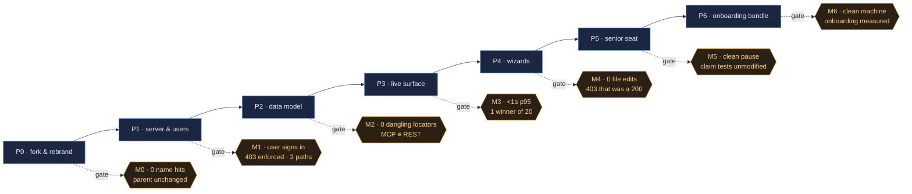

<!-- Stage 5 · Work Plan. Phases → milestones → tasks, each milestone with an explicit test gate.
     The checkboxes are the progress trace. -->

# Weave — Work Plan

- **Sources:** [WEAVE_DRP.md](WEAVE_DRP.md) · [WEAVE_ARCHITECTURE.html](WEAVE_ARCHITECTURE.html) · [WEAVE_RFC.html](WEAVE_RFC.html)
- **Contract:** [CONSTRAINTS.md](CONSTRAINTS.md) **v4** — every phase opens with a contract check (R11)
- **Branch:** work rides a `feature/` branch and the manager merges at each gate — two sessions now share one checkout (D-025's direct-to-`main` waiver superseded in practice; R5 observed). · **Status:** **P0–P7 complete and reviewed; M0–M7 all merged. P8 — the user guide — is the active phase.** — CR-001 approved 2026-08-13: the UI becomes Weave's rather than the engine's.** M6 approved 2026-08-11: 0 Critical, 0 High, suite 1083 / 0 / 0, all three deployables built and A1/A10/A13/A15 verified against the built images. D-032 and D-033 both closed: every governance write now goes through the ledger.
- **Owner:** dsivov · **Roles:** *manager* owns this plan, the contract, the reviews, git and server startup; *developer* implements the tasks and runs the gate. A task marked **[manager]** is not the developer's to do.

> **This plan builds on working code, not a blank page.** Every task below that moves code names its
> **source path in the parent tree and its destination here**, with the line count, so "copy, rename,
> refactor — but still use it" is a checkable instruction rather than an intention. Roughly **92k LOC
> is carried across**; the genuinely new code is the user store, the answer surface, the live layer,
> the wizards, the CLI and one event-bus adapter.
>
> **Read before P0 (D-022):** the source is under active development. `coordinator.py`, `store.py`,
> `devhost_daemon.py` and `test_weave_devhost.py` all changed on 2026-08-08, and `coordinator.py`
> carries uncommitted work in the claim path. **The copy point is a commit, never a working tree** —
> task P0.1 resolves this before anything is copied.

## Phase overview

| Phase | Theme | Ships | Milestone | Gate |
|-------|-------|-------|:---------:|------|
| P0 | Fork, rebrand, foundations | ~92k LOC copied + renamed; name-guard; conda env | **M0** | same tests, same count; 0 name hits; parent byte-identical |
| P1 | Standalone server & user store | `WEAVE_*` config; users + Admin UI; 3 storage paths | **M1** | UI-created user signs in, sees only granted workspaces, 403s correctly, on all 3 paths |
| P2 | Data model & answer surface | Feature/Review/Insight/Question; locator; ProjectLayout | **M2** | 4 questions = 4 traversals; 0 dangling locators; MCP ≡ REST |
| P3 | Live, multi-user surface | SSE + presence; 409-and-merge; Postgres bus adapter | **M3** | < 1s p95 cross-session; 1 winner under N=20 concurrent; no polling |
| P4 | Team-vocabulary wizards | Wizard + templates; RBAC & lifecycle as ledger kinds | **M4** | fresh install → governed workspace, 0 file edits, 0 restarts; 403 that was a 200 |
| P5 | Senior-developer seat | Supervisory principal; dispatch, pause/resume/redirect | **M5** | pause honoured between steps; claim tests pass unmodified |
| P6 | Onboarding bundle & productisation | `weave` CLI; compose bundles; dev-host + agent images | **M6** | clean machine → live fleet by published steps only; onboarding measured |
| P7 | **The UI becomes Weave's** (CR-001) | Weave-first navigation; ontology/rules authored propose → diff → sign; the four questions get a UI | **M7** | first screen answers a Weave question; every `/ask` reachable and matching the API; governance signed with a reason; 0 endpoints changed |
| P8 | **The user guide** | one illustrated HTML manual covering bootstrap, install and every role; absorbs `guides/first-fleet.md` | **M8** | **every documented step executed while writing it**; an uninvolved person reaches a live fleet from the guide alone |
| P9 | **The PostgreSQL adapter runs quadruple mode** | `decisions` + `communities` vector stores: tables, upsert, query, indexes, migration | **M9** | `compose.yml` raises a governed workspace on PostgreSQL end to end; the startup refusal from D-039 is deleted, not disabled |

**Legend for copy tasks:** `destination` ← `source` (LOC) — what it is.
`[copy]` verbatim + rename · `[copy+split]` copied then split along an existing seam ·
`[new]` written here.

---

## P0 · Fork, rebrand, foundations → **M0**

> Mechanical by definition: **no behaviour change**. Any bug found here is written up and deferred
> to a later phase with its own task — fixing it in P0 destroys the gate's meaning (R5).

- [x] **Contract check (R11)** — this phase touches **A1** (three deployables), **A2** (import
      direction, no HTTP in the core), **A3** (naming), **A4** (three storage paths + ports),
      **A11** (stack, one library per job), **A13** (no `anthropic` dependency). Re-read
      `CONSTRAINTS.md` v2 before starting.

### P0.1 · Pin the source (do this first — D-022)
- [x] Re-run `git status` in the parent tree. If dirty in any module listed below, either commit that
      work there and pin the new sha, **or** exclude it explicitly and record a `D-NN` to port later.
- [x] `PROVENANCE.md` — source repo, **pinned sha**, the module selection table below, the date, and
      an empty port log for future deliberate ports.
- [x] `scripts/parent_checksum.sh` — record the parent's `git status` + working-tree checksum; this is
      the M0 baseline that proves we never wrote to it (A2, D-003).

### P0.2 · Environment and guards
- [x] `environment.yml` — conda, Python 3.12, pinned to the DRP §7 library table. **13 libraries
      omitted:** `anthropic`, `python-jose`, `lxml`, `playwright`, `redis`, `pymongo`, `pymilvus`,
      `qdrant-client`, `docling`, `llama-index(+openai)`, `zhipuai`, `aioboto3`, `voyageai`.
- [x] `weave-ui/package.json` — bun, carried from the source app's manifest.
- [x] `scripts/nameguard.sh` — fail on any `lightrag` / `context graph` hit outside a
      `<!-- nameguard:allow lineage -->` passage in `docs/BLOG_*.html`; report honoured markers (R2a, R3a).
- [x] ~~`.github/workflows/ci.yml` — run `nameguard.sh`, `pytest`, `bun test` on every commit.~~ **Removed 2026-08-12 (D-036)** — it ran exactly once in the project's life (W13) and this repository now publishes documentation only. The three checks are run by hand.
- [x] `tests/test_nameguard.py` — a seeded violation must fail the guard.
- [x] `tests/test_dependency_set.py` `[new]` — the installed set matches `environment.yml`, and **none of the 13 omitted libraries is present**; guards A11 and A13 at the manifest level rather than only at import time. *(Added 2026-08-08 from P0 implementation — R1: the plan carries the work, not the other way round.)*

### P0.3 · Copy the engine → `weave_core/` *(no HTTP below this line — A2)*
- [x] `weave_core/graph/engine.py` ← `lightrag/lightrag.py` (4,079) `[copy]` — the graph engine
- [x] `weave_core/graph/quadruple.py` ← `context_graph/core.py` (2,352) `[copy]` — the `(h,r,t,rc)` layer + CGR3 retrieve→rank→reason
- [x] `weave_core/graph/operate.py` ← `lightrag/operate.py` (5,433) `[copy]`
- [x] `weave_core/graph/query.py` ← `lightrag/utils_graph.py` (1,753) `[copy]`
- [x] `weave_core/graph/prompt.py` ← `lightrag/prompt.py` (794) `[copy]`
- [x] `weave_core/graph/base.py` ← `lightrag/base.py` (915) `[copy]`
- [x] `weave_core/graph/types.py` ← `context_graph/types.py` (252) `[copy]` — `RelationContext`, 11 fields
- [x] `weave_core/graph/storage/files.py` ← `lightrag/kg/{networkx_impl,json_kv_impl,json_doc_status_impl,nano_vector_db_impl}.py` (1,706) `[copy]`
- [x] `weave_core/graph/storage/postgres.py` ← `lightrag/kg/postgres_impl.py` (5,778) `[copy]`
- [x] `weave_core/graph/storage/neo4j.py` ← `lightrag/kg/neo4j_impl.py` (1,922) `[copy]`
- [x] `weave_core/graph/storage/__init__.py` — the `STORAGES` registry, **cut to the 3 supported paths** (A4). ⚠ string-keyed module map — the known rename trap (AS6)
- [x] `weave_core/store/record.py` ← `context_graph/weave/recordstore.py` `[copy]` — **promoted** to the one persistence port (A4, D-020)
- [x] `weave_core/store/locks.py` ← `lightrag/kg/shared_storage.py` (1,717) `[copy]` — keyed locks incl. the workspace-keyed claim lock
- [x] `weave_core/governance/rbac/` ← `context_graph/rbac/` (406) `[copy]`
- [x] `weave_core/governance/lifecycle/` ← `context_graph/lifecycle/` (393) `[copy]`
- [x] `weave_core/governance/actions/` ← `context_graph/actions/` (850) `[copy]`
- [x] `weave_core/governance/rules/` ← `context_graph/rules/` (1,290) `[copy]`
- [x] `weave_core/governance/ontology/` ← `context_graph/ontology/` (1,200) `[copy]`
- [x] `weave_core/governance/gate.py` ← `context_graph/rules/gate.py` `[copy+split]` — the single verdict entry point; returns verdicts, never raises HTTP (A2)
- [x] `weave_core/studio/service.py` ← `context_graph/studio/` (900) `[copy]` — propose → diff → sign, versioned
- [x] `weave_core/studio/diagrams/` ← `context_graph/diagrams/` (632) `[copy]` — *(stays a 4-module package: flattening needs intra-package import surgery, which is not mechanical, and P0's gate is no-behaviour-change.)*
- [x] `weave_core/events/schema.py` ← `context_graph/events/schema.py` `[copy]`
- [x] `weave_core/events/bus.py` + `inprocess.py` ← `context_graph/events/service.py` (289) `[copy+split]` — port and in-process adapter separated (the Postgres adapter lands in P3)
- [x] `weave_core/events/ingress.py` ← `context_graph/events/store.py` `[copy]` — durable append-then-publish log
- [x] `weave_core/knowledge/{dedup,quality,community,connectivity}/` ← the same-named `context_graph/` packages (1,426) `[copy]`
- [x] `weave_core/llm/` ← `lightrag/llm/{openai,azure_openai,bedrock,gemini,jina,lollms,ollama,binding_options}.py` (3,454) `[copy]` — **the 8 wired connectors only**; the 7 unwired modules and `anthropic.py` are not copied (A13)
- [x] `weave_core/llm/rerank.py` ← `lightrag/rerank.py` (577) `[copy]`
- [x] `weave_core/{utils,exceptions,constants,types,namespace}.py` ← the `lightrag/` equivalents (~3,700) `[copy]`
- [x] `weave_core/jsonio.py` ← `context_graph/jsonio.py` (46) `[copy]`

### P0.4 · Copy the product → `weave/`
- [x] `weave/team/coordinator.py` ← `context_graph/weave/coordinator.py` `[copy]` — atomic claim, **workspace-keyed lock** (the fixed review finding — R6)
- [x] `weave/team/store.py` ← `context_graph/weave/store.py` `[copy]` — task records
- [x] `weave/team/workers.py` ← `context_graph/weave/workers.py` (223) `[copy]` — fleet registry
- [x] `weave/team/worker.py` ← `context_graph/weave/worker.py` (526) `[copy]` — the loop + `scrub_api_auth()` / `preflight_subscription_auth()` (A13)
- [x] `weave/team/integration.py` ← `context_graph/weave/integration.py` (171) `[copy]` — `WeaveEnvironment` + `IntegrationRun`, the merge gate. *(Corrected 2026-08-08: the plan previously carried 587 LOC here, which is the **other** `integration` — see the next task.)*
- [x] `weave/ingress/` ← `context_graph/integration/` (483) `[copy]` — the **ingress engine** (`IngressService`, `MappingSpec`, connectors, mapper). A different subsystem that happens to share a word; the plan omitted it and the server + copied tests need it. *(Added from P0 implementation.)*
- [x] `weave_core/studio/apps.py` ← `context_graph/apps/` (86) `[copy]` — *(Added from P0 implementation; omitted from the original plan.)*
- [x] `weave/team/project.py` ← `context_graph/weave/project.py` `[copy]`
- [x] `weave/team/playbook.py` ← `context_graph/weave/playbook.py` `[copy]` — `role_kit()`, `claude_md()`, `_mcp_config()`
- [x] `weave/team/preset.py` + `weave/team/preset/*.json` ← `context_graph/weave/preset.py` + `preset/` (468) `[copy]`
- [x] `weave/devhost/registry.py` ← `context_graph/weave/devhost.py` (313) `[copy]` — host records, `run·drain·pause·stop`, seat health
- [x] `weave/devhost/daemon.py` ← `context_graph/weave/devhost_daemon.py` (759) `[copy+split]` — register → heartbeat → reconcile
- [x] `weave/devhost/runtime.py` ← split from the same file `[copy+split]` — `ContainerRuntime` protocol + `DockerRuntime`
- [x] `weave/devhost/worktree.py` ← split from the same file `[copy+split]` — host-side clone, worktrees, branch publish
- [x] `weave/server/app.py` ← `lightrag/api/lightrag_server.py` `[copy]`
- [x] `weave/server/config.py` ← `lightrag/api/config.py` `[copy]` — **every setting renamed to `WEAVE_*`** (R7)
- [x] `weave/server/auth.py` ← `lightrag/api/auth.py` `[copy]` — JWT kept; the account source changes in P1
- [x] `weave/server/utils.py` ← `lightrag/api/utils_api.py` `[copy]`
- [x] `weave/server/workspace_pool.py` ← `lightrag/api/workspace_pool.py` `[copy]`
- [x] `weave/server/mcp.py` ← `lightrag/api/mcp_server.py` `[copy]` — Streamable HTTP, **rebranded server name + `WEAVE-WORKSPACE` header** (R55)
- [x] `weave/server/routers/` ← `lightrag/api/routers/` **12 of 15** `[copy]` — drop `webingest_routes.py` and `ollama_api.py`
- [x] `weave/server/routers/team.py` ← `context_graph/weave/routes.py` `[copy]` — incl. `/hosts/{register,heartbeat,control,scale}`
- [x] `weave/server/routers/reasoning.py` ← `context_graph/api/routes.py` (1,383) `[copy]` — *(renamed from the plan's `graph.py`: `lightrag/api/routers/graph_routes.py` already claims that name. Two routers, two names.)*
- [x] `weave/server/gunicorn.py` ← `lightrag/api/run_with_gunicorn.py` `[copy]` — the launcher
- [x] `weave/server/gunicorn_config.py` ← `lightrag/api/gunicorn_config.py` `[copy]` — *(kept separate: the launcher imports the config as a **module object** and mutates its attributes; merging breaks that.)*
- [x] `weave_core/flows/` ← `context_graph/flows/` (1,037) `[copy]` — *(moved from the plan's `weave/flows/`: it is engine machinery with no HTTP, so it belongs below the A2 line. Confirmed clean by the A2 sweep.)*

### P0.5 · Copy the UI and images
- [x] `weave-ui/` ← `lightrag_webui/` (26,659) `[copy]` — React 19 · Vite 7 · Tailwind 4 · zustand 5; 28 components, 3 stores, API client
- [x] Drop the scraper screens with `webingest`; keep `DocumentManager`, `RetrievalTesting`, `Studio`, `GetStarted`, `WeaveBoard`, `Diagrams`, `Decisions`, `Ontology`, `Rules`, `Dashboard`, `LoginPage`
- [x] `weave-ui/src/styles/` — adopt `frontend-kit/house-ui.css` tokens as the design system for **new** screens (this repo already has it)
- [x] `deploy/dev-agent.Dockerfile` ← `docker/weave-dev.Dockerfile` `[copy]` — update `COPY` paths to `weave_core/` + `weave/`, entry point to `python -m weave.team.worker` (R49); safety properties preserved verbatim (R50)

### P0.6 · Rebrand and verify
- [x] `weave_core/version.py` `[new]` — hold `__api_version__`, re-exported from `weave/server/__init__.py`. **Fixes a real A2 violation in the source:** `lightrag/llm/{openai,ollama}.py` import it `from lightrag.api`, i.e. the engine importing the HTTP layer. Direction stays inward; no behaviour change.
- [x] `weave/server/config.py` — **all** variables Weave reads become `WEAVE_*`, incl. `POSTGRES_*`, `NEO4J_*`, `JWT_*`; `USE_CONTEXT_GRAPH` → `WEAVE_ENABLE_QUADRUPLE`. Variables a **vendor library reads itself** (`OPENAI_API_KEY`, `AZURE_*`, `GOOGLE_*`) are **never** prefixed (D-024)
- [x] Rename every module path, env var, storage identifier, log string and UI string; **filenames too** — including outbound `User-Agent` headers, which currently ship the parent's product name to third-party services
- [x] `tests/` ← the source's `context_graph/tests/` suites `[copy]` — carried with the code (R5)
- [x] `tests/test_storage_registry.py` `[new]` — the string-keyed `STORAGES` map resolves on **all three** paths (AS6, the known trap)
- [x] `tests/test_claim_race.py` `[new]` — regression for the 2026-08-04 review finding: two workers, two tasks, overlapping `touches` → one winner (R6)
- [x] `tests/test_no_sdk.py` `[new]` — `anthropic` is absent from manifests and no module imports it (A13)

**Gate (M0):**
1. The copied suite passes, and **every copied module's suite came with it**. Absent suites are only those whose modules were deliberately dropped, **named explicitly** — at `608401b8` that is the six `test_webingest_*` files (D-008). *(Corrected 2026-08-08: the original wording said "same test count", which a deliberate drop makes false — the gate would have had to be fudged to pass honestly.)*
2. `scripts/nameguard.sh` returns **0** hits outside the marked exemption, filenames included.
3. The **pinned commit** still resolves in the source and its tree hash matches the recorded value (`608401b8` → tree `30a44324`); the fork is extracted via `git archive` at that commit, so this is what was actually copied and git guarantees its integrity. *(Corrected 2026-08-08 at the M0 review: the original compared the source's **working tree** to a baseline, conflating "we never wrote to it" — what A2/D-003 require — with "nobody wrote to it", which is impossible for a live repository with its own developer. As written it would fail permanently for reasons unrelated to our compliance, and it did.)*
4. The server boots and serves **the API** on the file-based path. The **UI build** (`bun`) is a separate assertion: met at M0 if `bun` is available, otherwise recorded as a named exception with a P1 task — never silently skipped, since A1 requires the server to serve the built UI and P6's clean-machine gate depends on it.
5. `PROVENANCE.md` names the pinned sha and the module selection.
6. A seeded name violation fails CI.

**Review:** ✅ **M0 reviewed 2026-08-08** → [WEAVE_CODE_REVIEW.md](WEAVE_CODE_REVIEW.md) — 0 Critical, 1 High (H1), 3 Medium, 1 Security. Gate verified independently: 569 passed / 3 skipped / 0 failed in the declared conda env. **P1 may start**; H1 and S1 are its first two tasks.

---

## P1 · Standalone server & the user store → **M1**

- [x] **Contract check (R11)** — touches **A4** (three paths + ports), **A6** (governance + authenticated principal), **A11** (no new library), **A14** (persisted users, no env accounts).
- [x] **H1 (M0 review)** `weave/server/app.py:561` — the default-JWT-secret warning says `TOKEN_SECRET`; the variable is `WEAVE_TOKEN_SECRET`. An operator following it fixes nothing and believes otherwise. One string.
- [x] **S1 (M0 review)** `weave/server/config.py:417` — `WEAVE_TOKEN_SECRET` defaults to the published constant `weave_core-jwt-default-secret`. Refuse to start on the default unless an explicit development flag is set; with the user store live, a forged token is a full RBAC bypass (A6, A14). A warning that can be ignored is not a control.
- [x] `tests/test_jwt_secret_required.py` `[new]` — the server refuses to start on the default secret without the dev flag, and the warning names the variable that actually exists.
- [x] `weave/server/users.py` `[new]` — `User` + `WorkspaceMembership` records **written against `weave_core/store/record.py`**, not a new persistence layer (A4, D-020)
- [x] `weave_core/store/postgres.py` `[new]` — the Postgres `RecordStore` adapter (memory + json come from the copied port)
- [x] `weave/server/routers/users.py` `[new]` — `GET/POST /users`, `GET/PATCH/DELETE /users/{id}`, `POST /users/{id}/password`, `GET/PUT /users/{id}/workspaces`
- [x] `weave/server/auth.py` — source accounts from the store instead of `AUTH_ACCOUNTS`; principal still derived from the authenticated identity (A6, R15)
- [x] `weave/server/migrate_accounts.py` `[new]` — one-time boot migration of `AUTH_ACCOUNTS`/`AUTH_ROLES`, then both **removed** from the config surface (R16)
- [x] **UI:** `weave-ui/src/pages/AdminUsers.tsx` `[new]` — create / edit / disable / reset password / grant workspaces, using the frontend-kit tokens
- [x] `deploy/compose.yml` `[new]` — server + PostgreSQL (+ optional Neo4j)
- [x] `tests/test_users.py` `[new]` — CRUD, bcrypt hashing, **no endpoint ever returns a hash**
- [x] `tests/test_membership.py` `[new]` — a user sees only granted workspaces; `developer` gets 403 on an architect-only action
- [x] `tests/test_account_migration.py` `[new]` — env-configured install migrates on boot, then serves with the variable unset; idempotent
- [x] `tests/test_storage_paths.py` `[new]` — the suite runs green on file-based, Postgres and Neo4j (AS2, AS3 — first real exercise of both)

**Gate (M1):** an admin creates a user in the UI → that user signs in → sees **only** granted
workspaces (asserted); `developer` receives **403** on an architect-only governed action; an
`AUTH_ACCOUNTS` install migrates on boot and then serves with it unset; `grep -r AUTH_ACCOUNTS`
returns 0 outside the migration path; no endpoint returns a password hash; the suite is green on
**all three** storage paths — or Neo4j is labelled experimental with the failing set named (R11).

**Review:** ✅ **M1 reviewed 2026-08-09** → [WEAVE_CODE_REVIEW_M1.md](WEAVE_CODE_REVIEW_M1.md) — 0 Critical, 1 High (a decision for dsivov, not a code fix), 3 Medium. Gate reproduced independently: **679 passed / 0 failed / 0 skipped** against live PostgreSQL and Neo4j. **AS2 and AS3 verified.** P2 may start.

---

## P2 · Data model & the answer surface → **M2**

> **Read before starting.** This phase creates a **new top-level package, `weave/model/`** — that is a
> named tripwire, so the contract check below is done in writing before the first file, not after.
> Run the phase end to end and **stop at the gate** for review (R3, R4); do not begin P3.
>
> **Carried in from the M1 review** ([WEAVE_CODE_REVIEW_M1.md](WEAVE_CODE_REVIEW_M1.md)):
> **H1 is closed, and it became work for you.** Neo4j Community has no per-workspace database, so A4's
> three paths were not equal on the property tenancy rests on. dsivov chose to ship the Neo4j path
> **experimental and single-workspace** rather than qualify it — **A4 is now v4, logged as D-029** —
> and that restriction has to be **enforced in code**, so P2.1 gains the refusal and its test.
> The rest of P2 is unaffected: it scopes the resolver to a workspace in *application* code (D-028),
> which is correct on all three paths. If you find yourself relying on the *database* as the tenant
> boundary, stop and report — that is the drift D-029 exists to close.

- [x] **Contract check (R11)** — touches **A5** (artifact nodes reference, never embed), **A6**, **A9** (one handler for REST and MCP), **A14** (per-workspace membership — the locator resolver must not sit outside it). Also **A2** (`weave/model/` is a new top-level package — it holds no HTTP and `weave_core/` must not import it) and **A4** (persistence through the store ports only; no new client). Write the check into the commit message, naming each ID and its verdict. **Written per commit, each ID with its verdict** — `bd70c36` `6681852` `763d0d8` `6a3061b` `14d4ccb` `1a6dd45`. Two tripwires fired and were reported before implementing, not after: retargeting `implemented_by` and `reviewed_in` (ruled on, D-031) and the `weave_core/` occupancy probe for D-029. No amendment was needed; A4 v4 was already in force when the branch was cut.

### P2.—1 · **CRITICAL, before everything else** — the workspace header was never honoured (D-030)
- [x] `weave/server/workspace_pool.py:192` — the middleware reads a rebrand artifact instead of the documented **`WEAVE-WORKSPACE`** header, and line 214 is the **only** `_current_workspace.set()` in the tree, so **every request resolves to `default_workspace`** and tenant isolation silently collapses. Restoring the published contract — **not** a contract change, no amendment (D-030). ⚠ **ASGI lowercases raw header names**: the key is `b"weave-workspace"`, so `b"WEAVE-WORKSPACE"` fails too. `app.py:703` is already correct — Starlette's `Headers` is case-insensitive; only the raw-scope read is broken.
- [x] `tests/test_workspace_header.py` `[new]` — the middleware honours the documented header, and the lowercase trap is pinned by assertion rather than by comment.
- [x] ~~`tests/test_workspace_isolation.py` `[new]`~~ — **two workspaces, written through the real store, see different data over HTTP.** M1's gate said "sees only granted workspaces" and passed because it was verified at the token/membership layer, never at the data layer; that hole is why this survived two reviews. This test must fail against the pre-fix middleware. **Deviation:** landed in `tests/test_workspace_header.py` rather than a second file — the two assertions share the fixture and the defect, and splitting them would have separated the failure from its cause. 6 of its 10 tests fail against the pre-fix middleware, as required. *Partial:* no PostgreSQL-backed variant, because **the ontology store has no PostgreSQL adapter** (only in-memory and JSON); the strongest available is a fresh service over `JsonOntologyStore` asserting two separate files on disk. The database-backed version of this assertion is `tests/test_project_layout_tenancy.py` (P2.1), which runs on real PostgreSQL.
- [x] **[unplanned]** `weave/server/users.py` · `weave/server/routers/users.py` — the **last-administrator guard lived only in the HTTP router**, so `weave user promote` could demote the last admin and brick the install the CLI exists to rescue. Moved into `UserService`, where every surface inherits it, and strictly stronger than what it replaced (the router's version only fired on *self*-demotion). Found by P2.0's first test run. *(Added from P2.0 implementation — R1. Same class as M1's M3: a fix for a lockout that reopens it by another door.)*

### P2.0 · Carry-over from P1 *(added by the M1 review — do these first, they are small and they close M3)*
- [x] `weave/cli/users.py` — fold `python -m weave.server.users` (list/add/promote/passwd) into `weave user add`; it exists because M1 found that a migrated install has users but **no admin**, the HTTP bootstrap window having closed on the first user. *(Added from P1 implementation — R1. Seed of R44; do not let P6 rebuild it.)*
- [x] `deploy/server.Dockerfile` · `deploy/requirements.txt` — recorded as layout; the latter is a **generated projection** of `environment.yml` (`scripts/sync_requirements.py`) with `tests/test_dependency_parity.py` failing on drift, so A11 still has one manifest. *(Added from P1 implementation.)*
- [x] **[manager]** `WEAVE_ARCHITECTURE.html` — say that the Postgres `RecordStore` adapter owns a daemon loop thread; the document still calls the store a plain port. *(M1 review, Medium M1 — document fix, no code change.)* **Done 2026-08-11 (`b4dda54`)**, together with the Neo4j row A4 v4 made false.

### P2.1 · The ontology and the locator *(everything below depends on these two)*
- [x] `weave/team/preset/ontology.json` — add object types `Feature`, `Review`, `Insight`, `Question` and link types `implemented_by`, `specified_by`, `depicted_by`, `answered_by` (R19). **Adding an object or link type is a tripwire** — confirm A5 holds (these nodes reference a source, they never carry a body).
- [x] `weave/model/locator.py` `[new]` — `Locator{repo, path, rev, anchor}`; `sha` added to `Commit` (R21)
- [x] `weave/model/project_layout.py` `[new]` — `ProjectLayout` registry + `resolve()` → URL for a human, file content for an agent (R22); resolves against the recorded `rev`, never `HEAD` (R23). **Workspace-scoped, stored through `weave_core/store/record.py`** so the workspace argument is required by signature, not by convention (R22a/R22b, D-028)
- [x] `tests/test_project_layout_tenancy.py` `[new]` — two workspaces, one repo registered in one of them: the other gets **404** from `/projects/resolve`, not content and not a distinguishable error (R22a)
- [x] **Refuse a second workspace on the Neo4j path** (**A4 v4**, D-029) — Community Edition cannot give a workspace its own database, so creating workspace #2 while the graph backend is Neo4j must **fail loudly at creation**, naming the edition limit and pointing at PostgreSQL. Prose is not enough: a documented-only restriction is the trap D-029 exists to close. Enforce where the workspace is created, not in the adapter, and not at read time.
- [x] `tests/test_neo4j_single_workspace.py` `[new]` — on the Neo4j path, the first workspace succeeds and the second is refused with an actionable error; on the PostgreSQL and file paths the same call succeeds. The test asserts the **class** (backend-dependent workspace admission), not the one call site.
- [x] `tests/test_locator_resolve.py` `[new]` — resolution at a pinned `rev`; a moved file at `HEAD` still resolves
- [x] **[unplanned]** `weave/server/workspace_admission.py` `[new]` — the single-workspace policy as a declared table with a stated reason, called from `WorkspacePool` at both doors into workspace creation: `get_rag()` **and** `finalize_seed()`. The second is the one the plan did not foresee — `seed()` registers the deployment's default workspace synchronously at boot, so a default of `beta` against a Neo4j holding `alpha` would have opened a second workspace *past* the guard. *(Added from P2.1c implementation — R1.)*
- [x] **[unplanned]** `weave_core/graph/storage/neo4j.py` — `occupied_workspaces()`, so the refusal reads occupancy **from the database** and survives a restart rather than resting on this process's dictionary. It lives in the adapter because A4 forbids constructing a database client outside it. *(Added from P2.1c implementation — R1. `weave_core/` change: A2 holds, it imports nothing from `weave/`.)*

### P2.2 · The answer surface *(A9: one handler, two adapters — write the service function first, then both adapters over it)*
- [x] `weave/model/answers.py` `[new]` — the four canonical traversals; **one service function each**
- [x] `weave/server/routers/ask.py` `[new]` — `/ask/{changes,why,features,learnings}` as thin adapters
- [x] `weave/server/mcp.py` — the four MCP tools call **the same functions** as the routers (A9, R26)
- [x] `weave/server/routers/projects.py` `[new]` — `POST/GET /projects`, `GET /projects/resolve` — all three scoped to the caller's workspace. **Written and tested during P2.1b** (the R22a 404 assertion needs it), but ⚠ **not yet mounted in `app.py`** — see the router-registration task below. Its behaviour is asserted; its reachability on a live server is not, and that is an M2 gate check.
- [x] **[unplanned]** `weave/server/app.py` — mount the `/ask` and `/projects` routers. Recorded as its own task because "written and tested" and "reachable" came apart here, and an unmounted router passes every test it has. *(Added from P2.1b implementation — R1.)*
- [x] `tests/test_answers.py` `[new]` — each of the four questions is one traversal returning nodes
- [x] `tests/test_mcp_rest_parity.py` `[new]` — the same question via MCP and REST returns **the same node set**. Assert parity by **calling both surfaces**, not by asserting they share a symbol — a shared call site is the implementation, node-set equality is the contract.

### P2.3 · Migration and verification
- [x] `weave/model/migrate_reviews.py` `[new]` — lift task `reviews` / `learnings` into `Review` / `Insight` nodes; idempotent. **Must cover entries written by `release()`** if that work is in the pinned sha (D-022)
- [x] `scripts/check_locators.py` `[new]` — report every artifact node whose locator does not resolve (R24)
- [x] `tests/test_migrate_reviews.py` `[new]` — 100% moved by count and content; second run is a no-op
- [x] **[unplanned]** `tests/test_check_locators.py` `[new]` — the gate's number is produced by a script, so the script is tested: a resolving locator, a dangling one, an unregistered repo and a `rev`-less one are counted separately, and only rot fails the gate. *(Added from P2.3 implementation — R1.)*
- [x] **[unplanned]** `weave/team/preset/ontology.json` — `yielded` widened to `[Review, Task] → Insight`. `record_learning(task_id=...)` attaches an insight to a **task**, so the migration had task-anchored insights to move; declaring only Review→Insight would have meant writing an edge the ontology does not admit, or inventing a review to hang each insight from. *(Added from P2.3 implementation — R1. Ontology tripwire: additive widening of an existing link type, no retarget.)*

**Gate (M2):** each of the four question classes is answered by a single traversal returning nodes,
not a text blob; the resolver reports **0** dangling locators; MCP and REST return the same node set;
the migration moves 100% of existing `reviews`/`learnings` (count **and** content) and is idempotent;
`reviewed_in` terminates on a `Review` node; `Commit` nodes carry a resolving `sha`.
Source fields are removed **only after** this gate is signed off (R25).

**Running the gate (M1 review, and it is not a formality).** Run it **by hand on a live server**, not
only in the suite — M0's and M1's gates each found a defect no unit test would have. The full run is
`/storage/conda/envs/weave/bin/python -m pytest tests/ -q --run-integration` with both databases
reachable; the M1 baseline is **679 passed / 0 failed / 0 skipped**, and M2 must not fall below it.
**The AS2/AS3 containers no longer exist** — `weave-m1-pg` (pgvector:pg16, port 5442) and
`weave-m1-neo4j` (neo4j:5, bolt 7688) must be recreated before the gate, or the two production
storage paths go unverified again and the skip count will hide it. Check skip **reasons**, never the
count.

**Gate run by hand, 2026-08-11 — developer's evidence, for the manager to reproduce.**
Live server on `0.0.0.0:9800` (file path), plus PostgreSQL 5442 and Neo4j bolt 7688.

| Gate criterion | Result |
|---|---|
| Four question classes, one traversal each, **returning nodes** | ✅ over HTTP on the live server: `changes` 6 nodes · `why` 3 · `features` 4 · `learnings` 2. Each returned **only** its declared types — `/ask/changes` did not drag in `ADR-1` or the review chain, which is the bound that separates an answer from a graph dump. |
| **MCP ≡ REST** — same node set | ✅ verified **by calling both surfaces on the live server**, MCP over its real Streamable-HTTP transport (`initialize` → `tools/call`). All four node lists byte-identical to REST. |
| Resolver reports **0 dangling locators** | ✅ `scripts/check_locators.py --workspace alpha` → `resolved 2 · dangling 0 · malformed 0 · unregistered 0`, **exit 0**. Its detection was proven separately against a seeded bad locator → `dangling 1`, exit 1. |
| `Commit` carries a **resolving** `sha` | ✅ resolved through the registered layout to real file content at that revision. |
| Migration 100% by count **and content**, idempotent | ✅ 15 tests. Not exercised on the live server: the live task store was empty, so there was nothing to migrate. **Stated as a limit, not claimed as a pass.** |
| `reviewed_in` terminates on `Review`; no link type points at nothing | ✅ asserted over the preset document. |
| **Tenant boundary** — other workspace → 404 | ✅ on the live server: `alpha` resolved with content, `beta` got 404, and a repository that exists nowhere got the **byte-identical** 404. Also on real PostgreSQL in the suite. |
| **D-029** — second Neo4j workspace refused | ✅ against the **live Neo4j**: occupancy read from the database (`alpha`), re-opening it admitted, a second refused with the actionable message, and the same call admitted on `PGGraphStorage`. |
| Suite ≥ M1 baseline | ✅ **848 passed / 0 failed / 0 skipped** with `--run-integration` (M1 was 679). Skip **reasons** checked, not counts — there are none. |
| A3 naming, on the **generated** contract | ✅ 0 hits over the live server's `/openapi.json`. Name-guard clean; 7 pipeline artifacts out of scope, 1 lineage exemption honoured. |

**Two limits, declared rather than buried.** (1) `scripts/parent_checksum.sh` **could not run** —
`WEAVE_SOURCE_DIR` is unset on this machine, so "nothing was written to the parent" is *unverified
here*, not verified. (2) The suite ran under a `.venv` built from `deploy/requirements.txt` (the
parity-tested projection), because this machine has no conda; the manager reproduces the gate in the
declared environment.

**Review:** ✅ **M2 reviewed 2026-08-11** → [WEAVE_CODE_REVIEW_M2.md](WEAVE_CODE_REVIEW_M2.md) — 0 Critical, **1 High (H1, open)**, 3 Medium. Gate reproduced independently: **848 passed / 0 failed / 0 skipped** in the conda env against live PostgreSQL and Neo4j, and the criteria driven by hand on a live server — tenant boundary confirmed (cross-tenant `resolve` returns a 404 byte-identical to a nonexistent repo), governance confirmed (401 on all four `/ask` routes once auth is configured), parent tree verified intact. **H1 must be fixed before P3 starts or anything merges to `main`** (R4, R5).

- [x] **H1 (developer)** — the D-029 admission check failed open: the Neo4j occupancy probe returned an empty set on *any* error, which `check_admission` could not tell from "no workspaces", and `known_workspaces` is empty on a fresh boot. **Fixed in `cf85275`** — occupancy is now `set | None`, undetermined refuses a *new* workspace while still admitting one already held, and the two refusals read differently. Reproduced against a dead database before fixing, re-verified at **852 / 0 / 0**.

---

## P3 · Live, multi-user surface → **M3**

> **Opened 2026-08-11 after the M2 review.** Two findings from P2 apply directly here and are not
> optional reading. **W3 closes in this phase, not after it:** nothing currently refuses multi-worker
> startup on the in-process bus, and A7 is the constraint that makes SSE correct — the refusal ships
> **with** the Postgres adapter, in the same commit, or the phase reintroduces the silent failure it
> exists to remove. **W4 is the lens to review your own work by:** a rule enforced in an adapter
> protects only the callers who arrive through that adapter — three instances so far, and SSE plus a
> second bus adapter is exactly the shape that produces a fourth. **W5:** if this phase produces a
> populated task store, re-run the P2 migration against it and record the result.

- [x] **Contract check (R11)** — re-read `CONSTRAINTS.md` **v4** before the first task. Touches **A7** (the bus adapter must match the deployment — *the pairing is the whole point; a multi-worker deployment on the in-process bus fans out to nothing, with no error and no log*), **A8**, **A9** (SSE is a third adapter over the same handlers, not a fourth answer surface), **A11** (`asyncpg` is already installed — **no new library**, and a broker would breach A1 as well), and **A15** (nothing here may require the server to dial a client). Write the check into the first commit message, naming each ID and its verdict.
- [x] `weave_core/events/postgres.py` `[new]` — the `LISTEN/NOTIFY` bus adapter via `asyncpg`; **no new library** (A7, A11, D-019)
- [x] `weave/server/config.py` — bus adapter selected alongside the storage path; refuse to start multi-worker on the in-process bus (A7)
- [x] `weave/live/stream.py` `[new]` — SSE endpoint `GET /live/stream`, subscribed to the bus
- [x] `weave/live/presence.py` `[new]` — `POST /live/presence`; who is on a board, who is editing what
- [x] **[unplanned]** `weave/server/routers/live.py` `[new]` — the thin HTTP adapter over `weave/live/`, mounted in `app.py`. Split out so the filtering rules stay testable without HTTP. *(Added from P3.2 implementation — R1.)*
- [x] **[unplanned]** `weave/server/config.py` — `create_event_bus()`, **one construction site for the bus**. The ingress service built its own `InProcessBus()`, which under several workers silently opted that whole subsystem out of fan-out **while the A7 startup check went on passing**, because the check only ever sees the configured name. W4 in structural form: a rule enforced at one construction site protects only the callers who construct there. *(Found by applying W4 to my own work in P3.2 — R1.)*
- [x] **[unplanned]** `tests/test_live_stream.py` `[new]` — 18 tests: the tenant check runs **per event, not per connection** (a stream outlives a revocation); an unlabelled event does not act as a wildcard; a slow client drops the oldest and counts it; presence expires, is workspace-scoped, and absorbs out-of-order bus updates without resurrecting a stale position. *(Added from P3.2 implementation — R1.)*
- [x] `weave/server/routers/studio.py` — version-checked writes: stale write → **409** + merge view (R31)
- [x] ~~**UI:** `weave-ui/src/pages/LiveBoard.tsx` `[new]`~~ — board, tasks, fleet and presence over SSE. **Deviation:** converted the **existing** `weave-ui/src/features/next/pages/WeaveBoard.tsx` instead of adding a second board beside it. A new `LiveBoard` would have been a second tool for a job something already does (R10), and the old board would have gone on polling. New shared hook `weave-ui/src/hooks/useLiveStream.ts`; `WeaveProjectPanel.tsx` (rendered inside the board) converted too.
- [x] **UI:** remove every polling loop the stream covers — `grep -r setInterval` in board sources → **0** (R32). Verified: `WeaveBoard.tsx` (was 4s) and `WeaveProjectPanel.tsx` (was 5s) are both clean. The remaining `setInterval`s in the tree are **not** loops the stream covers and are listed here so the zero is not mistaken for a wider claim: document-ingestion progress (`DocumentManager`, `DocumentsNext`, `PipelineStatusDialog` — no events are published for the ingestion pipeline), the server health check in `stores/state.ts`, and a graph **animation** timer in `LayoutsControl.tsx` which is not polling at all.
- [x] `scripts/measure_live_latency.py` `[new]` — 2 authenticated SSE clients, 100 trials, publish p95 (R2)
- [x] `scripts/measure_claim_concurrency.py` `[new]` — N=20 simultaneous claims per storage path; report winners, 409s, lost writes (R2)
- [x] `tests/test_sse_multiworker.py` `[new]` — **2 gunicorn workers**: an event published on worker 1 reaches a client on worker 2 (the failure A7 exists to prevent)
- [x] **[unplanned]** `tests/test_event_bus_postgres.py` `[new]` — the adapter's own quiet failure modes: an oversized `NOTIFY` payload raises at the publisher instead of vanishing, a raising subscriber does not silence the others, an undecodable notification does not kill the listener, and **both adapters dispatch identically** — A7 requires deployments to swap them, so a difference in dispatch would change behaviour on the deployment that swapped. *(Added from P3.1 implementation — R1.)*
- [x] `tests/test_optimistic_concurrency.py` `[new]` — second writer gets 409; a silent overwrite fails
- [x] **[unplanned]** `weave_core/studio/service.py` — the version check lives in `DiffEngine.apply`, not in the router. The plan named `routers/studio.py`; the wizard and anything else composing the engine writes through `apply` without touching HTTP, so a check in the adapter would protect only HTTP callers (W4). The router's remaining job is mapping `StaleWrite` to 409. *(Deviation from the named file, with reason — R1.)*

**Gate (M3):** a task claimed in one session appears in another in **< 1s at p95 over 100 trials**,
number published; two sessions editing one artifact → the second gets 409 and a merge view (a silent
overwrite fails the gate); `grep -r setInterval` in board sources returns 0; the concurrency harness
asserts **exactly one winner** per task at N=20 on **every** storage path, JSON included; the
multi-worker SSE test passes on the Postgres adapter and is **expected to fail** on the in-process
one — that asymmetry is the point.

**Gate run by hand, 2026-08-11 — developer's evidence, for the manager to reproduce.**
Live server on `0.0.0.0:9800`, measured on **both** bus adapters; PostgreSQL 5442, Neo4j bolt 7688.

| Gate criterion | Result |
|---|---|
| **Measured:** claimed in one session → visible in another, **< 1s at p95 over 100 trials** | ✅ **p95 2.52 ms** on the PostgreSQL bus, **3.35 ms** in-process. 2 authenticated SSE clients, 100 trials, 200 samples, **0 missed**. Harness `scripts/measure_live_latency.py`, which prints its own driver caveat. |
| Two sessions editing one artifact → second gets **409 + merge view**; a silent overwrite **fails** the gate | ✅ live: Alice applied from v1 → 200; Bob applied from the same v1 → **409** carrying `base`/`theirs`/`mine`, `expected_version 1` / `current_version 2`. Read back: `AliceType` present, `BobType` absent — **no silent overwrite**, asserted rather than inferred from the status code. |
| `grep -r setInterval` in board sources → **0** | ✅ `WeaveBoard.tsx` (was 4s) and `WeaveProjectPanel.tsx` (was 5s) both clean. Remaining `setInterval`s in the tree are enumerated in P3.4's task note so the zero is not read as a wider claim. |
| **Measured:** exactly **one winner** per task at N=20, **every** storage path, JSON included | ✅ `memory`, `file` and `postgres` each: `winners=1 conflicts=19 errors=0 lost_writes=0`. Harness `scripts/measure_claim_concurrency.py --json`. |
| Multi-worker SSE passes on the Postgres adapter, **expected to fail** on the in-process one | ✅ both halves asserted, across **real** process boundaries (`multiprocessing` `spawn`): worker 1 publishes → worker 2 receives on PostgreSQL; the same test on the in-process bus receives nothing, written as a positive assertion of absence rather than a skip. |
| A7 refusal ships with the adapter (**W3**) | ✅ same commit, `4af22da`. Refused at `create_app`, which every server entry path goes through. |
| Suite | ✅ **897 passed / 0 failed / 0 skipped** with `--run-integration`. |

**Four limits, declared rather than buried.** (1) The multi-worker property is proven at the **bus
level across real processes**, not end-to-end through two gunicorn workers each holding live SSE
clients — the fan-out that A7 is about is covered; the gunicorn wiring around it is not. (2) The
latency figure is driven by `POST /live/presence`, the event-publishing endpoint this build mounts;
a task claim travels the identical transport but the routes that emit one are not mounted, so the
claim-specific leg is uncovered. (3) The **UI is not built** — no `bun` in this container; `tsc
--noEmit` is clean for the three files P3 touched, and three pre-existing type errors elsewhere are
untouched. (4) Both figures come from a local bridge to a local database and would look different
across a real network; what they establish is that nothing in the path is accidentally synchronous.

**W5 was not triggered:** P3 produced no populated task store carrying `reviews`/`learnings` (the
claim harness writes throwaway tasks with neither), so the P2 migration has still never run on real
data. It stays open.

**Review:** ✅ **M3 reviewed 2026-08-11** → [WEAVE_CODE_REVIEW_M3.md](WEAVE_CODE_REVIEW_M3.md) — **0 Critical, 0 High**, 4 Medium. **Merged to `main`.** Both measured criteria were re-run by the reviewer rather than accepted on report: **p95 2.44 ms** over 100 trials / 200 samples against a 1000 ms gate (developer measured 2.52 ms), and **exactly one winner of 20** with 0 lost writes on `memory`, `file` and `postgres`. Suite **897 / 0 / 0**. **W3 closes** — the A7 refusal shipped in the same commit as the adapter and is reachable from every startup path. The SSE tenant check runs **per event**, closing the stream if a grant is revoked mid-connection.

---

## P4 · Team-vocabulary wizards → **M4**

> **Opened 2026-08-11 after the M3 review.** Two carried items apply directly. **W6 is now a habit,
> not a task:** the suite does not construct the server, so anything in `create_app` is unverified
> until something starts it — twice caught that way already (unmounted P2 routers; `app.state` set
> before `app` existed with 888 tests green). **Start the server once before the gate, every phase.**
> **W4 is the review lens:** a wizard writes through the same service the HTTP routers do, so any
> guard added here belongs in the service, not the router — the P3.3 version check was moved for
> exactly this reason and P4 is the phase that proves it was right.
>
> **A8 is the constraint this phase exists to satisfy, and it cuts against the obvious design.** A
> wizard that writes a config file the runtime does not read is a second source of truth — the
> failure A8 names. What the wizard produces must be **signed ledger versions**, the same artifacts
> the runtime already enforces. If you find yourself adding a server-file config path for roles, RBAC
> or lifecycle, stop and report: that is A8 going false, not a shortcut.

- [x] **Contract check (R11)** — re-read `CONSTRAINTS.md` **v4** first. Touches **A8** (the runtime enforces the signed ledger version; **no server-file config path** for roles, RBAC or lifecycle), **A6** (the wizard's writes pass the same governance as any other action, against an authenticated principal), **A9** (whatever the wizard can do must be one handler, reachable by both surfaces — not a wizard-only code path), and **A11** (the interview is built on the copied `GetStarted` / `/onboard/chat` flow, not a new mechanism). Write the check into the first commit message with a verdict per ID.
- [x] `weave_core/studio/service.py` — register `rbac` and `lifecycle` as ledger artifact kinds (R35); the existing kinds are `rule · ontology · flow · action`
- [x] **[unplanned]** `tests/test_governance_ledger_kinds.py` `[new]` — the two new kinds behave **exactly like** the established ones: signed into versions, attributed in history with a diff, refusing an unsigned behaviour change, and refusing a stale write through the same P3.3 guard. "Exactly like" is the property that keeps there from being a second path (A8). *(Added from P4.1 implementation — R1.)*
- [x] **[unplanned]** `weave/server/app.py` — pass `rbac_service` / `lifecycle_service` into `DiffEngine`. Without this the kinds are registered and the engine has nothing to persist them with, which would fail at sign-off rather than at startup. *(Added from P4.1 implementation — R1.)*
- [x] `weave/wizards/session.py` `[new]` — the interview, **built on the copied `GetStarted` / `/onboard/chat` flow** rather than a new mechanism
- [x] `weave/wizards/templates/` `[new]` — Weave-oriented starting templates for common team shapes (R37)
- [x] `weave/server/routers/wizard.py` `[new]` — `POST /wizard/{session,propose,apply}`; apply writes **through the ledger**, never to a file (A8, R39)
- [x] ~~**UI:** `weave-ui/src/pages/Wizard.tsx`~~ `[new]` — interview → proposal → diff → sign. **Deviation:** landed at `weave-ui/src/features/next/pages/Wizard.tsx`, where every other page lives (`src/pages/` does not exist). **Registered in `AppShell` nav + render switch and its `View` union** — an unrouted page is the M2 "written but unreachable" trap, which is what W6 exists for. `tsc --noEmit`: **0 errors** in the files P4 touched.
- [x] `tests/test_wizard_enforced.py` `[new]` — an RBAC change made in the wizard is a **403 that was a 200** on the next request; a lifecycle change is a **409**
- [x] `tests/test_wizard_rollback.py` `[new]` — rolling back to the prior ledger version restores prior behaviour, re-asserting both checks
- [x] `tests/test_no_file_config.py` `[new]` — no wizard path writes a server file or requires a restart
- [x] **[unplanned]** `weave/server/app.py` · `pyproject.toml` — mount `/wizard` and ship `weave/wizards/templates/*.json` as package data. Without the latter an installed wheel has a wizard with no templates, which fails at first use rather than at build. *(Added from P4.2 implementation — R1.)*
- [x] **[ruled 2026-08-11 — D-032]** `/onboard/apply` bypasses the ledger. **Ruling: option (a)** — convert it through `DiffEngine.apply`, as **P5's first task**. Re-graded on review: it is not "the shape that becomes false" but **false today** — `routers/actions.py` runs `RBAC → lifecycle → rules gate → side effect`, so an onboarding-installed rule is **runtime-enforced with no signature and no version**, and A8's first sentence fails for it. Not fixed in P4 (pre-existing, untouched by this phase); M4 still merges because the merge rule is about the milestone's own work — see D-032 and the M0 precedent.
      **Developer's read:** A8/A9 **drift, not a defect** — nothing in the contract is false today (no config *file* is involved), but a second write path for kinds the ledger owns is exactly the shape that becomes false. Deliberately **not touched in P4**: pre-existing surface, and converting it is unreviewed scope in a phase that did not plan for it.
      **Options:** **(a)** convert `onboard_apply` to route through `DiffEngine.apply` in P5 — *recommended*: it is the same fix as P3.3's, and P6's onboarding bundle is where an unsigned governance write would hurt most; **(b)** leave it and record the asymmetry as a standing watch item; **(c)** treat it as an M4 finding and fix it before the merge.

**Gate (M4):** from a fresh install, a wizard run produces a governed workspace with roles and gates
enforced, with **zero file edits and zero restarts**; an RBAC change is observed as a 403 that was a
200 before, on the next request; a lifecycle change is observed as a 409; both appear in ledger
history with an attributed signature and a diff; rollback restores the prior behaviour.

**Gate run by hand, 2026-08-11 — developer's evidence, for the manager to reproduce.**
Live server, workspace `team`, admin `m4admin`, **one server pid throughout**.

| Gate criterion | Before | After |
|---|---|---|
| `integrator` may `invoke:MergeToMain` | **True** — "no RBAC policy — permissive" | **False** — "role 'integrator' has no grants" — *a 403 that was a 200* |
| `Task pending → done` (skips review) | **True** — "no lifecycle — permissive" | **False** — "Task has no transition pending→done" — *the 409* |
| `Task pending → in_progress` | True | **True** — the legal step still works, so the machine is gated rather than broken |
| **Zero restarts** | — | same server pid across all of it; `apply` returns `restart_required: false` |
| **Zero file edits** | — | the operator edited nothing. The server persisted its own state (`rbac/`, `lifecycle/`, `studio/`, workspace graph) **inside its working directory** — the storage path doing its job. Nothing outside it changed but the log. |
| Ledger history, attributed, with a diff | — | `rbac` v1 signed by `m4admin`, reason recorded; `/studio/history/rbac/rbac` shows it |
| **Rollback restores prior behaviour** | `reviewed` re-granted the integrator (v2) | revert to v1 → **refused again**, and the revert is v3, appended not rewritten |
| Suite · name-guard | — | **925 passed / 0 failed / 0 skipped**; guard clean |

**Two limits, declared.** (1) The **UI is not built** — no `bun` in this container; `tsc --noEmit` is
clean for every file P4 touched, and the three errors it does report are W8, pre-existing. (2) The
run above drives the **API**, not the screen, so the wizard's HTTP contract is verified end-to-end
and the React page is verified only by type-check.

**W5 still not triggered** — P4 produced no populated task store carrying reviews or learnings, so
the P2 migration has still never run on real data.

**Review:** ✅ **M4 reviewed 2026-08-11** → [WEAVE_CODE_REVIEW_M4.md](WEAVE_CODE_REVIEW_M4.md) — 0 Critical, **1 High (H1 — pre-existing, P5's first task, D-032)**, 2 Medium. **Merged to `main`.** Suite **925 / 0 / 0** reproduced independently, and the behavioural gate **run live by the reviewer**: on a fresh install `developer invoke:MergeToMain` was allowed (*"no RBAC policy — permissive"*) and after the wizard was **denied**, read back by a **separate process** while the **same server pid** kept serving — persistence and no-restart proved separately, since either alone proves the wrong thing. Repo working tree untouched. The flip landed on `developer` rather than the developer's `integrator` because the reviewer answered `who_merges: integrator` — **evidence the answers shape the policy** rather than a fixed template.

---

## P5 · The senior-developer seat → **M5**

> **Opened 2026-08-11 after the M4 review. Do the carried High first — before any P5 task.**
>
> - [x] **H1 from M4 (D-032) — DONE.** `/onboard/apply` **and `/onboard`** now sign ontology and rules into
>   the ledger through `DiffEngine.apply`. **The structural test found a third write path**: after converting
>   `/onboard/apply` I asserted the *class* — no router may call `save()` on a ledger-owned service — and it
>   immediately caught `/onboard`, which the finding had not named. That is the argument for asserting the
>   class rather than the instance, and it is why the fix is wider than the ruling asked for. A missing Studio
>   engine now returns **503 rather than falling back** to the unsigned write, since a fallback is how a
>   removed second path returns. Both halves of the escalation were verified in the code first: the rules gate
>   really is in `actions.py`'s enforcement chain (REJECT → 422), and the old writers really did leave no
>   ledger entry — `tests/test_onboard_signs_governance.py` reproduces that as a passing assertion about the
>   *old* behaviour before proving the new. 6 tests. Suite **931 / 0 / 0**; server booted and `/onboard*` still
>   mounted (W6).
>
> - [x] **D-033 — DONE (`b8b0505`)**, and there was a layer under it: dropping the exclusions was not enough, because the guard matched on *variable name* and the four editors hold a bare `service` param — so the rule would have caught nothing in the very files it excluded. Proven by reintroducing a direct `save()` and watching the guard pass. Matcher fixed, exclusions gone, `DELETE` recorded as a signed version with `revert_to`. ~~**D-033 — the same fix again, on the four doors the guard excludes.** Verifying D-032 I checked its
>   exclusion list rather than its rule, and it does not hold: `routers/rbac.py:94`, `ontology.py:128,157`,
>   `lifecycle.py:86` and `rules.py:153,227` all call `service.save(...)` directly, mounted in Weave mode
>   behind `combined_auth`. `POST /rbac` changes what the runtime enforces with no signature, and
>   **`DELETE /rbac` returns a workspace to permissive with no record at all.** dsivov ruled **comply**:
>   route all four through `DiffEngine.apply` and **drop the exclusion list** so the class assertion is
>   uniform. A8 gains no carve-out. Do it **after** the senior-seat work, while the D-032 pattern is fresh.
>   `DELETE` needs its own thought — removing a policy is a governance change and needs a *version*, not an
>   absence. **A guard whose exclusion list contains the largest hole reads as coverage it does not give.**
>
> - [x] ~~**H1 from M4 (D-032) — `/onboard/apply` must route through `DiffEngine.apply`.**~~ Today it calls
>   `ontology_service.save()` / `rules_service.save()` directly, so a rule installed through onboarding is
>   **enforced by the runtime** (`actions.py`: `RBAC → lifecycle → rules gate → side effect`) while carrying
>   **no signature and no version** — A8's first sentence is false for it. Both write paths must produce
>   signed, versioned artifacts. Same fix as P3.3, same lesson as W4: the guard belongs in the engine both
>   paths share. Needs its own tests, including one that fails against `b3c743d`.
>
> **A15 is the constraint this phase is most likely to break, and it will look like a feature.** Dispatch,
> pause, resume and redirect all read as *the server telling a worker what to do*. They must not be. The hub
> **never dials out**: supervisory acts are **state the host reads back** (`desired_workers` on the host
> record), and hosts reach the server by register/heartbeat. If a task seems to need an inbound connection to
> a host or worker, that is A15 going false — stop and report, do not design around it.
>
> **A12 next:** the seat *operates* the lifecycle; it does not put a model in the dispatch path. Coordination
> stays deterministic graph logic.
>
> **Tripwire, named explicitly:** this phase runs at the claim protocol, the lifecycle guards and the
> `touches` collision rule. A fleet race there is invisible until it corrupts work. The M5 gate says the
> **claim tests pass unmodified** — if you find yourself editing one to make something pass, that is the
> signal to stop and report, not to adjust the test.
>
> **W6 still applies:** start the server once before the gate. **W5** remains untriggered — if P5 finally
> produces a populated task store, re-run the P2 migration against it and record the result.

- [x] **Contract check (R11)** — re-read `CONSTRAINTS.md` **v4** first. Touches **A6** (principal authenticated), **A12** (no orchestrator model — the seat *operates* the lifecycle, it does not add a model to the dispatch path), **A15** (one hub, never dials out), and **A8** via the carried H1. Write the check into the first commit message with a verdict per ID.
- [x] `weave/team/supervisor.py` `[new]` — the supervisory principal: claim, order, dispatch, pause/resume/stop/redirect
- [x] `weave/server/routers/team.py` — `POST /team/dispatch`, `POST /workers/{id}/control`; scaling writes `desired_workers` onto the **host record** and never dials the host (R46, R64, A15)
- [x] ~~**UI:** `weave-ui/src/pages/FleetView.tsx`~~ — per host: machine, status, control state, **seat health**, desired vs running, per-worker progress and diff (R76). **Deviation: extended `WeaveProjectPanel.tsx` instead of adding a second fleet screen.** It already renders machine, status, control (drain/pause/stop), seat health *with an explanation of what to run to fix it*, and desired-vs-running; a new `FleetView` would have been a second fleet surface and the old one would have stayed the one people use (R10 — the same call as P3.4's board). Added the genuine gap: **per-worker progress** (which developer is on which task, or its goal, or idle) with a per-worker pause/resume, and a **Dispatch** control. Dispatch reports *"asked N machines for M developers · K tasks ready · they reconcile on their next heartbeat"* rather than a success tick, because nothing has started and a tick would say otherwise (A15).
- [x] `tests/test_supervisor.py` `[new]` — every supervisory action is on the graph with an authenticated principal; none self-stamped
- [x] `tests/test_pause_between_steps.py` `[new]` — a paused worker's worktree has a clean `git status`; no partial edit
- [x] `tests/test_claim_protocol_unchanged.py` `[new]` — **the copied claim tests pass unmodified** (R41)
- [x] **[unplanned]** `weave/team/workers.py` — `set_goal()`, so `redirect` can change what a worker is *for* without stopping it. Reads on the next heartbeat like every other control, and refuses a stopped worker (giving one a new goal would leave a record implying it went and did something). *(Added from P5.1 implementation — R1.)*

**Gate (M5):** a senior developer dispatches N workers and each appears in the fleet registry with a
live heartbeat; a pause is honoured **between steps** (clean worktree, asserted); every supervisory
action is recorded with an authenticated principal; **the pre-existing claim tests pass unmodified** —
supervision must not have changed the claim protocol.

**Review:** ✅ **M5 reviewed 2026-08-11** → [WEAVE_CODE_REVIEW_M5.md](WEAVE_CODE_REVIEW_M5.md) — **0 Critical, 0 High**, 2 Medium. **Merged to `main`.** Suite **974 / 0 / 0** reproduced independently. **The gate's own wording checked rather than believed:** all three claim-test files hashed **byte-identical to the P0 fork commit `8610914`** (`test_claim_race.py` = `ac4cf323…` at both ends). A15 verified structurally — `Supervisor` holds no transport at all, and a `socket.connect` trap drives the whole supervisory surface with zero connections. A8's gap is closed across every write path.

---

## P6 · Onboarding bundle & productisation → **M6**

> **Opened 2026-08-11 after the M5 review. This is the last phase, and it is the one where every
> deferral comes due.** Four watch items were parked here on the argument that P6 is where they would
> hurt most. This is P6.
>
> - [x] **W9 — CLOSED. Both halves, and the second is the one that matters.** `ShellGit.test_cmd` defaults to
>   `["python", …]` and most hosts ship only `python3`, so a dev agent fails every task at the test step.
>   That is the trigger. The defect is that the loop cannot tell *"the test command could not run"* from
>   *"the tests failed"*, so it writes a **learning** — and P2 made learnings `Insight` nodes that
>   `/ask/learnings` serves **as fact**. Pick an interpreter that exists (or fail loudly), **and**
>   distinguish could-not-run from failed so no insight is written for the former.
> - [x] **W10 — CLOSED.** Committed and verified live in the M6 gate run: root → 307 → `/webui/` → 200.
>   `weave/server/app.py` root redirect now targets `/webui/`; verified live (root → 200, `<title>Weave</title>`).
>   **Left uncommitted deliberately:** `app.py` also carries the developer's in-flight P6 line
>   (`studio_engine=studio_engine`), and committing the file would sweep that into a manager commit.
>   Commit it with your P6 work and run the suite — I changed a route, and no test covers the root
>   redirect, which is part of why this survived. Original finding: `/` redirects to `/webui` (`weave/server/app.py:1760`) and the
>   static mount only answers `/webui/` **with** the trailing slash, so a browser hitting the server root
>   lands on a 404. Found 2026-08-11 by building the UI on the host and actually opening it — the first
>   time the mounted branch has ever run, because `webui_assets_exist` has been false in every dev
>   container, so the *unavailable* branch is the only one that had been exercised. The assets
>   themselves serve correctly (4.1 MB JS, 150 kB CSS, `<title>Weave</title>`). **This is the M6 gate in
>   miniature:** a clean machine following the published steps reaches a 404 at the first URL a human
>   would type.
> - [x] **W5 — CLOSED 2026-08-11.** The P2 migration finally ran on real data, against the demo tenant
>   (`docs/DEMO_SCENARIO.md`): 7 tasks, 6 reviews and 7 learnings → **13 nodes created**, second run
>   **0 created / 13 already present**, verify **complete, 0 missing, 0 mismatched**. R25's criterion met
>   against real data rather than fixtures, after four phases of staying untriggered.
> - [x] **W11 — CLOSED (`weave migrate reviews`).** Was: `migrate_reviews.py` has no CLI and no endpoint.** It is a library function, so lifting
>   task reviews/learnings into nodes needs a hand-written script that constructs a task store and a
>   graph. Seeding the demo tenant required exactly that. **A migration an operator cannot invoke is a
>   migration that will not be run** — give it a `weave` subcommand in this phase, where the CLI is the
>   deliverable.
> - [x] **W12 — CLOSED, and it went two layers deeper (D-034).** Was: a sixth unsigned path, and this time the *claim* is what was wrong.** The inverted guard
>   (D-033) is right and its allowlist carries a stated reason per entry — but one reason is false.
>   `flows.py` is exempted as *"flow definitions — versioned by the flow store, not the ledger"*, and
>   **`flow` is a `DIFF_KINDS` member** whose persistence the ledger implements itself
>   (`studio/service.py:704`). `POST /flows` calls `flow_store.save()` directly and `DELETE /flows/{id}`
>   calls `flow_store.delete()` — no signature, no ledger version, and the delete has the very
>   removal-ambiguity that M5's M1 just made structural. Checked the sibling claim: `diagrams.py` is
>   **correct** — it genuinely runs propose → assess → sign → apply. **Fourth layer of one lesson:** the
>   exclusion list hid the hole, the matcher could not see what it excluded, the reach was a hand-kept
>   list — and now an exemption's *justification* is the thing that is untrue. An allowlist entry is a
>   claim, and a claim needs checking, not just stating.
> - [x] **W7 — CLOSED.** The operator instructions that name commands which do not exist**
>   (`weave/server/gunicorn.py:103,108`). Harmless while nobody follows them; this is the phase where
>   published steps are the deliverable and a wrong command ships as documentation.
> - [x] **W8 — CLOSED; the UI type-checks clean for the first time, and `tests/test_ui_typechecks.py` keeps it that way. A bundle still needs `bun`, which this container lacks.** The three pre-existing UI type errors. CI runs the UI build; they would fail a strict
>   `tsc`. The UI has now shipped **unbuilt for three phases** because no `bun` exists in the dev
>   container — M6's gate requires a clean machine to reach a live fleet, so this is where that has to
>   resolve one way or the other.
> - [x] **W5 — CLOSED by the manager against the demo tenant (see above).** Was: last chance. The P2 migration has never run on real data through four phases. If P6
>   produces a populated task store, run it and record the result; if it does not, say so plainly in the
>   milestone report rather than letting the claim stay half-verified.
> - [x] **M1/M2 from the M5 review — DONE** — give a ledger removal a **structural** marker (`origin='removal'`
>   or `removed: bool`), and widen the governance guard beyond its filename map.
>
> **A10 and A13 are the constraints this phase exists to satisfy, and they are the two that have never
> been exercised.** Every role is ordinary Claude Code over MCP — no bespoke client — and every seat is
> subscription-authenticated: **no API key, auth token or base-URL override may reach a Claude Code
> process**, while `CLAUDE_CODE_OAUTH_TOKEN` is deliberately *not* scrubbed, because scrubbing it would
> remove the seat rather than protect it. Adding the `anthropic` package is this tripwire firing.
>
> **The M6 gate is measured and comparative** — a clean machine reaching a live fleet **by the published
> steps only**, with onboarding timed. Under R2 that needs a harness in `scripts/` and an honest baseline;
> if no baseline can be produced, publish the Weave number alone and say so (AS7).

- [x] **Contract check (R11)** — re-read `CONSTRAINTS.md` **v4** first. Touches **A1** (three deployables — the bundle must not become a fourth), **A10** (every role is a Claude Code session; no bespoke human client), **A13** (subscription seats; no model credential near a Claude Code process), **A15** (outbound-only — the dev host registers and heartbeats, the hub never dials it). Write the check into the first commit message with a verdict per ID.
- [x] `weave/cli/` — **deviation:** added to the existing `build_parser()` in `weave/cli/__init__.py` rather than a new `main.py`; a second assembler is R10's "two tools for one job". Groups: `server.py` (`init`/`up`) · `roles.py` · `project.py` · `agents.py`, all calling `preset.install()` and `playbook.role_kit()`. Was: `weave/cli/main.py` `[new]` — `init` · `roles install` · `user add` · `project register` · `up` · `down` · `agents up/scale/down` · `doctor`. **Calls the copied `preset.install()` and `playbook.role_kit()`** rather than reimplementing them (R44)
- [x] `environment.yml` — **already satisfied**: `[project.scripts] weave` has been in `pyproject.toml` since P1, and the manifest header documents `pip install -e .`. Was: `[project.scripts]` equivalent: the `weave` console entry point (replacing the source's four `lightrag-*` entries)
- [x] `deploy/compose.devhost.yml` `[new]` — plus `devhost.Dockerfile` and `requirements.devhost.txt`; publishes **no port** — the dev-host bundle: daemon + Docker socket, deployed per developer machine
- [x] `weave/devhost/__main__.py` `[new]` — **it was missing and the guide already named it**; thinness now measured, not asserted — the daemon entry point, **thin install extra** so a dev machine needs no Postgres/Neo4j drivers (R75)
- [x] `weave/cli/doctor.py` `[new]` — per configured seat: subscription-auth status and any metered variable present (R61)
- [x] `weave/team/playbook.py` — already one generator; `weave roles kit` writes it, idempotently — one generator for **human and agent roles alike**; regenerating a kit is idempotent (R52a, R56)
- [x] `scripts/measure_onboarding.py` `[new]` — **5.47s over 6 automated steps**, 3 manual with clocks excluded; no baseline (AS7) — timestamp each documented step, clean machine → first governed task claimed (R2, R48)
- [x] `docs/guides/first-fleet.md` `[new]` — organised by the job a person is doing, not by engine subsystem (R51)
- [x] `tests/test_cli_covers_docs.py` `[new]` — now also checks `python -m` steps and their flags — **every documented step maps to a command**; a step with no command fails
- [x] `tests/test_devhost_outbound.py` `[new]` — the structural A15 property, negative-controlled — the daemon registers, heartbeats and runs containers with the server **unable to open a connection to it** (R63)
- [x] `tests/test_reconcile.py` — **not written; already covered.** `tests/test_weave_devhost.py` (P5) asserts every listed criterion. A second copy is R10 applied to tests. Was: — scale 3 → exactly 3; 3 → 1 stops the highest-numbered and leaves worker 1; a held worker's slot stays **empty**; `drain` finishes held tasks and claims nothing new (R65, R66)
- [x] `tests/test_container_env.py` — **not written; already covered** by `test_the_machines_own_secrets_do_not_cross_into_a_container`, which verifies the env is allowlist-composed. Was: — a running container holds only allowlisted vars + its seat; the daemon's LLM keys and JWT signing secret are **absent** (R69)
- [x] `tests/test_seat_boundary.py` — exists (P5) — with `ANTHROPIC_API_KEY`, `ANTHROPIC_AUTH_TOKEN` and `ANTHROPIC_BASE_URL` all set, **every** seat starts scrubbed with its subscription asserted (R57, R59)
- [x] `tests/test_host_ownership.py` — **not written; already covered** by the ownership and terminal-stop tests in `tests/test_weave_devhost.py`. Was: — a host record cannot be claimed by another identity; re-registering does **not** revive a terminal `stop` (R73)

**Gate (M6):** on a clean machine with only Docker and the repository, the published steps reach a
running Weave with an admin user, installed roles, a registered project and N dev agents visible in
the fleet — **no Python called by hand**; `weave agents scale 3` yields exactly 3 registered workers
with live heartbeats and `down` retires them cleanly; every documented step maps to a command;
onboarding time is **measured and published**, compared against the parent's baseline or published
alone with the reason (AS7); no document in `docs/` references the parent's product names; the
dev-agent image builds from the rebranded packages carrying no git credentials and no metered keys.

**Review:** ✅ **M6 reviewed 2026-08-11** → [WEAVE_CODE_REVIEW_M6.md](WEAVE_CODE_REVIEW_M6.md) — **0 Critical, 0 High**, 2 Medium. **Merged.** Suite **1083 / 0 / 0** reproduced independently. The Docker half, which the developer's container could not run, was run by the reviewer: **all three deployables build**, and **A13** (no `anthropic` in the dev-agent image), **A10** (`/usr/local/bin/claude` present), **A15** (no git credentials; `compose.devhost.yml` publishes no ports) verified **against the built artifacts** for the first time. D-034 ratified on evidence. **The build is complete.**

---

## P7 · The UI becomes Weave's → **M7**

> **Opened 2026-08-13. Source: [WEAVE_UI_CHANGE_REQUEST.md](WEAVE_UI_CHANGE_REQUEST.md) (CR-001, approved) · D-037.**
> Read the CR before the first task — it carries the scope, the explicit *unchanged* list, the risk table and
> **§4b, which decides the ontology canvas rather than leaving it to implementation**. Nothing here is a licence
> to redesign the engine's screens: §3 names them unchanged, and touching them needs its own CR.
>
> **This phase's highest risk is verification, not design.** After D-036 nothing runs `bun test` or the UI build
> automatically. **Run both by hand and report the numbers** — a UI phase whose UI was never built is the failure
> W10 already caught once.
>
> **A9 is the constraint most at risk.** A screen that needs something the API cannot answer is a *finding*, not
> a licence to add an endpoint. The gate asserts `git diff` on `weave/server/routers/` is empty.

- [x] **Contract check (R11)** — re-read `CONSTRAINTS.md` **v4**. Touches **A9** (no UI-only endpoint), **A11** (no new library — everything needed is installed), **A8** (governance writes stay signed), **A6**. Verdict per ID in the first commit message. **✅ done — verdict per ID in each hand-off; A9 re-checked with `git diff --name-only weave/server/routers/` every time.**
- [x] `AppShell.tsx` — Weave-first `NAV` groups and ordering; `ViewId` extended. Nothing deleted; the engine's views keep their labels and routes. **✅ done (`1b8946a`) — landing view is `weave`; 16/16 original views verified still reachable.**
- [x] `features/next/governance/` `[new]` — the shared **propose → diff → sign** flow, **extracted** from `Wizard.tsx` so there is one implementation rather than a second copy beside it (R10). **✅ done (`d1d8421`) — extracted, and `Wizard.tsx` renders it, so the wizard is the flow's own regression test.**
- [x] `pages/Work.tsx` · `pages/Features.tsx` · `pages/Learnings.tsx` · `pages/Projects.tsx` `[new]` — the primary views. The four `/ask` questions have existed since P2 with **no UI at all**. **✅ done (`1b8946a`, `2e6d90c`). **Deviation approved:** no `Work.tsx` wrapper — the existing view was relabelled, since a file rendering one component adds indirection, not structure.**
- [x] `OntologyNext.tsx` · `RulesNext.tsx` — **over the shared flow via `useGovernedArtifact`**; Save became *Review changes* → diff → *Sign*. The JSON textarea is retained as the escape hatch. Deferred behind D-038 and picked up once that landed — it was outstanding for four tasks because the trace was not being ticked as work was committed.
- [x] **Ontology canvas** (§4b) — `@xyflow` node/link view drawing **all 37** concrete edges, same-`LinkType` edges grouped: selecting one selects all, inspector headed with the other pairs it connects. The canvas gets **its own** inspector — `diagram-editor/components/Inspector/` cannot be reused (it reads `useFlowStore` directly and edits mermaid styling, not typed properties). Corrected 2026-08-13; see CR §4b. Fallback if grouping proves too much for a first cut: multi-type links **read-only** on the canvas, edited in the panel. **✅ done (`3b747b9`) — all 37 edges, grouping by `linkType`, its own inspector (**CR corrected**: the diagram editor's cannot be reused).**
- [x] `Studio.tsx` — history, diff and revert; authoring removed. **✅ done (`60f9846`) — 389 → 198 lines; the approver box went with D-038.**
- [x] `tests/test_ui_has_no_private_answer_path.py` `[new]` — **renamed from `test_ask_ui_parity.py`, because that test could not do what its name claimed.** A Python test cannot observe the UI's node set, and asserting REST/MCP parity instead would duplicate `test_mcp_rest_parity.py` while *reading* as if it had checked the UI. What it can assert, and what A9 actually needs, is that **the UI has no private data path**: the four pages fetch the four `/ask` endpoints and nothing else answers those questions — an AST/source sweep of `weave-ui/src` for any other call that returns answer nodes. Pair it with a `bun test` that `AnswerView` renders every node the API shape carries, dropping none. **✅ done (`97be3f1`) — 7 tests, negative-controlled both ways, with a guard on the guard.**
- [x] `weave-ui/src/**/__tests__` `[new]` — **one fixture exercising what the preset does not**: link-type properties (0 of 23 have any) **and** an `ANY` wildcard link (0 of 23 use one). Assert properties round-trip through save, the wildcard renders, and editing one edge of a shared `LinkType` visibly affects its siblings. Plus: a proposal with no reason cannot sign. **✅ done — the fixture landed with the canvas; `bun test` **run by the manager: 17 pass, 0 fail**.**
- [x] **Open the pages in a browser before M7 is called.** Everything built in P7 so far is verified by `tsc`, `eslint` and a real bundle — **and has never been rendered**. *It compiles* is not *it works*, and this phase named that gap as its top risk. The navigation restructure and the new pages are unexercised at runtime. If `AnswerView` shows `(untitled)` against real data, the fix is its `title → name → entity_name → id` guess list, not the endpoint. **✅ done by the manager 2026-08-13 — real Chromium over CDP. Nav renders Weave-first, Features 6 nodes, Projects 1 repo, SSE connected, no console errors. **Found W17.****
- [x] **Run `bun run build`, `bun test`, `tsc --noEmit`, `eslint .`, the Python suite and the name-guard by hand** and report every number (D-036). **✅ done by the manager 2026-08-13 — `bun test` 17 pass / 0 fail (first run ever), `bunx --bun vite build` ✓, tsc 0, eslint 0, pytest 1116, guard clean.**

**Gate (M7):** from a fresh login the first screen answers a **Weave** question, not a document one; each of
`/ask/{changes,why,features,learnings}` is reachable and returns the **same node set as the API** for the same
workspace, with every node linking to its locator; ontology and rules changes show a diff, refuse to sign without
a reason, and land as a **new ledger version verified by reading `history()` back**; the JSON escape hatch
round-trips a document the structured editor cannot express; **all sixteen current views remain reachable**;
**no endpoint added and no route serving the UI alone** — a shared-handler change that serves MCP identically is consistent with A9 (amended 2026-08-13, D-038; it previously read *"`git diff weave/server/routers/` is empty"*, which would have forbidden fixing the A6 hole this phase found); `bun run build` and `bun test` pass; `tsc` and `eslint` exit 0;
Python **1091+ passed**; name-guard clean.

**Review:** ✅ **M7 reviewed 2026-08-13** → [WEAVE_CODE_REVIEW_M7.md](WEAVE_CODE_REVIEW_M7.md) — **0 Critical, 0 High**, 2 Medium. **Merged.** Gate driven by hand including the two that had never run. Browser pass with real Chromium: Weave-first nav, landing view `Work`, 16/16 views reachable, no console errors — **and it found W17**.

---

## P8 · The user guide → **M8**

> **Requested by dsivov 2026-08-13, to be written after P7 lands.** One illustrated HTML manual in house
> style (`docs/assets/house.css`, inline SVG, mermaid), written for someone who has never seen Weave.
>
> **It absorbs [`guides/first-fleet.md`](guides/first-fleet.md), it does not sit beside it.** That guide
> already covers install → server → first admin → vocabulary → project → dev host → workers → upgrade →
> troubleshooting, in 259 lines, and P6 corrected it twice (W7, W9). Two onboarding documents is the
> duplication R10 exists to prevent, so `first-fleet.md` is **deleted** in the same commit and its content
> carried across — including both corrections.
>
> **The rule that makes this different from documentation: every claimed step is executed before it is
> written.** Not "verified afterwards" — the command is run, its real output captured, and the guide records
> what happened. A step that cannot be executed here says so in the text rather than being written
> optimistically. dsivov's stated purpose is that an **uninvolved person** installs and runs Weave from this
> document alone, so a step that has never been run is not a step, it is a hope.
>
> **This is also the closest the project gets to M6's unclosed half.** M6's gate said *clean machine → live
> fleet by published steps only*, and two things were never closed: the compose bundle has never raised a
> fleet end to end, and `bun test` is unverified since D-036. **Writing this guide by executing it is the
> mechanism that finally tests them** — and where it cannot, the guide says so.

- [ ] **Contract check (R11)** — touches **A1** (three deployables — the guide must not imply a fourth), **A10** (every role is a Claude Code session; no bespoke client), **A13** (subscription seats — the guide must never tell a reader to put a model key anywhere near a Claude Code process), **A15** (the dev host dials out; nothing dials in).
- [ ] `docs/WEAVE_USER_GUIDE.html` `[new]` — house style, illustrated with inline SVG + mermaid, one document.
- [ ] **Bootstrap & install** — clean machine to a running server: prerequisites, `environment.yml`, the token secret, the model backend (**W9's lesson: the guide must say the model has to stay resident, because a timeout reads as a Weave defect**), first administrator.
- [ ] **Per role, what that person actually does day one:** **admin** (users, workspaces, membership, backups) · **manager** (the board, dispatch, the four questions) · **architect** (ontology, rules, lifecycle, the signed ledger, diagrams) · **developer** (claiming, worktrees, PRs, and the dev-agent seat).
- [ ] **The dev-host service** — install the daemon on a second machine, register, heartbeat, scale, and why nothing dials in (A15).
- [ ] **The Docker environment** — `deploy/compose.yml` and `compose.devhost.yml`, the three images, and the variables each refuses to start without.
- [ ] **Troubleshooting**, carried from `first-fleet.md` and extended with what this project actually hit: the front door (W10), the resident-model timeout (W9), the batch-size limit on embeddings, `admin` ≠ supervisor, and the workspace header.
- [ ] `docs/guides/first-fleet.md` — **deleted**, content absorbed (R10).
- [ ] `docs/DOCS_INDEX.md` · `docs/index.html` — the guide linked from both; it is the page a new reader should land on.
- [ ] **An execution log** — for each numbered step, what was run and what came back. Not shipped in the guide; kept as the evidence the gate is checked against.

**Gate (M8):** **every step in the guide has been executed and its real output recorded**, or the step
carries an explicit note saying what could not be run here and why. A reader following the guide on a clean
machine reaches: a running server, a first administrator, a governed workspace, a registered project, an
attached dev host, and a worker that claims a task — **with no step requiring a file edit the guide did not
name, and no command that does not exist**. The guide names no model credential anywhere near a Claude Code
process (**A13**), implies no fourth deployable (**A1**), and describes no inbound connection to a host
(**A15**). `first-fleet.md` is gone and nothing links to it.

**Review:** code review of the guide against an execution log; then dsivov, or someone uninvolved, runs it end to end.

---

## P9 · The PostgreSQL adapter runs quadruple mode → **M9**

> **Opened 2026-08-13 from D-039.** A4 v5 says PostgreSQL cannot yet run quadruple mode, and this phase is
> what removes that sentence. Until it lands, the containerised bundle refuses the pair at startup rather
> than crash-looping — legible, but still a product that cannot run its own core mode on its own production
> storage path.
>
> **The one that must not happen:** completing this by widening the refusal, or by making `decisions` and
> `communities` optional so the error stops. The gate is that the pair **works**, and the refusal is
> **deleted** rather than disabled.

- [ ] **Contract check (R11)** — **A4** (this phase is the amendment being paid off), **A2** (no HTTP in the core), **A11** (no new library — `asyncpg` is already the driver).
- [ ] `weave_core/graph/storage/postgres.py` — `WEAVE_VDB_DECISIONS` and `WEAVE_VDB_COMMUNITIES`: DDL, `NAMESPACE_TABLE_MAP` entries, `upsert` branches, query SQL, index handling, and migration entries alongside the existing three.
- [ ] `tests/` — the two namespaces round-trip on **live PostgreSQL**, not a fixture: upsert, query by vector, delete. A test that passes on the file path proves nothing here.
- [ ] **Delete the D-039 startup refusal** — and a test that fails if it comes back.
- [ ] `docs/CONSTRAINTS.md` — remove A4's quadruple sentence at **v6** with an amendment row; log the `D-NN`.
- [ ] **[manager]** re-run `docker compose -f deploy/compose.yml up` and confirm a governed workspace on PostgreSQL, end to end.

**Gate (M9):** `deploy/compose.yml` raises a server on PostgreSQL with `WEAVE_ENABLE_QUADRUPLE=true`, reaches
`/health`, bootstraps a workspace, and answers one governed question — verified by the manager on Docker.
The startup refusal is gone from the source, not merely unreachable. Suite green on all three storage paths.

**Review:** code review; log the outcome in `DECISIONS.md`.

---

## P10 · The shell people actually use → **M10**

> **Opened 2026-08-13 from `WEAVE_UI_DEFECTS.md`** — thirteen defects found by dsivov in twenty minutes
> with the running demo, all confirmed, seven root causes. P7 made the UI Weave's; this phase makes it
> usable by someone who is not holding the source open beside it.
>
> **The one that must not happen:** fixing the thirteen instances. Four of them are the same rule
> (*a control that will not act says why, in place*) and three are the same omission (*the new shell
> re-implemented the chrome and dropped what the old one owned*). Fix the rules; the instances follow.

- [x] **Contract check (R11)** — **A6** (the principal stays authenticated; showing the user their own identity is not self-stamping it), **A9** (no new endpoint — every fix is in the shell or an existing handler), **A11** (no new library; U9 is a static-asset mount, not a docs dependency), **A3** (U13, and note the guard sees spellings not initials).
- [x] **U11 · U12 · U13 — the session block.** `AppShell.tsx:196–203`: the signed-in user's initials, name and role, and logout. One change, three defects, and the place identity belonged from the start. Delete the `CG` literal.
- [x] **A test that the new shell keeps what the classic one owned** — derive the control set from `SiteHeader.tsx`, assert the shell offers each. The M7 miss was that view-reachability was checked and chrome-parity was not; a passing count is not a passing shell.
- [x] **U2 — the refusal renders where the click happened.** `WeaveBoard.tsx`: `act()`'s error belongs inside the `Modal`, not at page level behind it.
- [x] **U6 · U7 — say why the button is disabled**, in place, not in a `title`. `SignOff.tsx` already owns the decision as `canSign`; render its reason next to the control.
- [x] **U10 — Admin ▸ Users tells the truth about its own writes.** State the password rule before the button is pressed; confirm a role change visibly; say that it takes effect at the user's next sign-in — which is the sentence that would have prevented U1.
- [x] **The tooltip sweep's reach matches its claim.** Verified by the manager: `title={x ? … : …}` on a disabled control fails the sweep, but a **constant** `title="…"` passes — while the docstring says *"a `title` on a disabled element … is not an explanation."* Naive widening false-positives on naming-titles (`title="Refresh"`), so either narrow the docstring to the rule the code enforces, or flag any `title` on a control with a non-trivial `disabled=` and require an explicit opt-out. **Fourth instance of reach-versus-claim in this project.**
- [x] **W21 — the second token-write path** (`api/weave.ts:369`) updates the store from the renewed token, so the footer always shows what the token carries. Approved to ride along with this phase.
- [x] **U14 — the board installs governance instead of naming an HTTP verb.** `WeaveBoard.tsx:140` tells a human role to *"Run `POST /weave/bootstrap`"*; the board already knows `installed: false` and the endpoint is correctly gated to supervisors. A button, with the same report-what-happened treatment as the rest of the rule. **Not** auto-install on workspace creation — see U14's second half and W16.
- [x] **U9 — the API tab renders.** `/static/swagger-ui/*` 404s; ship or mount the assets, and a test that fetches both.
- [x] **U5 — the features anchor stops pretending to be a question box**, and its empty state distinguishes *nothing matched* from *nothing exists*.
- [x] **U3 — no raw node id is ever shown to a reader** (`AnswerView.tsx:31`). Re-seed first and confirm the shape; the fallback may be masking a data defect rather than causing one.
- [x] **U15 — `ENABLE_WEAVE` does not exist; the variable is `WEAVE_ENABLE_TEAM`.** One UI string (`WeaveBoard.tsx:55`) and two comments (`routers/team.py:3`, `app.py:1569`). Proven by experiment, not grep. **Blocks P8**, which documents turning Weave on.
- [x] **U16 — the bootstrap 503 says "requires Weave mode" when Weave mode is on** and quadruple mode is what is missing. Fix the sentence; the recommended flag is already right.
- [x] **U17 — show what governance is in force.** dsivov signed Solo → Reviewed with two roles; it landed (`rbac name=reviewed v2`, roles manager+developer) and **no screen says so**. An *In force now* section on Team vocabulary, the installed shape marked in the chooser, and the board's chip naming the mode. **Derived from `/rbac` + `/lifecycle`, never a stored label** — a stored mode is a second source of truth and A8 forbids exactly that.
- [x] **[manager]** drive all thirteen in a real browser, signed in as each of two roles. Not `curl`.

**Gate (M10):** every U-number in `WEAVE_UI_DEFECTS.md` reproduced before the fix and driven after it, **in
a browser**, by the manager. Sign out, sign in as a second user, and see the identity change on screen.
`bun test` and `tsc --noEmit` green; suite green; name-guard clean.

**Both decisions are in (2026-08-13).** **D-040:** the role model does *not* change — `admin` administers users,
`manager`/`architect` direct work. P10 fixes the deadlock, and Admin ▸ Users must state that a role change takes
effect at the user's **next sign-in**, which is the sentence whose absence produced U1. **D-041:** the extraction
prompt is rewritten as a measured change, and that is **P11**, not P10.

**Review:** code review; log the outcome in `DECISIONS.md`.

---

### P10.5 · A worker says which step it is on *(D-045, dsivov 2026-08-14)*

> dsivov watches a developer in tmux and asked for the equivalent over a containerised agent. Measured:
> the heartbeat carries **one** field, `current_task`, and `claude -p` runs under `capture_output=True`
> with its stdout truncated to 400 characters and the rest **discarded**. The supervisory question is
> *"is it alive, on what, for how long?"* — answerable on the beat that already exists.

- [x] **Contract check (R11)** — **A15** ✓ one optional field on the beat the worker already sends; nothing dials a worker · **A8** ✓ asserted as a class in `tests/test_the_step_is_diagnostic.py`, on the Python **and** the TypeScript side · **A9** ✓ `/weave/workers` is unchanged apart from two fields in its view; one handler still serves it.
- [x] **`WORKER_STEPS`, read off the loop** — and the test asserts the two cannot diverge in *either* direction: a step the loop sends that is not declared is a word nobody defined, and one declared but never sent is a state a supervisor waits for forever.
- [x] **`building · 4m`**, through one formatter (`workerStep`) shared by the board and the project panel. The clock restarts **only when the step changes**, not on every beat — otherwise the number is time-since-last-heartbeat wearing a useful label. A worker that has reported no step shows nothing rather than `0s`, which would read as *just started*.
- [x] **The subject is the task's own title**, capped at `COMMIT_SUBJECT_MAX = 72` — the git convention, chosen rather than inherited. The model's account still reaches `record_decision`, which is where a reader looks for *why*; a subject answers *what*.
- [x] `tests/test_the_step_is_diagnostic.py` — 11 tests. **Twelve negative controls; one was silent and it was the important one:** the branch detector recognised `w.step`, `w["step"]` and a bare `step` but not **`.get("step")`** — and the heartbeat returns a dict, so that is the single most likely spelling of the exact mistake the rule forbids.

**Gate:** the fleet shows the current step and its duration for a live worker; no commit subject contains model
stdout; nothing in the codebase reads `step` to make a decision.

**Deliberately not in scope:** shipping the transcript — see D-045 and **W29**.

---

### P10.3 · The first screen belongs to Weave *(W25 · W26 · W27 · W28)*

> Placed by the manager after the fact — the developer left it to me rather than edit a file I was working in,
> which is the right call on a shared checkout.

- [x] **W27 — one working-directory default, and one resolver.** `DEFAULT_WORKING_DIR` + `resolve_working_dir()` in `weave/server/__init__.py`, five copies collapsed onto it. It lives there rather than in `config.py` because **`config.py` calls `load_dotenv()` at import**, so reading a constant from it would load a `.env` from the caller's directory as a side effect.
- [x] **The guard that already existed and did not cover this.** `test_the_cli_and_the_server_lay_out_storage_the_same_way` has been in the suite since P6, its docstring describing W27 exactly — and it compared the directories *beneath* the working directory and never the **root**. **Sixth instance of reach-not-rule**, and the cleanest: a test that passed while the defect it described was live. The new assertion went into the same file, and the old docstring now says what it does not cover.
- [x] **W25 — nothing in the startup path asks a human.** The prompt is gone and both `if not check_env_file(): sys.exit(1)` callers with it. The rule is the class: **no `input()`, no branch on `isatty()`** — a server whose behaviour depends on whether a human is watching has defects that only users find, which is exactly why this survived every capture either of us took under `nohup`.
- [x] **W26 — the splash, the workers default, the log.** *"A governed graph for an AI development team"*. `DEFAULT_WORKERS = 1` — **the flag's help already said `1` while the code used `2`**, three disagreements in one flag, and A7 *refuses* two workers on the in-process bus that is the default. The log goes to the working directory, not the cwd.
- [x] **W28 — API prose.** *"the RAG system"* → Weave. **Bare "RAG" deliberately kept** in the `/query` descriptions: *"the RAG system"* asserts this product **is** one; *"Comprehensive RAG query endpoint"* names a technique the endpoint genuinely performs. The guard bans **phrases of self-description**, not the token — banning the token would have flagged six honest descriptions and taught the next person to add an exemption.

**Verified by the manager:** the divergent-literal control fails `test_the_cli_and_the_server_resolve_the_same_working_directory`; the startup path is free of `input()`/`isatty()`; suite 1228, `bun test` 51/0, name-guard clean.

---

### P10.4 · The API description names nothing the server does not serve *(D-044, dsivov 2026-08-14)*

> The guard that would have caught the emulation claim on the day of the fork. **Scoped to one class on
> purpose:** a capability *asserted on the public contract* that no route serves. It does not adjudicate
> content that is merely wrong — the extraction prompt (D-041) and the wizard templates are a different
> problem and no route table can settle them.

- [x] **Composed from `API_CLAIMS`** in `weave/server/app.py`. The web UI is deliberately **not** a claim: it is a `Mount` and never appears in the OpenAPI paths, so admitting it would mean matching some claims against `app.routes` and others against the document — an exception that would be the obvious place for the next unbacked sentence to hide.
- [x] `tests/test_the_api_describes_what_it_serves.py` — the maximal app (`enable_weave` + `use_quadruple`) yields **154 paths**, and the fixture asserts its own premise (`> 100`) before anything is concluded from it.
- [x] **The reach** — asserted. The emulation clause was never *declared*, it was prose, so checking only that declared claims have routes would have left the original defect open.
- [x] Both controls fire, plus seven more across W25–W28. And a test that the **Ollama binding survives**: two things answer to that name, A13 blesses the backend connector, and a grep-driven sweep would have broken a supported deployment.

**Measured, and both facts changed the design:** `app.routes` yields **14** entries where the OpenAPI document
yields **154** — the route list is not what a reader sees. And the table is configuration-dependent:
`create_app()` with no flags gives **77 paths and zero `/weave/*`**, so a guard built on a default app would
fail a true claim. `/api/*` is **0 even at full configuration**, which is why the emulation claim is the
clean first test.

**Gate:** the description names only capabilities with routes, and neither negative control passes.

---

### P10.1 · Recording writes what the answer reads *(D-043, W23 — blocks P8)*

> **The defect a clean tenant found and a week of re-running the demo could not.** Record 7 learnings and 6
> reviews into a fresh workspace and `/ask/learnings` answers **0**. `record_learning` writes a decision
> trace; `ask_learnings` seeds on `entity_type in (Review, Insight)`; the typed nodes are never created.
> `weave migrate reviews` creates all 13 and the answer works.
>
> **The one that must not happen:** fixing creation and leaving W17's retyping. A node created correctly and
> clobbered by the next generic upsert is this defect again, on a delay, and the migration was already shown
> not to survive that.

- [x] **Contract check (R11)** — **A5** ✓ `Insight` and `Review` become real artifact node types, referencing their task by id and embedding no document body · **A9** ✓ the fix is below both adapters; `weave/server/routers/` and `mcp.py` are **0 changed files** · **A2** ✓ the builder (`weave/model/insights.py`) imports stdlib only, `weave_core/` is untouched except for the guard read in the *test*, and no HTTP is anywhere near the writer · **A4** ✓ all persistence still goes through the store ports, and the node is written whole rather than partially, because whether an upsert merges or replaces is each backend's choice.
- [x] **`record_learning` and the review path create typed `Insight` / `Review` nodes** — the builder moved to **`weave/model/insights.py`**; `migrate_reviews.py` and the coordinator are its two callers. Proven by observation rather than by reading both: the migration re-run over live-recorded data reports **`nodes_created: 0`**.
- [x] **`emit_decision_trace` may not change the `entity_type` of an existing governed node** — **it already could not, since the P0 fork.** Pinned by a negative-controlled test rather than newly built; see the correction to W17 below, which the artefact did not support.
- [x] `tests/` — `test_recording_writes_what_the_answer_reads.py`, against a **real `NetworkXStorage` and the real `emit_decision_trace`**: a workspace built inside the test answers *what did we learn* with 2 of 2, no migration run.
- [x] `tests/` — a governed node's type and content survive later generic writes. **Seven negative controls run; three initially did not fire and found two real defects in this work** (a second, swallowing writer of the same node; a must-succeed test passing off an error raised by the audit path).
- [x] **[manager]** re-run the seed on a genuinely empty tenant and confirm `/ask/learnings` answers **before** `weave migrate reviews` is run — the exact measurement that produced W23.

**Gate (M10.1):** a workspace created from nothing, seeded, answers *what did we learn* **without a migration**;
the migration remains correct and becomes a one-off for older instances; a retyping upsert cannot silently
empty the answer. Suite green, name-guard clean.

**Review:** code review; log the outcome in `DECISIONS.md`.

---

### P10.2 · The diagram editor accepts the mermaid it renders *(U18, U19)*

> Found by editing a diagram dsivov created, through the real surfaces — the save path is governed and
> correct (v5, signed, rules gate PASS); the **open** path is where the gaps are.

- [x] **U18 — the grammar is now mermaid's, measured from mermaid.** Every header form was run through `mermaid.parse` at the pinned 11.16.1: `flowchart`/`graph` × `TD TB BT RL LR v ^ > <` × optional `;` × **no direction at all** — 22 forms, all accepted, and `flowchart XX` the only neighbouring form mermaid refuses. Two extras found in passing: `graph LR; A-->B` **silently dropped** the statement on the header line, and my first regex accepted `flowchart XX` and would have invented a node called `XX`.
- [x] **U19 — a cluster endpoint is resolved to a member before `setEdge`.** The **real edge is untouched** — React Flow still draws it to the subgraph box; the substitution only decides where things sit. Five fixtures: out of a subgraph, between two, into an empty one, from a member into its own parent, into a nested one.
- [x] **No raw `TypeError` reaches the reader — and widening the rule found two more sites.** `PreviewPanel` and `MermaidLiveSection` also rendered `err.message` straight from `mermaid.render`. Those needed a distinction rather than a ban: **mermaid's diagnostics are written for the reader** (*"Parse error on line 3 … Expecting 'SEMI'"*), a dagre `TypeError` is written for us. One helper, `lib/errors.ts`, passes the first through and swallows the second into a sentence.
- [x] ` ` splits into real line breaks — split, not `dangerouslySetInnerHTML`: a label is user content.
- [x] `tests/` — `__tests__/parser.test.ts` (behaviour, for `bun test`) + `tests/test_the_editor_opens_what_the_viewer_renders.py` (the class). **Eleven controls; two were silent and both were my tests' fault:** the grid fallback made a broken layout look identical to a working one, and a layout test greped for a symbol that stayed *defined* while never being reached.

**Gate:** every mermaid form this repository's own documents use opens in the editor, and no failure message contains a JavaScript error string.

---

## P12 · A database image that can run the production path → **M12**

> **Opened 2026-08-14 from D-046 and `CONSTRAINTS.md` v6.** A4 now says PostgreSQL is the multi-workspace
> path **for records** and its graph half is not yet deployable. **This phase is what earns the stronger
> sentence back** — and A4 is amended again only when the round-trip has actually run.
>
> **The one that must not happen:** declaring victory on an image that builds. `pgvector/pgvector:pg16`
> builds, starts, and passes every existing test — and cannot run the adapter. The gate is a **graph
> round-trip on live PostgreSQL**, not a container that starts.

- [x] **Contract check (R11)** — **A4 v6** ✓ the amendment stands until the round-trip runs; nothing here weakens it · **A11** ✓ no new Python or JS dependency; the image is a thing we now maintain and `deploy/postgres.Dockerfile` says which half and why · **A1** ✓ not a fourth deployable — it is what the bundle runs against, like the optional Neo4j.
- [x] **`deploy/postgres.Dockerfile`** — `apache/age:release_PG16_1.6.0` in **both** stages (an extension compiled on one base and installed on another is a `.so` that loads on a good day), pgvector pinned to **v0.8.5** — the version `pgvector/pgvector:pg16` already ships, so this change adds the graph half without also moving the vector half. Installed via `DESTDIR` and copied wholesale, so the prefix comes from `pg_config` rather than a literal path that goes silently missing when the base moves. The maintenance direction is written into the file. **Also found and handled: the adapter never issues `LOAD 'age'`**, so the image writes `shared_preload_libraries = 'age'` into `postgresql.conf.sample` — true however the container is started, not only under our compose.
- [x] `deploy/compose.yml` builds it as `weave-postgres:16`; every storage variable is still `${VAR:-default}`, asserted — as literals, the refusal advice that names them is a dead end (W20).
- [x] **`test_the_postgres_graph_path` runs green rather than skipping** — **still skipping, and this box stays open.** This container has no Docker: the image has never been built and the round-trip has never been watched pass. What exists is structural — `tests/test_the_database_can_run_the_production_path.py`, 10 tests, 9 negative controls — and its own last test asserts the live round-trip remains the gate, because the previous image passed every file-reading test in this repository while being unable to run the adapter.
- [x] **[manager]** `curl /health` against a container raised by the **published steps**, and the round-trip green on live AGE — the two things nobody has ever seen.
- [x] `docs/CONSTRAINTS.md` → **v7**, A4's graph qualification removed, with an amendment row and a `D-NN`. **Only after the round-trip has run.**

**Gate (M12):** the bundle's published steps raise a healthy server on PostgreSQL with `PGGraphStorage`, and
the graph round-trip passes on a live database. Suite green with **no W30 skip**.

---

## P11 · The extractor learns from software artifacts → **M11**

> **Opened 2026-08-13 from D-041.** `weave_core/graph/prompt.py` teaches entity extraction with two few-shot
> examples carried verbatim from the parent engine: a science-fiction short story and a B2B speaker sales call.
> **5 of the sales example's entities are real nodes in the demo graph**, out of 924. The leak is the symptom;
> the defect is that an extractor for a software-development team is calibrated on a novel and a price objection.
>
> **The one that must not happen:** deleting the examples. A few-shot prompt with no examples is a worse extractor,
> not a neutral one. They are **replaced** with software artifacts, and the replacement is **measured** (R2).

- [ ] **Contract check (R11)** — **A3** (this is the half-rebrand in the place the guard cannot reach: it catches spellings, not inherited content), **A5** (examples must model artifacts referenced by `repo · path · rev`, never bodies), **A11** (no new library), **A13** (the prompt is server-side LLM use — the only place a model credential exists; nothing here goes near a Claude Code process).
- [ ] `scripts/measure_extraction.py` — the harness first, against the current prompt: fixed corpus of real project documents, entity/relation counts by type, and an explicit check for the five leaked entities. **A before number nobody can reconstruct later is not a baseline.**
- [ ] `weave_core/graph/prompt.py` — replace both few-shot examples with software-development ones: a PRD/RFC excerpt and a review-and-decision excerpt, using entity types drawn from Weave's own ontology rather than `competitor` / `objection`.
- [ ] `tests/` — assert no example entity name from the prompt appears in extraction output on the fixed corpus, and that the declared entity types match the ontology. The test asserts the **class** — any example entity, not the five we know.
- [ ] Re-extract the demo tenant; confirm the 5 leaked entities are gone and the answer surfaces still resolve.
- [ ] `docs/` — record the before/after numbers where the claim is made (R2/R6). Parity is an honest result; an unverified improvement is not.
- [ ] **Sweep the other inherited content, not just the prompt** (developer's pointer, accepted): `weave/wizards/templates/*.json` and the preset's seed entities. **The wizard templates are the sharper of the two** — an operator adopts them wholesale into a real workspace, so parent-chosen content there does not merely teach the extractor, it becomes someone's governance.

**Gate (M11):** `scripts/measure_extraction.py` reports before and after on the same corpus, the five leaked
entities are absent from a re-extracted demo graph, entity types match the ontology, and the suite is green.
**If the new examples measure worse, that is the finding and it ships as one** — the domain fix is not permitted
to smuggle in a quality regression unmeasured.

**Review:** code review; log the outcome in `DECISIONS.md`.

---

## Definition of Done (every task)

- Code + tests committed on `main` (D-025).
- **No constraint in `CONSTRAINTS.md` v3 was made false** — or the drift was reported, approved, and
  the contract amended (version bump + amendment row + `D-NN`) **before** the code landed (R11).
- Milestone **gate passes**; **code review** clean (no open Critical/High).
- Any measured claim has a reproducible harness in `scripts/` (R2).
- **Nothing was written into the parent tree** — `scripts/parent_checksum.sh` still matches (A2).
- Docs updated; `DECISIONS.md` and `DOCS_INDEX.md` current.

## Progress trace

The checkboxes above are the trace — keep them current as work lands. Milestone reviews and
checkpoints record the rest; there is no separate status document.

### Standing watch items

Recorded so they are deliberate rather than rediscovered. None is a task yet; each names the
milestone that would turn it into one.

| # | Watch | Raised | Turns into work when |
|---|-------|--------|----------------------|
| ~~W1~~ | ~~**A4 does not say the three storage paths differ on tenancy.**~~ **Closed 2026-08-11** — dsivov chose *experimental, single-workspace*; A4 is at **v4**, logged as **D-029**, and the refusal is now a P2.1 task with a test. | M1 review H1 | — |
| W2 | **Membership is indexed only by user**, so "who can reach workspace X" is a full scan. Correct at this scale. | M1 review M2 | an audit view needs the reverse question, or user counts grow — earliest is P4. |
| W3 | **Nothing refuses multi-worker startup on the in-process bus** (A7). A client on one worker would silently never receive events published on another. | M0 + M1 contract checks | **P3** — the Postgres `LISTEN/NOTIFY` adapter ships with the refusal, not after it. |
| W4 | **A rule enforced in an adapter protects only the callers who arrive through that adapter.** Three instances: the last-admin guard lived in the HTTP router, so `weave user promote` could brick the install the CLI exists to rescue (P2.0); the workspace header was honoured by one of two resolution paths (D-030); M1's finding M3 was the same shape. | Developer, P2 | Every milestone — when a guard is added, ask which callers *bypass* it. The fix is always the same: move it to the service the adapters share. |
| W5 | **The migration has never run on real data** — 15 tests, an empty live store. "Moves 100% of existing reviews/learnings" is a claim about existing data. | M2 review M1 | The first time a populated store exists — likely P3. Re-run and record. |
| W6 | **The suite does not construct the server, so anything in `create_app` is unverified until something starts it.** Twice now: the P2 routers were written, tested and *never mounted* (found at the M2 gate), and P3.2 set `app.state` before `app` existed — 888 green tests, and the server would not boot. No test builds the whole app, and each near-miss was caught only by running it. | M2 gate · P3.2 | **Now, as a habit rather than a task:** start the server once per phase, before the gate. Turning it into a test would mean constructing the app in CI, which is worth considering at P6 when the onboarding bundle needs a smoke test anyway. |
| W7 | **`weave/server/gunicorn.py:103,108` print operator instructions naming console scripts that do not exist** (`weave_core-gunicorn`, `weave_core-server`; `pyproject` declares only `weave`). Rebrand sed artifacts of the same family as the workspace header — but printed advice rather than a comparison, so they misdirect rather than break. **Not A3**: the banned names are `lightrag`/`context graph`, and `weave_core` is neither. | P3.1, reading `gunicorn.py` | **P6**, where the CLI and the published onboarding steps are the deliverable and wrong instructions would be shipped as documentation. Left untouched deliberately — a drive-by fix in P3 would be unreviewed scope. |
| W8 | **Three pre-existing UI type errors** — `api/weave.ts:907` (`.includes` on an `AxiosHeaders` union), `components/retrieval/ChatMessage.tsx:226` (`className` on `react-markdown` `Options`), `components/ui/FileUploader.tsx:149` (missing `defaultProp`). All predate P3 and none is in a file P3 touched; `tsc --noEmit` is **clean for the three files P3 changed**. Found because `bun` is absent in the dev container but `node_modules` and `tsc` are present, so type-checking was the strongest UI verification available. | P3.4 | **Whenever the UI build is next exercised** — they would fail a strict `tsc` in CI, and `.github/workflows/ci.yml` already runs the UI. Not fixed in P3: unreviewed scope in a phase that could not build the UI to confirm a fix. |
| W9 | **A tooling failure is recorded as a test failure, and since P2 that lie is citable.** `ShellGit.test_cmd` defaults to `["python", "-m", "pytest", "-q"]` (`weave/team/worker.py:341`); Debian/Ubuntu and the dev container ship `python3` with **no `python`**, so a dev agent there fails every task at the test step with `FileNotFoundError`. **The default is the trigger; the defect is the misattribution.** The loop cannot tell *"the test command could not run"* from *"the tests failed"*, so it records a **learning** and moves on — and P2 turned learnings into first-class `Insight` nodes that `/ask/learnings` serves to humans and agents **as fact**. A wrong task outcome is recoverable; a false insight in the graph is read later as evidence. | P5.3, hit while writing `test_pause_between_steps.py` | **P6**, with the dev-agent image — and **fix both halves there**: pick an interpreter that exists (or fail loudly if none does), *and* distinguish could-not-run from failed so no learning is written for the former. Parking the default alone would leave the misattribution, which is the part that corrupts the graph. |
| W4 | **A rule enforced in an adapter protects only the callers who arrive through that adapter.** Three instances now, not a coincidence: the last-administrator guard lived in the HTTP router, so the local console could brick the install (P2.0); the workspace header was read in one middleware, so nothing else could set the tenant (D-030); and M1's own finding M3 was the same shape — a lockout fix that reopened the lockout by another door. Each was found by a *second* surface arriving later. **Open question for the manager:** does this belong in `DECISIONS.md` as a stated rule, or in the M2 review as an observation? Raised twice by message; both sends were denied delivery, so it is recorded here instead. | P2.0 · P2.1c | a fourth instance, or the M2 review — whichever comes first. The test that catches the class is "enforce in the service, assert on every surface". |
| W13 | **CI had never run once, and the first run is red.** The repository got its first remote on 2026-08-12; `.github/workflows/ci.yml` was added at **P0** and, with nowhere to push, **never executed in the project's life**. First real run: **name-guard ✓, pytest ✓** — the Python suite is green on a clean runner with no conda, the best news in it — and **bun test ✗**, failing at *Lint* with **335 problems (326 errors)**, all in UI code carried at `8610914`; 258 auto-fixable. **The lint debt is not the finding.** The finding is that a gate was asserted for seven milestones and never once exercised — this project's own recurring lesson arriving from outside, and every review took CI at face value because it lived in a file rather than in a run. | Reviewer, first push to GitHub, 2026-08-12 | **Before any release claim.** Either clear the carried lint debt or scope the lint step to authored files — and either way stop the documents claiming a gate that was not running. |
| W14 | **`set-state-in-effect` measured: 38% of its warnings describe a harm that does not happen.** 48 sites (not 49 — the `ChatMessage.tsx` fix removed one), split three ways by AST plus hand-adjudication of the 14 the AST could not decide: **30 synchronous onto a value the state may not hold**, **9 synchronous onto the value already held** (React bails via `Object.is`; where a later render does occur it is the intended spinner or field reset), and **9 not synchronous at all** — `useEffect(() => { void refresh() })` where every setState follows an `await`. For those nine the rule's own message — *"Calling setState **synchronously** within an effect"* — is **factually untrue**. Of the 30, only **8 are clearly actionable**: `useEffect(() => setX(prop), [prop])`, the shape `ChatMessage.tsx` was, with a documented fix. **This retro-justifies D-035 on a better ground than "too noisy": at `error` the rule would have blocked the build on nine sites where its own message is false.** | Developer measurement, 2026-08-12, verified by the reviewer | **Optional.** The 8 derive-from-prop sites are a scope decision, and after D-036 no gate demands them. If taken, do it as one change with a before/after render count per site — not a lint-driven sweep. |
| W15 | **`weave/server/webui/` is build output, it is gitignored, and it has now been destroyed twice — both times invisibly to git.** First `rm -rf` on a path someone else was serving (during W10); then `vite.config.ts`'s `outDir: '../weave/server/webui'` with `emptyOutDir: true` overwrote it on the next build. `git status` stayed clean both times, so nothing warned anyone. **The pattern is not carelessness — it is that gitignored artifacts have no owner and no alarm.** The demo instance serves from this exact directory, so a stale browser tab 404s on cached asset names until reloaded. | Twice: 2026-08-11 and 2026-08-13 | **Before the M7 gate.** Either build to a scratch `--outDir` and copy in deliberately, or make the destination explicit and owned. A UI phase that rebuilds constantly makes this near-certain to recur. |
| W16 | **The wizard that governs a workspace locks its agents out of it.** `mcp.py:529` calls `rbac_service.check(ws, None, …)` because MCP carries no authenticated role — and `role=None` **fails closed**: *"no authenticated role for an RBAC-enabled workspace"*. Verified. So MCP agents can act only where **no RBAC policy exists**, and P4's wizard installs one. **Neither piece is wrong alone**, and the interaction is: the moment a workspace becomes governed, every headless dev agent is denied every action — while A10 says dev agents are Claude Code sessions speaking MCP. It fails safe rather than open, so it is a capability hole and not a security one, and the code comment is candid about it. **Out of CR-001's scope; needs a design decision** — how an MCP session carries a role — which may need dsivov. | Developer, P7, raised while fixing D-038 | **Before Weave is used with both governance and agents.** The demo tenant has no RBAC policy, which is exactly why nothing has hit it yet. |
| ~~W17~~ | **Withdrawn 2026-08-14 — the mechanism does not exist, and W23 is the whole defect.** `emit_decision_trace` skips an existing node rather than retyping it (`quadruple.py:1293`), and that guard has been there since the P0 fork commit. `review:T-P0-FORK` was a **twin** created by an audit edge pointing at `review:{task}` while typed nodes live at `review:{task}:{index}` — generic from birth, not retyped. Closed by D-043, which writes the typed node first and points the edge at it. Original text follows. **Superseded in scope by W23.** The mechanism here is real and the framing was too narrow: this describes drift in an existing instance, and W23 establishes that the typed nodes are never created at all on a new one. Original: **A generic upsert silently retypes a governed node, and the answer surface stops seeing it.** Found by the P7 browser pass: the Learnings page rendered *"No insights recorded yet"* while the task store held 12 reviews and 14 learnings. The UI was right. `review:T-P0-FORK` still **exists** in the graph but its `entity_type` is now `'ENTITY'` with `source_id='emit_decision_trace'` — the migration wrote `'Review'`. `/ask/learnings` seeds on `entity_type in (Review, Insight)`, so a retyped node **disappears from the answer with no error and no missing row**. **This weakens W5's closure:** the P2 migration ran correctly on real data, and its output does not survive later writes by a path that does not know the type matters. Same shape as every other finding here — one writer unaware of a property another writer depends on — but the first to corrupt *data* rather than a guard. | P7 browser pass, 2026-08-13 | **Before the guide (P8), which will tell readers to migrate.** Decide whether `entity_type` is owned by the writer that created it; a re-run of the migration repairs an instance but not the mechanism. |
| W18 | **The server image builds and does not run — both compose paths crash-loop.** Found by P8's execute-before-you-write gate on the first attempt to raise `deploy/compose.yml`. **Two distinct failures.** With the bundle's PostgreSQL config: `ModuleNotFoundError: No module named 'weave_core.graph.graph'` — the **AS6 rename trap P0 flagged and nobody hit**: `STORAGES` holds *relative* module paths (`.graph.storage.postgres`) resolved against the **caller's** package, and in the image the caller is `weave_core.graph`, so the path doubles. With default storage: the image tries to **pip-install `ollama` at runtime** and dies — `No module named 'ollama'`. **M6 verified all three images *build*; nothing ever ran one.** A1's three deployables are three build artifacts, one of which cannot start. | P8 execution, 2026-08-13 | **Blocks the guide's Docker chapter.** A guide cannot document a path that crash-loops. Either fix before P8 ships that chapter, or the guide states plainly that the source install is the supported path today. |
| W19 | **A configuration error restarts forever, and the splash screen claims success first.** Verified by the manager's Docker run of D-039's refusal: the check fires correctly and the message is exactly right — and the operator still gets a crash-loop. Two causes. **(1)** The splash screen prints **before** the check (`📡 Server Configuration:` at log line 18, `QuadrupleUnsupported` at line 71), so a banner announcing a configured server precedes the traceback saying it cannot start. **(2)** All four compose services carry `restart: unless-stopped`, so the server had restarted **12 times** in under a minute, printing the whole banner and refusal each cycle until the message scrolls away. **A deterministic configuration error is not transient and restarting cannot fix it** — the policy turns a one-line answer into noise. | Manager's Docker run, 2026-08-13 | **Before the guide's Docker chapter**, since the chapter's whole value is that a reader meets a sentence rather than a loop. Fix: run the startup checks before the splash, and give the server `restart: on-failure` with a cap so a config error stays dead and readable. |
| W20 | **The refusal's advice cannot be followed by the operator it addresses.** W19's fix is otherwise complete — message first, 0 tracebacks, 0 splash, exit 1, dead after 3 capped retries, verified in Docker. But the message tells a **bundle** user (*"`deploy/compose.yml` ships this pair as its default"*) to *set `WEAVE_ENABLE_QUADRUPLE=false`* or *use `NanoVectorDBStorage`* — and `compose.yml:47,67` hardcodes **both** as literals rather than `${VAR:-default}`, so the environment cannot override them. Confirmed by running the bundle with `WEAVE_ENABLE_QUADRUPLE=false` exported: **the refusal fires anyway**. The advice is correct for someone running the server directly and a **dead end for the reader it names** — which is the exact failure the developer guarded against by testing that both exits construct. They construct; they are not reachable. **Testing the advice in the environment the message addresses is the step nobody took.** | Manager's Docker run, 2026-08-13 | **Before the guide's Docker chapter.** Make both values `${VAR:-default}` so the exits work, or have the message say *edit `compose.yml`* — the first is better, since a refusal you can act on beats one you must edit around. |

**Traceability:** every task here maps to a numbered requirement in
[WEAVE_DRP.md](WEAVE_DRP.md) §3 or a gate criterion in §5. New work gets a task here **first**
(R1); a new library gets a row in the DRP's table **first**, with its justification against what is
already installed (R10).

| ~~W21~~ | **Closed 2026-08-13** (`6d2e0cb`) — `setIdentity` on both paths; the store follows the token. Original: **Two token-write paths, and only one refreshes the displayed identity.** `weave-ui/src/api/weave.ts:314` writes a renewed token *and* calls `useAuthStore.login()`; the `x-new-token` response interceptor at **`:369` writes it to `localStorage` and does not**. **Not a defect today** — `weave/server/utils.py:204` re-mints with the *same* `role` taken from `token_info`, so nothing observable drifts, and this was checked before reporting. **It becomes one the moment renewal ever re-reads the user's current role** — which is precisely the obvious future fix for U1's remaining friction (*"don't make them sign in again"*). At that point the footer would display a role the server no longer enforces: silently, and as the exact inverse of the bug the session block just fixed. | Manager's M10 browser pass, 2026-08-13 | **Whenever token renewal is next touched**, and before anyone tries to make a role change take effect without a re-login. One line in the interceptor, or the store updated there too. |

| W22 | **`scripts/seed_demo.py` is not idempotent, and the demo tenant shows it.** Every learning in the demo appears **exactly twice** — 26 nodes, 13 distinct statements, all ×2 — because the seed was run twice and `coordinator.record_learning` does an unconditional `t.learnings.append(insight)` (`weave/team/coordinator.py:349`), minting a fresh `insight:<task>:<n>` each time. **This is the second half of dsivov's bug 3**: the raw-id rendering was U3, and the *"same insight twice"* was real duplication underneath it, invisible until U3 made the text readable. Not a product defect on its face — recording a learning is an event, and appending is defensible — but a seed script the guide will tell readers to run must be safe to re-run, and `record_learning` having no dedup is worth stating rather than discovering. | Manager's U3 verification, 2026-08-13 | **Before P8 documents the seed.** Fix the script (upsert or refuse a second run against a populated tenant); decide separately whether `record_learning` should dedup identical text on the same task, and say which in the guide. The demo tenant keeps its duplicates until then — they are honest evidence. |

| W23 | **On a new instance, recording a learning does not make it answerable — and nothing says so.** Established on a clean tenant, not inferred: seed 7 learnings and 6 reviews into a fresh workspace, and `/ask/learnings` returns **0 nodes**. The graph holds `Commit`, `Feature`, `ChangeRequest`, `PullRequest` and `ArchitectureDecisionRecord` correctly typed — and **21 generic `ENTITY` nodes with no `Insight` or `Review` among them**, because `record_learning` writes a decision trace rather than a typed artifact node. `/ask/learnings` seeds on `entity_type in (Review, Insight)`, so it finds nothing. Running **`weave migrate reviews`** then creates all 13 and the answer works: `13 nodes, 13 distinct, 0 duplicated`. **This reframes W17 rather than repeating it.** W17 read as *a generic upsert silently retyped a governed node* — drift in an existing instance. The truth is stronger: the nodes are **never typed correctly in the first place**, so one of Weave's four canonical questions is **empty on every new workspace** until a migration nobody is told to run has been run. The demo tenant only ever answered because it had been migrated historically. | Manager, fixing W22 on a clean tenant, 2026-08-13 | **Blocks P8.** The guide cannot say *"record a learning, then ask what did we learn"* against a product where the second half returns nothing. Either recording writes the typed node directly (right), or the migration becomes part of the documented flow and the answer surface explains the emptiness (weaker, and W17 already showed a migration's output does not survive). Decide before the guide's answer-surface chapter. |

| W24 | **The diff shows the target state, not what you are losing — and U17's warning now points at it.** `SignOffPanel` renders `delta.after`, so re-picking **Solo** on a **Reviewed** workspace shows *"here is Solo"* rather than *"you are removing the architect's approval gate"*. The only signal that something is being taken away is the version badge (`v2 → v3`) and the `changes behaviour` chip. Found by the developer while building U17's chooser warning, and reported rather than smoothed — **the warning it added says *"read the diff before signing"*, which is now advice pointing at a diff that cannot answer the question it raises.** The warning is still right (it is the only thing standing between a returning user and silently dropping their review gate) and it is honest about being a signpost, but the pair is incoherent until the diff pane shows before **and** after. Same family as W20: advice whose recommended next step does not do what the reader expects. | Developer, building U17, 2026-08-13 | **Before P8's governance chapter**, which will tell readers to read the diff before signing. Either the diff pane renders a real before/after, or U17's warning stops citing it. The first is the improvement; the second is a retreat. |

| W25 | **`weave up` stops on an interactive prompt the first time a reader runs it — after `weave init` did everything right.** `check_env_file()` (`weave/server/utils.py:44`) looks for a file literally named **`.env`** in the *startup directory*; `weave init` writes **`weave.env`** into the *working directory* and tells you to `source` it. So the documented sequence produces `Warning: Startup directory must contain .env file for multi-instance support.` and then, **`if sys.stdin.isatty()`, `input("Do you want to continue? (yes/no): ")`** — anything but `yes` prints *"Server startup cancelled"* and exits. It did not stop **me** only because I started the server under `nohup`, with no tty. **A reader in an ordinary terminal is blocked at their first server start, by a question about a file the product never asked them to create.** Called from `app.py:2235` (`weave up`) and `gunicorn.py:57`. | Manager, executing P8's install spine, 2026-08-14 | **Blocks P8 chapter 2.** Either the check accepts what `weave init` writes, or it stops being a blocking prompt — a warning at most. Verify with a real tty, which is the condition that makes it a stop rather than a line of noise. |
| W26 | **The splash screen describes the parent product.** `weave/server/utils.py:330` prints *"Fast, Lightweight RAG Server Implementation"* inside the banner, and `weave_core/constants.py:10` sets `DEFAULT_WOKERS = 2` (sic) so every uvicorn start also prints `Forcing workers=1 in uvicorn mode(Ignoring workers=2)`. Neither is an A3 violation — no banned string — and both are **D-041's class: inherited content that no longer describes this product**, on the very first screen anyone sees. The workers line is worse than cosmetic: it advertises a default that A7 would *refuse* on the gunicorn path with the in-process bus. Also `weave_core.log` (1.2 MB after one run) is written into the **current directory**, so running from a clone drops it in the checkout — gitignored, so silent. | Same session | **Before P8 ships its screenshots**, since the banner appears in every one. The tagline is a one-line fix; the workers default deserves a thought about what it should be given A7. |

| W27 | **The CLI and the server disagree about where the store lives, and the split is silent.** `weave/cli/users.py:32` and `cli/_local.py:31` default to **`./weave_storage`**; `weave/server/config.py:185` defaults to **`./rag_storage`**. Reproduced in an empty directory with `WEAVE_WORKING_DIR` unset: `weave user add alice …` created `./weave_storage/`, while `parse_args().working_dir` resolves to `./rag_storage`. **So an operator who creates the first administrator and then starts the server without setting the variable has an account the server cannot see** — which presents as *"I made an admin and cannot log in"*, with both halves reporting success. The documented path is safe because `weave init` writes `WEAVE_WORKING_DIR` into `weave.env`; **every path that deviates from it is not.** | Manager's sweep, 2026-08-14 | **Before P8**, which cannot honestly document two defaults for one thing. One default, in one place, shared by both — and a test that the CLI and the server resolve the same directory from the same environment. |
| W28 | **The parent's vocabulary is still on the public API surface, and it is the page the guide screenshots.** Not name-guard hits — no banned string — the same **semantic** half-rebrand as D-041. Live from a running server: `/openapi.json` `info.description` reads *"Providing API for WeaveEngine core, Web UI and **Ollama Model Emulation**"*. Also `config.py:186` *"Working directory for **RAG storage**"*, `config.py:275` *"Name for the simulated **Ollama** model"*, and response descriptions through `routers/query.py` (*"Successful **RAG** query response"*, *"the generated response from the **RAG** system"*) and `routers/documents.py` (*"a sample text to be inserted into the **RAG** system"*). **`weave --help` and `weave up --help` are clean** — the wrapper was rebranded and the surface underneath it was not. | Same sweep | **With W26**, before the guide's API chapter. Decide once whether Ollama emulation is a Weave feature at all; if it is not, the description should stop advertising it. |

| W29 | **The agent's transcript is destroyed, not merely unsurfaced.** `worker.py:494` runs `claude -p` under `capture_output=True`; stdout is truncated to **400 characters** at line 501 and the remainder is dropped. It is never printed, written or shipped — so `docker logs` on the dev host shows the worker loop, **not the conversation**, and there is no copy anywhere. **In a system whose premise is that the *why* is recorded permanently and every answer resolves to a real document, the most detailed account of why a piece of code looks the way it does is thrown away** and replaced with 400 characters used as a commit subject. Separable from D-045's step reporting, and separable again from *displaying* it: **not destroying it is cheap; deciding who may read it is not** — an agent's reasoning is the most revealing artifact in the system and RBAC has no notion of read-access to it. | dsivov's question about monitoring, 2026-08-14 | **A `D-NN` before anything is built.** Persisting it beside the worktree on the dev host is the cheap half and needs no new surface; retention, size and who may read it are the decision. Do not let it arrive as a side effect of a monitoring feature. |

| W30 | **PostgreSQL's *graph* storage has never run — not in the bundle, not in a test, not anywhere.** Started as a compose-image mistake and is larger. **The bundle:** defaults refuse correctly (D-039); **`WEAVE_ENABLE_QUADRUPLE=false`**, one of the two exits the refusal *names*, **crashes** — `asyncpg.exceptions.UndefinedFunctionError: function create_graph(unknown) does not exist`, because `create_graph` is **Apache AGE** and the image is `pgvector/pgvector:pg16`. Read from the running database, not inferred: `vector 0.8.5` and `pg_trgm` are available and **`age` is not available at all**. A third override, `WEAVE_GRAPH_STORAGE=NetworkXStorage`, raises a healthy server with 112 endpoints — so the bundle runs, **and not on the path its own message describes**. **Then the deeper half:** the project's PostgreSQL test container (`weave-m1-pg`) is *the same image*, and no test exercises the adapter — `tests/test_storage_paths.py` has a live `test_the_neo4j_graph_path` and, for PostgreSQL, only **`test_all_three_graph_adapters_import`**, which asserts the module *imports*. **That is "builds is not runs" in test form**: an importability check that reads as coverage. **A4 names PostgreSQL the multi-workspace production path**, and its graph half has never been executed — which is what D-007's *"each path kept must be gated at every milestone"* existed to prevent. **The compose miss is mine:** W20's gate said *"every exit produces a **running server**, verified by me in Docker"* and I verified the flags were settable and never ran the container. **Measured 2026-08-14, and it removes the last escape route:** `PGGraphStorage` needs **both** extensions, not just AGE. Run against `apache/age:release_PG16_1.6.0` (which offers `age 1.6.0` and no `vector`), the adapter fails *earlier* than on pgvector — in the shared `PostgreSQLDB` connect path: `Could not create VECTOR extension: extension "vector" is not available` → `Failed to connect … unknown type: public.vector`. So `pgvector` alone crashes on `create_graph`, `age` alone crashes on connect, **and no published image serves both**. There is no configuration of the shipped bundle that runs the production path. | Manager, P8's Docker chapter, 2026-08-14 | **Blocks P8's Docker chapter and touches A4.** Two parts: a database image that provides **both** `vector` and `age` (the developer to establish what exists rather than anyone guessing), and a **live** PostgreSQL graph test beside the Neo4j one. Gate: `curl /health` against a container the *published steps* raised, and a graph round-trip on real PostgreSQL. Original entry: **The bundle pairs `PGGraphStorage` with a database image that cannot provide it — and following the refusal's own advice still does not reach a running server.** Executed end to end for the first time (M6's unclosed half). Three configurations: **defaults** → refused at startup (D-039, correct); **`WEAVE_ENABLE_QUADRUPLE=false`** — one of the two exits the refusal *names* → **crashes**, `asyncpg.exceptions.UndefinedFunctionError: function create_graph(unknown) does not exist`, because `create_graph` is an **Apache AGE** function and the image is `pgvector/pgvector:pg16`. Verified against the running database rather than inferred: `pg_available_extensions` offers `vector 0.8.5` and `pg_trgm`, and **`age` is not available at all**. Adding a third override, `WEAVE_GRAPH_STORAGE=NetworkXStorage`, raises a healthy server with 112 endpoints — so the bundle *can* run, and **not on the path its own message describes**. **This is W20 one layer down**, and the miss is mine: W20's gate said *"every exit produces a **running server**, verified by me in Docker"* and I verified the flags were settable and never ran the container. Reachable is not running — the same sentence I have written about someone else's work three times. | Manager, P8's Docker chapter, 2026-08-14 | **Blocks P8's Docker chapter**, which cannot document a bundle whose documented exit crashes. Either the bundle ships a database image with AGE, or `WEAVE_GRAPH_STORAGE` defaults to something the shipped image can serve, or the refusal names the **third** variable too. Whichever is chosen, the gate is a **`curl /health` against a container the published steps raised** — not a flag that parses. |

| W31 | **The extension setup swallows its own failures, which is why a missing extension surfaced forty frames away.** `configure_age_extension` and `configure_vector_extension` (`weave_core/graph/storage/postgres.py`) both `except Exception`, log *"Could not create AGE extension"* as a **warning**, and carry on — so the server starts, connects, and dies later on `create_graph(unknown) does not exist`, which is a Cypher-shaped error for what is really *"this database does not have the extension"*. **Found while fixing W30 and deliberately not fixed there:** turning a warning into a startup refusal is a behaviour change, and a build fix is the wrong place to make one. Same family as W19/W20 — a refusal you can act on, delivered where the fact is known. | Developer, building P12's image, 2026-08-14 | **When the storage adapters are next opened.** The check already knows the truth at the moment it fails; the only question is whether it should stop. Worth pairing with the message naming the image the bundle ships. |
