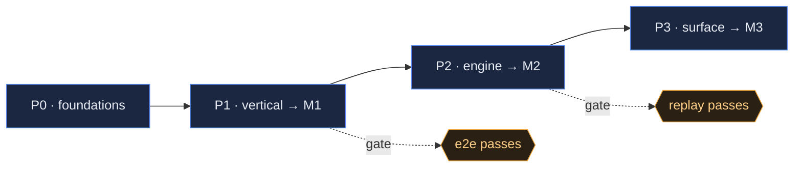

<!-- TEMPLATE: WORK PLAN. Stage 5. Turns the DRP + architecture into phases → milestones → tasks,
     each milestone with an explicit TEST GATE. The checkboxes are the progress trace.
     Markdown; illustrate with mermaid. Phases = P0/P1…; milestones = M1/M2…. -->

# {{NAME}} — Work Plan

- **Sources:** [{{NAME}}_DRP.md]({{NAME}}_DRP.md) · [{{NAME}}_ARCHITECTURE.html]({{NAME}}_ARCHITECTURE.html)
- **Contract:** [CONSTRAINTS.md](CONSTRAINTS.md) {{v1}} — every milestone opens with a contract check (R11)
- **Branch:** `feature/{{name}}`  ·  **Status:** {{in progress · P1}}

## Phase overview

| Phase | Theme | Ships | Milestone | Gate |
|-------|-------|-------|:---------:|------|
| P0 | Foundations & contracts | {{schemas, stores, protocols}} | — | unit tests green |
| P1 | {{thin vertical}} | {{first end-to-end slice}} | **M1** | {{e2e test}} |
| P2 | {{engine}} | {{…}} | **M2** | {{…}} |
| P3 | {{surface}} | {{…}} | **M3** | {{…}} |

---

## P0 · Foundations & contracts

- [ ] `{{path}}` — {{schema / dataclass}}
- [ ] `{{path}}` — {{store / protocol + default impl}}
- [ ] `test_{{…}}.py` — {{round-trip / invariant}}

**Gate (P0):** {{all unit tests green; no runtime wiring yet}}.

## P1 · {{Thin vertical}} → **M1**

- [ ] **Contract check (R11)** — re-read `CONSTRAINTS.md`; this milestone's tasks touch
      {{A2, A6}} and stay inside them. {{Or: drift found → reported, see D-NN.}}
- [ ] `{{path}}` — {{the first real end-to-end path}}
- [ ] `{{path}}` — {{…}}
- [ ] `test_{{…}}_e2e.py` — {{input → assert the observable outcome}}
- [ ] {{determinism / idempotency assertion, if relevant}}

**Gate (M1):** {{the exact assertions that must pass}}.
**Review:** run `/milestone-review` → `{{NAME}}_CODE_REVIEW.md` (M1). Fix Critical/High before P2.

## P2 · {{Engine}} → **M2**

- [ ] **Contract check (R11)** — constraints this phase touches: {{A#}}.
- [ ] `{{path}}` — {{…}}
- [ ] `test_{{…}}.py` — {{…}}

**Gate (M2):** {{…}}.
**Review:** code review; update checkpoint.

## P3 · {{Surface / UI}} → **M3**

- [ ] `{{path}}` — {{…}}
- [ ] **UI:** {{screen / component, using the frontend-kit tokens}}
- [ ] `test_{{…}}.py` — {{…}}

**Gate (M3):** {{…}}.

---

## Definition of Done (every task)

- Code + tests committed on `feature/{{name}}`.
- **No constraint in `CONSTRAINTS.md` was made false** — or the drift was reported, approved,
  and the contract amended before the code landed (methodology R11).
- Milestone **gate passes**; **code review** clean (no open Critical/High).
- Any measured claim has a reproducible harness in `scripts/` (methodology R2).
- Docs updated; `DECISIONS.md` and `DOCS_INDEX.md` current.

## Progress trace

Update the checkboxes above as work lands. Milestone reviews and checkpoints record the
rest — no separate status doc.
